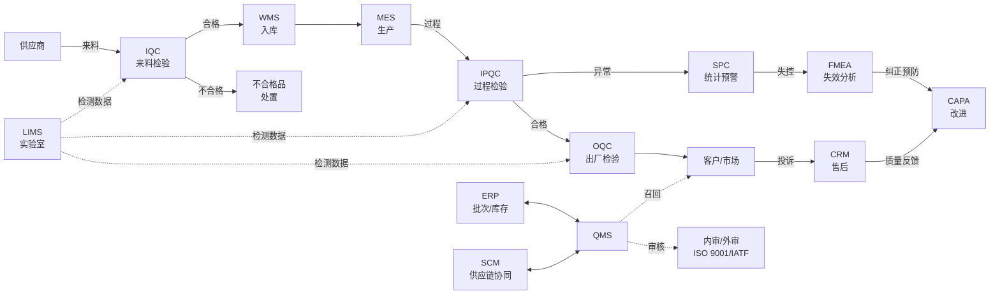
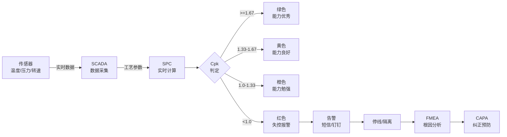

<!--
module:
  parent: application-systems
  slug: application-systems/05-operations/qms
  type: article
  category: 主模块子文章
  summary: 一份按业务场景梳理的 QMS 速查手册：从"事后检验"到"全过程质量管控"。
-->

# QMS · 质量管理系统

> 一份按业务场景梳理的 QMS 速查手册：从"事后检验"到"全过程质量管控"。

---

## 一、一句话定位

**QMS（Quality Management System，质量管理系统）**：对产品/服务的全生命周期质量进行管理（来料 → 过程 → 出厂 → 售后），目标是"质量可控、可追溯、可持续改进"。

---

## 📌 全景图



QMS 位于企业"价值链运营层"的中枢位置：上游接供应商（IQC 来料协同 SCM）、中游与 MES/LIMS/ERP 实时交换质量数据（IPQC/OQC/SPC/实验室检测）、下游接通客户（CRM 投诉处理 + 市场召回）；横向承接内审/外审（ISO 9001 / IATF 16949 / ISO 13485 等体系审核）；纵向形成"质量策划 → 质量控制 → 质量保证 → 质量改进"的 PDCA 闭环（参考 GB/T 19001 / ASQ / IQA 体系）。

---

## 二、核心功能（5 大模块）

| 模块 | 功能 | 价值 |
|------|------|------|
| **来料质量控制（IQC）** | 供应商来料检验 | 卡住源头 |
| **过程质量控制（IPQC）** | 生产过程巡检、首件检验 | 过程可控 |
| **出厂质量控制（OQC）** | 成品抽检 / 全检 | 不良品不出厂 |
| **质量分析（SPC）** | 统计过程控制、CPK 分析 | 主动预警 |
| **质量追溯** | 正反向追溯、批次追踪 | 召回从 7 天→1 小时 |

---

## 🔧 核心能力

现代 QMS 不再是"事后检验的电子化"，而是"**全过程质量管控 + PDCA 持续改进**"的协同平台。其核心能力围绕 PDCA（Plan-Do-Check-Act）循环展开，可拆解为 **8 大能力域**：

| 能力域 | 核心职能 | 关键指标 |
|--------|---------|---------|
| **质量策划（Quality Planning）** | 质量目标 / 检验计划 / 控制计划 / APQP / 检验规范 | 检验覆盖率 / 计划完成率 |
| **质量控制（Quality Control）** | IQC / IPQC / OQC 检验 + SPC 监控 | 一次合格率（FPY）/ 入库合格率 |
| **质量保证（Quality Assurance）** | 体系审核 / 过程审核 / 产品审核 / 体系文件管理 | 审核问题关闭率 / 文件受控率 |
| **质量改进（Quality Improvement）** | PDCA / 8D / 6 Sigma / CAPA / QC 七大手法 | CAPA 关闭率 / 改进 ROI |
| **不合格品管理（NCM）** | 不合格判定 / 隔离 / 处置（返工/返修/让步/报废/退货）| NCM 关闭周期 / 让步接收率 |
| **质量成本（COQ）** | 预防成本 / 鉴定成本 / 内部失败成本 / 外部失败成本 | COQ 占销售额比 / 失败成本占比 |
| **文档管理（Document Control）** | 体系文件 / 记录 / 受控分发 / 版本管理 | 文件受控率 / 记录完整性 |
| **审核管理（Audit Management）** | 内审 / 外审 / 二方审核 / 三方审核 | 审核计划完成率 / 不符合项关闭率 |

**1. 质量策划（Quality Planning / QP）**：

- **核心职能**：把"客户质量要求"转化为"内部可执行的质量计划"
- **关键工具**：APQP（Advanced Product Quality Planning 先期产品质量策划）/ 控制计划（Control Plan）/ PFMEA（过程失效模式分析）/ 检验规范（IIS Inspection Instruction Sheet）
- **汽车行业（IATF 16949）强制要求**：新产品 / 变更必须走 APQP 五阶段（计划 / 产品设计开发 / 过程设计开发 / 产品和过程确认 / 反馈评定评估）
- **关键交付物**：质量计划 / 控制计划 / PFMEA / 检验规范 / 初始过程能力研究（PPK）
- **价值**：把"事后救火"前移到"事前预防"——研究表明 70% 质量缺陷在设计/工艺阶段就已决定（参考 ASQ ASQ 2024 报告）

**2. 质量控制（Quality Control / QC）**：

- **核心职能**：通过"检验 + 监控"保证产品质量符合标准
- **检验三阶段**：
  - **来料 IQC（Incoming Quality Control）**：供应商来料抽样/全检（按 AQL 抽样规则）
  - **过程 IPQC（In-Process Quality Control）**：首件检验 + 巡检 + 末件检验 + 关键工序 SPC
  - **出厂 OQC（Outgoing Quality Control）**：成品抽检 / 全检 / 出货审核
- **关键工具**：AQL 抽样（GB/T 2828.1 / ISO 2859-1）/ SPC（X-bar/R 图、P-chart、Cpk）/ 测量系统分析（MSA GR&R）
- **关键指标**：一次合格率（FPY First Pass Yield）/ 直通率（Rolled Throughput Yield）/ 入库不良率（DPPM Defective Parts Per Million）
- **价值**：把"不合格品"拦截在厂内——汽车行业 DPPM 要求 < 50，医疗器械 0 ppm

**3. 质量保证（Quality Assurance / QA）**：

- **核心职能**：通过"体系 + 审核 + 文档"保证质量管理体系有效运行
- **核心活动**：
  - **体系管理**：ISO 9001 / IATF 16949 / ISO 13485 / AS9100 / ISO 22000 / GMP 等体系维护
  - **过程审核（Process Audit）**：按 VDA 6.3 / IATF 体系审核过程能力
  - **产品审核（Product Audit）**：按 VDA 6.5 审核成品质量
  - **体系审核（System Audit）**：按 ISO 19011 审核体系符合性
  - **文件控制**：质量手册 / 程序文件 / 作业指导 / 记录 受控分发
- **关键指标**：审核不符合项关闭率 / 文件受控率 / 记录完整性
- **价值**：通过"第三方视角"发现"自己看不到的问题"——内审 1 次/季度、外审 1 次/年、二方审核（客户审核）按需

**4. 质量改进（Quality Improvement / QI）**：

- **核心职能**：通过"问题分析 + 持续改进"降低质量损失
- **核心方法**：
  - **PDCA 循环**（Plan-Do-Check-Act）：戴明循环，最基础的改进框架
  - **8D 报告**（Eight Disciplines Problem Solving）：汽车行业强制要求，8 步法解决客户投诉
  - **6 Sigma / DMAIC**（Define-Measure-Analyze-Improve-Control）：统计驱动的改进方法，目标 3.4 DPMO（百万缺陷率）
  - **CAPA**（Corrective and Preventive Action 纠正预防措施）：IATF 16949 / ISO 13485 强制要求
  - **QC 七大手法**（层别 / 查检 / 柏拉图 / 鱼骨图 / 散布图 / 直方图 / 控制图）：基础质量分析工具
  - **5Why 分析**：追根究底 5 个"为什么"，丰田生产方式核心方法
- **关键指标**：CAPA 关闭率（目标 > 95%）/ 改进项目 ROI / 重复问题发生率
- **价值**：从"被动响应"到"主动改进"——优秀企业的质量成本占销售额 < 5%，行业平均 15-20%（参考 ASQ 质量成本报告）

**5. 不合格品管理（NCM Non-Conforming Material）**：

- **核心职能**：对"不合格品"进行判定、隔离、处置、记录
- **8 步流程**：发现 → 标识 → 隔离 → 记录 → 评审 → 处置 → 通知 → 关闭
- **处置方式**（按 GB/T 19000）：
  - **返工（Rework）**：对不合格品采取措施，使其满足规定要求
  - **返修（Repair）**：对不合格品采取措施，使其满足预期使用要求（让步）
  - **让步接收（Concession）**：对不合格品经授权人员批准，让其使用、放行或接收
  - **降级（Downgrade）**：改变不合格品的等级或类别
  - **报废（Scrap）**：对不合格品采取销毁措施
  - **退货（Return）**：退给供应商
- **关键指标**：NCM 关闭周期（目标 < 7 天）/ 让步接收率（目标 < 1%）/ 报废损失率
- **价值**：防止"不合格品流入下道工序或出厂"——是质量底线的最后一道关

**6. 质量成本（Cost of Quality / COQ）**：

- **核心职能**：把"质量"量化成"成本"，让管理层看到"质量改进的 ROI"
- **四大分类**（参考 ASQ COQ 模型）：
  - **预防成本（Prevention Costs）**：质量策划 / 培训 / 体系维护 / 供应商评审
  - **鉴定成本（Appraisal Costs）**：来料检验 / 过程检验 / 出厂检验 / 检测设备
  - **内部失败成本（Internal Failure Costs）**：返工 / 报废 / 停线 / 复检 / NCM 处理
  - **外部失败成本（External Failure Costs）**：客户退货 / 投诉处理 / 召回 / 索赔 / 品牌损失
- **关键指标**：COQ 占销售额比 / 失败成本占比（内部+外部）/ 预防鉴定成本与失败成本比
- **价值曲线**：增加预防/鉴定成本 → 显著降低失败成本 → 总 COQ 下降。**优秀企业**：COQ 占销售额 3-5%；**行业平均**：15-20%；**落后企业**：> 30%（参考 ASQ 2024 报告）

**7. 文档管理（Document Control）**：

- **核心职能**：把"体系文件 / 作业指导 / 质量记录"全生命周期管起来
- **文件类型**：
  - **质量手册（Quality Manual）**：体系纲领性文件（4 层）
  - **程序文件（Procedure）**：部门级流程（3 层）
  - **作业指导（SOP / WI）**：岗位级操作（2 层）
  - **质量记录（Record）**：过程证据（1 层，**唯一不允许修改的文件类型**）
- **关键活动**：文件创建 → 审核 → 批准 → 发放 → 培训 → 执行 → 回收 → 作废（全过程留痕）
- **关键指标**：文件受控率（目标 100%）/ 记录完整性 / 文件版本一致性
- **价值**：ISO 9001 / IATF 16949 审核必查——"文件受控率 < 100% = 严重不符合项"

**8. 审核管理（Audit Management）**：

- **核心职能**：通过"内审 + 外审 + 二方审核"保证体系有效运行
- **审核类型**：
  - **第一方审核（内审）**：企业自己审自己（每年全覆盖）
  - **第二方审核（客户/二方）**：客户来审供应商（如 SQE 审核）
  - **第三方审核（认证机构）**：第三方认证机构审（如 TÜV / SGS / BSI / DNV）
- **审核标准**：ISO 19011（审核管理体系）/ VDA 6.3（过程审核）/ VDA 6.5（产品审核）/ IATF 16949 / ISO 13485 等
- **关键指标**：审核计划完成率 / 不符合项关闭率（目标 > 95%）/ 重大不符合项（0 容忍）
- **价值**：审核不是"找麻烦"，而是"用第三方视角找盲点"——IATF 16949 强制要求每年至少 1 次内审 + 1 次管理评审

---

## 三、QMS 与 ISO/IATF 16949 体系

| 体系 | 适用范围 |
|------|---------|
| **ISO 9001** | 通用质量管理 |
| **IATF 16949** | 汽车行业（强制） |
| **ISO 13485** | 医疗器械 |
| **AS9100** | 航空航天 |
| **ISO 22000** | 食品安全 |
| **GXP（GMP/GSP）** | 医药 |

---

## 四、典型行业应用

| 行业 | 重点 |
|------|------|
| **汽车** | IATF 16949 / PPAP / APQP / FMEA |
| **医疗器械** | ISO 13485 / 设计历史文档（DHF）|
| **医药** | GMP / 验证 / 偏差处理 |
| **食品** | ISO 22000 / HACCP |
| **电子** | IPC 标准 / 静电防护 |

---

## 📊 关键模块详解

### 1. 来料检验 IQC（Incoming Quality Control）

IQC 是 QMS 的"**源头关**"——60% 以上的质量缺陷来自供应商（参考 ASQ 供应链质量报告 2024）。

- **抽样规则**：按 **AQL（Acceptable Quality Level 接收质量限）** 抽样，主流标准 **GB/T 2828.1（等同 ISO 2859-1）** / **ANSI/ASQ Z1.4**；AQL 一般选 0.065 / 0.10 / 0.15 / 0.25 / 0.40 / 0.65 / 1.0 / 1.5 / 2.5 / 4.0 / 6.5 共 11 个等级
- **检验类型**：外观 / 尺寸 / 性能 / 功能 / 可靠性（按物料关键度分级）
- **检验方式**：抽样检验 / 全检 / 免检（供应商绩效优秀时可申请免检）
- **来料异常处理**：标识 → 隔离 → 退货 / 让步接收 / 挑选 / 报废 → 8D 报告
- **与 SCM 集成**：供应商协同平台（SRM）实时同步来料质量数据 → 供应商绩效自动评级
- **关键指标**：来料合格率（目标 > 99%）/ 来料 DPPM / 供应商响应时效

### 2. 过程检验 IPQC（In-Process Quality Control）

IPQC 是 QMS 的"**过程关**"——把"不合格品"拦截在"工序内"，防止流入下道工序。

- **检验节点**：
  - **首件检验（First Article Inspection）**：每班次 / 换型 / 换料 后第一批必检
  - **巡检（Patrol Inspection）**：按频次抽检（一般 1-2 小时一次）
  - **末件检验（Last Article Inspection）**：批量生产结束前最后一件必检
  - **关键工序 100% 检验**：如汽车安全件 / 医疗器械关键工序
- **关键工序识别**：按 FMEA RPN（风险优先数）排序，RPN > 100 的工序为关键工序
- **实时数据采集**：与 SCADA/PLC/IoT 集成，工艺参数（温度/压力/转速）实时采集 → SPC 自动监控
- **首件/末件管理**：电子化首件确认（图片 + 数据 + 操作员）→ 自动比对标准值
- **关键指标**：IPQC 合格率 / 工序不良率 / 关键工序 SPC Cpk 值

### 3. 出厂检验 OQC（Outgoing Quality Control）

OQC 是 QMS 的"**出厂关**"——保证"不良品不出厂"。

- **检验内容**：外观 / 尺寸 / 性能 / 功能 / 包装 / 标识 / 附件
- **检验方式**：抽检（AQL）/ 全检 / 抽样+全检混合（按客户要求）
- **出货审核**：出货前 4 项审核——产品质量审核 / 包装审核 / 文件审核（COA/RoHS/CE 等）/ 数量审核
- **批次放行**：OQC 合格 → 放行 → 出库；OQC 不合格 → 隔离 → 评审 → 返工/让步/报废
- **COA（Certificate of Analysis）**：出厂检验报告，含检测项目 / 标准 / 结果 / 判定 / 检测人 / 日期
- **关键指标**：出厂合格率（目标 > 99.9%）/ 客户投诉率 / 退货率

### 4. SPC 统计过程控制（Statistical Process Control）

SPC 是 QMS 的"**预警雷达**"——从"事后检验"升级为"事前预警"。



- **核心图表**：
  - **X-bar / R 图**（均值-极差图）：连续型数据（尺寸、重量）
  - **P-chart**（不良率图）：离散型数据（不良品计数）
  - **C-chart**（缺陷数图）：单位缺陷数（如汽车焊点缺陷数）
  - **u-chart**（单位缺陷率图）：变样本量缺陷率
- **判稳 / 判异准则**：
  - **判稳**：25 个点全在控制限内 / 35 个点最多 1 个超出 / 100 个点最多 2 个超出
  - **判异（Western Electric 规则）**：①1 点超出 3σ ②连续 9 点在中心线同侧 ③连续 6 点递增/递减 ④连续 14 点交替上下 ⑤连续 2 点超出 2σ（同侧）⑥连续 4 点超出 1σ（同侧）
- **过程能力指数**：
  - **Cp / Cpk**：已受控过程的能力（短期能力）
  - **Pp / Ppk**：未受控过程的能力（长期能力）
  - **Cpk ≥ 1.33**：过程能力良好；**Cpk ≥ 1.67**：过程能力优秀（汽车行业常用）
- **控制限计算**：UCL/LCL = 均值 ± 3σ（基于 20-25 个子组的历史数据计算）
- **集成场景**：与 MES/IoT 集成 → 工艺参数实时采集 → SPC 自动计算 → 异常自动告警（短信/钉钉/邮件）
- **关键指标**：Cpk 值（目标 ≥ 1.33）/ SPC 受控率 / 异常响应时间

### 5. FMEA 失效模式分析（Failure Mode and Effects Analysis）

FMEA 是 QMS 的"**风险预防**"——在"问题发生前"识别潜在风险。

- **FMEA 类型**：
  - **DFMEA（Design FMEA）**：设计阶段失效模式分析（产品设计）
  - **PFMEA（Process FMEA）**：过程阶段失效模式分析（工艺设计）
  - **SFMEA（System FMEA）**：系统级失效模式分析
  - **DFMEA-MSR（Monitoring and System Response）**：监控与系统响应 FMEA（汽车行业 2019 新增）
- **AIAG-VDA FMEA 2019 新版**：从"风险优先数 RPN"转向"行动优先级 AP（Action Priority）"——H（High 高）/ M（Medium 中）/ L（低）
- **七步法**（AIAG-VDA 2019）：
  1. 规划与准备（项目范围 / 团队 / 时间表）
  2. 结构分析（系统 / 子系统 / 组件 / 接口 树状图）
  3. 功能分析（功能 / 性能 / 接口）
  4. 失效分析（失效模式 / 失效影响 / 失效原因）
  5. 风险分析（严重度 S / 发生率 O / 探测度 D）
  6. 优化（措施 / 行动优先级 AP / 责任 / 期限）
  7. 结果文件化（FMEA 表 + 控制计划 CP）
- **评分标准**（S/O/D 各 1-10 分）：
  - **S（Severity 严重度）**：1（无影响）→ 10（安全/法规失效，无预警）
  - **O（Occurrence 发生率）**：1（极低）→ 10（极高，几乎必发生）
  - **D（Detection 探测度）**：1（极易探测）→ 10（几乎无法探测）
  - **AP（Action Priority）**：H/M/L（取代旧版 RPN = S×O×D）
- **应用场景**：新产品 / 工艺变更 / 客户投诉 / 内部问题 → 触发 FMEA 评审
- **关键指标**：FMEA 覆盖率（目标 100%）/ 高 AP 项目关闭率 / FMEA 评审频率

### 6. 8D 报告（Eight Disciplines Problem Solving）

8D 是 QMS 的"**问题解决**"标准方法——汽车行业（IATF 16949）/ 制造业通用，特别是客户投诉场景。

- **8 个步骤（D1-D8）**：
  - **D1 团队组建**：组建跨职能问题解决团队（质量/工程/生产/采购/物流）
  - **D2 问题描述**：用 **5W2H**（What/Why/Where/When/Who/How/How many）+ **Is/Is Not** 对比分析明确问题边界
  - **D3 临时遏制（ICA Interim Containment Action）**：48 小时内启动紧急遏制措施（隔离/挑选/100% 检验/库存冻结），**防止问题扩大**
  - **D4 根本原因分析**：用 **5Why** + **鱼骨图（4M1E 人机料法环）+ **Fault Tree（故障树）** + **对比分析 / 数据分析** 找到根本原因
  - **D5 永久纠正措施（PCA Permanent Corrective Action）**：选择并实施永久纠正措施（消除根本原因）
  - **D6 实施验证 + 标准化**：验证 PCA 效果 → 更新 SOP / FMEA / 控制计划 / 培训 → 标准化
  - **D7 防止再发**：识别类似产品 / 工序 → 横向展开预防措施
  - **D8 团队总结 / 祝贺**：回顾 8D 过程 → 总结经验教训 → 表彰团队
- **关键指标**：D3 启动时间（目标 < 24 小时）/ D5 完成时间（目标 < 30 天）/ 8D 关闭率 / 重复投诉率
- **客户要求**：大众 / 通用 / 福特 / 丰田 / 比亚迪 等汽车主机厂强制要求供应商 24 小时内启动 D3，5 个工作日内提交完整 8D

### 7. 纠正预防措施 CAPA（Corrective and Preventive Action）

CAPA 是 QMS 的"**改进闭环**"——IATF 16949 / ISO 13485 / GMP 等体系强制要求。

- **CAPA vs 8D vs PDCA**：
  - **CAPA**：体系级要求（IATF 16949 条款 10.2），用于记录 + 跟踪 + 关闭
  - **8D**：方法级（解决客户投诉的具体 8 步法），可作为 CAPA 的载体
  - **PDCA**：思维级（戴明循环），是 CAPA 的底层逻辑
- **CAPA 流程**：问题识别 → 风险评估（严重度 / 发生率）→ 立项 → 根本原因分析 → 措施制定 → 措施实施 → 效果验证 → 关闭 / 横向展开
- **CAPA 来源**：内审不符合项 / 外审不符合项 / 客户投诉 / 过程异常 / SPC 失控 / 设备故障 / 数据分析 / 员工建议
- **分级管理**：
  - **高风险 CAPA**：RPN > 100 或涉及安全/法规，必须 30 天内关闭
  - **中风险 CAPA**：一般问题，60 天内关闭
  - **低风险 CAPA**：改进建议，90 天内关闭
- **关键指标**：CAPA 关闭率（目标 > 95%）/ 按时关闭率 / 重复发生率 / 措施有效性验证率

### 8. 审核管理（Audit Management）

审核是 QMS 的"**体检**"——通过第三方视角发现"自己看不到的问题"。

- **审核类型**：
  - **第一方审核（内审 Internal Audit）**：企业自己审自己，按 ISO 19011 / IATF 16949 要求每年全覆盖
  - **第二方审核（二方审核 Supplier Audit）**：客户来审供应商（如主机厂 SQE 审核）
  - **第三方审核（认证审核 Certification Audit）**：第三方认证机构审（如 TÜV / SGS / BSI / DNV / DEKRA / 中国 CQC / CNAS）
- **审核方法**：
  - **体系审核（System Audit）**：审体系文件 + 执行（ISO 9001 / IATF 16949）
  - **过程审核（Process Audit）**：审过程能力（VDA 6.3 五星级评分）
  - **产品审核（Product Audit）**：审产品质量（VDA 6.5）
- **审核流程**：审核策划 → 审核准备 → 现场审核 → 审核报告 → 不符合项整改 → 跟踪验证 → 关闭
- **不符合项分级**：
  - **严重不符合（Major Non-conformity）**：体系失效或系统性错误（如多个条款不符合）
  - **轻微不符合（Minor Non-conformity）**：孤立的不符合项
- **关键指标**：审核计划完成率（100%）/ 不符合项关闭率（目标 > 95%）/ VDA 6.3 评分（目标 ≥ B 级）

### 9. 质量追溯（Traceability）

质量追溯是 QMS 的"**召回雷达**"——发生质量事故时，能在**小时级**定位影响范围。

- **正向追溯（Forward Traceability）**：原料 → 过程 → 成品 → 客户（"这个物料用在了哪些产品？卖给了哪些客户？"）
- **反向追溯（Backward Traceability）**：客户 → 成品 → 过程 → 原料（"这批问题产品用了哪些物料？"）
- **批次管理（Lot/Batch Management）**：原料批次 + 生产批次 + 检验批次 + 出货批次 唯一标识
- **追溯粒度**：
  - **批次级（Lot-level）**：同批次物料可追溯（食品 / 日化常用）
  - **单品级（Serial-level）**：每个产品唯一序列号（汽车 / 医疗器械 / 高端电子产品常用）
- **追溯数据**：原料供应商 / 批次号 / 数量 / 生产日期 / 工序 / 操作员 / 设备 / 工艺参数 / 检验记录 / 出货客户
- **召回效率**：传统纸质追溯 = 7-15 天；数字化追溯 = **小时级**（如三鹿奶粉事件后乳制品行业全面升级追溯系统）
- **行业强制要求**：汽车（IATF 16949）/ 医疗器械（UDI Unique Device Identification）/ 食品（食品安全法 GS1 追溯）
- **关键指标**：追溯准确率（目标 100%）/ 追溯响应时间（目标 < 1 小时）/ 召回完成率

### 10. 供应商质量管理 SQM（Supplier Quality Management）

SQM 是 QMS 的"**源头延伸**"——70% 的质量缺陷来自供应商（参考 ASQ 2024 报告）。

- **供应商准入**：资质审核（ISO 9001 / IATF 16949 / ISO 13485）+ 体系审核（第二方审核）+ 样品承认（PPAP / PPF）+ 批量验证
- **供应商分类**：
  - **战略供应商（Strategic）**：独家 / 长期合作 / 共赢
  - **优选供应商（Preferred）**：合格 / 优先采购
  - **合格供应商（Approved）**：合格 / 正常采购
  - **限制供应商（Conditional）**：有问题 / 限量采购
  - **淘汰供应商（Disqualified）**：不合格 / 停止采购
- **供应商绩效（Score Card）**：质量（40%）+ 交付（30%）+ 价格（20%）+ 服务（10%）；月度 / 季度评级
- **供应商改善**：8D 报告 + 现场辅导 + 二方审核 + VDA 6.3 审核 + PPAP 重新提交
- **PPAP（Production Part Approval Process 生产件批准程序）**：汽车行业 IATF 16949 强制要求，5 个等级（Level 1-5）；新物料 / 工艺变更 / 供应商变更 必须重新提交 PPAP
- **关键指标**：来料合格率 / 供应商 DPPM / 8D 响应时效 / 供应商改善完成率

---

## 五、核心工具

| 工具 | 用途 |
|------|------|
| **SPC（统计过程控制）** | X-bar / R 控制图，监控过程稳定性 |
| **FMEA（失效模式分析）** | 识别潜在失效模式 |
| **8D Report** | 不合格品问题解决 8 步法 |
| **5Why 分析** | 追根究底 5 个为什么 |
| **鱼骨图** | 因果分析 |
| **CPK / PPK** | 过程能力指数 |
| **PDCA** | 持续改进循环 |

---

## 六、主流厂商/产品对比

| 类型 | 代表产品 | 适用场景 |
|------|---------|---------|
| **国际大厂** | IQS / EtQ / Sparta Systems | 大型集团 |
| **PLM 集成** | Siemens Teamcenter QMS / Dassault ENOVIA | 制造业 |
| **国内主流** | 鼎捷 QMS / 用友 / 金蝶 | 中大型 |
| **行业垂直** | 蓝凌 / 致远互联（医药版）| 垂直行业 |

---

## 🏆 选型决策

### 国际头部 vs 国内主流对比

| 厂商 | 总部 | 定位 | 优势 | 劣势 | 适用规模 |
|------|------|------|------|------|---------|
| **MasterControl** | 美国（盐湖城） | 全球生命科学 QMS 龙头 | **生命科学行业第一**（FDA 21 CFR Part 11 / GxP / ISO 13485 全面合规）/ 全球 1200+ 客户 | 贵 / 实施周期 12-18 个月 / 中国本地化弱 | 大型医药 / 医疗器械 |
| **ETQ Reliance** | 美国（波士顿） | 全球制造 QMS 龙头 | **制造行业第一**（IATF 16949 / AS9100 强）/ 集成度高（与 SAP/Oracle/Siemens）/ 全球 1000+ 客户 | 贵 / 复杂度高 / 中国本地化弱 | 大型集团 / 汽车 / 航空 |
| **Veeva Vault QMS** | 美国（旧金山） | 云端生命科学 QMS | **SaaS 化典范**（无需本地部署）/ 生命科学行业深 / 监管链追溯强 | 仅限生命科学 / 贵 | 生命科学中大型 |
| **Arena Solutions** | 美国（福斯特城） | 云端 PLM + QMS 一体化 | **PLM + QMS 一体化**（BOM 变更联动 FMEA / 控制计划）/ SaaS 模式 / 全球 1200+ 客户 | 制造工艺深度弱于 ETQ | 中型制造 / 电子 |
| **Sparta Systems（Honeywell）** | 美国（霍尼韦德） | TrackWise QMS | **流程行业强**（制药 / 化工）/ 偏差 / CAPA / 变更管理深度强 | UI 较老 / 本地化弱 | 流程行业 |
| **IQ-Flow（IQS）** | 美国 | TrackWise 母公司产品 | 同上 | 同上 | 同上 |
| **Siemens Teamcenter QMS** | 德国 | PLM + QMS 集成 | **与 PLM/ CAD 深度集成**（BOM/工艺变更自动触发 QMS 流程）/ 制造工艺能力强 | 实施复杂 / 贵 / 学习曲线长 | 大型集团 / 汽车 / 航空 |
| **Dassault ENOVIA QMS** | 法国 | PLM + QMS 集成 | **3D 设计 + 质量一体化** | 同上 | 航空 / 高端制造 |
| **鼎捷 QMS** | 中国（上海） | 国内 ERP 厂 QMS | **ERP + MES + QMS 一体化**（鼎捷 ERP 用户首选）/ 本地化强 / 服务网络广 | 国际化弱 / 行业深度不及国际大厂 | 中大型制造 |
| **用友 QMS** | 中国（北京） | 国内 ERP 厂 QMS | **与用友 ERP / NC 集成深** / 财务 + 供应链 + QMS 一体化 | 制造工艺深度不及鼎捷 | 中大型企业 |
| **金蝶云·苍穹 QMS** | 中国（深圳） | 云 ERP 厂 QMS | **云原生 + SaaS** / 与金蝶云 ERP 集成 / 性价比高 | 大型集团项目经验弱于用友 | 中小企业 / 云优先 |
| **致远互联 GMP-QMS** | 中国（北京） | 医药 / 流程行业 QMS | **医药 GMP 行业深**（CAPA / 偏差 / 变更 / 验证）/ GxP 合规 | 离散制造弱 | 医药 / 医疗器械 |
| **蓝凌 QMS** | 中国（深圳） | 协同 OA 厂 QMS | **OA + QMS 一体化** / 流程审批深 | 制造工艺弱 | 中型医药 / 化工 |
| **简道云（钉钉）** | 中国（杭州） | 低代码 QMS | **低代码搭建**（业务人员 1-2 周上线）/ 与钉钉 / 企微深度集成 / 性价比极高 | 大型流程 / 复杂审批弱 | 中小企业 / 快速验证 |
| **盈飞无限（InfinityQS）** | 美国 | SPC 专项 | **SPC 行业第一**（全球 50000+ 客户）/ 实时 SPC / Cpk 报表 | 仅 SPC，无完整 QMS | SPC 升级替换 |
| **海外自研** | - | 通用 | 100% 自主可控 / 深度定制 | 投入大 / 周期长 | 央国企 / 军工 |

### 自研 vs SaaS vs 商用

| 维度 | 自研 QMS | 商用 QMS（私有化） | SaaS QMS |
|------|---------|------------------|----------|
| **适用规模** | 央国企 / 军工 / 强合规 | 中大型企业（数据本地化） | 中小企业 / 通用 |
| **优势** | 100% 自主可控 / 深度定制 / 国产化 | 数据本地化 / 行业方案成熟 / 合规保障 | 快速上线 / 成本低 / 免运维 |
| **劣势** | 投入大（3000 万+）/ 周期长（2-3 年）/ 需对接 SPC/FMEA/CAPA 工作流 | 投入中等（300-1000 万）/ 运维成本高 | 数据在 SaaS 厂商 / 定制受限 |
| **典型代表** | 央企 / 军工自研 | MasterControl 私有化 / ETQ 私有化 / 鼎捷私有化 | Arena / Veeva / 简道云 |
| **决策阈值** | 特殊合规 + 长期投入 + 数据强敏感 → 自研；否则 → 商用 / SaaS | 数据本地化 + 中等规模 → 私有化 | 通用场景 + 快速上线 → SaaS |

### 选型决策树（5 层）

1. **先看行业强合规**：医药 / 医疗器械 → MasterControl / Veeva（FDA 21 CFR Part 11 + GxP）/ 致远（GMP）/ 蓝凌；汽车 → ETQ / Siemens Teamcenter / Arena（IATF 16949 + VDA 6.3）；食品 → ETQ / Sparta（ISO 22000 + HACCP）；通用制造 → 鼎捷 / 用友 / 金蝶
2. **再看部署模式**：央国企 / 军工 / 强合规 → 私有化（MasterControl 私有化 / ETQ 私有化 / 自研）；中小企业 → SaaS（Veeva / Arena / 简道云）；中大型 → 商用（鼎捷 / 用友 / 金蝶）
3. **再看 PLM 集成**：已有 Siemens Teamcenter / Dassault ENOVIA PLM → 选同厂 QMS（Teamcenter QMS / ENOVIA QMS）；已有 SAP / Oracle ERP → 选 ETQ / MasterControl（标准连接器）
4. **再看 SPC 深度**：SPC 是核心 → 选 InfinityQS（盈飞无限）或 ETQ（含 SPC）；简单 SPC → 商用 QMS 内置 SPC 模块
5. **最后看行业案例**：医药优先看 MasterControl / Veeva / 致远 案例（≥ 3 个）；汽车优先看 ETQ / Siemens / Arena 案例；食品优先看 ETQ / Sparta 案例

---

## 七、🎯 选型指南（按 8 大类企业推荐）

| 企业类型 | 推荐厂商 | 核心理由 |
|---------|---------|---------|
| **跨国生命科学集团（万人+）** | **MasterControl / Veeva Vault QMS** | **FDA 21 CFR Part 11 + GxP 全球合规第一**（全球 1200+ 客户，覆盖药企 80% 头部）/ 电子签名 + 审计追踪 + 验证文档全配套 | 
| **跨国制造集团（万人+）** | **ETQ Reliance（Honeywell）** | **IATF 16949 / AS9100 制造 QMS 全球第一**（全球 1000+ 客户，福特/通用/波音供应商广泛采用）/ 与 SAP/Oracle/Siemens 标准连接器齐备 |
| **大型汽车集团（一级供应商）** | **Siemens Teamcenter QMS / ETQ** | **与 PLM/CAD 深度集成**（BOM 变更自动触发 PFMEA / 控制计划更新）/ IATF 16949 + VDA 6.3 全配套 |
| **中央国企 / 军工 / 强合规** | **自研 / 鼎捷 QMS（国产化）/ 用友 QMS** | **数据本地化 + 国密合规 + 自主可控**（国产化目录 + 等保三级）/ 配合等保 / 分级保护要求 |
| **中型医药 / 医疗器械（500-5000 人）** | **Veeva Vault QMS / 致远互联 GMP-QMS / 蓝凌 QMS** | **GxP 合规 + 偏差/CAPA/变更管理深度**（GMP 强制）/ 实施成熟 + 行业案例丰富 |
| **中型制造（500-5000 人）** | **鼎捷 QMS / 用友 QMS / 金蝶云·苍穹 QMS** | **ERP + MES + QMS 一体化**（财务 + 供应链 + 生产 + 质量无缝）/ 本土化最强 / 性价比高 |
| **SPC 升级替换专项** | **盈飞无限（InfinityQS）** | **SPC 行业全球第一**（全球 50000+ 客户）/ 实时 SPC + Cpk 报表 + 多协议接入 |
| **中小企业 / 快速验证（<500 人）** | **简道云（钉钉）/ Arena Solutions SaaS** | **低代码搭建**（1-2 周上线，业务人员可配置）/ 与钉钉 / 企微深度集成 / 性价比极高 |

### 自检维度（10 项必查）

1. **是否覆盖目标合规体系**：ISO 9001 / IATF 16949 / ISO 13485 / AS9100 / ISO 22000 / GxP（按行业强制）？
2. **8 大能力域完整度**：质量策划 / 控制 / 保证 / 改进 / NCM / COQ / 文档 / 审核 是否全模块支持？
3. **SPC 深度**：是否支持 X-bar/R / P-chart / Cpk / Western Electric 判异规则？是否支持实时采集？
4. **FMEA 工具**：是否支持 AIAG-VDA 2019 七步法 + AP（行动优先级）？是否支持 DFMEA / PFMEA 协同？
5. **集成能力**：与 MES / ERP / LIMS / SCM / PLM 是否提供标准连接器？是否支持事件驱动 + 消息队列？
6. **CAPA / 8D 流程**：是否支持 CAPA 分级 + 8D 8 步法 + 横向展开？是否支持电子签名 + 审计追踪？
7. **文档控制**：是否支持 ISO 9001 / IATF 16949 要求的 4 层文件体系 + 版本受控 + 现场受控章？
8. **供应商质量管理（SQM）**：是否支持 PPAP / VDA 6.3 / 供应商绩效评级 / 8D 协同？
9. **移动端 / 离线**：检验员 / 审核员 / SQE 是否支持移动端操作 + 离线数据缓存？
10. **行业案例**：本行业案例数 ≥ 3 个？实施商有同行业 ≥ 3 个落地经验？

### 红线（满足任意 1 项即慎选）

- 行业强制体系（IATF 16949 / ISO 13485 / GxP）不通过 = **慎选**（合规风险）
- 无 SPC 实时计算 / Cpk 自动报表 = **慎选**（过程控制失效）
- 无 FMEA / AP 工具 = **落后**（AIAG-VDA 2019 已是行业标准）
- 无 CAPA / 8D 工作流 = **慎选**（IATF 16949 强制要求）
- 与 MES / ERP 无标准连接器 = **慎选**（追溯断裂，数据孤岛）
- 无电子签名 / 审计追踪 = **慎选**（FDA 21 CFR Part 11 强制）
- 私有化版本未国产化（央国企） = **慎选**（合规风险）
- 实施商无同行业案例 = **慎选**（行业方法论不足）
- TCO > 2000 万 / 5 年 = **高于行业均值**（需谨慎评估）

---

## 🔧 TCO 估算（1000 人企业 5 年 TCO）

QMS 是"全员参与 + 跨部门协同"系统，TCO 远高于普通业务系统——除 License / 实施外，**二开 + 体系合规 + 升级**占比显著（参考 Gartner 2024 + ASQ 2024 报告）。

### 5 年 TCO 总览

| 方案 | License + 实施（一次性） | 运维/年 | 5 年 TCO | 适用 |
|------|----------------------|---------|---------|------|
| **国际 SaaS（MasterControl / Veeva / ETQ Cloud）** | 300-1000 万 | 80-200 万 | **500-1500 万** | 跨国生命科学 / 制造 |
| **国内 SaaS（简道云 / Arena 中国版）** | 50-150 万 | 20-60 万 | **100-300 万** | 中小企业 / 快速验证 |
| **私有化（MasterControl / ETQ / Siemens）** | 300-800 万 | 60-180 万 | **500-1500 万** | 大型集团 / 数据本地化 |
| **国内私有化（鼎捷 / 用友 / 金蝶）** | 100-400 万 | 30-80 万 | **200-700 万** | 中大型制造 / 已用国产 ERP |
| **行业垂直 SaaS（致远 GMP / 蓝凌医药）** | 80-300 万 | 30-70 万 | **200-550 万** | 医药 / 医疗器械 |
| **SPC 专项（盈飞无限 InfinityQS）** | 50-200 万 | 15-40 万 | **100-350 万** | SPC 升级替换 |
| **自研（30 人年 + 维护）** | 4000-8000 万 | 800-1500 万 | **5000 万-1 亿** | 央国企 / 军工 / 强合规 |

### TCO 拆分（典型项目）

QMS 项目 5 年 TCO 通常按以下比例拆分（参考 EAM 同类项目基准 + QMS 行业实践）：

| TCO 拆分项 | 占比范围 | 典型场景 |
|----------|---------|---------|
| **License（软件许可）** | 30-40% | 国际厂商 50%+，国内厂商 25-35% |
| **实施服务（咨询 + 部署）** | 20-30% | 含蓝图设计 / 主数据治理 / 流程配置 / 上线辅导 |
| **集成与二开** | 15-25% | MES / ERP / LIMS / SCM 接口 + 行业定制（汽车 PPAP / 医药 GMP） |
| **培训与变更管理** | 5-10% | 内审员 / SQE / 检验员培训 + 流程重塑 |
| **运维（升级 + 支持）** | 8-12% | 年化 8-12% License（含厂商支持费 + 版本升级） |
| **硬件 / 数据库 / 安全** | 3-8% | 私有化部署才需（服务器 + 存储 + 等保） |
| **合规与验证（仅生命科学）** | 5-15% | IQ/OQ/PQ 计算机化系统验证（CSV）+ GxP 文档 |

### TCO 决策阈值

- **TCO > 2000 万 / 5 年**：高于行业均值，需严格 ROI 评估（一般仅大型集团 / 央国企 / 生命科学可承受）
- **TCO 500-1500 万 / 5 年**：中大型企业主流区间（私有化 + 实施完整）
- **TCO 100-300 万 / 5 年**：中小企业合理区间（SaaS + 标准化）
- **TCO 5000 万-1 亿 / 5 年**：自研区间（30 人年 + 维护），仅在强合规 + 国产化 + 长期投入时选择
- **决策阈值对比**：

| 决策因素 | 自研阈值 | 私有化阈值 | SaaS 阈值 |
|---------|---------|----------|----------|
| **数据敏感性** | 极高（央国企/军工/医药） | 中高（中大型） | 中低（中小企业） |
| **合规强度** | 极严（GxP + 国密 + 国产化） | 严（IATF/ISO/等保） | 中（通用 ISO 9001） |
| **定制深度** | 极深（行业专属） | 中（厂商可配置） | 浅（标准模板） |
| **投入预算** | 5000 万+ | 500-1500 万 | 100-300 万 |
| **实施周期** | 2-3 年 | 6-18 个月 | 数周-3 个月 |

---

## 🛠️ RFP 模板（7 大类 35+ 评分项）

建议 RFP 覆盖 **7 大类 35+ 评分项**（按权重打分，100 分制）：

| 类别 | 权重 | 评分项 |
|------|------|--------|
| **1. 产品功能** | 30% | ① 8 大能力域完整度 ② SPC 实时计算 + Cpk 报表 ③ FMEA 七步法 + AP 工具 ④ CAPA 分级 + 8D 8 步法 ⑤ NCM 不合格品全流程 ⑥ COQ 质量成本 ⑦ 文档控制 4 层体系 ⑧ 审核管理（内审/外审/二方）⑨ 质量追溯（正反向/批次/单品）⑩ 供应商质量管理 SQM / PPAP |
| **2. 集成能力** | 15% | ① MES 集成（实时工艺参数）② ERP 集成（批次/库存）③ LIMS 集成（检测数据）④ SCM/SRM 集成（供应商协同）⑤ PLM 集成（BOM 变更 → FMEA 联动） |
| **3. 实施服务** | 15% | ① 行业方法论（APQP/PPAP/IATF/GMP）② 主数据治理方案 ③ 流程重塑辅导 ④ 培训认证体系（内审员/SQE/CQE）⑤ 上线辅导与持续优化 |
| **4. 厂商资质** | 15% | ① 同行业案例数（≥3 个）② 实施商认证（ISO 9001 / CMMI）③ 全球客户数 / 行业渗透 ④ 厂商财务健康度 ⑤ 行业认证（IATF/AS9100/GxP） |
| **5. 成本** | 10% | ① License 单价 / 用户数 / 模块 ② 实施费拆分 ③ 集成费 / 二开费 ④ 年化运维费 ⑤ 升级与扩容成本 |
| **6. 风险** | 10% | ① 厂商稳定性 / 厂商收购风险（如 Honeywell 收购 Sparta）② 实施商能力与人员稳定性 ③ 数据安全 / 合规风险 |
| **7. 长期支持** | 5% | ① 版本升级策略 ② 厂商 SLA 承诺 ③ 社区生态与第三方资源 |

### RFP 评分细则（示例）

| 评分项 | 0 分（不达标） | 1 分（部分达标） | 2 分（完全达标） |
|--------|------------|---------------|---------------|
| **SPC 实时计算** | 无 SPC 或仅事后报表 | 实时计算但 Cpk 报表不全 | 实时 + X-bar/R/P-chart/C-chart + Western Electric 判异 + Cpk ≥ 1.33 自动告警 |
| **FMEA 七步法** | 旧版 RPN 模式 | AIAG-VDA 七步法 + AP | 七步法 + DFMEA-MSR + 与控制计划/检验规范联动 + 跨职能团队工作流 |
| **CAPA 分级** | 仅简单流程 | CAPA 分级（高/中/低）+ 关闭期限 | 分级 + 横向展开 + 效果验证（数据驱动）+ 重复问题监控 |
| **MES 集成** | 无集成 / 仅手工导出 | API 集成（定时同步） | 事件驱动 + 消息队列 + 实时同步工艺参数/质量数据 |
| **行业案例** | 0 个 | 1-2 个 | ≥3 个且含同行业头部客户 |

### 评分汇总模板

```
总分 = Σ(类别权重 × 类别均分) = 100 分制
├─ 产品功能（30%）
├─ 集成能力（15%）
├─ 实施服务（15%）
├─ 厂商资质（15%）
├─ 成本（10%）
├─ 风险（10%）
└─ 长期支持（5%）
建议阈值：≥ 80 分入围短名单；≥ 90 分推荐；< 60 分淘汰
```

---

## 八、实施关键点

1. **质量标准**：先定标准（ISO / IATF / 行业规范）
2. **检验流程**：从抽样规则（AQL）到不合格品处理
3. **数据采集**：IoT / 自动检测设备数据接入
4. **质量分析**：SPC / CPK 实时监控
5. **持续改进**：PDCA 循环 + 不良品案例库

---

## 🚨 实施陷阱 / 反模式

### 1. 质量管理形式化陷阱

**现象**：QMS 上线后变成"填表格系统"——员工花 30% 时间填表，质量没改善。
**根因**：QMS 沦为"应付审核"工具，质量部门 KPI 只看"关闭率"不看"实际改善"。
**规避**：①QMS 设计以"数据驱动"为核心，少人工录入、多自动采集（IoT/SCADA）；②质量 KPI 与业务 KPI 挂钩（一次合格率 / DPPM / COQ）；③管理层定期 review QMS 数据而非表单。

### 2. SPC 数据缺失陷阱

**现象**：SPC 上线后发现"数据进不来"——IoT / SCADA / 检测设备数据格式不统一，手工录入多。
**根因**：选型时未考虑"数据采集"，事后集成困难。
**规避**：①QMS 选型前先做"数据源盘点"（哪些设备 / 系统 / 传感器）；②优先选"OPC UA / MQTT 标准协议"设备；③未联网设备配置"边缘采集网关"。

### 3. FMEA 流于文档陷阱

**现象**：FMEA 文档齐全，但每次问题都"重新做一遍 FMEA"，没有真正预防作用。
**根因**：FMEA 沦为"应付审核"的文件工作，没有"活的 FMEA"机制（更新不及时 / 团队不参与）。
**规避**：①FMEA 必须"活"——新产品 / 变更 / 投诉必须更新 FMEA；②FMEA 团队必须跨职能（设计 + 工艺 + 质量 + 生产 + 售后）；③采用 AIAG-VDA 2019 新版（AP 行动优先级而非 RPN）。

### 4. 与 MES 数据割裂陷阱

**现象**：QMS 与 MES 各干各的——MES 记录的生产数据与 QMS 记录的检验数据对不上，追溯断裂。
**根因**：QMS 与 MES 集成只做"表面"（手工导出 / 邮件发送），没有"实时同步"。
**规避**：①QMS 与 MES 必须实时集成（事件驱动 / 消息队列）；②物料批次 / 生产批次 / 检验批次 统一标识；③工艺参数 / 质量数据 同源采集。

### 5. 审核走过场陷阱

**现象**：内审"提前通知" + "按脚本走" + "问题被隐藏"，审核流于形式。
**根因**：内审被视为"找麻烦"，被审部门提前"准备"；审核员能力不足 / 不敢提问题。
**规避**：①部分内审"不通知"（飞行审核）；②审核员培训 + 资格认证（ISO 19011 主任审核员）；③不符合项必须"举一反三"（横向展开）；④审核结果与部门 KPI 挂钩。

### 6. 文档失控陷阱

**现象**：现场作业指导书"多版本并存"——员工用的版本与体系文件不一致。
**根因**：文件分发 / 回收失控；现场无"文件受控"标识。
**规避**：①QMS 文件全生命周期电子化管理（创建 / 审核 / 批准 / 发放 / 回收 / 作废 全留痕）；②现场文件必须有"受控章" + 版本号；③定期文件盘点（季度）。

### 7. CAPA 形式化陷阱

**现象**：CAPA 数量多但"治标不治本"——同一个问题反复 CAPA，但根本原因没找到。
**根因**：根本原因分析不深入（仅做"5Why 表面"），措施只"治标"不"治本"。
**规避**：①根本原因必须用"5Why + 鱼骨图 + 故障树"多重验证；②CAPA 措施必须"消除根本原因"而非"缓解症状"；③效果验证必须有数据支撑（如 Cpk 提升 / 不良率下降）；④类似问题横向展开。

### 8. 供应商质量管理失效陷阱

**现象**：来料合格率低，但供应商绩效评级仍"合格"——SQE 不敢管供应商。
**根因**：SQE 权力不足 / 供应商关系复杂 / 缺乏"淘汰机制"。
**规避**：①供应商绩效与采购份额挂钩（优选 / 限制 / 淘汰）；②SQE 直属质量部，权威性保障；③定期二方审核（VDA 6.3）+ 现场辅导。

### 9. 质量成本不可见陷阱

**现象**：管理层不知道"质量问题花了多少钱"——失败成本隐藏在生产 / 售后成本中。
**根因**：COQ 未系统统计；财务系统与质量系统数据不联通。
**规避**：①建立 COQ 四大分类台账（预防 / 鉴定 / 内部失败 / 外部失败）；②COQ 月度报表进管理层会议；③COQ 与质量改进 ROI 直接挂钩。

### 10. 召回能力缺失陷阱

**现象**：发生质量事故时，无法在 24 小时内定位"受影响批次 + 客户"——传统纸质追溯 7-15 天。
**根因**：批次管理 / 序列号管理 / 客户追溯 缺失；QMS 与 CRM / ERP 集成不够。
**规避**：①关键产品（汽车 / 医疗器械 / 食品）必须"单品级"追溯（UDI / VIN）；②QMS ↔ ERP ↔ CRM 实时集成；③每年至少 1 次"模拟召回"演练（小时级定位）。

### 陷阱统计

行业研究统计 QMS 项目实施未达预期率约 **30-45%**（高于 ERP / MES，因 QMS 涉及"全员" + "跨部门"），失败原因中：
- 约 **25%** 源自「质量管理形式化 + CAPA 形式化」（管理陷阱）
- 约 **20%** 源自「SPC 数据缺失 + 与 MES 数据割裂」（集成陷阱）
- 约 **20%** 源自「FMEA 流于文档 + 审核走过场」（体系陷阱）
- 约 **15%** 源自「供应商质量失效 + 来料失控」（供应链陷阱）
- 约 **10%** 源自「文档失控 + 现场执行走样」（执行陷阱）
- 约 **10%** 源自「质量成本不可见 + 召回能力缺失」（数字化陷阱）

规避核心：「**数据驱动 + 跨部门协同 + 体系化运营 + PDCA 闭环**」是 QMS 成功的 **4 大前置条件**。

---

## 📚 参考来源

- **ISO 9001:2015（GB/T 19001-2016 质量管理体系 要求）**：国际标准化组织 ISO 9001:2015 标准，PDCA 循环 + 风险思维 + 过程方法，QMS 最通用基础标准（https://www.iso.org/standard/62085.html）
- **IATF 16949:2016（汽车质量管理体系标准）**：IATF（International Automotive Task Force）国际汽车工作组，IATF 16949:2016 取代 ISO/TS 16949:2009，汽车行业强制质量体系（https://www.iatfglobaloversight.org）
- **ISO 13485:2016（医疗器械 质量管理体系）**：国际标准化组织 ISO 13485:2016 医疗器械质量管理体系标准，FDA / CE / NMPA 法规基础（https://www.iso.org/standard/59752.html）
- **ASQ（American Society for Quality 美国质量学会）**：全球最大质量专业组织 ASQ，提供 CQE / CQA / CSSBB 等认证 + COQ / 质量成本 / 行业基准报告（https://asq.org）
- **ASQ State of Quality Report 2024**：ASQ 年度质量报告，全球质量行业基准（COQ / DPPM / 改进 ROI 等关键数据）（https://asq.org/quality-report）
- **Gartner Magic Quadrant for Quality Management 2024**：Gartner, "Magic Quadrant for Quality Management System 2024"，QMS 市场格局权威参考（https://www.gartner.com）
- **AIAG-VDA FMEA Handbook 2019**：AIAG（美国汽车工业行动集团）+ VDA（德国汽车工业协会）联合发布，DFMEA / PFMEA 七步法 + AP（Action Priority）取代 RPN（https://www.aiag.org）
- **Arena Solutions 官方资料**：Arena Solutions（云端 PLM + QMS 一体化）官方白皮书 + 客户案例，全球 1200+ 客户（https://www.arenasolutions.com）
- **MasterControl 官方资料**：MasterControl（生命科学 QMS 龙头）官方文档 + FDA 21 CFR Part 11 合规模板（https://www.mastercontrol.com）
- **ETQ Reliance 官方资料**：ETQ（Honeywell 旗下，制造 QMS 龙头）官方产品手册 + IATF 16949 合规方案（https://www.etq.com）
- **ISO 19011:2018（审核管理体系）**：国际标准化组织 ISO 19011:2018 审核管理体系标准，内审 / 外审的方法论（https://www.iso.org/standard/70017.html）
- **VDA 6.3（过程审核）**：VDA（德国汽车工业协会）6.3 过程审核标准，五星级评分（https://www.vda.de）
- **GB/T 2828.1-2012（计数抽样检验程序）**：中国国标 GB/T 2828.1-2012（等同采用 ISO 2859-1:1999），AQL 抽样检验标准（https://www.spc.org.cn）

---

## 相关章节

- [MES 制造执行系统](../../02-production/mes/README.md) — QMS 与生产执行的集成
- [LIMS 实验室信息管理系统](../../06-specialized/lims/README.md) — QMS 与实验室检测的协同
- [SCM 供应链管理](../../03-supply-chain/scm/README.md) — QMS 与供应商质量协同
- [E-Signature 电子签](../e-signature/README.md) — 检验报告 / 体系文件电子签署
- [OA 办公自动化](../oa/README.md) — 质量审批流 / CAPA 流程协同
- [13.split-hairs 面试题](../../../12.interview/README.md) — 质量管理相关面试题

---

← [返回业务系统总览](../README.md)

---

← [返回: 业务应用系统](../../README.md)

## 📊 本节统计

- **核心模块**：5 大模块（IQC / IPQC / OQC / SPC / 质量追溯）
- **核心能力**：8 大能力域（质量策划 / 质量控制 / 质量保证 / 质量改进 / 不合格品管理 / 质量成本 / 文档管理 / 审核管理）
- **关键模块详解**：10 大模块（IQC / IPQC / OQC / SPC / FMEA / 8D / CAPA / 审核管理 / 质量追溯 / SQM）
- **合规体系**：6 类（ISO 9001 / IATF 16949 / ISO 13485 / AS9100 / ISO 22000 / GXP）
- **典型行业**：5 类（汽车 / 医疗器械 / 医药 / 食品 / 电子）
- **核心工具**：7 类（SPC / FMEA / 8D / 5Why / 鱼骨图 / CPK-PPK / PDCA）
- **厂商分类**：4 类（国际大厂 / PLM 集成 / 国内主流 / 行业垂直）
- **国际头部厂商**：6+ 家（MasterControl / ETQ / Veeva / Arena / Sparta / Siemens / Dassault）
- **国内主流厂商**：5+ 家（鼎捷 / 用友 / 金蝶 / 致远 / 蓝凌 / 简道云 / 盈飞无限）
- **决策维度**：5 层（行业强合规 / 部署模式 / PLM 集成 / SPC 深度 / 行业案例）
- **企业推荐**：8 大类（跨国生命科学 / 跨国制造 / 大型汽车 / 央国企军工 / 中型医药 / 中型制造 / SPC 专项 / 中小企业）
- **TCO 估算**：7 方案 5 年 TCO（国际 SaaS 500-1500 万 / 国内 SaaS 100-300 万 / 私有化 500-1500 万 / 国内私有化 200-700 万 / 行业 SaaS 200-550 万 / SPC 专项 100-350 万 / 自研 5000 万-1 亿）
- **TCO 拆分**：7 大类（License 30-40% / 实施 20-30% / 集成 15-25% / 培训 5-10% / 运维 8-12% / 硬件 3-8% / 合规验证 5-15%）
- **RFP 模板**：7 大类 35+ 评分项（产品功能 30% / 集成 15% / 实施 15% / 厂商 15% / 成本 10% / 风险 10% / 长期支持 5%）
- **RFP 评分阈值**：≥ 80 入围 / ≥ 90 推荐 / < 60 淘汰
- **实施陷阱**：10 类（形式化 / SPC 缺失 / FMEA 流于文档 / MES 割裂 / 审核走过场 / 文档失控 / CAPA 形式化 / SQM 失效 / COQ 不可见 / 召回缺失）
- **陷阱统计**：QMS 项目实施未达预期率 30-45%（25% 管理 / 20% 集成 / 20% 体系 / 15% 供应链 / 10% 执行 / 10% 数字化）
- **关键标准**：ISO 9001:2015 / IATF 16949:2016 / ISO 13485:2016 / AIAG-VDA FMEA 2019 / ISO 19011:2018 / VDA 6.3 / GB/T 2828.1-2012
- **所属价值链**：05 运营管理
