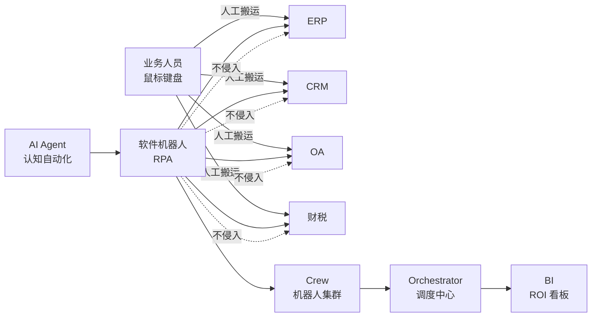
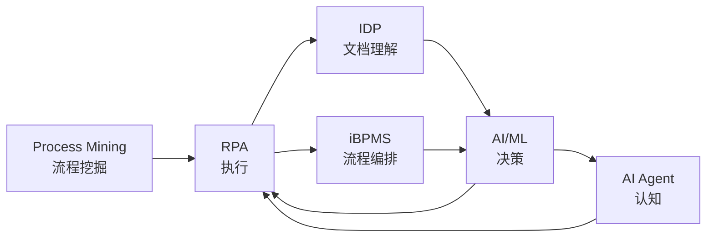
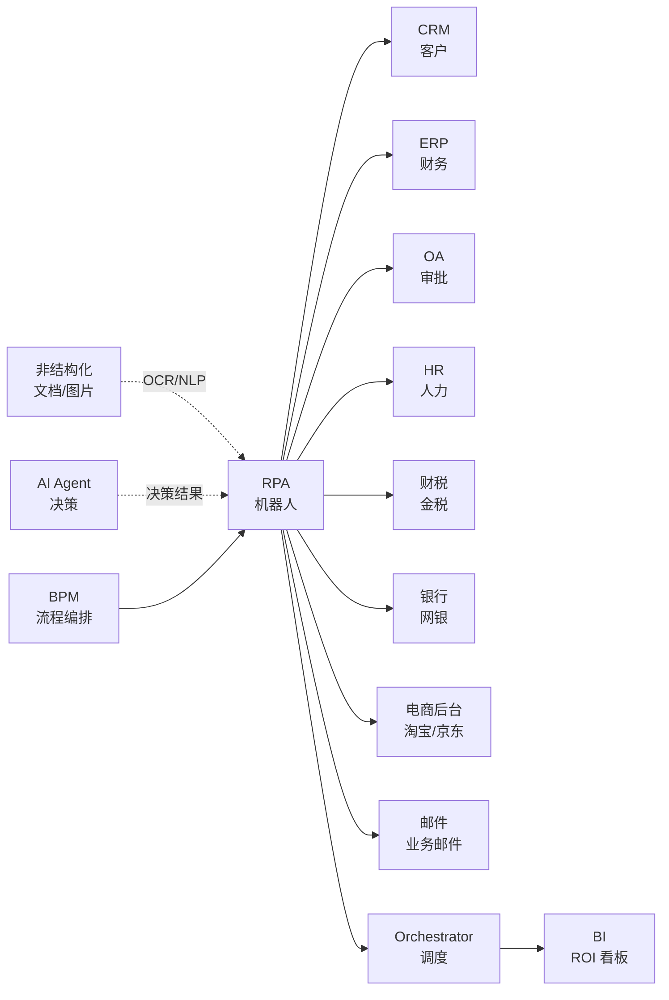

<!--
module:
  parent: application-systems
  slug: application-systems/05-operations/rpa
  type: article
  category: 主模块子文章
  summary: RPA（Robotic Process Automation 机器人流程自动化） 一句话定位：用"软件机器人"模拟人在电脑上的重复操作（点击/输入/复制/粘贴/跨系统搬运），把人从"鼠标搬运工"中解放出来，是企业自动化金字塔中"流程层自动化的最后一公里"。
-->

# RPA（Robotic Process Automation 机器人流程自动化）

> 一句话定位：用"**软件机器人**"模拟人在电脑上的重复操作（点击 / 输入 / 复制 / 粘贴 / 跨系统搬运），把人从"鼠标搬运工"中解放出来；是企业自动化金字塔中"**已有系统之上的非侵入式流程自动化**"——不改老系统、不写接口、不动数据库，让旧系统也能"自动跑起来"。

## 📌 全景图

**RPA 在企业自动化版图中的位置**：RPA 是"**UI 层的最后一公里自动化**"——底层有 ERP/CRM/SCM/财税等业务系统（System of Record），中层有 BPM 流程引擎（System of Process），上层有 BI 提供决策视图（System of Insight）；RPA 位于"**已有系统之间**"——用 UI 自动化打通"老系统 + 老系统 + 老系统"之间的数据搬运，**不动老系统一行代码**；再往上，AI Agent 接管"需要判断的环节"（看图、读邮件、理解合同），与 RPA 形成"决定 → 执行"闭环。

## 📖 定义

RPA（Robotic Process Automation 机器人流程自动化）是用"**软件机器人**"模拟人在电脑上的重复操作（点击 / 输入 / 复制 / 粘贴 / 跨系统搬运），把员工从"鼠标搬运工"中解放出来的技术。它不改老系统、不写接口、不动数据库，而是在"**已有系统的 UI 之上**"做一层"虚拟员工"。

**为什么需要 RPA**：企业普遍存在"**系统很多但数据不连通**"的痛点——ERP、CRM、OA、财税、银行、电商后台、Excel 表单，各自独立运营；跨系统数据搬运每天占用员工 30%-60% 的工作时间（Forrester 调研：高重复性后台岗位 40% 工作是"数据搬运"）；传统解决办法是"打接口 / 换系统 / 写集成"，成本高、周期长、动老系统风险大；RPA 给出"**第三条路**"——**不动老系统，让机器人像人一样操作老系统**。

**权威定义参考**：
- **Forrester（2017 首创术语）**：RPA 是"用软件机器人自动执行本来由人完成的重复性、规则化、跨系统操作任务的技术"
- **Gartner（RPA 魔力象限 2024）**：RPA 是"在企业 IT 架构中位于 SaaS/ERP/CRM 等系统之上的**非侵入式流程自动化层**，与 BPM、低代码、IDP（智能文档处理）共同构成 Hyperautomation（超自动化）四大支柱"
- **UiPath（行业龙头）**：RPA 是"让每个员工都有一个'数字助手'（Digital Assistant），处理高频重复工作，人去专注于判断 / 创意 / 客户沟通"

**历史演进**：
- **2010s 前身**：桌面自动化（Microsoft Macro / AutoHotkey / WinAutomation），单机脚本级，仅限个人
- **2012-2015 萌芽**：Blue Prism（2012 上市）、UiPath（2012 罗马尼亚创业）、Automation Anywhere（2003 创立）在英国/美国/印度起步，资本市场尚未关注
- **2017-2019 爆发**：Forrester 2017 年首创"RPA"术语，Gartner 2019 年首次发布"RPA 魔力象限"，UiPath 估值 70 亿美元（2019），Automation Anywhere 估值 68 亿美元，全球 RPA 融资超 30 亿美元
- **2020-2022 峰值**：UiPath 2021 年上市（NYSE: PATH），市值峰值 350 亿美元；新冠疫情成为"远程办公 + 自动化"催化剂，国内来也科技、影刀、实在智能、弘玑、云扩融资规模超 50 亿
- **2023-2025 成熟期**：Gartner 预测 2024 年 RPA 市场达 **44 亿美元**，UiPath 全球客户 **9000+ 家**（2024 年报）；国内 RPA 头部年营收 5-15 亿；技术演进方向是"**RPA + AI Agent**"（RPA 处理规则、AI 处理判断）
- **2026-2027+**：Gartner 预测**到 2026 年 30% 的企业 RPA 流程被 AI Agent 替代**（Agentic Automation），但**RPA 不会消失**——它是"AI Agent 的'手'"（执行层），二者从"竞争"走向"协作"

**与各系统的边界**：

- **vs BPM（业务流程管理）**：**BPM 是"流程编排"**（用流程引擎可视化编排流程，如 Camunda/Activiti/ProcessMaker），强调"流程设计 → 流程执行 → 流程优化"的完整生命周期；**RPA 是"流程执行"**（在已有系统 UI 上执行流程动作），强调"打通异构系统 + 模拟人操作"。**BPM 适合"单一系统内流程"，RPA 适合"跨系统流程"**；大型企业常"BPM 做主流程 + RPA 做跨系统拼图"
- **vs 低代码（Low-Code）**：低代码（如 OutSystems/钉钉宜搭/腾讯微搭）让"业务人员用拖拽快速搭建新应用"，是"**应用生产**"；RPA 是"**应用操作**"——不改系统，只模拟人操作系统。**低代码的产出是"新 APP"，RPA 的产出是"自动执行"**；二者可结合（低代码做新系统 + RPA 连老系统）
- **vs AI Agent（智能体）**：**AI Agent 是"认知层"**（理解意图、规划任务、调用工具、做决策），如 AutoGPT / Claude Agent / Manus；**RPA 是"执行层"**（按规则点击/输入/搬运）。**AI Agent 适合"开放场景 + 需要判断"，RPA 适合"封闭场景 + 规则固定"**。2025-2026 趋势：**AI Agent 做"大脑"，RPA 做"四肢"**（Agentic Process Automation）
- **vs Python 脚本**：Python 脚本是"程序员写代码 + 调 API"，需要开发能力；RPA 是"业务人员通过流程录制 + 拖拽配置"，**不需要编程**。**RPA 是"业务友好的自动化"**，对 IT 团队是补充而非替代（核心系统集成仍需 Python/Java）

**RPA 不擅长**：高频低延迟（μs 级）/ 高并发（ms 级）/ 决策判断（需结合 AI）/ 跨业务域编排（需 BPM 或 AI Agent 统筹）/ 改动老系统（需 API / 低代码 / 集成平台）。

**在企业 IT 架构中的位置**：RPA 是企业"**异构系统集成胶水**"——位于 ERP/CRM/SCM/财税/银行/电商等系统之上，**不侵入**这些系统，只在 UI 层模拟人操作；与 BPM（流程编排）、低代码（应用生产）、AI Agent（认知决策）、Python 脚本（API 集成）共同构成"**超自动化（Hyperautomation）**"技术栈。Gartner 2024 年报告将"RPA + Process Mining + IDP + iBPMS + 低代码 + AI Agent"列为超自动化六大支柱，**RPA 是其中最成熟、最广为人知的支柱**。RPA 项目"先 ROI 再说"——Forrester 调研显示 **RPA 项目平均 ROI 周期 12 个月**，头部项目 6-9 个月回本。

**典型数据量级**：成熟 RPA 平台管理的"机器人数量"从**数个到数千个**不等（中小企业 5-20 个 Bot，跨国集团 500-5000 个 Bot）。单个机器人每年节省人工 **1-3 FTE**（Full-Time Equivalent 全职当量）；典型 RPA 部署在 **1-3 年** 内扩展到 **50-200 个流程**。RPA 平台数据库（流程定义 / 执行日志 / 凭证库）通常在 **10GB-500GB** 区间；活跃用户从十人（CoE 卓越中心）到上百人（业务部门开发者/平民开发者 Citizen Developer）。

**为什么 2026 年 RPA 仍是必备工具**（客户常问"AI Agent 来了 RPA 是不是过时了"）：
1. **现有 RPA 资产沉没成本**：UiPath / Automation Anywhere 沉淀了 8-10 年、9000+ 客户、10 万+ 流程，再投入 5-10 年才能用 AI Agent 重写，**企业不会轻易放弃**
2. **RPA 处理"长尾流程"无敌**：AI Agent 在开放场景强，但在" 100% 规则、UI 固定、需要审计追溯"的长尾流程上，**RPA 仍然更快更稳更便宜**
3. **RPA 是 AI Agent 的"执行层"**：AI Agent 决策后，**调用 RPA Bot 完成"敲键盘点鼠标"**（如在 SAP 里按决策结果下采购订单）——二者在 Agentic Automation 框架下**互补而非竞争**
4. **合规与审计刚需**：RPA 提供**完整执行日志**（用户/时间/操作/截图），金融/医疗/政府部门审计刚需；AI Agent 的"黑盒决策"在合规场景**短期难替代**
5. **5-10 年内 RPA 仍是"自动化主力"**：Gartner 2024 预测**到 2028 年 30% 的企业 RPA 流程由 AI Agent 增强，但 70% 仍是"纯 RPA"**——RPA 不会消失，会"AI 化"

## 🔧 核心能力

- **流程录制（Process Recording）**：业务人员录制自己操作老系统的步骤（点击 / 输入 / 复制 / 粘贴 / 打开应用），RPA 自动生成可执行脚本
- **可视化流程设计（Visual Designer）**：拖拽式（Drag-and-Drop）流程编辑器，业务人员无需写代码即可拼装"步骤 + 判断 + 循环"
- **机器人执行（Bot Execution）**：设计好的流程部署到"机器人"——**有人值守（Attended）**（与员工同屏协作，员工触发）或**无人值守（Unattended）**（独立服务器 24×7 自动跑）
- **任务调度与编排（Orchestration）**：Orchestrator 调度中心按时间 / 事件 / 队列 / 优先级触发机器人；多机器人协同（First Available / Load Balancing）
- **异常处理（Exception Handling）**：遇到 UI 变化 / 错误弹窗 / 数据异常时走"重试 / 跳过 / 报警 / 转人工"分支
- **凭证管理（Credential Vault）**：机器人登录老系统的用户名密码 / 证书 / Token 加密存储，**不在脚本明文保存**
- **审计日志（Audit Trail）**：每个步骤的执行时间 / 截图 / 输入输出值 / 操作人员全部留痕（合规刚需）
- **AI 增强（AI Skills / Document Understanding）**：OCR 识别发票 / NLP 解析邮件 / ML 分类工单，让 RPA 能"看图读字"
- **跨系统操作（Cross-Application）**：同时操作 Windows 应用 + Web 应用 + Citrix 虚拟桌面 + 终端 + 的大型机（Mainframe），**覆盖企业 99% 系统**
- **人机协作（Human-in-the-Loop）**：关键步骤插入"人工确认"（如付款前财务复核），人机混合流程
- **机器人队列（Work Queue）**：把多个任务扔到"机器人队列"，机器人按队列领任务处理（解耦"提交"与"执行"）
- **可观测性（Observability）**：实时仪表盘显示机器人运行状态 / 成功率 / 处理时长 / 异常率，便于 CoE 监控
- **低代码扩展（Low-Code Custom Activities）**：业务人员用 VB.NET / C# / Python 写"自定义活动"，扩展 RPA 能力
- **公民开发（Citizen Development）**：业务部门经过培训后自主开发 RPA 流程，CoE 提供治理与支持（不是"IT 替代品"，是"IT 合作伙伴"）

**「录制 → 设计 → 执行 → 调度》的 RPA 四段式生命周期**：

**1. 流程发现（Process Discovery）**：
- **流程挖掘（Process Mining / Task Mining）**：用 Celonis / UiPath Process Mining 等工具挖掘"员工实际操作日志"，识别高重复、高耗时、规则化的流程
- **候选流程评估**：从"流程复杂度 / 规则化程度 / 业务量级 / 错误率"4 维度评估，**优先级 = 业务量 × 节省时间 × 错误率**
- **ROI 测算**：单流程 ROI = (人工时间 × 时薪 × 业务量) - (RPA 实施成本 + 年运维) ；**12 个月回本** 是行业基准

**2. 流程设计（Process Design）**：
- **流程录制（Recording）**：业务人员用 Recorder 录制"自己操作"，生成可视化步骤
- **可视化编排（Visual Designer）**：拖拽"打开应用 / 输入数据 / 点击按钮 / 复制粘贴 / 条件判断"等活动节点
- **变量与参数**：把硬编码改成"变量 / 参数"，让流程可复用
- **异常分支**：每个活动配置"重试 / 跳过 / 报警 / 转人工"分支
- **凭证绑定**：从 Credential Vault 绑定登录老系统的账号密码，**不写死在脚本**

**3. 流程部署（Deployment）**：
- **发布到 Orchestrator**：设计好的流程（Package）发布到调度中心
- **机器人绑定**：绑定到"有人值守机器人"（员工工位）或"无人值守机器人"（独立服务器）
- **环境分层**：Dev → Test → UAT → Prod 四环境，**避免"开发完直接上生产"**
- **发布审批**：流程上线需 CoE / 业务负责人审批

**4. 流程执行与监控（Execution & Monitoring）**：
- **触发执行**：手工触发 / 定时触发（Cron）/ 事件触发（API）/ 邮件触发 / 队列触发
- **执行监控**：Orchestrator 实时显示"机器人状态 / 任务队列 / 成功率 / 异常数"
- **异常告警**：异常率 > 阈值自动告警（邮件 / 钉钉 / 企微）
- **执行日志**：每个步骤的时间 / 截图 / 输入输出值 / 操作员全部记录（合规审计）
- **性能优化**：优化长流程（拆短 / 并行 / 异步）、优化机器人密度（一台机器跑多个 Bot）

**「有人值守 vs 无人值守」双模式**：RPA 机器人按"是否需要人工触发"分两类，企业按场景混合部署：

**1. 有人值守（Attended Bot）**：
- **部署位置**：员工工位 PC，与员工同屏
- **触发方式**：员工点击"启动 Robot"按钮 / 快捷键 / 屏幕悬浮按钮
- **典型场景**：客服一单处理（从 ERP 抓订单 + 从 CRM 抓客户 + 录入工单，半自动）、财务月结（员工启动后自动跑报表）
- **优点**：灵活（员工可介入）、启动成本低（无需独立服务器）
- **缺点**：仅工作时间运行（8h / 天）、依赖员工 PC 稳定性

**2. 无人值守（Unattended Bot）**：
- **部署位置**：独立 Windows Server / 虚拟机 / 云端（UiPath Automation Cloud）
- **触发方式**：Orchestrator 定时 / 事件 / 队列触发，**全自动**
- **典型场景**：银行日终对账（22:00 启动）、电商订单同步（实时队列）、月度税务申报（每月 1 号）
- **优点**：24×7 运行、不依赖员工、稳定性高
- **缺点**：需要 Windows Server 资源 + 维护

**机器人集群（Bot Density）**：单台 Windows Server 通常跑 **2-5 个 Unattended Bot**（取决于 CPU / 内存 / 应用并发能力）；现代 RPA 平台支持"**无人值守 + 桌面自动化**"（如 Citrix 虚拟应用），可单机跑 5-10 个 Bot。

**「OCR + NLP + ML」AI 增强三件套**：现代 RPA 平台均内置 AI 能力，让 RPA 能"看图读字"：

**1. OCR（Optical Character Recognition 光学字符识别）**：
- **场景**：发票识别（增值税发票 / 火车票 / 出租车票）、身份证识别、银行回单识别、合同扫描件识别
- **能力**：从图片/PDF 中提取结构化字段（金额 / 税率 / 发票号 / 日期）
- **UiPath Document Understanding**：预训练 200+ 发票/单据模板，开箱即用
- **准确率**：标准发票 95%+、手写体 70-85%、复杂版式 60-80%

**2. NLP（Natural Language Processing 自然语言处理）**：
- **场景**：邮件分类（投诉 / 询价 / 订单）、工单分派（按主题 / 紧急度路由）、合同条款提取
- **能力**：从文本中提取意图 / 实体 / 情感
- **UiPath AI Center**：预训练 50+ 行业 NLP 模型

**3. ML（Machine Learning 机器学习）**：
- **场景**：异常检测（异常交易识别）、预测（客户流失预测）、分类（信用风险）
- **能力**：ML 模型作为"Custom Activity"嵌入 RPA 流程
- **UiPath AI Center / Automation Anywhere IQ Bot**：支持 AutoML / 自定义模型

**「Hyperautomation（超自动化）」Gartner 2024 框架**：RPA 不是"孤立技术"，而是"超自动化"技术栈的核心组件之一：

- **Process Mining（流程挖掘）**：Celonis / Disco / UiPath Process Mining 分析"ERP/SAP 操作日志"，识别瓶颈流程
- **RPA（执行）**：RPA 完成"跨系统 UI 操作"
- **IDP（Intelligent Document Processing 智能文档处理）**：OCR + NLP + ML 处理非结构化文档
- **iBPMS（Intelligent Business Process Management Suite）**：Camunda / Appian / Pega 编排"长流程"
- **低代码**：OutSystems / 钉钉宜搭快速搭建新应用
- **AI Agent**：AutoGPT / Claude Agent 接管"需要判断"的环节

**「RPA 成熟度分级」（行业参考框架）**：

- **L1 试点（10 个流程）**：单部门试点 1-3 个流程，验证 ROI，CoE 1-3 人
- **L2 推广（50 个流程）**：跨部门推广 10-50 个流程，建立 CoE 5-10 人，年度节省人工 50-100 FTE
- **L3 规模化（200 个流程）**：全集团规模化 50-200 个流程，CoE 20-50 人，**引入 Process Mining / IDP / AI Center**
- **L4 智能化（500 个流程）**：RPA + AI Agent + IDP 全栈部署，**500+ 流程**，CoE 50-100 人
- **L5 Agentic（生态化）**：RPA 作为"AI Agent 的执行层"，**1000+ 流程**，CoE 100+ 人，**从"自动化"升级到"自治"**

按 RPA 厂商公开年报数据，2024 年全球 RPA 客户的成熟度分布大致是：**L1 占 40%**、**L2 占 35%**、**L3 占 15%**、**L4-L5 占 10%**——多数企业仍在"试点 → 推广"阶段。

## 📊 关键模块详解

### 流程录制器（Process Recorder）

RPA 的"入口"，让业务人员用"零代码"方式记录操作：

- **基本录制（Basic Recording）**：记录鼠标点击 / 键盘输入，生成"动作序列"
- **桌面录制（Desktop Recording）**：记录完整桌面操作（多应用切换）
- **网页录制（Web Recording）**：针对浏览器，智能识别 HTML 元素（不只是坐标）
- **Citrix 录制（Citrix Recording）**：针对虚拟桌面 / 终端，**唯一可识别"图像"**（需配 CV 引擎）
- **录制 vs 设计**：录制适合"快速原型"，复杂流程建议"直接设计"（录制产物可能含冗余动作）

### 可视化设计器（Visual Designer / Studio）

RPA 的"工作台"，是"流程开发 IDE"：

- **活动库（Activity Library）**：内置 300-600 个预制活动（点击 / 输入 / 打开应用 / OCR / HTTP / Excel / Email / DB）
- **拖拽式编排**：把活动"拖"到画布，连线成流程
- **变量与参数**：把硬编码改"变量"，让流程可复用
- **条件 / 循环 / 异常**：可视化配置"If / Else / For Each / Try Catch"
- **调试器（Debugger）**：单步调试 / 断点 / 监视变量
- **录制器集成**：录制器录的步骤直接进入设计器

### 机器人运行时（Bot Runtime / Robot）

执行流程的"软件员工"：

- **有人值守（Attended）**：与员工同屏，员工触发
- **无人值守（Unattended）**：独立服务器，Orchestrator 触发
- **高密度（High-Density）**：克隆模式（VDI / Citrix），单机跑 20-50 个 Bot
- **Studio 模式**：开发用，绑给开发人员
- **Bot 组成**：.NET Runtime + 流程 Package + 凭证 + 配置

### 调度中心（Orchestrator）

RPA 的"大脑"，管理所有机器人：

- **机器人管理**：注册 / 解绑 / 分组 / 授权
- **流程管理**：发布 / 版本 / 部署 / 升级
- **任务调度**：定时 / 事件 / 队列 / 优先级
- **队列管理**：Work Queue 解耦"提交"与"执行"（如 1000 个订单扔进队列，机器人按队列领单）
- **凭证管理**：Credential Vault 加密存储账号密码
- **审计日志**：所有管理操作 + 机器人执行全部留痕
- **角色权限**：RBAC（管理员 / 开发员 / 业务用户 / 只读）
- **API 集成**：REST API 触发流程 / 推送队列 / 查询状态

### AI Center / Document Understanding（AI 中心）

让 RPA 能"看图读字"：

- **OCR（文档识别）**：预训练发票 / 合同 / 身份证 / 银行回单模板
- **NLP（语义理解）**：邮件分类 / 工单分派 / 合同提取
- **ML（机器学习）**：自定义模型训练（AutoML / 调参 / 部署）
- **持续学习**：标注数据回流，持续优化模型
- **AI Skill 复用**：训练好的 AI 能力作为"AI Skill"在 RPA 流程中复用

### 流程挖掘（Process Mining / Task Mining）

识别"哪些流程值得自动化"：

- **Process Mining（系统日志挖掘）**：从 ERP/SAP/CRM 导出日志，分析"流程实际执行路径"，识别绕路 / 返工 / 瓶颈
- **Task Mining（员工操作挖掘）**：通过"屏幕录像 + 操作日志"分析员工实际操作，识别重复性任务
- **自动候选评估**：自动算出"哪些流程值得自动化 + ROI 多少"
- **流程优化建议**：不仅"识别瓶颈"，还"建议优化方向"

### 机器人市场（Marketplace / Bot Store）

预制流程市场，开箱即用：

- **UiPath Marketplace**：1000+ 预制流程（SAP / Oracle / Salesforce / 钉钉 / 微信 / 支付宝集成）
- **Automation Anywhere Bot Store**：500+ 预制 Bot
- **国内 RPA 厂商**：来也科技 / 影刀 / 实在智能均有预制流程库
- **社区贡献**：全球开发者贡献的免费流程

### 分析与 ROI 看板（Insights / Analytics）

衡量 RPA 项目 ROI：

- **执行统计**：流程数 / 机器人数量 / 任务数 / 成功率 / 平均时长
- **节省工时**：人工时间 vs 机器人时间，FTE 节省（FTE Saved）
- **ROI 计算**：License + 实施成本 vs 节省工时 × 时薪 × 业务量
- **异常分析**：异常率 / 异常原因 / SLA 达成率
- **预测性维护**：基于历史异常，预测哪些机器人 / 流程即将出问题

## 🏆 选型决策

### 国际三巨头 vs 国内五虎

| 厂商 | 总部 | 定位 | 优势 | 劣势 | 适用规模 |
|------|------|------|------|------|---------|
| **UiPath** | 美国（罗马尼亚创立） | 全球 RPA 龙头 | 生态最全（Marketplace 1000+ 预制流程）、AI 能力强（Document Understanding）、Orchestrator 强大、社区活跃 | **贵**（人均 5000-15000 元/年）、中国本地化弱（钉钉 / 企微 / 微信集成需自研）、C# 技术栈 | 跨国集团 / 大型企业 / 金融保险 |
| **Automation Anywhere** | 美国 | RPA + AI 平台 | IQ Bot 文档识别强、Control Room 集中管理、企业级安全 | 实施复杂、UI 偏传统、生态弱于 UiPath | 大型集团 / 金融保险 |
| **Blue Prism** | 英国 | 面向大企业的 RPA | 安全性强（银行 / 保险首选）、企业级治理 | 较贵、UI 传统、技术栈老、旧版本难升级 | 跨国集团 / 银行保险 |
| **来也科技（来也）** | 中国 | 国内 RPA 龙头 | **本土化强**（钉钉 / 企微 / 微信 / 飞书集成开箱即用）、性价比高、IDP 文档识别强、生态完善 | 国际化弱、复杂流程设计器略弱于 UiPath | 国内中大型企业 / 政企 |
| **影刀 RPA** | 中国 | 平民开发代表 | 上手最快（业务人员 1 天入门）、拖拽式体验好、电商场景深（淘宝 / 京东 / 拼多多） | 企业级治理弱（无完整 Orchestrator）、大型项目不如 UiPath | 国内中小企业 / 电商 / 财务 |
| **实在智能** | 中国 | RPA + AI 双引擎 | TARS 大模型（自研 LLM）集成强、Agent 方向领先、国产化适配 | 生态较新、企业级落地案例少 | 国内中大型企业 / AI 创新场景 |
| **弘玑 Cyclone** | 中国 | 金融级 RPA | 金融行业深耕、安全合规强、流程稳定性高 | 政企以外案例少 | 国内金融 / 央国企 |
| **云扩科技** | 中国 | 全栈 RPA | 文档识别（IDP）强、易用性好、定制能力强 | 品牌知名度弱于来也 / 影刀 | 国内中型企业 |

### 自研 vs 商用

| 维度 | 自研 RPA | 商用 RPA |
|------|---------|---------|
| 适用规模 | 特殊合规需求（军工 / 金融）/ 已有 AI Agent 平台 | 多数企业（跨境 / 集团 / 中型） |
| 优势 | 100% 自主可控、与内部系统深度集成 | 8-10 年行业沉淀、生态成熟、迭代快 |
| 劣势 | 投入大（5000 万+）、周期长（3-5 年）、生态空白 | 长期 TCO 高（按 Bot 订阅）、定制受限 |
| 典型代表 | 字节跳动 / 阿里自研、华为内部 RPA | UiPath / AA / 来也 / 影刀 |
| 决策阈值 | 万人 + 特殊合规 + 长期投入 → 自研；否则 → 商用 |

### 选型决策树（5 层）

1. **先看规模与地域**：跨国 → UiPath / AA / Blue Prism；纯国内 → 来也 / 影刀 / 弘玑
2. **再看行业**：金融 / 保险 → Blue Prism / 弘玑（合规强）；电商 / 中小 → 影刀（上手快）；政企 → 来也 / 弘玑（本土化 + 合规）
3. **再看生态要求**：强钉钉 / 企微 / 微信集成 → 来也 / 影刀；强 SAP / Oracle 集成 → UiPath Marketplace（1000+ 预制流程）
4. **再看 AI 能力**：需要 OCR + NLP + ML → UiPath / 来也（含 AI Center）；需要 AI Agent 集成 → 实在智能（自研 TARS 模型）
5. **最后看预算与 TCO**：5 年 TCO 是否在 ROI 测算范围内？国际 vs 国内差距通常 **3-5 倍**

### RPA + AI Agent 时代选型（2026+）

Gartner 2024 预测 **2026 年 30% 的 RPA 流程被 AI Agent 替代**，但 RPA 不会消失——会"AI 化"。选型注意：

- **RPA 厂商是否在"AI Agent 化"**：UiPath Autopilot（2024）/ 来也"数字员工"大模型版本 / 实在智能 TARS / Automation Anywhere + AWS Bedrock 集成
- **是否能与外部 AI Agent 集成**：是否提供 REST API / MCP（Model Context Protocol）/ Agent 调用接口
- **是否能从"Bot"升级到"Agent"**：从"按规则执行"升级到"按目标执行"
- **"AI Agent 做大脑 + RPA 做四肢"**：RPA 厂商提供"Skill / Tool"接口，让 AI Agent 调用 RPA Bot

## 🚨 实施陷阱 / 反模式

### 1. 流程选择错误陷阱

**现象**：上了 10 个 RPA 流程，3 个 ROI 为负（流程太复杂 / 业务量太小 / 规则频繁变化）。
**根因**：流程选择没有"客观评估标准"，凭业务部门主观偏好；选择"复杂流程"做"标杆项目"——反而失败。
**规避**：用**自动化潜力评估表**（4 维度评分）：①业务量（每月 ≥ 100 次）②规则化（≥ 80% 步骤是规则）③稳定性（UI 变化 ≤ 1 次 / 季度）④结构化（输入数据 ≥ 80% 结构化）。**总分 ≥ 80 分才做**；**L1 试点只做"小而美"流程**（如单一系统内的对账），不挑战"复杂跨系统"。

### 2. 异常处理缺失陷阱

**现象**：RPA 流程上线后遇到 UI 变化 / 弹窗 / 数据异常，机器人"卡死"或"误操作"，数据被污染。
**根因**：流程设计时只考虑"正常路径"，没有"异常分支"；异常处理 = "重试" / "跳过" / "报警" / "转人工"任一选项，**不是一个都没有**。
**规避**：每个活动配置"Exception Handler"（Try Catch）；UI 变化用"Anchor Base"（基于邻元素定位）而非"Coordinate"（基于坐标）；关键操作前"截图"（审计留痕）；异常率 > 阈值（如 5%）自动告警。

### 3. 维护成本爆炸陷阱

**现象**：上了 50 个流程，3 个月后 30% 流程因"老系统 UI 改动"失效，维护团队 5 人天天救火。
**根因**：RPA 是"贴在 UI 上的一层皮"，老系统改版 / 升级 / 浏览器更新都可能导致 RPA 失效；多数企业没把"维护成本"算进 TCO。
**规避**：维护成本 = 实施成本的 **15-25% / 年**（行业基准）；建立"流程 Owner"机制（每个流程指定业务负责人，UI 变化前通知）；优先选"UI 稳定"的系统做 RPA（SAP / Oracle 比小厂商系统稳定）；用"Selector"（基于元素属性）而非"Coordinate"（基于坐标）。

### 4. 凭证管理失控陷阱

**现象**：RPA 脚本里硬编码"管理员账号密码"，员工离职后密码未改，机器人"误操作"或"被滥用"。
**根因**：业务人员为图方便，把凭证"明文"写在脚本；没有集中的"Credential Vault"。
**规避**：所有凭证必须存 Orchestrator 加密 Vault；脚本中**只引用凭证名**，不引用密码；密码定期轮换（90 天）；凭证访问走 RBAC（业务用户看不到 Production 凭证）；生产环境强制 MFA 二次验证。

### 5. 与 AI Agent 边界混乱陷阱

**现象**：2025 年 AI Agent 热潮，业务部门要求"所有 RPA 流程用 AI Agent 重写"，结果 6 个月没交付，RPA 流程反而比 AI Agent 稳定。
**根因**：把"AI Agent"当成"万能药"，忽视"AI Agent 在规则化场景反而不如 RPA"；决策边界不清。
**规避**：**能做规则的不用 AI**——RPA 4 维度评分（业务量 / 规则化 / 稳定性 / 结构化）≥ 80 分走 RPA，< 60 分走 AI Agent，60-80 分走"AI Agent + RPA"混合；**AI Agent 做"决定"，RPA 做"执行"**（Agent 给结果，RPA 调老系统落地）；建立"AI Agent 项目治理"（与 RPA 治理并行）。

### 6. 平民开发失控陷阱

**现象**：业务部门"自助开发" 30 个 RPA 流程，三个月后 20 个流程烂尾（设计混乱 / 异常处理缺失 / 凭证泄露）。
**根因**：鼓励"业务人员自助开发"但没"治理机制"——CoE 不审流程、不培训、不审计。
**规避**：**CoE 治理 + 平民开发** 双轨：①CoE 提供"开发规范 + 模板 + 培训"；②流程上线前 CoE 走"代码审查"（MVP 流程至少 30 分钟）；③生产部署需 CoE 审批；④流程版本管理（Git）；⑤年度审计（异常率 / 凭证使用 / 合规）。

### 7. 项目治理缺失陷阱

**现象**：RPA 项目看起来"小"（自动化单个流程），但 50 个流程后治理成本爆炸；License 失控：业务部门绕过 IT 自行采购；机器人闲置 / 滥用。
**根因**：没把 RPA 当"企业级项目"治理；CoE 缺位 / 弱化。
**规避**：**RPA CoE（卓越中心）必不可少**——5-10 人（CoE Lead / 架构师 / 开发 / 运维 / 业务分析）；CoE 统一采购 / 治理 / 培训 / 监控；KPI 包括流程数 / 成功率 / ROI / 用户满意度；半年一次"RPA 治理 review"。

### 8. 期望值过高陷阱

**现象**：CEO 听了厂商"上 RPA 降本 50%"宣传，宣布"3 年降本 1 亿"，3 年后实际降本 2000 万，公司上"自动化失败名单"。
**根因**：RPA 厂商销售夸大 ROI；企业没做"现实 ROI 测算"。
**规避**：**RPA ROI 测算公式**：ROI = (节省人工时间 × 时薪 × 业务量 - RPA 年化成本) / RPA 年化成本；**行业均值：12 个月回本，头部项目 6-9 个月**；CEO 不要被"PPT ROI"迷惑，要求"每个流程有具体 ROI 测算"；**标杆项目先做 1-2 个**，验证 ROI 后再推广。

### 9. 流程未被"端到端"覆盖陷阱

**现象**：RPA 把"中间环节"自动化了，但"前后环节"仍人工（前端数据采集 / 后端异常处理），员工"反而更累"——"机器人做完我还要核对"。
**根因**：RPA 项目只考虑"流程片段"，忽略"端到端体验"。
**规避**：RPA 项目从"端到端流程"出发，**前后环节都纳入自动化设计**；前端用"用户输入表单"统一数据；后端用"机器人 + 异常工单"自动分配人工；**目标是"员工 0 干预"**，而非"半自动"。

### 10. 小作坊实施陷阱

**现象**：业务部门私自找"小厂商"或"外包团队"做 RPA，3 个月后厂商跑路，机器人维护无门。
**根因**：RPA 决策权下放给业务部门，缺 CoE 治理。
**规避**：**RPA 选型必须 CoE 主导**；3-5 家候选厂商 RFP + POC；厂商需有"长期服务能力"（本地化团队 / 持续迭代 / 行业案例）。

### 陷阱共性规律

行业研究统计 RPA 项目失败率约 **30-40%**（Forrester 2024），失败原因中：
- 约 **30%** 源自「流程选择错误」（选择陷阱）
- 约 **25%** 源自「异常处理缺失 + 维护成本失控」（技术陷阱）
- 约 **20%** 源自「平民开发失控 + 治理缺失」（治理陷阱）
- 约 **15%** 源自「期望值过高 + 厂商画饼」（商务陷阱）
- 约 **10%** 源自「凭证泄露 / 流程被滥用」（合规陷阱）

规避核心：「**流程选择 4 维度评估表 + 异常处理零容忍 + CoE 治理 + 平民开发控 + 现实 ROI 测算**」是 RPA 成功的 5 大前置条件。

## 🛤️ 学习路线

### 入门（0-3 个月，建立基础认知）

1. **第 1 周**：阅读 Gartner RPA 魔力象限 2024 报告，了解 UiPath / Automation Anywhere / Blue Prism 在 RPA 领域的市场地位
2. **第 2-3 周**：阅读《智能自动化：RPA + AI 实战》《The RPA Way》入门书，建立 RPA 全局认知
3. **第 4-6 周**：试用一款**免费版 RPA**（UiPath Community Edition / 影刀个人版），亲自录制 1-2 个简单流程（如自动登录 5 个网站、自动汇总 Excel）
4. **第 7-10 周**：研究 1-2 家头部企业案例（如某银行日终对账 RPA 自动化、某电商订单同步 RPA 流程）
5. **第 11-12 周**：参加 1 次行业会议（如 UiPath Forward / 中国 RPA 大会），了解最新趋势

### 进阶（3-12 个月，深度技能）

1. **3-6 个月**：选择一个**细分模块**（如 Orchestrator / AI Center / Document Understanding）做深度研究——产品手册 + 官方认证课程 + 实战项目
2. **6-9 个月**：参与 1 个 **RPA 实施项目**，从流程挖掘 → POC 验证 → 部署上线全流程
3. **9-12 个月**：学习 **Process Mining / Task Mining**（Celonis / UiPath Process Mining），能从系统日志挖掘候选流程；产出 1 个完整 ROI 报告

### 精通（12 个月以上，专家级）

1. **12-24 个月**：主导 1 个完整 RPA 实施项目（≥ 50 个流程），覆盖流程挖掘 / 治理 / 平民开发 / 集成 AI
2. **24-36 个月**：建立 **RPA CoE 治理体系**（流程规范 / 平民开发治理 / ROI 看板 / 培训认证），成为企业 RPA 专家
3. **36 个月+**：横向扩展到 **Hyperautomation**（RPA + Process Mining + IDP + AI Agent + iBPMS），主导企业"超自动化"战略

### 学习资源

- **书籍**：《智能自动化：RPA + AI 实战》《The RPA Way》《Working with AI》《RPA 实施方法论》
- **报告**：Gartner RPA 魔力象限 / Forrester Wave for RPA / IDC 中国 RPA 市场报告
- **会议**：UiPath Forward / 中国 RPA 大会 / Gartner Application Innovation & Business Solutions Summit
- **社区**：UiPath Forum / RPA 中国社区 / 影刀开发者社区 / 来也开发者社区
- **认证**：UiPath Certified RPA Developer / Automation Anywhere Certified Master / 来也 RPA 工程师认证

## 🔗 上下游关系

- **上游**：ERP（财务数据）、CRM（客户数据）、OA（审批流程）、HR（人事数据）、财税系统（金税申报）、银行系统（网银操作）、电商后台（订单同步）、邮件系统（业务邮件）、非结构化文档（OCR/NLP 输入）
- **下游**：Orchestrator（调度中心）、BI（ROI 看板）、流程 Owner（业务部门）
- **横向**：AI Agent（AI Agent 做决策，RPA 执行）、BPM（流程编排，RPA 执行）、Process Mining（挖掘候选流程）

**集成要点**：

- **RPA ↔ ERP**：RPA 在 ERP UI 上操作（不改 ERP），如 SAP 事务码 / 用友 U8 表单 / 金蝶 EAS 报表
- **RPA ↔ OA**：OA 审批流触发 RPA（API 触发），RPA 完成后续系统操作
- **RPA ↔ 财税**：RPA 自动登录金税系统申报 / 认证发票 / 抵扣
- **RPA ↔ 银行**：RPA 自动登录企业网银（U盾 / 数字证书）做对账 / 收付款
- **RPA ↔ 电商**：RPA 同步淘宝 / 京东 / 拼多多订单到 ERP
- **RPA ↔ AI Agent**：AI Agent 决策后调用 RPA Bot 完成"敲键盘点鼠标"
- **RPA ↔ BPM**：BPM 编排"长流程"，RPA 执行"跨系统操作"
- **RPA ↔ Process Mining**：Process Mining 挖掘 ERP 日志，识别"哪些流程值得自动化"

**集成模式选择**：

- **屏幕自动化（UI Automation）**：直接操作老系统 UI（默认方式，不侵入）
- **API 触发**：通过 REST API 触发 RPA 流程（与其他系统集成）
- **队列触发**：把任务扔到 Work Queue，机器人按队列领单（解耦"提交"与"执行"）
- **事件驱动**：监听邮件 / 文件 / API 事件，自动触发 RPA
- **混合模式**：UI 自动化 + API 集成（双重保险）

## ⚖️ 关键考量

- **流程选择决定 80% 成功**：4 维度评分（业务量 / 规则化 / 稳定性 / 结构化）≥ 80 分才做
- **CoE 治理必须先行**：RPA 是"企业级项目"，不是"部门工具"，CoE 5-10 人是标配
- **异常处理零容忍**：每个活动配置 Exception Handler；UI 变化用 Anchor Base 而非 Coordinate
- **维护成本算进 TCO**：每年 15-25% 实施成本用于维护；流程 Owner 机制
- **凭证管理集中化**：所有凭证走 Orchestrator Vault，脚本不存明文
- **平民开发要治理**：业务部门可开发，但 CoE 必须审流程
- **不要"AI Agent 狂热"**：RPA 不会消失，AI Agent 是补充而非替代；**AI Agent 做大脑，RPA 做四肢**
- **现实 ROI 测算**：行业均值 12 个月回本，头部 6-9 个月；CEO 不要被"PPT ROI"迷惑
- **小而美起步**：先做 1-2 个标杆流程（单系统内的高频流程），验证 ROI 再推广
- **生态优先于品牌**：UiPath Marketplace 1000+ 预制流程 比"自研 100 个流程"更划算

## 🎯 选型指南

| 企业类型 | 推荐 | 理由 |
|---------|------|------|
| 跨国集团（万人+） | UiPath / Automation Anywhere / Blue Prism | 全球合规、英语生态、跨国部署 |
| 国内大型集团 | 来也科技 / UiPath | 本土化 + 国际生态 |
| 国内中型企业 | 来也 / 影刀 / 实在智能 | 性价比、本土化、钉钉企微集成 |
| 国内中小企业 | 影刀 / 云扩 | 上手快、性价比高、电商场景深 |
| 金融 / 保险 | Blue Prism / 弘玑 / UiPath | 合规强、安全、审计 |
| 电商 / 零售 | 影刀 / 来也 | 电商场景深、上手快 |
| 政企 / 国企 | 来也 / 弘玑 | 本土化、信创合规 |
| 制造业 | UiPath / 来也 | SAP / Oracle 集成、ERP 自动化 |

**选型自检维度**：

1. **生态覆盖度**：是否覆盖目标系统（SAP / Oracle / 钉钉 / 企微 / 微信）？
2. **AI 能力**：是否内置 OCR / NLP / ML？是否支持自定义 AI 模型？
3. **业务友好度**：业务人员能否自主开发（平民开发）？Studio 设计器体验？
4. **企业级治理**：Orchestrator 调度中心 / 凭证管理 / 审计日志 / RBAC？
5. **厂商长期能力**：本地化实施团队 / 行业案例 / 持续迭代 / 长期服务承诺？
6. **TCO 测算**：5 年 TCO 是否在 ROI 测算范围内？维护成本是否纳入？
7. **AI Agent 演进**：是否在"AI Agent 化"？能否与外部 AI Agent 集成？

**红线**：

- 无 CoE 治理 = 必败
- 流程选择不评估（4 维度评分）= 必败
- 凭证明文写在脚本 = 必败
- 平民开发无审查 = 必败
- 期望值过高于 12 个月回本 = 必败

**RFP 模板要点**：建议 RFP 覆盖 **5 大类 30+ 评分项**：

- **功能类（30%）**：流程录制器 / Studio 设计器 / Bot 运行时 / Orchestrator / AI Center / Document Understanding / Marketplace / Process Mining
- **性能类（15%）**：单机 Bot 数量 / 流程执行时长 / 并发能力 / 大队列吞吐量
- **集成类（25%）**：REST API / 消息队列 / Webhook / SAP / Oracle / Salesforce / 钉钉 / 企微 / 微信 / 飞书 / 银行 / 电商
- **AI 类（15%）**：OCR（发票 / 合同 / 身份证）/ NLP（邮件 / 工单）/ ML（自定义模型）/ AI Agent 集成（MCP / Tool）
- **服务类（15%）**：本地化实施团队 / 行业案例 / 培训认证 / SLA / 持续迭代

**TCO 估算要点**（1000 人企业 5 年 TCO）：

- **UiPath**：1500-3000 万（License 60% + 实施 25% + 运维 10% + AI 增强 5%）
- **Automation Anywhere**：1000-2500 万
- **Blue Prism**：1200-2500 万
- **来也 / 影刀**：300-800 万
- **实在智能**：400-900 万
- **自研**：2000-5000 万 + 500 万/年级运维

## ⚠️ 常见陷阱

- **「RPA 是万能自动化」**：RPA 只适合"规则化流程"，AI Agent 适合"判断性流程"；Hyperautomation 才是"全场景"
- **「上了 RPA 就能砍人」**：RPA 是"把人从重复劳动中解放"，不是"砍人"——释放的人去做"判断 / 创意 / 客户沟通"
- **「RPA 一定降本 50%」**：行业均值 12 个月回本，降本 30-40% 是现实；CEO 不要被 PPT 迷惑
- **「平民开发 = 业务替代 IT」**：平民开发是"业务 + IT 协作"，不是"砍 IT"；CoE 治理不可缺
- **「RPA 升级到 AI Agent 就万事大吉」**：AI Agent 在规则化场景不如 RPA；**AI Agent 做大脑，RPA 做四肢**
- **「凭证写在脚本里没事」**：凭证泄露 = 数据泄露 + 合规风险；必须 Credential Vault
- **「RPA CoE 是 IT 部门的事」**：RPA CoE 是"业务 + IT 联合团队"，业务 Owner 缺位 = 治理失败
- **「RPA 实施完就结束」**：RPA 没有"实施完"，UI 变化 / 业务调整 = 持续运维；CoE 长期运营
- **「RPA 一定能替代人」**：RPA 替代"重复劳动"，不替代"判断 / 创意 / 客户沟通"；人机协作是常态

## 📚 参考来源

- **Gartner Magic Quadrant for Robotic Process Automation 2024**：Gartner, "Magic Quadrant for Robotic Process Automation", 2024。RPA 市场格局权威参考，UiPath / Automation Anywhere / Microsoft Power Automate / SS&C Blue Prism 四大领导者（https://www.gartner.com）
- **Forrester Wave™ for Robotic Process Automation 2024**：Forrester, "The Forrester Wave™ for Robotic Process Automation, Q2 2024"，从战略 / 当前产品 / 市场表现等维度评估 RPA 厂商（https://www.forrester.com）
- **UiPath 2024 Annual Report**：UiPath 公司年报，全球客户 9000+ 家、ARR 14 亿美元、120+ 国家覆盖、Marketplace 1000+ 预制流程（https://www.uipath.com）
- **IDC China RPA Market Report 2024**：IDC, "中国 RPA 市场跟踪报告 2024"，国内 RPA 市场格局（来也 / 影刀 / 实在智能 / 弘玑 / 云扩）权威数据
- **Gartner Top 10 Strategic Technology Trends 2024 - Hyperautomation**：Gartner 2024 战略科技趋势报告，Hyperautomation（超自动化）含 RPA + Process Mining + IDP + iBPMS + 低代码 + AI Agent 六大支柱
- **《The RPA Way》**：Udayan Bose 著，RPA 实施方法论标杆，介绍 CoE 治理 / 流程挖掘 / 平民开发等核心实践
- **《智能自动化：RPA + AI 实战》**：国内 RPA 实施专家合著，讲解 RPA + AI + 超自动化在中国企业的落地实践
- **Automation Anywhere University**：Automation Anywhere 官方课程，覆盖 IQ Bot / Control Room / Bot Security 等核心技能
- **UiPath Academy**：UiPath 官方免费课程，从入门到精通全系列，含 RPA Developer / RPA Solution Architect 认证路径
- **Harvard Business Review - "What RPA Is and Isn't"**：HBR 关于 RPA 定位与边界的经典文章，强调"RPA 不替代人，但增强人"

---

← [返回: 业务应用系统](../../README.md)

## 📊 本节统计

- **核心能力**：14 大模块（录制 / 设计 / 执行 / 调度 / 异常处理 / 凭证管理 / 审计 / AI 增强 / 跨系统 / 人机协作 / 队列 / 可观测性 / 低代码扩展 / 公民开发）
- **RPA 生命周期**：4 段（流程发现 / 流程设计 / 流程部署 / 流程执行与监控）
- **机器人模式**：2 类（有人值守 / 无人值守）
- **AI 增强**：3 件套（OCR / NLP / ML）
- **Hyperautomation 框架**：6 大支柱（Process Mining / RPA / IDP / iBPMS / 低代码 / AI Agent）
- **RPA 成熟度分级**：5 级（L1 试点 / L2 推广 / L3 规模化 / L4 智能化 / L5 Agentic）
- **国际三巨头**：UiPath / Automation Anywhere / Blue Prism
- **国内五虎**：来也科技 / 影刀 / 实在智能 / 弘玑 / 云扩
- **典型场景**：8 类（跨国 / 大型 / 中型 / 小型 / 金融 / 电商 / 政企 / 制造业）
- **集成架构**：8 上下游（CRM / ERP / OA / HR / 财税 / 银行 / 电商 / 邮件）+ 横向 AI Agent / BPM / Process Mining
- **关键考量**：10 维度（流程选择 / CoE 治理 / 异常处理 / 维护成本 / 凭证管理 / 平民开发 / AI 边界 / 现实 ROI / 小而美 / 生态优先）
- **选型自检维度**：7 项（生态 / AI / 业务友好 / 治理 / 厂商 / TCO / AI Agent 演进）
- **RFP 评分项**：5 大类 30+ 项（功能 30% / 性能 15% / 集成 25% / AI 15% / 服务 15%）
- **TCO 估算**（1000 人 5 年）：UiPath 1500-3000 万 / AA 1000-2500 万 / Blue Prism 1200-2500 万 / 国内 300-900 万 / 自研 2000-5000 万
- **常见陷阱**：9 类（流程选择 / 异常处理 / 维护成本 / 凭证管理 / AI 边界 / 平民开发 / 治理 / 期望值 / RPA 一定降本）
- **陷阱统计**：RPA 项目失败率 30-40%（30% 流程 / 25% 技术 / 20% 治理 / 15% 商务 / 10% 合规）
- **RPA 行业基准**：12 个月回本、头部 6-9 个月、降本 30-40%
- **所属价值链**：05 运营管理
- 关联系统：[ERP 深读](../erp/README.md) / [HR 深读](../hr/README.md) / [OA 深读](../oa/README.md) / [BPM 深读](../bpm/README.md) / [CRM 深读](../../04-sales-service/crm/README.md) / [BI 深读](../bi/README.md) / [MES 深读](../../02-production/mes/README.md)

