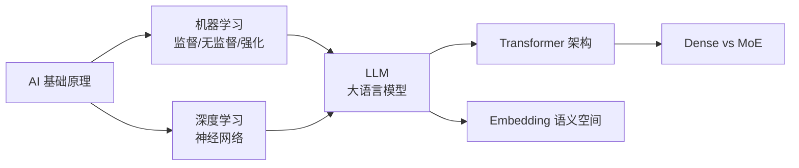

<!--
module:
  parent: ai
  slug: ai/fundamentals
  type: index
  category: 主模块子文章
  summary: AI 基础概念
-->

# L1 基础概念

> 人工智能的底层原理：从机器学习到神经网络，从稠密模型到混合专家。

## 1. 目录导航

| 目录 | 核心内容 | 一句话定位 |
|------|---------|-----------|
| [llm-basics](llm-basics/) | 大语言模型(LLM)基础定义、核心能力与训练方式 | LLM 入门第一站 |
| [transformer](transformer/) | **Transformer 架构核心** — Self-Attention / QKV / Multi-Head / Positional Encoding / Encoder-Decoder | 现代所有 LLM 的基石 |
| [neural-layers](neural-layers/) | 神经网络内部层次结构：CNN / RNN / Transformer | 深度学习骨架 |
| [embedding-vs-vectorization](embedding-vs-vectorization/) | 嵌入(Embedding)与向量化的本质区别、流形假说 | 语义空间的数学基础 |
| [dense-vs-moe](dense-vs-moe/) | 稠密模型 vs 混合专家(MoE)架构对比 | 大模型架构选型 |

### 1.1 学习路径

- **入门**：llm-basics → transformer → neural-layers
- **深入**：embedding-vs-vectorization → dense-vs-moe

---

## 2. 知识脉络

---

## 3. 速查表

| 概念 | 核心要点 | 典型场景 |
|------|---------|---------|
| **机器学习** | 从数据中学习规律，不依赖硬编码规则 | 分类、回归、聚类 |
| **监督学习** | 带标签数据训练 | 图像识别、垃圾邮件 |
| **无监督学习** | 无标签数据发现隐藏结构 | 聚类、降维 |
| **强化学习** | 试错 + 奖励机制 | AlphaGo、游戏 AI |
| **深度学习** | 多层神经网络 + 反向传播 | 视觉、NLP、语音 |
| **Transformer** | Self-Attention + 位置编码 + 并行计算 | 所有现代 LLM 基座 |
| **MoE** | 稀疏激活的专家网络 | GPT-4 / Mixtral / DBRX |
| **Embedding** | 高维向量空间中的语义表示 | 语义搜索、RAG |

---

## 4. 核心内容（按子模块展开）

- **[llm-basics](llm-basics/)**：大语言模型基础定义、核心能力、训练范式（预训练/微调/RLHF）
- **[transformer](transformer/)**：Self-Attention 数学推导、QKV 拆解、Multi-Head 机制、位置编码、Encoder-Decoder 变体
- **[neural-layers](neural-layers/)**：CNN 卷积层 / RNN 循环层 / Transformer 自注意力层的对比
- **[embedding-vs-vectorization](embedding-vs-vectorization/)**：Embedding 语义空间、流形假说、Word2Vec / GloVe / BERT Embedding
- **[dense-vs-moe](dense-vs-moe/)**：Dense 全激活 vs MoE 稀疏激活、专家路由、负载均衡、推理成本对比

---

## 5. 最佳实践

| 场景 | 实践要点 |
|------|---------|
| **入门 Transformer** | 先看 Self-Attention 的 QKV 拆解（数学本质），再理解多头与位置编码 |
| **理解 Embedding** | 从"语义相似 → 距离近"切入；用余弦相似度 + t-SNE 可视化直观理解 |
| **Dense vs MoE 选型** | 推理成本敏感 → MoE（参数大但激活少）；训练资源受限 → Dense（小模型全激活） |
| **理解 LLM 训练** | 预训练（无标注文本）→ SFT（指令微调）→ RLHF（人类反馈强化）三阶段 |

---

## 6. 常见面试题

| 题目 | 核心考点 |
|------|---------|
| 机器学习 vs 深度学习的本质？ | 特征工程自动化 vs 手工设计 |
| Transformer 与 RNN/LSTM 的区别？ | 并行计算 + 长距离依赖 |
| Self-Attention 的 QKV 如何理解？ | 查询-键-值矩阵，点积相似度加权 |
| Embedding 与 Vectorization 的本质？ | 高维语义空间 + 流形假设 |
| Dense vs MoE 推理成本？ | 全激活 vs 稀疏激活（10x 参数仅 2x FLOPs） |
| 多头注意力的意义？ | 多个子空间并行学习不同语义关系 |
| 位置编码的必要性？ | Self-Attention 本身无序，需额外位置信息 |

---

## 7. 相关章节

- 上层：[`L2 技术栈`](../02-technology-stack/) — Token / Prompt / Context / Function Calling
- 关联：[`13.split-hairs Transformer`](../../13.split-hairs/11.ai/transformer/README.md) — 面试深挖版
- 父级：[`11.ai` 总览](../README.md) — AI 知识体系

---

## 8. 开源参考

| 类别 | 项目 |
|------|------|
| 深度学习 | PyTorch · TensorFlow · Hugging Face Transformers |
| Transformer 论文 | "Attention is All You Need" (2017, Google) |
| Embedding 工具 | Sentence-Transformers · BGE · E5 · MTEB Benchmark |
| MoE 框架 | DeepSeek-MoE · Mixtral · DBRX |
| 学习资源 | 3Blue1Brown 神经网络可视化 · Andrej Karpathy "Zero to Hero" |

---

## 📊 本节统计

| 维度 | 数字 |
|------|------|
| 一级 leaf README 数 | 5（llm-basics / transformer / neural-layers / embedding-vs-vectorization / dense-vs-moe） |
| 二级 leaf README 数 | 0 |
| 速查表条目数 | 8（ML / SL / UL / RL / DL / Transformer / MoE / Embedding） |
| 最佳实践条数 | 4 |
| 常见面试题数 | 7 |
| 开源参考项目数 | 4 类（深度学习 / 论文 / Embedding / MoE / 学习资源）共 12+ 条 |
| frontmatter 覆盖 | 5 / 5 = 100% |
| 文末回链覆盖 | 5 / 5 = 100% |

---

← [返回 AI 知识体系](../README.md)