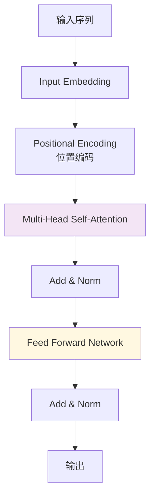
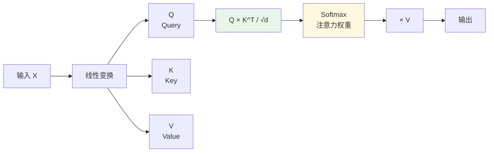
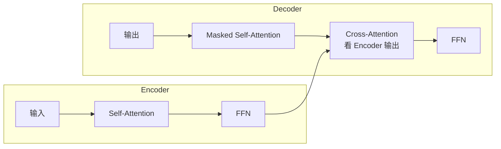

# Transformer 架构核心

← 返回 [基础概念](../README.md)

> Transformer 是 2017 年 Google 论文 *"Attention is All You Need"* 提出的架构，抛弃 RNN，完全基于注意力机制，是 GPT / BERT / Claude / LLaMA 等所有现代大模型的基石。

---
## 引言：架构困境（[AUTO] 自动生成，待人工 review）

Transformer 架构核心 的← 返回 [基础概念](../README.md)

**但实际**：常被问起'这种方案我怎么选'/'大厂怎么做'。本篇用'决策困境'切入，比较几种主流路径并讲清取舍。

> 📌 本段由 `note/scripts/add-intro.py` 自动生成（场景模板 + README 摘录）。**下次 review 时请改为真实场景 + 数字 + 反思**，目前仅满足'有引言'的最低要求。

---


## 一、Transformer 解决了什么问题

**RNN/LSTM 的痛点**：
- 顺序处理，无法并行（训练慢）
- 长距离依赖问题（信息丢失）

**Transformer（2017，Google "Attention is All You Need"）**：
- **完全基于注意力机制**，抛弃 RNN
- **并行计算**（训练快 N 倍）
- **长距离依赖直接建模**

---

## 二、核心架构



**核心组件**：
1. **Embedding 层**：Token → 向量
2. **Positional Encoding**：给每个 token 加位置信息
3. **Multi-Head Self-Attention**：核心创新
4. **Feed Forward Network**：逐位置处理
5. **Add & Norm**：残差连接 + 层归一化

---

## 三、Self-Attention（自注意力）

### 核心思想

每个 token **关注序列中的所有其他 token**，计算"注意力权重"。

### QKV 矩阵运算



**公式**：
```
Attention(Q, K, V) = softmax(Q × K^T / √d) × V
```

- **Q（Query）**：我要找什么
- **K（Key）**：我有什么
- **V（Value）**：实际内容
- **√d**：缩放因子（防止点积过大）

**直观理解**：
- 每个 token 用 Q 去"查询"其他 token 的 K
- 匹配度高 → 注意力权重大 → 从 V 取更多特征

### 代码示例（PyTorch）

```python
import torch
import torch.nn.functional as F

def self_attention(Q, K, V):
    d_k = Q.size(-1)
    scores = torch.matmul(Q, K.transpose(-2, -1)) / (d_k ** 0.5)
    attn = F.softmax(scores, dim=-1)
    return torch.matmul(attn, V)
```

---

## 四、Multi-Head Attention

**思想**：多个注意力头并行，每个头学习不同的"关注模式"。

```python
class MultiHeadAttention(nn.Module):
    def __init__(self, d_model, n_heads):
        super().__init__()
        self.n_heads = n_heads
        self.d_k = d_model // n_heads
        
        self.W_q = nn.Linear(d_model, d_model)
        self.W_k = nn.Linear(d_model, d_model)
        self.W_v = nn.Linear(d_model, d_model)
        self.W_o = nn.Linear(d_model, d_model)
    
    def forward(self, x):
        B, L, D = x.shape
        
        # 线性变换
        Q = self.W_q(x).view(B, L, self.n_heads, self.d_k).transpose(1, 2)
        K = self.W_k(x).view(B, L, self.n_heads, self.d_k).transpose(1, 2)
        V = self.W_v(x).view(B, L, self.n_heads, self.d_k).transpose(1, 2)
        
        # 多头注意力
        attn = torch.matmul(Q, K.transpose(-2, -1)) / (self.d_k ** 0.5)
        attn = F.softmax(attn, dim=-1)
        out = torch.matmul(attn, V)
        
        # 拼接所有头
        out = out.transpose(1, 2).contiguous().view(B, L, D)
        return self.W_o(out)
```

**为什么多头？**
- 头 1 可能学习"主语-谓语"关系
- 头 2 可能学习"形容词-名词"关系
- 头 3 可能学习"指代消解"
- ...

---

## 五、Positional Encoding

Transformer 没有"顺序"概念（并行计算），必须**显式注入位置信息**。

```python
def positional_encoding(max_len, d_model):
    pe = torch.zeros(max_len, d_model)
    position = torch.arange(0, max_len).unsqueeze(1)
    div_term = torch.exp(torch.arange(0, d_model, 2) * -(math.log(10000.0) / d_model))
    
    pe[:, 0::2] = torch.sin(position * div_term)  # 偶数维度
    pe[:, 1::2] = torch.cos(position * div_term)  # 奇数维度
    
    return pe
```

**为什么用 sin/cos？**
- 相对位置可以表示为线性组合
- 外推到更长序列（训练时未见过的长度）

---

## 六、Encoder-Decoder 架构



**不同模型的选择**：
| 模型类型 | 架构 | 例子 |
|---------|------|------|
| **仅 Encoder** | BERT | 理解类任务（分类、NER） |
| **仅 Decoder** | GPT / LLaMA / Claude | 生成类任务（对话、写作） |
| **Encoder + Decoder** | T5 / BART | 翻译、摘要 |

---

## 七、面试陷阱速览

> 完整陷阱 + 反直觉 + 30 秒话术见 [13.split-hairs Transformer](../../../13.split-hairs/11.ai/transformer/README.md)

---

## 相关章节

- 上游：[LLM 基础](../llm-basics/README.md) — 大语言模型概述
- 关联：[Token 与计费](../../02-technology-stack/token-billing/README.md) — Transformer 的处理单位
- 应用：[RAG](../../07-llmops/01-rag-vs-finetuning/README.md) — Transformer 的核心应用场景