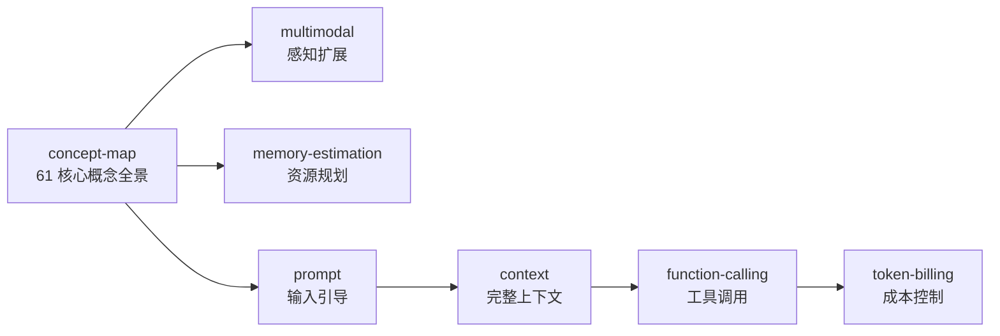

<!--
module:
  parent: ai
  slug: ai/tech-stack
  type: index
  category: 主模块子文章
  summary: LLM 技术栈全景（61 核心概念 + 多模态 + Prompt/Context/Harness/Loop 四阶段演进）
-->

# L2 技术栈

> 从模型架构到应用编排，全景理解大语言模型生态。

## 1. 目录导航

| 目录 | 核心内容 | 一句话定位 |
|------|---------|-----------|
| [concept-map](concept-map/) | **LLM 技术栈全景** — 6大层 61 个核心概念，含 Mermaid 架构图、选型指南、生产部署检查清单 | 全局认知地图 |
| [multimodal](multimodal/) | 多模态感知-认知统一架构、跨模态特征对齐、多模态交互体验优化 | 视觉/音频/视频融合 |
| [memory-estimation](memory-estimation/) | 大模型显存估算指南 — Transformer / MoE / Mamba 三大架构的训练/推理显存公式 | 资源规划必备 |
| [prompt-engineering](prompt-engineering/) | **Prompt 工程** — 8 种核心技巧（Zero-shot/Few-shot/CoT）+ 注入防御 + 调试优化 + 子目录：模板/系统提示/创意注释 | LLM 入门第一道 |
| [context-engineering](context-engineering/) | **Context Engineering** — Prompt → Context 范式转移、4 大原则、Lost in Middle、Context Window 限制 | Agent 时代主流 |
| [function-calling](function-calling/) | **Function Calling / Tool Use** — OpenAI / Claude 协议对比、多轮编排、5 大场景、5 大安全陷阱 | Agent 工具调用基础 |
| 🆕 [structured-output](structured-output/) | **结构化输出（JSON）** — 5 种稳定性策略 + response_format + Instructor/Outlines 框架对比 + 反模式 | 工程落地必备 |
| [token-billing](token-billing/) | **Token 与计费** — BPE / WordPiece / SentencePiece、上下文窗口、计费模型、Token 优化 | 成本控制核心 |
| 🆕 [llm-inference-optimization](llm-inference-optimization/) | **LLM 推理优化大专题** — 10 章：KV Cache / PagedAttention / Continuous Batching / Speculative / 量化 / MoE / 指标 / 框架 | 生产性能核心 |
| 🆕 [kv-cache](kv-cache/) | KV Cache 推理核心机制 | 自回归加速 |
| 🆕 [paged-attention](paged-attention/) | vLLM PagedAttention 解决 KV Cache 碎片 | 显存利用率 40%→96% |
| 🆕 [continuous-batching](continuous-batching/) | Continuous Batching 动态调度 | 吞吐量 23x |
| 🆕 [speculative-decoding](speculative-decoding/) | Speculative Decoding 投机解码 | 加速 2-3x |
| 🆕 [weight-quantization](weight-quantization/) | 权重量化 GPTQ/AWQ/GGUF/NF4 | 显存省 4x |
| 🆕 [moe-inference](moe-inference/) | MoE 推理优化（DeepSeek-V3 实战）| 671B 8x A100 |
| 🆕 [inference-metrics](inference-metrics/) | 推理性能指标 TTFT/TPOT/Throughput | 服务质量金三角 |
| 🆕 [inference-frameworks](inference-frameworks/) | 推理框架对比 vLLM/TGI/SGLang/TRT-LLM | 选型决策树 |

### 1.1 学习路径

建议顺序：concept-map（全局认知）→ multimodal（感知扩展）→ memory-estimation（资源规划）→ **Prompt → Context → Function Calling → Token 计费**（AI 工程 4 阶段演进）。

---

## 2. 知识脉络

---

## 3. 速查表

| 概念 | 核心要点 | 典型场景 |
|------|---------|---------|
| **Prompt Engineering** | Zero-shot / Few-shot / CoT / Role / 模板 | 单轮 LLM 调用 |
| **Context Engineering** | 系统提示 + 工具 + 历史 + RAG + 记忆 | Agent 多轮任务 |
| **Function Calling** | OpenAI / Claude 协议；JSON Schema 描述工具 | Agent 工具扩展 |
| **Token** | BPE / WordPiece / SentencePiece 分词 | 计费与上下文窗口 |
| **多模态** | VLM（视觉-语言）/ 音频 / 视频统一表征 | 跨模态任务 |
| **显存估算** | 模型参数 + 优化器 + 激活 + KV Cache | 训练/推理资源规划 |
| **MCP** | Model Context Protocol，标准化工具接入 | 跨厂商 Agent 互操作 |

---

## 4. 核心内容（按子模块展开）

- **[concept-map](concept-map/)**：6 大层 61 核心概念全景图（模型基础 / 训练优化 / 推理加速 / 检索知识 / 应用编排 / 治理运维）
- **[multimodal](multimodal/)**（+ 2 子）：
  - [cross-modal-alignment](multimodal/cross-modal-alignment/) — 跨模态特征对齐
  - [multi-modal-interaction](multimodal/multi-modal-interaction/) — 多模态交互体验
- **[memory-estimation](memory-estimation/)**：Transformer / MoE / Mamba 三大架构的训练/推理显存公式
- **[prompt-engineering](prompt-engineering/)**（+ 3 子）：
  - [code-comment-styles](prompt-engineering/code-comment-styles/) — 创意注释代码风格
  - [grok-system-prompt](prompt-engineering/grok-system-prompt/) — Grok 系统提示拆解
  - [prompt-templates](prompt-engineering/prompt-templates/) — 提示模板库
- **[context-engineering](context-engineering/)**：Lost in Middle、4 大原则、Context Window 限制
- **[function-calling](function-calling/)**：5 大场景（搜索/计算/API/数据库/文件操作）+ 5 大安全陷阱
- **[token-billing](token-billing/)**：BPE / WordPiece / SentencePiece 对比；Token 优化技巧

---

## 5. 最佳实践

| 场景 | 实践要点 |
|------|---------|
| **Prompt → Context 演进** | 单轮 Prompt 已不够；Agent 时代用 Context Engineering 提供完整上下文 |
| **Token 优化** | 系统提示精简 + Few-shot 示例压缩 + 输出长度限制 + 流式响应 |
| **Function Calling 安全** | 工具白名单 + 参数校验 + 输出过滤 + 速率限制 + 审计日志 |
| **多模态选型** | 文本任务用纯 LLM；图文任务用 VLM（GPT-4o / Qwen-VL）；视频任务用专用视频模型 |
| **显存估算** | 训练显存 = 模型 + 优化器(2-8x) + 激活 + Batch；推理显存 = 模型 + KV Cache |

---

## 6. 常见面试题

| 题目 | 核心考点 |
|------|---------|
| BPE / WordPiece / SentencePiece 区别？ | 字节级 vs 词级 vs 字符级分词 |
| Context Engineering 4 大原则？ | 选信息 / 排结构 / 防过载 / 持续更新 |
| Function Calling 协议对比？ | OpenAI tools vs Claude tool_use |
| Token 优化技巧？ | 系统提示精简 + Few-shot 压缩 + 输出限长 |
| 显存估算公式？ | 模型参数 × 精度字节数 + 优化器状态 + 激活 + KV Cache |
| Lost in Middle 问题？ | 长上下文中部信息被忽略，结构化排版可缓解 |
| MCP 协议价值？ | 跨厂商 Agent 工具互操作标准 |

---

## 7. 相关章节

- 上游：[L1 基础概念](../01-fundamentals/) → **L2 技术栈** → [L3 工程实践](../03-engineering/)
- 关联：[04.system-design](../../04.system-design/) — 系统设计（AI 系统也遵循通用设计原则）
- 面试：[13.split-hairs AI 新概念](../../13.split-hairs/11.ai/README.md) — AI 面试深挖（精炼版）

---

## 8. 开源参考

| 类别 | 项目 |
|------|------|
| 概念全景 | [LLM 技术栈全景图 (61 核心概念)](concept-map/) |
| 多模态 | GPT-4o · Gemini 2.0 · Qwen2.5-VL · Whisper |
| Prompt 框架 | LangChain PromptTemplate · Guidance · Outlines |
| Context 框架 | LlamaIndex · LangChain Memory · Mem0 |
| Function Calling | OpenAI Function Calling · Claude Tool Use · MCP |
| Token 工具 | tiktoken (OpenAI) · sentencepiece (Google) · tokenizers (Hugging Face) |

---

## 📊 本节统计

| 维度 | 数字 |
|------|------|
| 一级 leaf README 数 | 7（concept-map / multimodal / memory-estimation / prompt-engineering / context-engineering / function-calling / token-billing） |
| 二级 leaf README 数 | 5（multimodal:2 + prompt-engineering:3） |
| 总 leaf README 数 | 12 |
| 速查表条目数 | 7 |
| 最佳实践条数 | 5 |
| 常见面试题数 | 7 |
| 开源参考项目数 | 6 类共 15+ 条 |
| frontmatter 覆盖 | 12 / 12 = 100% |
| 文末回链覆盖 | 12 / 12 = 100% |

---

← [返回 AI 知识体系](../README.md)