# LLM 技术栈全景 (61 核心概念)

## 引言：反直觉代码

LLM 技术栈全景 (61 核心概念) 的关键不是语法——是**看起来对**的代码背后那些'踩坑点'。

本篇用 3 个反直觉片段切入，把面试/生产中常被问起、但一深入就漏馅的点摆出来。

---

← 返回 [技术栈](../README.md)

随着人工智能技术的飞速发展，大语言模型（LLM）已从单纯的研究课题演变为驱动各行各业创新的核心引擎。构建一个成熟、可靠且高效的 LLM 应用，不仅仅依赖于模型本身，更需要一个庞大且复杂的技术生态栈支持。本文旨在梳理大模型及其应用生态中的关键技术栈，明确其概念定义，划分技术领域，并解析各技术栈之间的依赖与协作关系。

> **最后更新：2026 年 5 月** — 涵盖 6 大技术层、61 个核心概念。新增 SSM/Mamba 架构、SFT、Constitutional AI、语义缓存、推理负载均衡、提示注入攻击等概念，以及生产部署检查清单。

## 目录

- [1. 核心概念名称和定义](#1-核心概念名称和定义)
  - [1.1 模型与架构](#11-模型与架构) · [1.2 训练与优化](#12-训练与优化) · [1.3 推理与加速](#13-推理与加速) · [1.4 检索与知识](#14-检索与知识) · [1.5 应用与编排](#15-应用与编排) · [1.6 治理与运维](#16-治理与运维)
- [2. 技术领域划分与栈详解](#2-技术领域划分与栈详解)
  - [2.1 模型基础层](#21-模型基础层-model-foundation-layer) · [2.2 训练与优化层](#22-训练与优化层-training--optimization-layer) · [2.3 推理优化层](#23-推理优化层-inference-optimization-layer) · [2.4 知识与数据层](#24-知识与数据层-knowledge--data-layer) · [2.5 应用编排层](#25-应用编排层-application-orchestration-layer) · [2.6 治理与运维层](#26-治理与运维层-governance--llmops-layer)
- [3. 关键技术栈全景图](#3-关键技术栈全景图)
- [4. 技术栈之间的关键依赖关系](#4-技术栈之间的关键依赖关系)
- [5. 技术选型决策指引](#5-技术选型决策指引)
  - [5.1 按项目阶段](#51-按项目阶段选择) · [5.2 按团队规模](#52-按团队规模选择) · [5.3 按应用场景](#53-按应用场景选择)
- [6. 生产部署检查清单](#6-生产部署检查清单)
  - [6.1 性能与成本](#61-性能与成本) · [6.2 可靠性与可观测性](#62-可靠性与可观测性) · [6.3 安全与合规](#63-安全与合规) · [6.4 质量保障](#64-质量保障)
- [结语](#结语) · [参考来源](#参考来源)

## 1. 核心概念名称和定义

在深入技术栈之前，我们需要明确生态中基础术语的定义。以下基于行业标准及上下文整理出的核心概念：

> **成熟度说明**：🟢 成熟生产级 · 🟡 快速增长期 · 🔵 前沿探索期

### 1.1 模型与架构

| 概念名称 | 定义简述 | 成熟度 |
| :--- | :--- | :--- |
| **大模型 (LLM)** | 基于海量数据训练的深度学习模型，具备理解和生成人类语言的能力。 | 🟢 |
| **稠密模型 (Dense Model)** | 所有参数参与每次计算的神经网络架构。 | 🟢 |
| **混合专家模型 (MoE)** | 稀疏架构，对每个输入仅激活部分专家子网络，平衡规模与效率（如 Mixtral、Llama 4 Maverick）。 | 🟡 |
| **多模态 (Multimodal)** | 处理和融合文本、图像、音频、视频等多种数据模态的能力（如 GPT-4o、Gemini 2.5）。 | 🟡 |
| **推理模型 (Reasoning Model)** | 通过内部思维链进行深度推理的模型范式，在推理阶段投入更多计算以提升复杂任务表现（如 OpenAI o 系列、DeepSeek-R1）。 | 🟡 |
| **小语言模型 (SLM)** | 参数量较小但经过高度优化的模型，适合端侧和低成本部署（如 Phi、Gemma、Qwen 系列）。 | 🟡 |
| **状态空间模型 (SSM/Mamba)** | 基于状态空间方程的序列建模架构，以线性复杂度替代 Transformer 的二次方注意力，适合超长序列处理（如 Mamba、Mamba-2、Jamba）。 | 🔵 |

> → 相关：模型架构的选择直接影响 [1.2 训练策略](#12-训练与优化) 和 [1.3 推理加速](#13-推理与加速) 的技术路线。

### 1.2 训练与优化

| 概念名称 | 定义简述 | 成熟度 |
| :--- | :--- | :--- |
| **监督微调 (SFT)** | 使用标注好的"指令-回答"数据对模型进行有监督训练，是 RLHF/DPO 等对齐方法之前的必要步骤，教会模型遵循指令的基本格式和能力。 | 🟢 |
| **微调 (Fine-tuning)** | 使用特定数据在预训练模型基础上进一步训练，以适应新任务。 | 🟢 |
| **参数高效微调 (PEFT)** | 仅更新少量参数（如 LoRA、QLoRA）即可适配新任务，大幅降低微调成本。 | 🟢 |
| **RLHF** | 利用人类反馈作为奖励信号，优化模型行为符合人类价值观。 | 🟢 |
| **DPO (直接偏好优化)** | 无需训练奖励模型，直接从人类偏好数据优化模型策略，比 RLHF 更简洁稳定，已成为主流对齐方法之一。 | 🟢 |
| **RLVR (可验证奖励强化学习)** | 使用可自动验证的奖励信号（如代码测试用例、数学答案）替代人类偏好进行强化学习，是 2025-2026 年的重要范式转变。 | 🔵 |
| **模型蒸馏 (Knowledge Distillation)** | 将大模型知识迁移至小模型，压缩规模并保持性能。 | 🟢 |
| **模型压缩 (Model Compression)** | 通过剪枝、量化等技术减小模型规模，提升效率。 | 🟢 |
| **对齐 (Alignment)** | 调整模型行为，使其与人类意图和社会规范保持一致。 | 🟢 |
| **安全对齐 (Safety Alignment)** | 针对有害内容的对齐机制，确保输出安全、无害。 | 🟡 |
| **Constitutional AI (CAI)** | 通过预定义原则（"宪法"）让模型自我修正输出，减少对人类反馈标注的依赖，由 Anthropic 提出。 | 🟡 |
| **持续学习 (Continual Learning)** | 模型在序列任务中持续学习新知识，避免灾难性遗忘 (Catastrophic Forgetting)。 | 🔵 |
| **领域适应 (Domain Adaptation)** | 调整模型以适应新领域数据分布的技术。 | 🟢 |
| **合成数据 (Synthetic Data)** | 利用模型生成高质量训练数据，缓解真实数据稀缺问题，已成为 2025-2026 年训练数据的核心来源之一。 | 🟡 |
| **分布式训练 (Distributed Training)** | 将训练任务分布到多 GPU/多节点上执行，包括数据并行、模型并行、流水线并行和张量并行等策略。 | 🟢 |

> → 相关：训练产出的模型权重进入 [1.3 推理与加速](#13-推理与加速)；SFT 和 RLHF/DPO 的数据质量依赖 [1.4 检索与知识](#14-检索与知识) 中的数据管道。

### 1.3 推理与加速

| 概念名称 | 定义简述 | 成熟度 |
| :--- | :--- | :--- |
| **推理优化 (Inference Optimization)** | 提升模型推理速度和吞吐量的技术集合，包括 KV Cache 管理、推测解码、批处理策略等。 | 🟢 |
| **推测解码 (Speculative Decoding)** | 使用小模型快速生成候选 token，由大模型并行验证，实现 2-3x 推理加速。 | 🟡 |
| **测试时计算 (Test-time Compute)** | 在推理阶段投入更多计算资源（如多次采样、思维链搜索）来提升输出质量，而非仅依赖训练阶段。 | 🔵 |
| **量化推理 (Quantized Inference)** | 将模型权重从高精度（FP16/BF16）压缩为低精度（INT4/INT8/FP8），降低显存占用和计算成本。 | 🟢 |
| **语义缓存 (Semantic Cache)** | 对语义相似的查询命中缓存结果而非重新推理，大幅降低重复查询的成本和延迟（如 GPTCache）。 | 🟡 |
| **推理负载均衡 (Inference Load Balancing)** | 在多 GPU/多节点间动态分配推理请求，优化资源利用率和响应延迟，是大规模部署的必备基础设施。 | 🟢 |

> → 相关：推理服务为 [1.5 应用与编排](#15-应用与编排) 提供底层算力；推理质量和安全由 [1.6 治理与运维](#16-治理与运维) 保障。

### 1.4 检索与知识

| 概念名称 | 定义简述 | 成熟度 |
| :--- | :--- | :--- |
| **RAG** | 检索增强生成，结合外部知识库检索与文本生成，提升准确性。 | 🟢 |
| **RAG 数据管道 (RAG Data Pipeline)** | RAG 系统的数据处理流程，包括文档解析（PDF/HTML/代码等）、分块策略（Chunking）、元数据提取和索引构建，直接决定检索质量。 | 🟢 |
| **嵌入 (Embedding)** | 将离散数据映射为低维连续向量，捕获语义相似性。 | 🟢 |
| **向量数据库 (Vector Database)** | 专为高效存储和检索高维向量（嵌入）设计的数据库（如 Milvus、Pinecone、Weaviate）。 | 🟢 |
| **混合检索 (Hybrid Search)** | 结合稠密向量检索（语义匹配）与稀疏检索（如 BM25 关键词匹配），提升召回率与准确率。 | 🟢 |
| **GraphRAG** | 将知识图谱的结构化关系与 RAG 检索结合，利用图结构增强检索的关联推理能力。 | 🔵 |
| **知识图谱 (Knowledge Graph)** | 以实体 - 关系三元组表示信息的结构化知识库。 | 🟢 |

> → 相关：检索结果为 [1.5 应用与编排](#15-应用与编排) 中的 RAG 和 Agent 提供上下文；分块和索引质量直接影响检索效果。

### 1.5 应用与编排

| 概念名称 | 定义简述 | 成熟度 |
| :--- | :--- | :--- |
| **AI Agent** | 能感知环境、规划行动并调用工具以完成复杂目标的自主实体。 | 🟡 |
| **多智能体系统 (Multi-Agent)** | 多个 Agent 分工协作（如理解、检索、编码、审核），由调度器协调完成复杂任务的系统架构。 | 🔵 |
| **Agent 工作流 (Agent Workflow)** | 协调多个 Agent 或步骤以实现端到端应用的预定义任务序列。 | 🟡 |
| **Agent 记忆 (Memory)** | Agent 维持上下文连续性的机制，包括短期记忆（对话历史）、长期记忆（持久化知识）和情景记忆（过往交互经验）。 | 🟡 |
| **函数调用 (Function Calling / Tool Use)** | 模型以结构化方式调用外部函数或 API 的能力，是 Agent 与外部世界交互的核心机制。 | 🟢 |
| **结构化输出 (Structured Output)** | 约束模型输出为 JSON Schema 等预定义格式，确保下游系统可靠解析，是生产环境的刚需。 | 🟢 |
| **MCP (模型上下文协议)** | 由 Anthropic 提出的开放标准，规范 Agent 与外部工具/数据源的连接方式（Agent-to-Tool）。 | 🟢 |
| **A2A (Agent-to-Agent 协议)** | 由 Google 提出的开放协议，规范不同 Agent 之间的任务委派与协调（Agent-to-Agent）。 | 🔵 |
| **ACP (Agent 通信协议)** | 面向通用 Agent 间通信的协议，支持跨框架、跨平台的 Agent 互操作。 | 🔵 |
| **ANP (Agent 网络协议)** | 面向去中心化、互联网级别的 Agent 网络通信协议，构建"Agent 互联网"。 | 🔵 |
| **提示工程 (Prompt Engineering)** | 设计输入提示以引导模型生成更精确、可控输出的技术。 | 🟢 |
| **上下文工程 (Context Engineering)** | 系统性地设计、管理和优化送入模型的全部上下文信息（包括提示、检索结果、工具描述、记忆、对话历史），是 Agent 时代 Prompt Engineering 的进化形态。 | 🟡 |
| **上下文学习 (In-Context Learning)** | 模型通过输入中的示例（few-shot）即时学习任务和模式，无需更新参数。 | 🟢 |
| **零/少样本学习 (Zero/Few-shot Learning)** | 无示例（零样本）或极少示例（少样本）下模型泛化适应新任务。 | 🟢 |
| **自动提示优化 (Automatic Prompt Optimization)** | 利用算法自动生成和优化提示，最大化模型性能。 | 🟡 |
| **应用开发框架 (LLM Framework)** | 封装 LLM 调用链、工具集成和 Agent 编排的开源框架（如 LangChain、LlamaIndex、CrewAI、AutoGen）。 | 🟢 |
| **Agentic Coding (智能体编程)** | 由 AI Agent 驱动的软件开发范式，Agent 自主完成代码生成、调试、测试等开发任务（如 Cursor、Claude Code、GitHub Copilot Agent）。 | 🟢 |
| **模型路由 (Model Routing)** | 根据查询复杂度、任务类型自动将请求分发到最合适的模型（如简单问题→小模型，复杂推理→大模型），平衡成本与质量。 | 🟢 |

> → 相关：应用层的稳定性和安全性由 [1.6 治理与运维](#16-治理与运维) 保障；Agent 工具调用依赖 [1.3 推理与加速](#13-推理与加速) 的高性能推理引擎。

### 1.6 治理与运维

| 概念名称 | 定义简述 | 成熟度 |
| :--- | :--- | :--- |
| **LLMOps** | 面向 LLM 应用的运维体系，涵盖模型监控、追踪、评估、版本管理和持续迭代。 | 🟡 |
| **安全护栏 (Guardrails)** | 在模型输入/输出端设置的实时过滤机制，防止 PII 泄漏、有害内容、提示注入等安全风险。 | 🟡 |
| **模型评估 (Model Evaluation)** | 使用指标和分析系统测量模型性能、鲁棒性和公平性，包括 LLM-as-Judge 等新型评估范式。 | 🟢 |
| **可解释性 (Explainability / XAI)** | 使模型决策过程透明化，便于人类理解与信任。 | 🟡 |
| **幻觉 (Hallucination)** | 模型生成看似合理但事实错误或虚构内容的现象。 | 🟢 |
| **提示注入攻击 (Prompt Injection)** | 通过在输入中嵌入恶意指令劫持模型行为的攻击方式，分为直接注入（用户输入）和间接注入（通过检索内容），是 LLM 应用的头号安全威胁。 | 🟡 |
| **红队测试 (Red Teaming)** | 通过对抗性攻击系统性测试模型安全边界和脆弱性的实践。 | 🟡 |
| **模型部署 (Model Deployment)** | 将模型集成到生产环境，提供实时推理能力。 | 🟢 |

## 2. 技术领域划分与栈详解

为了更清晰地理解这些技术如何协作，我们将上述技术栈划分为六个核心领域：**模型基础层**、**训练与优化层**、**推理优化层**、**知识与数据层**、**应用编排层**、**治理与运维层**。

### 2.1 模型基础层 (Model Foundation Layer)
这是整个生态的基石，决定了智能的上限。
*   **包含技术栈**：大模型 (LLM)、稠密模型、混合专家模型 (MoE)、多模态、推理模型、小语言模型 (SLM)、状态空间模型 (SSM/Mamba)。
*   **解决什么问题**：提供通用的语言理解、逻辑推理及跨模态感知能力。MoE 架构解决了参数规模膨胀带来的计算成本问题，多模态打破了单一文本的限制，推理模型通过思维链搜索实现复杂问题的高质量求解，SLM 使得端侧和低成本部署成为可能，SSM/Mamba 以线性复杂度为超长序列场景提供 Transformer 之外的替代方案。
*   **依赖与关联**：
    *   依赖海量预训练数据、合成数据和算力基础设施。
    *   是**训练与优化层**和**推理优化层**的操作对象。
    *   为**应用编排层**提供推理引擎。
*   **2025-2026 趋势**：
    *   MoE 架构成为主流（Llama 4、Mixtral、DeepSeek-V3），稀疏激活显著降低推理成本。
    *   推理模型范式爆发（OpenAI o 系列、DeepSeek-R1、Claude 思考模式），"思考时间换答案质量"成为新范式。
    *   上下文窗口从 128K 扩展至百万级 token（Gemini 2.5 Pro 支持 1M tokens）。
    *   SSM/Mamba 架构持续演进（Jamba 等混合架构），在超长序列和端侧推理场景展现优势，形成"Transformer + SSM"混合架构趋势。

### 2.2 训练与优化层 (Training & Optimization Layer)
该领域关注如何让通用模型变得更专业、更安全、更高效。
*   **包含技术栈**：SFT（监督微调）、微调、PEFT (LoRA/QLoRA)、RLHF、DPO、RLVR、Constitutional AI (CAI)、模型蒸馏、模型压缩、持续学习、领域适应、对齐、安全对齐、合成数据、分布式训练。
*   **解决什么问题**：
    *   **指令跟随**：SFT 使用标注好的"指令-回答"数据教会模型遵循指令的基本格式和能力，是后续对齐步骤的基础。
    *   **专业化**：通过微调、PEFT 和领域适应，使模型懂行业术语（如医疗、法律）。PEFT 技术（LoRA/QLoRA）使得单卡即可微调大模型。
    *   **价值观**：通过 RLHF、DPO、RLVR、Constitutional AI、对齐和安全对齐，减少偏见和有害输出。DPO 无需奖励模型即可从偏好数据学习，比 RLHF 更简洁；RLVR 利用可验证奖励信号（代码测试、数学证明）进一步降低对人工标注的依赖；Constitutional AI 通过预定义原则让模型自我修正，减少对人工反馈的依赖。
    *   **效率**：通过蒸馏和压缩，使模型能在边缘设备或低成本服务器上运行。
    *   **数据**：合成数据技术缓解高质量真实数据枯竭问题，分布式训练使超大规模模型训练成为可能。
    *   **进化**：通过持续学习，让模型随时间推移掌握新知识。
*   **依赖与关联**：
    *   依赖**模型基础层**的预训练权重。
    *   依赖人类反馈数据（用于 RLHF/DPO）和可验证奖励环境（用于 RLVR）。
    *   输出优化后的模型权重，供**推理优化层**和**模型部署**使用。
*   **2025-2026 趋势**：
    *   DPO 因其简洁性已大幅替代传统 RLHF 流程，成为对齐首选方法。
    *   RLVR 在代码和数学领域取得突破性进展（DeepSeek-R1 的核心训练方法），减少对昂贵人工标注的依赖。
    *   合成数据成为主流训练数据来源，各厂商竞相构建高质量合成数据管线。
    *   PEFT (QLoRA) 使得在消费级 GPU 上微调 70B+ 参数模型成为现实。

### 2.3 推理优化层 (Inference Optimization Layer)
> **2025-2026 新增层** — 随着 LLM 大规模部署，推理成本和延迟成为核心瓶颈，推理优化已从"锦上添花"升级为"刚需"。

该领域关注如何在生产环境中高效、低成本地运行模型推理。
*   **包含技术栈**：推理引擎（vLLM、TensorRT-LLM、SGLang）、推测解码、KV Cache 管理（PagedAttention）、批处理策略（Continuous Batching）、量化推理（INT4/INT8/FP8）、模型并行推理、语义缓存 (Semantic Cache)、推理负载均衡 (Load Balancing)。
*   **解决什么问题**：
    *   **延迟**：推测解码使用小模型"打草稿"、大模型验证，实现 2-3 倍加速；KV Cache 优化（如 PagedAttention）解决显存碎片化问题；语义缓存对语义相似的查询直接命中缓存，避免重复推理。
    *   **吞吐**：Continuous Batching 动态合并请求，大幅提升并发处理能力；负载均衡在多 GPU/多节点间智能分发请求。
    *   **成本**：量化推理（INT4/FP8）在几乎不损失精度的情况下降低显存需求和计算成本。
    *   **测试时计算**：推理模型在推理阶段通过多次采样、搜索等策略投入更多计算以提升质量。
*   **依赖与关联**：
    *   依赖**训练与优化层**输出的模型权重。
    *   为**应用编排层**和**模型部署**提供高性能推理服务。
    *   与**治理与运维层**的监控指标对接（延迟、吞吐量、GPU 利用率）。
*   **代表性引擎对比**：

    | 推理引擎 | 核心优势 | 适用场景 |
    | :--- | :--- | :--- |
    | **vLLM** | PagedAttention、开源生态丰富、支持多种推测解码 | 通用生产部署，社区首选 |
    | **TensorRT-LLM** | NVIDIA 深度优化、自定义 CUDA 内核 | NVIDIA GPU 极致性能优化 |
    | **SGLang** | RadixAttention、结构化生成优化 | 复杂提示模板、结构化输出 |

*   **2025-2026 趋势**：
    *   vLLM 凭借活跃的开源社区和丰富的推测解码支持（EAGLE/P-EAGLE），成为生产部署首选。
    *   SGLang 凭借 RadixAttention 在结构化生成和复杂提示模板场景快速崛起，形成三足鼎立格局。
    *   FP8 量化推理在 H100/B200 等新硬件上原生支持，几乎无精度损失且显著降低成本。
    *   推测解码从实验技术升级为生产标配，EAGLE 系列实现 2-3x 加速。
    *   推理时计算（Test-time Compute）成为新的性能提升维度，与推理引擎深度集成。
    *   语义缓存（如 GPTCache）在生产环境中广泛部署，对高频重复查询可降低 50-80% 的推理成本。

### 2.4 知识与数据层 (Knowledge & Data Layer)
大模型存在知识截止和幻觉问题，该层为模型提供"外挂大脑"和长期记忆。
*   **包含技术栈**：嵌入 (Embedding)、向量数据库、RAG 数据管道、混合检索 (Hybrid Search)、GraphRAG、知识图谱。
*   **解决什么问题**：
    *   **数据管道**：RAG 数据管道负责文档解析（PDF/HTML/代码等格式转换）、智能分块（按语义、段落或固定长度切分）、元数据提取和索引构建。分块策略直接决定检索粒度与召回质量，是 RAG 落地中最容易被忽视却影响最大的环节。
    *   **语义检索**：Embedding 将非结构化数据转化为向量，向量数据库实现高效相似性搜索。
    *   **混合检索**：结合稠密向量检索（语义匹配）与稀疏检索（BM25 关键词匹配），兼顾语义理解和精确匹配，显著提升召回质量。
    *   **图增强检索**：GraphRAG 利用知识图谱的实体关系结构，在检索时保留文档间的关联信息，特别适合需要跨文档推理的复杂查询（如微软 GraphRAG）。
    *   **事实准确性**：知识图谱提供结构化事实，辅助模型推理，减少幻觉。
    *   **私有数据接入**：允许企业在不重新训练模型的情况下使用内部数据。
*   **依赖与关联**：
    *   依赖原始业务数据。
    *   是**RAG**技术的核心组件。
    *   为**应用编排层**提供实时上下文信息。
*   **2025-2026 趋势**：
    *   混合检索（稠密+稀疏）成为 RAG 生产系统的标配，单一向量检索已无法满足企业级需求。
    *   GraphRAG 从学术走向工程落地，微软开源实现推动行业采纳。
    *   分块策略从固定长度向语义感知分块演进，Late Chunking 等技术结合 Embedding 模型实现更优切分。
    *   Agentic RAG 兴起 — Agent 自主决定何时检索、检索什么、如何迭代细化检索结果。

### 2.5 应用编排层 (Application Orchestration Layer)
这是用户直接交互的层面，负责将模型能力转化为实际业务价值。
*   **包含技术栈**：RAG、AI Agent、多智能体系统、Agent 工作流、Agent 记忆、Agentic Coding、函数调用 (Function Calling)、结构化输出 (Structured Output)、上下文工程 (Context Engineering)、提示工程、上下文学习、零/少样本学习、自动提示优化、应用开发框架（LangChain/LlamaIndex/CrewAI/AutoGen）、模型路由 (Model Routing)、MCP、A2A、ACP、ANP。
*   **解决什么问题**：
    *   **任务自动化**：Agent 和工作流能自主规划并调用工具（如搜索、API）完成复杂任务。函数调用是 Agent 与外部工具交互的核心机制，结构化输出确保下游系统可靠解析模型结果。
    *   **多 Agent 协作**：多智能体系统让多个专业化 Agent 分工协作（如规划 Agent、编码 Agent、审核 Agent），通过 A2A/ACP 协议进行通信和任务委派。
    *   **效果增强**：RAG 结合检索与生成；提示工程和自动优化确保模型输出质量。
    *   **工具连接**：MCP 标准化 Agent 与工具的连接方式，解决"M×N 集成问题"。
    *   **Agent 互联**：A2A 协议实现跨组织的 Agent 任务委派；ANP 构建去中心化的 Agent 网络。
    *   **上下文与记忆**：Agent 记忆系统提供短期（对话历史）、长期（持久化知识）和情景记忆（过往经验），使 Agent 在多轮交互中保持连贯性和个性化。
    *   **开发效率**：应用开发框架（LangChain、LlamaIndex、CrewAI 等）封装了 LLM 调用链、工具集成和 Agent 编排的通用模式，大幅降低开发门槛。
    *   **上下文工程**：在 Agent 时代，Prompt Engineering 进化为 Context Engineering — 不再只是写一条提示，而是系统性地设计送入模型的全部信息（检索结果、工具描述、记忆、对话历史、系统指令的组装策略）。
    *   **智能体编程**：Agentic Coding 是 2025-2026 最热门的 LLM 应用方向，AI Agent 自主完成代码编写、调试、测试、重构等开发任务，显著改变软件开发工作流。
    *   **智能路由**：模型路由根据查询复杂度和任务类型，自动将请求分发到最合适的模型（简单问题→小模型/低成本，复杂推理→大模型/高质量），在成本和质量之间取得最优平衡。
*   **依赖与关联**：
    *   依赖**模型基础层**和**推理优化层**提供推理能力。
    *   依赖**知识与数据层**提供检索内容。
    *   直接面向最终用户或业务系统。
*   **2025-2026 趋势**：
    *   Agentic Coding 爆发式增长（Cursor、Claude Code、Windsurf、GitHub Copilot Agent），AI 辅助编程从"代码补全"进化到"自主完成开发任务"。
    *   上下文工程 (Context Engineering) 成为构建高质量 Agent 应用的核心技能，取代传统 Prompt Engineering 的单一视角。
    *   模型路由在生产系统中广泛部署，通过智能分发降低 30-60% 的推理成本。
    *   Agent 记忆从简单的对话缓存进化为结构化长期记忆，支持个性化和持续学习。

#### Agent 协议族关系

| 协议 | 通信方向 | 核心定位 | 发起方 |
| :--- | :--- | :--- | :--- |
| **MCP** | Agent ↔ Tool | 工具连接标准（"AI 的 USB-C"） | Anthropic |
| **A2A** | Agent ↔ Agent | 企业级多 Agent 任务委派 | Google |
| **ACP** | Agent ↔ Agent | 通用跨框架 Agent 通信 | IBM/社区 |
| **ANP** | Agent ↔ Agent (互联网) | 去中心化 Agent 网络 | 开源社区 |

> 这四个协议是**互补关系**而非竞争关系：MCP 解决 Agent 与工具的连接，A2A/ACP 解决 Agent 间协作，ANP 解决互联网级 Agent 发现与通信。

### 2.6 治理与运维层 (Governance & LLMOps Layer)
确保模型在生产环境中稳定、可信、可控地运行。
*   **包含技术栈**：LLMOps、安全护栏 (Guardrails)、提示注入防御 (Prompt Injection Defense)、模型评估、幻觉检测、红队测试、可解释性、模型部署。
*   **解决什么问题**：
    *   **运维可观测性**：LLMOps 提供全链路追踪（trace）、日志、指标监控，帮助定位 Agent 执行瓶颈和异常（代表工具：LangWatch、Arize AI、Braintrust、LangSmith）。
    *   **安全防线**：安全护栏在输入/输出端实时过滤，防止 PII 泄漏、有害内容输出（代表框架：NeMo Guardrails、Guardrails AI）；提示注入防御专门针对直接注入（用户输入恶意指令）和间接注入（通过 RAG 检索内容注入）两类攻击进行检测和拦截。
    *   **质量评估**：模型评估量化性能，LLM-as-Judge 利用强模型评估弱模型输出，红队测试主动发现安全漏洞。
    *   **信任建立**：可解释性让黑盒决策透明化。
    *   **服务化**：模型部署将算法转化为 API 服务。
*   **依赖与关联**：
    *   贯穿整个生命周期，对**优化层**的效果进行验证。
    *   保障**应用编排层**的稳定性。
    *   反馈数据可用于后续的**持续学习**或**RLHF/RLVR**。
*   **2025-2026 趋势**：
    *   LLMOps 从可选组件升级为生产标配，LangSmith、Arize AI、LangWatch 等工具被广泛采用。
    *   安全护栏成为企业级 LLM 部署的合规要求（尤其金融、医疗、法律领域），NeMo Guardrails 和 Guardrails AI 成为主流框架。
    *   LLM-as-Judge 评估范式兴起，用强模型自动评估弱模型输出，大幅降低人工评估成本。
    *   红队测试从一次性活动变为持续性流程，自动化红队工具（如 Garak、PyRIT）成为安全基线。
    *   提示注入防御成为 Agent 应用的安全刚需，随着 Agent 自主调用工具和 RAG 检索，间接注入攻击面显著扩大。

## 3. 关键技术栈全景图

下图展示了六个领域之间的逻辑关系与数据流向。从底层的模型架构，到训练优化与推理加速，再到知识增强与应用编排，最后由治理层进行全链路监控。

```mermaid
graph TD
    %% 定义样式
    classDef foundation fill:#e1f5fe,stroke:#01579b,stroke-width:2px;
    classDef training fill:#fff3e0,stroke:#e65100,stroke-width:2px;
    classDef inference fill:#fff9c4,stroke:#f57f17,stroke-width:2px;
    classDef knowledge fill:#e8f5e9,stroke:#1b5e20,stroke-width:2px;
    classDef app fill:#f3e5f5,stroke:#4a148c,stroke-width:2px;
    classDef governance fill:#ffebee,stroke:#b71c1c,stroke-width:2px;

    subgraph Governance [治理与运维层]
        G1[LLMOps 可观测性]
        G2[安全护栏 Guardrails]
        G3[模型评估 & LLM-as-Judge]
        G4[幻觉检测 & 红队测试]
        G5[可解释性]
        G6[模型部署]
        G7[提示注入防御]
    end

    subgraph Application [应用编排层]
        A1[RAG 检索增强]
        A2[AI Agent & 多智能体系统]
        A3[提示工程 & 自动优化]
        A4[Agent 协议族: MCP / A2A / ACP / ANP]
        A5[函数调用 & 结构化输出]
        A6[Agent 记忆 & 应用框架]
        A7[上下文工程 & 模型路由]
    end

    subgraph Knowledge [知识与数据层]
        K1[嵌入 Embedding]
        K2[向量数据库]
        K3[知识图谱 & GraphRAG]
        K4[混合检索 Hybrid Search]
        K5[RAG 数据管道]
    end

    subgraph Inference [推理优化层]
        I1[推理引擎: vLLM / TensorRT-LLM / SGLang]
        I2[推测解码 & KV Cache 优化]
        I3[量化推理 INT4/FP8]
        I4[测试时计算 Test-time Compute]
        I5[语义缓存 & 负载均衡]
    end

    subgraph Training [训练与优化层]
        O1[SFT & 微调 & PEFT LoRA/QLoRA]
        O2[RLHF & DPO & RLVR & CAI]
        O3[蒸馏 & 压缩]
        O4[持续学习 & 领域适应]
        O5[合成数据 & 分布式训练]
    end

    subgraph Foundation [模型基础层]
        F1[大模型 LLM]
        F2[稠密 / MoE 架构]
        F3[多模态能力]
        F4[推理模型 Reasoning Model]
        F5[小语言模型 SLM]
        F6[SSM/Mamba 状态空间模型]
    end

    %% 关系连接
    F1 --> O1
    F1 --> O2
    F1 --> O3
    F1 --> I1
    F4 --> I4
    F6 --> I1
    F5 --> I1
    
    O1 --> I1
    O3 --> I1
    O5 --> F1
    O2 --> G6
    
    I1 --> G6
    I2 --> I1
    I3 --> I1
    I5 --> I1
    
    K1 --> K2
    K1 --> K4
    K2 --> K4
    K5 --> K1
    K5 --> K2
    K3 --> A1
    K2 --> A1
    K4 --> A1
    
    A1 --> A2
    A3 --> A2
    A4 --> A2
    A5 --> A2
    A6 --> A2
    A7 --> A2
    A7 --> A5
    
    F5 --> A7
    
    G6 --> A2
    G6 --> I1
    
    G1 -.-> A2
    G1 -.-> I1
    G3 -.-> O1
    G3 -.-> F1
    G4 -.-> A1
    G2 -.-> A2
    G2 -.-> G6
    G5 -.-> G3
    G5 -.-> A2
    G7 -.-> A2
    G7 -.-> G2

    %% 应用样式
    class F1,F2,F3,F4,F5,F6 foundation;
    class O1,O2,O3,O4,O5 training;
    class I1,I2,I3,I4,I5 inference;
    class K1,K2,K3,K4,K5 knowledge;
    class A1,A2,A3,A4,A5,A6,A7 app;
    class G1,G2,G3,G4,G5,G6,G7 governance;
```

### 全景图解读
1.  **纵向支撑**：**模型基础层**位于底部（含 Transformer 和 SSM/Mamba 两大架构路线），支撑上层的训练、推理与应用；**治理与运维层**贯穿右侧，确保从模型训练到应用服务的全流程可控可观测。
2.  **推理加速**：**推理优化层**是 2025-2026 年的核心增长点，它接收优化后的模型权重，通过推理引擎、语义缓存和加速技术为上层提供高性能服务，直接决定了生产成本和用户体验。
3.  **横向增强**：**知识与数据层**位于左侧，从 RAG 数据管道到向量检索、GraphRAG、混合检索，为应用层提供实时、准确的外部信息，弥补模型内部知识的不足。
4.  **核心闭环**：**训练与优化层**接收来自治理层的评估反馈（如 RLHF 中的人类偏好、RLVR 中的可验证奖励、DPO 中的偏好数据），不断迭代模型权重，形成"训练 - 评估 - 优化"的闭环。
5.  **协议互联**：**应用编排层**中 Agent 协议族（MCP/A2A/ACP/ANP）的标准化，使得 Agent 能够跨工具、跨组织、甚至跨互联网进行协作，是 2025-2026 年"Agentic AI"浪潮的基础设施。
6.  **交互核心**：**应用编排层**是用户感知的核心，它通过函数调用连接工具、通过 Agent 记忆维持上下文、通过上下文工程组装最优输入、通过模型路由平衡成本与质量、通过结构化输出保证可靠性，将技术能力转化为业务结果。

> 📖 **不同团队如何选型？** 请参阅 [第 5 节：技术选型决策指引](#5-技术选型决策指引)，按项目阶段、团队规模和应用场景给出具体建议。

## 4. 技术栈之间的关键依赖关系

| 上层技术 | 依赖的下层技术 | 依赖说明 |
| :--- | :--- | :--- |
| RAG | 嵌入 + 向量数据库 + LLM + 混合检索 | 检索依赖向量索引和 BM25，生成依赖语言模型 |
| GraphRAG | 知识图谱 + 向量数据库 + LLM | 图结构增强检索，需要知识图谱的实体关系和向量索引 |
| AI Agent | LLM + Function Calling + MCP + 推理引擎 | 推理依赖模型，工具调用依赖函数调用和 MCP 协议，性能依赖推理引擎 |
| Agent 记忆 | 向量数据库 + LLM + 持久化存储 | 长期记忆依赖向量检索，情景记忆依赖结构化存储 |
| 多智能体系统 | Agent + A2A/ACP + Agent 记忆 | Agent 间任务委派和状态同步依赖 Agent 间协议和共享记忆 |
| 结构化输出 | LLM + JSON Schema 约束 | 需要模型支持输出格式约束（如 OpenAI 的 response_format） |
| 微调/PEFT | 预训练权重 + 分布式训练 | 需要基础模型权重和训练基础设施 |
| DPO | 偏好数据集 + 预训练权重 | 需要成对的偏好数据（chosen vs rejected），无需训练奖励模型 |
| RLVR | 可验证奖励环境 + RLHF 框架 | 需要自动化的奖励验证机制（如代码沙箱、数学验证器） |
| 推测解码 | 大模型 + 小模型 (草稿模型) | 需要配对的大小模型组合，或 n-gram 匹配策略 |
| 安全护栏 | LLM + 分类器/规则引擎 | 输入输出过滤依赖轻量级模型或规则系统 |
| LLMOps | 全链路日志 + 评估框架 | 需要采集推理、Agent 执行、检索等全链路数据 |
| 模型路由 | 多模型集群 + 分类器/规则 | 需要多个可用模型和查询复杂度评估机制 |
| RAG 数据管道 | 文档解析器 + Embedding + 向量数据库 | 需要将原始文档转为向量索引的完整 ETL 流程 |
| Agentic Coding | LLM + Function Calling + 代码沙箱 + 工具链 | 需要安全的代码执行环境、文件系统和开发工具集成 |
| 语义缓存 | Embedding + 向量存储 + 推理引擎 | 需要嵌入模型计算查询语义相似度，缓存命中后跳过推理引擎 |
| SFT | 预训练权重 + 指令-回答标注数据 | 需要高质量的指令跟随数据集，是 RLHF/DPO 等对齐步骤的前置条件 |
| Constitutional AI | SFT 模型 + 预定义原则集 | 需要预定义的行为准则（"宪法"），模型根据原则自我修正输出 |
| 提示注入防御 | 分类器 + 规则引擎 + LLM | 输入端需要轻量级分类器检测恶意指令，RAG 场景需过滤检索内容中的注入 |
| 上下文工程 | RAG + Agent 记忆 + 工具描述 + 对话历史 | 系统性组装送入模型的全部信息，依赖检索、记忆、工具等多个子系统 |

## 5. 技术选型决策指引

并非所有团队都需要全部技术栈。以下按**项目阶段**和**团队规模**给出优先级建议。

### 5.1 按项目阶段选择

| 项目阶段 | 必备技术栈 (P0) | 推荐技术栈 (P1) | 可选技术栈 (P2) |
| :--- | :--- | :--- | :--- |
| **原型验证期** | LLM API 调用、提示工程、RAG 基础（Embedding + 向量数据库） | 应用开发框架（LangChain/LlamaIndex）、结构化输出 | — |
| **MVP 构建期** | 上述 + Function Calling、RAG 数据管道、混合检索 | Agent 工作流、MCP、安全护栏基础、LLMOps（基础追踪） | 模型路由 |
| **规模化生产** | 上述全部 + 推理引擎（vLLM 等）、LLMOps 全链路、安全护栏 | Agent 记忆、上下文工程、PEFT 微调、DPO 对齐 | 多智能体系统、GraphRAG |
| **平台化演进** | 上述全部 + 模型路由、量化推理 | 多智能体系统、A2A 协议、Agentic Coding 集成 | ANP、推测解码、RLVR |

### 5.2 按团队规模选择

| 团队规模 | 推荐策略 | 关键技术选择 |
| :--- | :--- | :--- |
| **个人/小团队 (1-3 人)** | 最大化利用托管服务，避免自建基础设施 | LLM API (OpenAI/Anthropic/Google)、托管向量数据库（Pinecone）、LangChain/LlamaIndex、基础 RAG |
| **中型团队 (4-15 人)** | 在托管与自建间平衡，开始构建差异化能力 | 自建推理服务（vLLM）、PEFT 微调、混合检索、MCP、LLMOps（LangSmith/Arize） |
| **大型团队 (15+ 人)** | 深度自研，构建完整平台能力 | 分布式训练、RLHF/DPO/RLVR、多智能体系统、A2A/ACP、全链路 LLMOps、安全护栏体系 |

### 5.3 按应用场景选择

| 应用场景 | 核心技术栈 | 关键技术决策点 |
| :--- | :--- | :--- |
| **企业知识库问答** | RAG + 向量数据库 + 混合检索 + RAG 数据管道 | 分块策略（语义 vs 固定长度）、Embedding 模型选择、重排序 (Reranking) |
| **客服/对话系统** | LLM + 提示工程 + Agent 记忆 + 安全护栏 | 记忆持久化策略、多轮对话状态管理、安全护栏配置 |
| **代码辅助工具** | LLM + Function Calling + Agentic Coding + 代码沙箱 | 推理模型选择（o 系列/DeepSeek-R1）、上下文工程、结构化输出 |
| **数据分析 Agent** | Agent + MCP + Function Calling + 模型路由 | 工具描述设计、模型路由策略、输出验证 |
| **多 Agent 协作系统** | 多智能体 + A2A/ACP + Agent 记忆 + LLMOps | Agent 角色设计、状态共享机制、可观测性体系 |
| **领域专用模型** | PEFT (LoRA/QLoRA) + DPO + 合成数据 + 推理引擎 | 数据配比、基座模型选择、量化策略 (FP8/INT4) |

## 6. 生产部署检查清单

在将 LLM 应用推向生产环境之前，以下清单帮助团队确认关键环节是否就绪。

### 6.1 性能与成本

| 检查项 | 关键问题 | 参考技术 |
| :--- | :--- | :--- |
| ☐ 推理引擎部署 | 是否选择了合适的推理引擎？是否启用 Continuous Batching？ | vLLM / TensorRT-LLM / SGLang |
| ☐ 量化策略 | 是否评估了 INT4/FP8 量化对精度的影响？ | 量化推理 |
| ☐ 缓存机制 | 高频重复查询是否启用语义缓存？ | GPTCache / Semantic Cache |
| ☐ 模型路由 | 是否对不同复杂度的查询配置了路由策略？ | 模型路由 |
| ☐ 负载均衡 | 多 GPU/多节点部署是否配置了负载均衡？ | 推理负载均衡 |

### 6.2 可靠性与可观测性

| 检查项 | 关键问题 | 参考技术 |
| :--- | :--- | :--- |
| ☐ 全链路追踪 | Agent 执行、检索、推理是否有 trace 追踪？ | LangSmith / Arize / LangWatch |
| ☐ 指标监控 | 延迟、吞吐量、GPU 利用率、错误率是否有告警？ | LLMOps |
| ☐ 容错降级 | 推理服务不可用时是否有降级方案？ | 模型路由 + 备用模型 |
| ☐ 版本管理 | 模型版本、提示版本、配置版本是否可回滚？ | LLMOps |

### 6.3 安全与合规

| 检查项 | 关键问题 | 参考技术 |
| :--- | :--- | :--- |
| ☐ 输入过滤 | 是否部署了提示注入检测和 PII 过滤？ | 安全护栏 + 提示注入防御 |
| ☐ 输出过滤 | 是否对有害内容、敏感信息进行了输出端过滤？ | NeMo Guardrails / Guardrails AI |
| ☐ 权限隔离 | Agent 的工具调用权限是否遵循最小权限原则？ | Function Calling 权限控制 |
| ☐ 红队测试 | 上线前是否完成了自动化红队测试？ | Garak / PyRIT |

### 6.4 质量保障

| 检查项 | 关键问题 | 参考技术 |
| :--- | :--- | :--- |
| ☐ 评估基线 | 是否建立了核心指标的评估基线和回归测试？ | 模型评估 + LLM-as-Judge |
| ☐ 幻觉检测 | RAG 场景是否配置了答案与检索结果的一致性检查？ | 幻觉检测 |
| ☐ 分块质量 | RAG 数据管道的分块策略是否经过 A/B 测试验证？ | RAG 数据管道 |
| ☐ 结构化输出 | 下游系统消费模型输出时是否验证了格式合规性？ | 结构化输出 |

## 结语

大模型应用生态并非单一技术的堆砌，而是一个六层协同的系统工程。本文梳理了 **61 个核心概念**，覆盖从模型架构到生产运维的全链路。理解这些技术栈的定义、领域划分及相互依赖关系，是构建下一代智能应用的基础。

**三个关键范式转移正在发生：**

1.  **从"模型为中心"到"系统为中心"** — 单一模型能力不再是唯一瓶颈。推理引擎（vLLM/SGLang）、语义缓存、模型路由等系统级优化对成本和延迟的影响，往往超过模型本身的代际提升。上下文工程取代提示工程，也标志着关注点从"写好一条提示"转向"设计整个信息流"。

2.  **从"对话"到"行动"** — AI Agent 从概念走向生产。MCP 解决了工具连接，A2A/ACP 解决了 Agent 间协作，Function Calling 和结构化输出确保了可靠性。Agentic Coding（Cursor、Claude Code）是这一范式最成功的落地场景。推理模型（o 系列、DeepSeek-R1）通过在推理阶段投入更多计算，为 Agent 的规划和决策提供了更强的"思考力"。

3.  **从"人工密集"到"自动化闭环"** — DPO 取代 RLHF 省去了奖励模型训练；RLVR 用可验证奖励替代人工标注；合成数据缓解了真实数据枯竭；LLM-as-Judge 用强模型自动评估弱模型；自动化红队工具（Garak、PyRIT）持续发现安全漏洞。整条链路的人工依赖正在系统性降低。

> 各层的详细技术趋势和选型建议，请参阅各节的 **"2025-2026 趋势"** 和 [第 5 节：技术选型决策指引](#5-技术选型决策指引)。

## 参考来源

- [The State Of LLMs 2025 — Sebastian Raschka](https://magazine.sebastianraschka.com/p/state-of-llms-2025)
- [AI Agent Protocols 2026: Complete Guide — Ruh AI](https://www.ruh.ai/blogs/ai-agent-protocols-2026-complete-guide)
- [Six Agent Protocols Every AI Builder Needs to Know in 2026 — MindStudio](https://www.mindstudio.ai/blog/six-agent-protocols-ai-builders-2026/)
- [MCP vs A2A vs ACP vs ANP Comparison — Katonic AI](https://www.katonic.ai/blog-agent-protocols)
- [A Survey of Agent Interoperability Protocols — arXiv](https://arxiv.org/html/2505.02279v2)
- [5 Key Trends Shaping Agentic Development in 2026 — The New Stack](https://thenewstack.io/5-key-trends-shaping-agentic-development-in-2026/)
- [2026 年 AI 主力技术预测 — 腾讯云](https://cloud.tencent.com/developer/article/2620491)
- [2025 年度大模型盘点与 2026 展望 — 知乎](https://zhuanlan.zhihu.com/p/1991837671446837098)
- [Gartner 2026 十大战略技术趋势](https://www.gartner.com/cn/newsroom/press-releases/2026-top-strategic-tech-trends)
- [vLLM vs TensorRT-LLM vs SGLang: H100 Benchmarks (2026) — Spheron](https://www.spheron.network/blog/vllm-vs-tensorrt-llm-vs-sglang-benchmarks/)
- [P-EAGLE: Parallel Speculative Decoding in vLLM — AWS](https://aws.amazon.com/blogs/machine-learning/p-eagle-faster-llm-inference-with-parallel-speculative-decoding-in-vllm/)
- [AI Guardrails: Complete Guide for LLMs (2026) — Openlayer](https://openlayer.com/blog/post/ai-guardrails-llm-guide)
- [Best LLMOps Platforms in 2026 — Braintrust](https://www.braintrust.dev/articles/best-llmops-platforms-2025)
- [Evaluating AI Systems in 2026: Metrics, Guardrails, Red Teaming — Fracto](https://www.fracto.ie/blog-posts/ai-evaluation-framework-metrics-guardrails-red-teaming-2026)
- [2025 AI/LLM Industry Trends Recap and 2026 Predictions — Taeho Kim](https://taeho.io/en/reading/2025-ai-llm-industry-trends-recap-and-2026-predictions_17128)
- [Effective Context Engineering for AI Agents — Anthropic](https://www.anthropic.com/engineering/effective-context-engineering-for-ai-agents)
- [Context Engineering for AI Agents: Lessons from Building Manus](https://manus.im/blog/Context-Engineering-for-AI-Agents-Lessons-from-Building-Manus)
- [Microsoft GraphRAG — Microsoft Research](https://microsoft.github.io/graphrag/)
- [DPO: Your Language Model is Secretly a Reward Model — arXiv](https://arxiv.org/abs/2305.18290)
- [Mamba: Linear-Time Sequence Modeling with Selective State Spaces — arXiv](https://arxiv.org/abs/2312.00752)
- [Constitutional AI: Harmlessness from AI Feedback — arXiv](https://arxiv.org/abs/2212.08073)
- [OWASP LLM Top 10: Prompt Injection (2025)](https://genai.owasp.org/llmrisk/llm01-prompt-injection/)
- [GPTCache: Semantic Cache for LLMs — Zilliz](https://github.com/zilliztech/gptcache)
