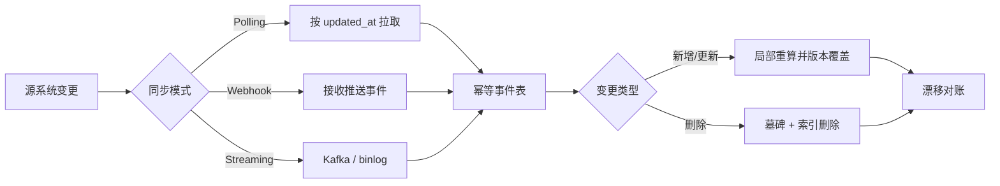
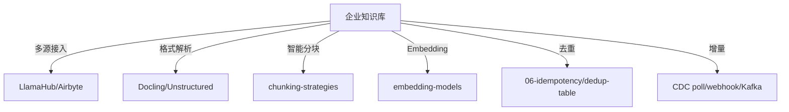

<!--
module:
  parent: ai
  slug: ai/knowledge-ingestion-pipeline
  type: article
  category: 主模块子文章
  summary: 企业级知识入库 8 阶段全链路（连接 → 解析 → 清洗 → 归一化 → 分块 → Embedding → 入库 → 增量同步 + CDC）
-->

# 企业级 Knowledge Ingestion Pipeline（知识入库流水线）

> **入库 ≠ 调个嵌入模型塞向量库** —— 是企业级 8 阶段流水线（连接 → 解析 → 清洗 → 归一化 → 分块 → Embedding → 入库 → 增量同步），对内要保 99% 召回 / 数据时效 / 合规审计，对外要可观测可重放。

---

## 一、为什么需要企业级 Ingestion Pipeline？

RAG 的回答质量由「能否找到正确证据」决定，而证据能否被找到，首先取决于入库质量。
经验上，RAG 失败的 80% 原因不在 query-time，而在 ingest-time：原文没接进来、解析错了、切碎了、过期了，检索侧再复杂也无法补救。

生产环境有 4 类核心痛点：

1. **多源格式混乱**：同一知识可能散落于扫描 PDF、Confluence、Slack、数据库和 Git PR，结构与编码完全不同。
2. **重复内容泛滥**：转载、附件副本、历史版本会挤占 Top-K，让检索结果看似相关却缺乏信息增量。
3. **数据持续漂移**：页面修改、权限变化、模型升级都会使向量和原始事实逐渐不一致。
4. **合规审计刚需**：企业必须回答「这段话从哪里来、谁能看、何时写入、能否彻底删除」。

Demo 通常只做「加载文件 → 固定切块 → Embedding → upsert」；生产系统还要处理幂等、版本、删除、ACL、限流、失败重放和质量评估。
Demo 关注一次跑通，生产关注持续正确；Demo 默认数据可信，生产必须把每个中间产物都当作可验证的数据资产。
因此，Ingestion Pipeline 不是 RAG 的前置脚本，而是一条长期运行、具备数据工程属性的核心生产链路。

---

## 二、8 阶段全链路


每个阶段都要定义统一契约：输入、输出、质量门禁、失败队列与可重放边界。
推荐将原始文件、解析文档、标准文档、Chunk、Embedding 分层保存，避免任何一步失败后从源站重新抓取。

| 阶段 | 核心输入 | 标准产物 | 主要质量指标 |
|------|---------|---------|-------------|
| 1. 多源连接 | 外部源与游标 | RawDocument + checkpoint | 覆盖率、延迟、抓取成功率 |
| 2. 格式解析 | 原始字节流 | ParsedDocument | 解析成功率、版面保真度 |
| 3. 清洗 + 去重 | 解析文档 | CleanDocument | 噪声率、重复率 |
| 4. 归一化 | 清洗文本 | CanonicalDocument | 编码一致性、字段完整率 |
| 5. 智能分块 | 标准文档 | Chunk[] | 边界完整率、长度分布 |
| 6. Embedding | Chunk[] | VectorRecord[] | 吞吐、错误率、模型版本一致性 |
| 7. 向量入库 + 元数据 | 向量记录 | 可检索索引 | upsert 成功率、可见性延迟 |
| 8. CDC 增量同步 | 变更事件 | 新版本 / 删除标记 | 新鲜度、漏同步率、重放成功率 |

### 2.1 阶段 1：多源连接

- **① 任务**：认证数据源，按全量或增量方式枚举对象，下载正文、附件、权限和版本信息。
- **② 关键工具**：LlamaIndex/LlamaHub 适合 RAG 数据加载；Airbyte 适合批量同步与 CDC；LangChain Loader 适合应用内快速接入。
- **③ 产出物**：不可变 `RawDocument`，至少包含 `source_uri`、`source_version`、`raw_bytes_uri`、`acl` 与采集游标。
- **④ 失败模式**：Token 过期、API 限流、分页漏数、时区错误、附件未下载、权限列表被错误继承。
- **质量门禁**：用源端对象数与抓取数对账；游标只在批次完整落盘后推进。
- **可重放点**：原始对象进入对象存储后，后续阶段不得依赖源站仍然可访问。

### 2.2 阶段 2：格式解析

- **① 任务**：把 PDF、DOCX、PPTX、HTML、图片等转换成保留标题、段落、表格、页码和阅读顺序的结构化文档。
- **② 关键工具**：Docling 强调复杂版面与结构化输出；Unstructured 覆盖多格式与分区；Marker 擅长 PDF 到 Markdown 的高质量转换。
- **③ 产出物**：`ParsedDocument`，正文由带类型的 Element 组成，并保留页码、坐标、标题层级和解析器版本。
- **④ 失败模式**：双栏错序、OCR 乱码、表格展平、页眉页脚混入正文、公式丢失、图片与说明文字脱钩。
- **质量门禁**：抽样对比页数、字符数、表格数与图片数；低置信度页面进入人工复核队列。
- **可重放点**：解析参数和解析器版本必须入元数据，升级解析器时才能定向重建。

### 2.3 阶段 3：清洗 + 去重

- **① 任务**：删除导航、广告、重复页眉页脚和不可见字符，同时识别相同或近似内容。
- **② 关键工具**：Unstructured 清洗函数、LangChain Transformer、自定义规则引擎，以及 MinHash/SimHash 去重服务。
- **③ 产出物**：`CleanDocument`、噪声删除报告、`exact_hash`、`sim_hash` 和重复簇 ID。
- **④ 失败模式**：正则过度清洗删掉代码，模板文字污染所有 Chunk，跨租户误去重，短文本哈希碰撞。
- **质量门禁**：清洗前后字符缩减率设上下限；重复簇必须保留一个 canonical document 和来源列表。
- **可重放点**：清洗规则要有版本号，规则变更后按受影响数据集回放，而不是全库盲目重建。

### 2.4 阶段 4：归一化

- **① 任务**：统一字符编码、Unicode 形态、换行、标点、日期、数字单位、语言标签与业务字段。
- **② 关键工具**：Python `unicodedata`、ICU、OpenCC、charset-normalizer，以及企业自定义词典。
- **③ 产出物**：`CanonicalDocument`，保存标准文本、原文映射、语言、单位制和 normalization version。
- **④ 失败模式**：NFD/NFC 不一致导致哈希漂移，繁简转换改变专有名词，`1k` 被错误解释，时区转换使更新时间倒退。
- **质量门禁**：标准化必须尽量可逆；保留原值与标准值，关键金额、编号和日期需要规则校验。
- **可重放点**：标准化规则与字典版本共同决定 canonical hash，更新时只重建 hash 变化的文档。

### 2.5 阶段 5：智能分块

- **① 任务**：按标题、段落、语义和业务结构切分，并为相邻 Chunk 建立上下文关系。
- **② 关键工具**：LlamaIndex NodeParser、LangChain TextSplitter、语义分块模型与面向合同的自定义解析器。
- **③ 产出物**：稳定 `chunk_id`、正文、父标题路径、页码范围、前后邻居和 token 数。
- **④ 失败模式**：问题与答案拆开、表头和表体分离、条款跨块、重叠过多、Chunk 超过 Embedding 模型上限。
- **质量门禁**：监控 token 长度分布、超限率、孤立短块率；用黄金问题集评估 chunk-level Recall@K。
- **可重放点**：`chunk_id` 应由 `doc_id + content_hash + chunker_version` 稳定生成，便于差量替换。

### 2.6 阶段 6：Embedding

- **① 任务**：批量生成向量，统一维度、归一化方式、模型版本和文本前缀策略。
- **② 关键工具**：BGE、M3E、Qwen、OpenAI Embedding API，以及 LlamaIndex/LangChain 的批处理封装。
- **③ 产出物**：`VectorRecord`，包含 vector、dimension、model、model_version、content_hash 与生成时间。
- **④ 失败模式**：限流、超时、部分批次丢失、模型静默升级、查询与文档使用不同模型、敏感文本越境发送。
- **质量门禁**：校验向量维度、空向量、NaN、范数分布；模型升级必须通过离线召回基准与灰度索引。
- **可重放点**：Embedding 结果按内容哈希缓存，同文同模型不重复计费。

### 2.7 阶段 7：向量入库 + 元数据

- **① 任务**：原子化写入向量、正文、过滤字段与 ACL，并建立可检索索引。
- **② 关键工具**：Milvus、Qdrant、Weaviate、Pinecone、pgvector；LlamaIndex/LangChain 负责适配 VectorStore。
- **③ 产出物**：可按 `tenant_id`、时间、来源和权限过滤的索引记录，以及成功写入清单。
- **④ 失败模式**：向量成功而元数据失败、批量 upsert 部分成功、索引尚未可见、主键不稳定产生幽灵副本。
- **质量门禁**：写后读校验、批次对账、按租户做 ACL 穿透测试；将数据可见性延迟纳入 SLO。
- **可重放点**：使用确定性 `chunk_id` 幂等 upsert，并把批次 manifest 作为提交凭证。

### 2.8 阶段 8：CDC 增量同步

- **① 任务**：持续捕获新增、更新、删除和权限变化，只重算受影响的文档与 Chunk。
- **② 关键工具**：Airbyte CDC、数据库 binlog/Debezium、Webhook、Kafka，以及 LlamaIndex Ingestion Cache。
- **③ 产出物**：有序变更事件、同步 checkpoint、新旧版本映射、墓碑记录与漂移报告。
- **④ 失败模式**：事件乱序、重复消费、删除漏传、游标推进过早、更新与重建竞态、消息积压导致知识过期。
- **质量门禁**：以源端更新时间与索引可见时间计算 freshness lag；定期全量 hash 对账捕获漏事件。
- **可重放点**：事件包含 `event_id`、`source_version` 和幂等键，消费者按版本比较后再写入。

### 2.9 贯穿全链路的工程控制

- **可观测**：每批次统一 `trace_id`，记录各阶段吞吐、延迟、丢弃原因、token 成本和队列积压。
- **可重放**：阶段产物不可变保存；失败进入 DLQ，修复配置后从最近成功产物继续。
- **幂等**：以 source identity、版本和内容哈希构造业务键，至少一次投递也不产生重复记录。
- **质量评估**：既测结构指标，也用黄金问题集测检索召回；两者缺一不可。
- **发布策略**：解析器、分块器或 Embedding 升级时建立影子索引，通过后再切换 alias。

---

## 三、多源连接器

连接器的目标不是「把文本拿回来」，而是完整捕获正文、附件、版本、权限和删除语义。

### 3.1 数据源分类

| 类别 | 典型来源 | 特别注意 |
|------|---------|---------|
| 文档类 | PDF / DOCX / PPTX / Markdown / HTML | 版面、附件、页码、扫描 OCR |
| 协作类 | Confluence / Notion / Slack / Teams / 邮件 | 线程、评论、空间权限、编辑历史 |
| 代码类 | GitHub / GitLab / Bitbucket Issue / PR | 分支、commit、代码块、Issue 与 PR 关联 |
| 数据类 | S3 / Kafka / MySQL binlog / 业务数据库 | schema、游标、事务边界、删除事件 |

### 3.2 工具栈选型

- **LlamaHub（200+ connector）**：适合快速接入 RAG 常见数据源，输出可直接进入 LlamaIndex Document/Node 流程。
- **Airbyte（300+ source）**：适合成熟的数据同步编排、状态管理、调度、CDC 与失败恢复。
- **Unstructured**：连接后紧接多格式 partition，尤其适合统一处理办公文档和网页。
- **Custom Connector**：源端有专有认证、复杂 ACL、特殊限流或业务版本语义时不可避免。

连接器统一接口建议包含 `discover`、`read(snapshot/cursor)`、`get_acl`、`ack_checkpoint` 四类能力。
认证信息放密钥系统，不写入任务配置；每个租户独立凭证、配额和 checkpoint。
抓取采用指数退避与抖动，尊重 `Retry-After`；大附件用流式下载并校验 ETag/MD5。
数据库 CDC 必须识别事务边界，避免同一事务内的数据只入库一半。
S3 可组合对象事件与周期清单对账；Kafka 要记录 partition/offset；MySQL 使用 binlog file/position 或 GTID。
连接器产出的统一信封示例：

```text
SourceEnvelope = {
  source_uri, source_type, source_version, modified_at,
  content_ref, mime_type, acl, tenant_id, cursor
}
```

不要用 URL 作为唯一身份：页面改名、短链与附件下载地址都会变化；优先使用源系统稳定 object ID。

---

## 四、解析与清洗

### 4.1 Docling vs Unstructured vs Marker

| 工具 | 优势 | 更适合 | 取舍 |
|------|------|--------|------|
| **Docling** | 版面理解、表格、阅读顺序、结构化模型 | 复杂 PDF、办公文档、需要结构保真的场景 | 模型与计算成本需评估 |
| **Unstructured** | 格式覆盖广、partition 策略成熟、易接入流水线 | 多格式企业知识库与快速工程化 | 复杂版面仍需针对性调参 |
| **Marker** | PDF → Markdown 质量高，擅长公式与版面恢复 | 论文、技术手册、Markdown 下游 | 输入类型相对聚焦 PDF |

选型不要只看「是否能抽出字」，要拿真实语料比较标题层级、阅读顺序、表格单元格、公式和页码保留率。
关键合同与财报可以按文档类型路由：普通文件走低成本解析，复杂页面走高精度模型。

### 4.2 四类解析难点

- **表格**：必须保留表头与跨行/跨列关系；必要时同时保存 Markdown 表格和单元格 JSON。
- **OCR**：记录页级置信度与语言；低置信度数字、金额、编号应进入复核，不能静默入库。
- **图片**：保存图片位置、caption 与附近段落；关键流程图可追加视觉模型描述，但不能替代原图引用。
- **公式**：优先保存 LaTeX/MathML 和原始截图，避免纯文本化后上下标与符号含义丢失。

### 4.3 清洗与归一化规则

清洗包括去除 HTML 标签、脚本、导航、Cookie 提示、重复页眉页脚，并标准化空白与换行。
编码先探测再修复：使用 charset normalize 处理 UTF-8/GBK 混杂、非法字节与 mojibake。
Unicode 统一选择 NFC（或业务明确要求的 NFD），并在生成内容哈希前完成，避免视觉相同而字节不同。
繁简转换必须使用领域词典保护人名、品牌和法规原文；跨语言检索时保留 `language` 字段。
数字单位统一存原值和标准值，如 `1k` → `1000`、`2 MB` → `2097152 bytes`，禁止只留下转换结果。
清洗规则按 MIME、来源和模板版本分层，不要用一套全局正则处理所有文档。

---

## 五、去重与数据血缘

### 5.1 三层去重

1. **URL / stable ID 精确去重**：同一源对象、同一版本直接幂等跳过；速度最快，但无法识别转载与镜像。
2. **内容哈希近似去重**：规范化全文做 SHA-256 精确判等，再用 MinHash/SimHash 识别少量编辑的近重复文档。
3. **向量近似去重**：对候选集合计算 embedding 距离，发现语义重复；成本最高，只应做最后一层候选确认。

去重粒度分文档级和 Chunk 级：文档级减少解析计算，Chunk 级减少检索 Top-K 被模板段落占满。
近似去重阈值必须按语言和内容类型标定；法律条款仅一字之差也可能含义相反，不能自动合并。
跨租户默认不合并实体记录，即使内容相同也要保留独立 ACL 和删除生命周期。
Canonical 文档保留所有别名来源，检索引用时仍能回到用户有权限访问的原始地址。

### 5.2 数据血缘

最小血缘字段包括 `source`、`crawled_at`、`version`、`tenant_id`，并向每个 Chunk 传播。
同时记录 parser、cleaner、normalizer、chunker、embedding 的版本，才能解释「为什么同一文档今天检索结果不同」。
建议元数据模板：

| 字段 | 含义 | 用途 |
|------|------|------|
| `source_url` | 可回看的原始地址 | 引用与来源追溯 |
| `doc_id` | 稳定文档主键 | 版本聚合、删除 |
| `chunk_id` | 稳定分块主键 | 幂等 upsert |
| `page_num` | 原文页码或区间 | 精确定位证据 |
| `updated_at` | 源端更新时间 | 增量判断与新鲜度 |
| `crawled_at` | 本次采集时间 | 延迟与审计 |
| `tenant_id` | 租户隔离键 | 强制过滤 |
| `acl_tags` | 用户/组/角色标签 | 查询期权限控制 |
| `content_hash` | 标准内容哈希 | 去重与漂移检测 |
| `pipeline_version` | 全链路版本 | 可解释、可重放 |

元数据不是「附带字段」，而是过滤、审计、引用、更新和删除的控制面。

---

## 六、智能分块与 Embedding 选型

分块的 5 类策略是固定长度、递归字符、语义分块、滑动窗口和 Agentic 分块；详细原理见 [chunking-strategies](../chunking-strategies/README.md)。
固定分块便宜稳定，递归分块兼顾结构，语义分块边界自然，滑动窗口保上下文，Agentic 分块适合高价值复杂文档。
合同不能只按 token 切：应以「章 → 条 → 款 → 项」为骨架，将定义、例外、附件引用和签署页建立关系。
表格 Chunk 必须带表名、表头和所在章节；代码 Chunk 带仓库、路径、symbol 与 commit。

Embedding 速查：

| 模型 | 适合场景 | 关注点 |
|------|---------|-------|
| **BGE / BGE-M3** | 多语言、稠密/稀疏能力、私有化 | 指令前缀与模型版本 |
| **M3E** | 中文语义检索、本地部署 | 用领域集验证长文本表现 |
| **Qwen Embedding** | 中英多语言、Qwen 生态 | 维度、服务成本与合规区域 |
| **OpenAI Embedding** | 托管 API、快速上线 | 数据出境、限流、持续费用 |

不要用公开榜单代替业务评测：固定黄金问题集，对比 Recall@K、MRR、延迟和每百万 token 成本。
写入采用批量 + 异步：按 token 而非文档数组批，设置并发上限，失败批次指数退避并加入随机抖动。
对 429/5xx 可重试，对认证、维度不匹配和内容超限应快速失败；重试必须使用幂等 `chunk_id`。
模型升级建立新 collection 或新向量字段，完成双写与对比后切换，禁止原地混写不同向量空间。

---

## 七、CDC 增量同步



### 7.1 三种增量模式

| 模式 | 原理 | 优点 | 风险与补偿 |
|------|------|------|-----------|
| 拉模式 | polling `updated_at` + stable ID | 简单、源端要求低 | 时间窗口重叠拉取，防止同秒更新与时钟偏差 |
| 推模式 | webhook 通知变更 | 延迟低、成本低 | 验签、落事件表后应答；定期全量对账防漏推 |
| 流模式 | Kafka / CDC / binlog | 高吞吐、有序可重放 | 处理分区顺序、schema 演进、积压和事务边界 |

Polling 不要使用「大于上次时间」的裸条件，应使用时间 + stable ID 复合游标，并回看一小段窗口后幂等去重。
Webhook 只传对象 ID 时，消费者再读取最新快照；若事件可能乱序，必须比较 source version。
Kafka 按 `doc_id` 分区可保持同文档顺序；消费者提交 offset 前应完成索引写入和状态落库。

### 7.2 删除与版本策略

- **软删除**：写 `deleted_at`/墓碑并在查询时过滤，便于审计和误删恢复，但要防过滤遗漏。
- **硬删除**：移除向量、文本、缓存和对象存储副本，适合 GDPR 删除请求，需要删除证明。
- **版本覆盖**：新版本成功可见后，再下线旧版本，避免重建窗口内知识短暂消失。

权限变更也属于 CDC：正文不变但 ACL 改变时，不应重新 Embedding，只更新过滤元数据。
局部更新先比较规范化内容 hash；hash 未变则跳过解析后链路，仅刷新血缘与权限。
若分块发生变化，按 `doc_id` 计算新旧 chunk 集合差：新增 upsert、删除写墓碑、相同 hash 复用向量。

### 7.3 数据漂移检测

每日/每周用源端快照 hash 与索引 manifest 对账，检测漏更、幽灵文档、权限漂移和模型版本混杂。
按来源、文档类型、租户分层抽样人审，重点检查金额、日期、表格与合同条款。
漂移告警必须能定位到 source、pipeline version 和首个异常阶段，而不是只报告「召回下降」。

---

## 八、合规与审计

- **来源追溯**：每个 Chunk 携带 `source_url`、`crawled_at`、`doc_id`、页码和版本，回答引用能回到原文。
- **访问控制**：`tenant_id` 是强隔离条件，`acl_tags` 表达用户/组/角色；权限过滤必须在检索前执行。
- **GDPR 与删除权**：建立 subject/source 到 doc/chunk/vector 的反向索引，才能完成全链路定位与删除。
- **数据脱敏**：入库前做 PII 检测，对身份证、手机号、邮箱、密钥进行删除、掩码或 token 化替换。
- **最小化原则**：只采集问答所需字段，敏感原文与向量分区存储，并设置保留期限。
- **审计日志**：记录 `trace_id`、operator、timestamp、action、before/after version 和处理结果。
- **密钥治理**：连接凭证进入 Vault/KMS，按租户和数据源最小授权，定期轮换。
- **模型合规**：调用外部 Embedding 前确认数据驻留、供应商保留策略、传输加密与合同条款。

ACL 过滤应纳入自动化测试：无权限用户的 Recall 必须是 0；管理员与普通用户使用同一 Query 做差异验证。
审计日志应防篡改、可关联、可导出，但不能再次写入未脱敏正文形成新的泄露面。

---

## 九、实战选型决策树



决策顺序建议：

1. **先看来源规模**：少量文件可用 LlamaHub；跨 SaaS/数据库且要求状态管理时优先 Airbyte。
2. **再看版面复杂度**：普通 HTML/Markdown 用轻量解析；复杂 PDF 对比 Docling、Unstructured、Marker 实测。
3. **再看更新时效**：小时级可 polling，分钟级用 webhook，秒级高吞吐用 Kafka/CDC。
4. **再看部署边界**：敏感数据优先私有解析与本地 Embedding；托管 API 必须通过合规审查。
5. **最后用指标定型**：以端到端 Recall@K、freshness lag、失败重放时间和单位成本做决策。

最小生产组合可从「LlamaHub + Unstructured + 递归分块 + BGE + pgvector + polling」开始。
高规模组合可采用「Airbyte/CDC + 对象存储分层 + Docling 路由 + Kafka + 向量数据库 + 影子索引」。
工具可以替换，但 RawDocument、Chunk、VectorRecord、ChangeEvent 四类契约应保持稳定。

---

## 十、7 大反直觉

| 直觉误区 | 生产事实 | 为什么 |
|---------|---------|-------|
| ❌ 全量扫描后入库就完事 | ✅ **增量同步才是核心** | 企业知识每天变化，一次性索引会迅速过期 |
| ❌ URL 不同就是不同内容 | ✅ **内容哈希才权威** | 镜像、短链、附件副本会产生不同 URL |
| ❌ 分块越大越好 | ✅ **过大通常让召回越差** | 一个向量混入多个主题，查询信号被稀释 |
| ❌ 直接用最强 Embedding | ✅ **要做成本 / 召回权衡** | 榜单最优不等于领域最优，延迟与数据边界也重要 |
| ❌ PDF 转纯文本就行 | ✅ **表格和层级丢失会破坏语义** | 阅读顺序、表头、页码决定证据是否可用 |
| ❌ 向量库写入成功就 OK | ✅ **元数据同样重要** | 无血缘、ACL、版本就无法过滤、更新与审计 |
| ❌ 上线后再慢慢优化 | ✅ **数据漂移会迅速恶化召回** | 漏更新、旧版本和权限变化会持续积累 |

真正的护城河往往不是某个模型，而是可持续地产出「干净、及时、可解释、权限正确」的索引。
评价流水线不能只看任务成功率：一条成功处理但标题错序、ACL 丢失的记录，比显式失败更危险。

---

## 📚 参考来源

1. [LlamaIndex Ingestion Pipeline 官方文档](https://docs.llamaindex.ai/en/stable/loading/loading.html) — 数据加载、连接器与 Ingestion Pipeline 基础。
2. [CSDN — 基于 LlamaIndex 实现大模型 RAG](https://blog.csdn.net/u012856866/article/details/145481517) — Loading → Indexing → Storing → Querying → Evaluation 五阶段实践。
3. [Unstructured.io GitHub](https://github.com/Unstructured-IO/unstructured) — 多格式文档预处理与结构化分区工具。
4. [阿里云 Lindorm — Java 客户端和 Pipeline 自动 Embedding](https://help.aliyun.com/document_detail/2873214.html) — 写入/查询 Pipeline 自动向量化实战。
5. [Final-State-Press/enterprise-knowledge-base](https://github.com/Final-State-Press/enterprise-knowledge-base) — 结构化、智能化企业知识系统参考。

---

## 🔗 相关章节

- **入库后查询**：[rag-pipeline](../rag-pipeline/README.md) / [rag-paradigm-evolution](../rag-paradigm-evolution/README.md)
- **入库工具**：[chunking-strategies](../chunking-strategies/README.md) / [embedding-models](../embedding-models/README.md) / [long-document-processing](../long-document-processing/README.md)
- **入库去重**：[deduplication-table](../../../04.system-design/06-idempotency/deduplication-table/README.md)
- **AI 平台**：[ai-platforms](../../03-engineering/ai-platforms/README.md)
- **餐厅叙事**：[12.story/36-rag-retrieval-augmented-generation](../../../12.story/36-rag-retrieval-augmented-generation.md)
- **咬文嚼字**：[knowledge-ingestion-pipeline 面试](../../../13.split-hairs/11.ai/knowledge-ingestion-pipeline/README.md)（commit 2 创建）

---

← [返回 L2 技术栈](../README.md)
