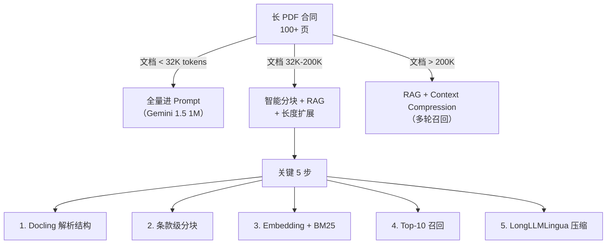

<!--
module:
  parent: ai
  slug: ai/long-document-processing
  type: article
  category: 主模块子文章
  summary: 长 PDF / 合同场景 4 大策略整合视角（智能分块 + 检索增强 + 上下文压缩 + 长度扩展）
-->

# 长文档处理（几百页 PDF 合同的整合视角）

> **长文档处理 = 长 PDF/合同场景 4 大策略整合** —— 智能分块 + 检索增强 + 上下文压缩 + 长度扩展，对接 Docling PDF 解析工具

---

## 📑 目录

- [一、问题边界：几百页 PDF 合同为什么装不下？](#一问题边界几百页-pdf-合同为什么装不下)
- [二、4 大策略整合](#二4-大策略整合)
- [三、PDF 结构化解析](#三pdf-结构化解析)
- [四、实战选型决策树](#四实战选型决策树)
- [五、风险点、反直觉与 7 大误区](#五风险点反直觉与-7-大误区)
- [六、实战代码片段](#六实战代码片段完整-pipeline)
- [七、参考来源](#七参考来源)
- [八、相关章节](#八相关章节)

---

## 一、问题边界：几百页 PDF 合同为什么装不下？

| 场景 | 规模估算 |
|------|---------|
| 一份普通合同 | 50-100 页 × 2000 字 ≈ 10 万-20 万 tokens |
| 招股书 / IPO 文件 | 200-500 页 × 2500 字 ≈ 50 万-125 万 tokens |
| 法律判例汇编 | 1000+ 页 ≈ 200 万+ tokens |
| 论文集 / 教科书 | 单本 30 万 tokens，全套可能 500 万+ tokens |

**反直觉事实**：

1. **1M Context 不是万能**。Gemini 1.5 等百万上下文模型看上去够用，但输入越长，Prefill 延迟、KV Cache 占用和调用成本通常越高；标准全注意力计算复杂度为 O(n²)，具体服务会用稀疏注意力等优化。
2. **Lost in the Middle 仍需实测**。即使模型“装得下”，对中段内容的召回与推理也可能显著弱于首尾（U 型曲线）。
3. **多跳推理更难**。“第 3 条与第 7 条的冲突点在哪？”这类跨条款查询，单次全量 Prompt 不一定能稳定找到并组合证据。
4. **研究窗口不等于生产窗口**。Gemini 1.5 技术报告曾展示最高 10M tokens 的研究实验，但实际 API 上限取决于模型版本与服务配置。

**结论**：长文档处理必须用**工程化策略组合**，而非依赖单一模型的 context 容量。

---

## 二、4 大策略整合

### 🧩 策略 1：智能分块（Chunking）

> 详见 [chunking-strategies](../chunking-strategies/README.md)

**5 种通用分块策略**：

| 策略 | 切法 | 适用合同场景 |
|------|------|-------------|
| **固定大小** | 每 500 字硬切 | ❌ 不适合（切断条款） |
| **递归** | 段落 → 句子 → 字 | 一般合同可用 |
| **语义分块** | Embedding 距离突变点切 | 通用文档 |
| **滑动窗口** | 切块 + 重叠 50-100 字 | 需保留跨边界上下文 |
| **Agentic 分块** | LLM 自主决定切法 | 复杂合同 / 法律文书 |

**合同专用分块模式**：

```python
import re

pattern = r'(第[一二三四五六七八九十百零]+条.*?)(?=第[一二三四五六七八九十百零]+条|$)'
clauses = re.findall(pattern, text, flags=re.S)
```

合同分块应优先保持“条款 + 款项 + 但书”的完整语义；超长条款再按款、项递归拆分，并让子块继承父标题。
表格和附件作为独立 Chunk，但同时生成可检索文本，避免只存二维数据而无法被召回。

**保留的关键 metadata**：
- `article_no`（第几条）
- `article_title`（条款标题）
- `page`（页码 — 审查必溯源）
- `chunk_type`（article_body / attachment_table / appendix）
- `parent_clause`（所属章节）

---

### 🔍 策略 2：检索增强（RAG）

> 详见 [rag-pipeline](../rag-pipeline/README.md)

**针对长合同场景的 Pipeline**：


**合同场景特殊处理**：

1. **Query Rewrite**：用户口语化查询 → 补全指代 + 抽取实体
   - 输入："那条对甲方不利的"
   - 输出：`甲方 = 合同主体A；查询主题 = 不利条款 / 责任分配 / 违约金`

2. **Hybrid Search（必选）**：
   - 向量检索：抓语义相似（如"违约责任"≈"breach liability"）
   - BM25：抓精确术语（如"第三条" / "不可抗力" / 法律条文编号）

3. **Rerank**：合同审查需要**高精确率**，宁可漏检不错检
   - Cross-Encoder（bge-reranker-large / Cohere Rerank）精排
   - Top-100 → Top-5（不是 Top-10）

4. **多跳查询**：跨条款推理用 **Map-Reduce 模式**
   - 第一轮：分别检索"第 3 条"和"第 7 条"
   - 第二轮：把两段 chunk 一起塞 LLM，生成对比结论

---

### 📦 策略 3：上下文压缩（Context Compression）

> 详见 [context-engineering](../context-engineering/README.md)

**上下文压缩流程**：

```text
Top-10 条款 → LongLLMLingua / RECOMP / 摘要压缩
            → 摘要 + 关键条款原文
            → 数字、主体、否定词、页码一致性校验
```

**方案对比**：

| 方案 | 压缩比 | 质量损失 | 速度 |
|------|--------|---------|------|
| **LongLLMLingua** | 5-20x | 低 | 慢（需小模型） |
| **LLMLingua-2** | 10-20x | 极低 | 快（分类任务） |
| **摘要压缩** | 10-50x | 中 | 快 |
| **Selective Context** | 2-5x | 低 | 中 |

**上下文压缩的三条合同红线**：

- 采用“**摘要 + 关键条款原文**”两层结构：摘要建立全局认识，原文负责事实校验与引用。
- 金额、日期、比例、否定词、义务主体、解除权和管辖权原则上保留原句，不做激进压缩。
- 压缩后校验数字、主体、但书与页码，发现不一致时回退到未压缩证据。

**合同场景建议**：用 LongLLMLingua、RECOMP 或抽取式摘要降低噪声；具体方案必须用领域评测验证，不能假设关键 token 一定无损。

---

### 📏 策略 4：长度扩展（Context Extension）

> 详见 [yarn-context-extension](../yarn-context-extension/README.md)

**核心问题**：基础模型只支持 4K-32K，要处理 100K+ 文档怎么办？

**4 大长度扩展方案**：

| 方案 | 原理 | 扩展能力 | 训练成本 |
|------|------|---------|---------|
| **Position Interpolation (PI)** | 线性压缩位置索引 | 2x | 低 |
| **NTK-aware** | RoPE 基数动态调整 | 4-8x | 低 |
| **YaRN** | NTK + 注意力缩放 + 频率分段 | 8-32x | 中 |
| **LongRoPE** | 渐进式搜索最优缩放 | 16-128x | 高 |

**长度扩展要点**：PI 线性压缩位置索引；NTK-aware 调整 RoPE 基数；YaRN 组合频率分段与注意力缩放；LongRoPE 搜索非均匀插值。它们扩展的是模型位置能力，不能替代 RAG 的检索、权限和引用能力。

**模型与窗口口径（以具体模型卡 / API 配置为准）**：

| 名称 | 应准确理解为 | 合同场景建议 |
|------|-------------|-------------|
| Qwen2.5-1M | Qwen2.5-Turbo 等百万上下文服务版本 | 中文长文档 API 候选，仍需评测数字与中段召回 |
| Llama-3.1-1M | 官方 Llama 3.1 原生为 128K；1M 多指社区扩展或继续训练版本 | 私有化优先考虑 128K + RAG，不把社区窗口当官方能力 |
| Gemini-1.5-10M | 10M 来自技术报告研究实验；生产窗口依版本和服务而定 | 适合超长、多模态探索，不把实验上限当稳定配额 |

**反直觉**：
- ❌ Qwen/Llama 都原生支持 1M → ✅ 必须区分具体服务版本、官方原生窗口与社区扩展版本
- ❌ 长度扩展无损 → ✅ 中段精度、短上下文能力与推理成本仍需评测
- ❌ 窗口越长就不需要 RAG → ✅ RAG 仍负责权限、更新、引用和成本控制

---

## 三、PDF 结构化解析

**主流工具对比**：

| 工具 | 优点 | 缺点 | 适用 |
|------|------|------|------|
| **Docling（IBM）** | 表格/公式/版面理解强，2024-2026 主流 | 中等速度 | 通用合同/招股书 |
| **Unstructured** | 文档类型多，API 简洁 | 中文支持一般 | 英文文档 |
| **Marker** | 速度快，Markdown 输出干净 | 表格识别弱 | 简单 PDF |
| **PyMuPDF** | 极速 + 底层控制 | 无版面分析 | 已结构化 PDF |
| **pdfplumber** | 表格提取精准 | 无 OCR | 数字 PDF |

**Docling 实战**（推荐首选）：

```python
from docling.document_converter import DocumentConverter

converter = DocumentConverter()
result = converter.convert("contract_500_pages.pdf")

# 输出结构化 JSON
doc = result.document

# 导出 Markdown（保留层级结构）
markdown = doc.export_to_markdown()

# 导出 DocTags（带完整 metadata）
doc_tags = doc.export_to_doctags()

# 遍历元素（段落、表格、图表、页眉页脚）
for element in doc.iterate_items():
    if element.type == "paragraph":
        print(f"[段落] {element.text[:100]}")
    elif element.type == "table":
        print(f"[表格] {element.data}")
    elif element.type == "page_header":
        print(f"[页眉] {element.text}")
```

**难点**：

1. **扫描件 OCR**：合同常是扫描件 → 先 OCR（Tesseract / PaddleOCR / Docling 内置）
2. **复杂表格**：合并单元格、跨页表格 → 用 `unstructured` 或 `camelot-py`
3. **页眉页脚**：每页重复的页眉会污染 chunk → 解析时**必须识别并剔除**
4. **目录 vs 正文**：目录的页码指向与正文不一致 → 区分 `toc_entry` 与 `body`

**合同 6 大要素抽取**：

| 要素 | 典型字段 | 校验方式 |
|------|---------|---------|
| 签署方 | 法人名称、统一信用代码、甲乙方角色 | 首页与签章页交叉校验 |
| 标的 | 产品、服务、范围、数量 | 正文与技术附件对齐 |
| 价款 | 含税金额、币种、付款节点 | 大写与小写金额一致性 |
| 履行期 | 生效日、交付日、验收期 | 日期关系与工作日规则 |
| 违约责任 | 违约金、赔偿上限、解除条件 | 主条款与免责条款合并判断 |
| 争议解决 | 适用法律、法院或仲裁机构 | 排他性与地域有效性复核 |

抽取结果建议固定输出 `value + evidence + clause_no + page + confidence`；字段缺失时返回 `null`，不要让模型依常识补全合同未写明的内容。

---

## 四、实战选型决策树



**决策要点**：

| 维度 | < 32K | 32K-200K | > 200K |
|------|-------|----------|--------|
| **核心策略** | 全量 Prompt | 分块 + RAG + 扩展 | 分块 + RAG + 压缩 |
| **模型选择** | GPT-4o / Claude | Qwen-72B + YaRN / Gemini 1.5 | RAG 优先，模型次要 |
| **延迟预算** | < 2s | 2-5s | 5-15s |
| **成本控制** | 按 token 计费 | Embedding + Rerank 优化 | 长 context 避免，重在 RAG |
| **评估指标** | 答案准确性 | Recall@10 / Faithfulness | Faithfulness / 溯源准确性 |

---

## 五、风险点、反直觉与 7 大误区

### 生产风险点

| 风险 | 典型后果 | 防护措施 |
|------|---------|---------|
| OCR 数字错误 | 金额、日期或比例结论错误 | 正则校验 + 双引擎 OCR + 人工复核 |
| 条款切断 | 例外条件丢失 | 条款级分块 + 邻接扩展 |
| 版本混检 | 引用已废止条款 | 版本 metadata + 生效优先级 |
| 权限泄漏 | 跨租户看到合同 | 检索前 ACL 过滤，不只在生成后过滤 |
| 摘要幻觉 | 改变义务主体 | 摘要与原文双层输出 |
| 引用漂移 | 页码与内容不对应 | 原件哈希 + 稳定 Chunk ID + 坐标映射 |
| Prompt Injection | 合同文本诱导模型越权 | 文档内容与系统指令隔离 |

### 7 大误区

| ❌ 错误认知 | ✅ 正确做法 |
|-----------|-----------|
| 1M Context 万能 | Lost-in-Middle 仍存在，U 型曲线不可避免 |
| Recursive 分块永远够用 | 合同场景需要 Agentic 分块（条款结构复杂） |
| Chunk 越大越好（上下文全） | Chunk 越大检索召回越差（噪声稀释语义） |
| PDF 转纯文本就够 | 必须保留层级结构（标题/段落/条款） |
| 不需要 page metadata | 合同审查**必须溯源**到具体页码 |
| Qwen/Llama 都原生支持 1M | 区分服务版本、官方原生窗口与社区扩展模型 |
| RAG 解决一切 | 多跳查询需 Map-Reduce，RAG 单独不够 |

---

## 六、实战代码片段

```python
import re
from docling.document_converter import DocumentConverter

# Docling 解析示例
converter = DocumentConverter()
result = converter.convert("contract.pdf")
md = result.document.export_to_markdown()  # 保留层级结构

# 按条款分块
pattern = r'(第[一二三四五六七八九十百零]+条.*?)(?=第[一二三四五六七八九十百零]+条|$)'
clauses = re.findall(pattern, md, flags=re.S)

# 生产环境还要给每块补齐稳定 ID、条款号、页码、版本和文件哈希
records = [
    {"chunk_id": f"contract-001-{i:04d}", "text": clause.strip()}
    for i, clause in enumerate(clauses, start=1)
]
```

随后将 `records` 同时写入 Embedding 与 BM25 索引，召回 Top-50 后由 Cross-Encoder 重排到 Top-10，再压缩为“摘要 + 关键条款原文”。最终答案必须返回 `answer + clause_no + page + quote + confidence`，证据不足时明确拒答。

---

## 七、📚 参考来源

1. [IBM Docling 官方仓库](https://github.com/DS4SD/docling) — PDF / Office / 图片转换、统一文档结构与 Markdown / JSON 导出。
2. [DeepLearning.AI — Preprocessing Unstructured Data for LLM Applications](https://www.deeplearning.ai/short-courses/preprocessing-unstructured-data-for-llm-applications/) — Andrew Ng 团队的非结构化数据预处理课程。
3. [从 8K 到 1M 上下文的通用化：Qwen-Agent 创新实践](https://download.csdn.net/blog/column/12717178/144158112) — 检索、分块阅读与长上下文数据构造。
4. [大模型源码分析之 Llama Long Context（DeepSeek 前线）](https://blog.csdn.net/kakaZhui/article/details/145393395) — RoPE 与长上下文实现分析。
5. [NeedleInAHaystack 测试工具](https://gitcode.com/gh_mirrors/ll/LLMTest_NeedleInAHaystack) — 不同长度和信息深度下的长上下文检索评测。

> 延伸阅读：量子位《[最强开源大模型除夕登场：Qwen3.5 与 1M 上下文](https://www.qbitai.com/2026/02/380433.html)》（2026-02）。模型能力变化快，选型时以官方模型卡和 API 文档为准。

---

## 八、🔗 相关章节

**工具视角三件套**：
- [chunking-strategies](../chunking-strategies/README.md) — 5 大分块策略（直接决定检索质量）
- [lost-in-middle](../lost-in-middle/README.md) — 长 Context 中段遗忘现象与 6 大缓解
- [yarn-context-extension](../yarn-context-extension/README.md) — YaRN / RoPE 长度扩展 2K → 128K

**系统视角**：
- [rag-pipeline](../rag-pipeline/README.md) — RAG 5 阶段 SOTA 架构总览
- [rag-paradigm-evolution](../rag-paradigm-evolution/README.md) — RAG 四阶段演进（Naive→Advanced→Modular→Agentic）
- [context-engineering](../context-engineering/README.md) — Context Engineering 4 大原则

**多模态**：
- [multimodal](../multimodal/README.md) — 含文档理解（PDF/扫描件 OCR）

**实战工具**：
- [12.story/36-rag-retrieval-augmented-generation](../../../12.story/36-rag-retrieval-augmented-generation.md) — RAG 餐厅故事

**咬文嚼字**：
- [long-document-pdf](../../../13.split-hairs/11.ai/long-document-pdf/README.md) — 长文档 PDF 面试题（Commit 2 创建）

---

← [返回 L2 技术栈](../README.md)