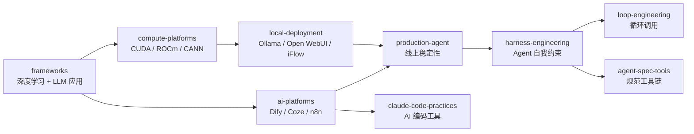

<!--
module:
  parent: ai
  slug: ai/engineering
  type: index
  category: 主模块子文章
  summary: AI 工程实践
-->

# L3 工程实践

> 从框架选型到本地部署，AI 工程落地的实用指南。

## 1. 目录导航

| 目录 | 核心内容 | 一句话定位 |
|------|---------|-----------|
| [frameworks](frameworks/) | **深度学习框架** (PyTorch/TensorFlow/MindSpore/PaddlePaddle) · **大模型应用框架** (LangChain/LangChain4j/Spring AI/LlamaIndex) | 框架选型地图 |
| [compute-platforms](compute-platforms/) | 计算平台对比 — CUDA / ROCm / CANN | 算力底层 |
| [local-deployment](local-deployment/) | 本地部署指南 — Ollama (含 Linux 部署方案)、Open WebUI、iFlow CLI | 离线跑模型 |
| [ai-platforms](ai-platforms/) | AI 平台选购指南 — Dify / Coze / n8n / FastGPT / RAGFlow 对比 | 低代码编排 |
| [claude-code-practices](claude-code-practices/) | Claude Code 实战 — OpenSpec / Spec Kit / Hooks 实践 + **Skill 设计（4 阶段 + 5 反模式 + YAML 模板）+ Skill 命中率（四层模型）** | AI 编码工具链 |
| [production-agent](production-agent/) | 生产级 Agent 实战 — 编排、监控、错误恢复 | 线上稳定性 |
| [harness-engineering](harness-engineering/) | **Harness Engineering** — 4 大 Harness 类型（规范/流程/工具/反馈）+ OpenSpec + 4 原则 | Agent 自我约束 |
| [loop-engineering](loop-engineering/) | **Loop Engineering** — 循环调用 3 大组件 + 4 大失败模式 + 5 大最佳实践 + 🆕 [Ralph Wiggum Loop](loop-engineering/ralph-wiggum-loop.md) | 探索性任务自动化 |
| [agent-spec-tools](agent-spec-tools/) 🆕 | **Agent Spec Tools** — Superpowers（强制 TDD）/ Spec-Kit（企业 SDD 管线）/ OpenSpec（轻量规范对齐）安装 + 配置 + 对比 | Agent 规范工具链 |
| [llm-production-thinking](llm-production-thinking/) 🆕 | **大模型思维工程** — 5 大灵魂拷问（Prompt vs if-else / 成本降级 / 一致性 / 超时熔断 / 监控定位）+ 5 层路由 + 双 timeout | LLM 生产工程 |
| [ai-code-review](ai-code-review/) 🆕 | **AI 代码审核验收** — 6 层审核体系（契约/业务/安全/性能/可测/幻觉）+ 分级门禁矩阵 + 幻觉专项 + 工具链 | AI 产出质量门禁 |

### 1.1 学习路径

建议顺序：frameworks（选框架）→ compute-platforms（选算力）→ local-deployment（跑起来）→ ai-platforms（选平台）→ **Harness → Loop Engineering**（AI 工程 4 阶段之 3-4 阶段）。

---

## 2. 知识脉络

---

## 3. 速查表

| 概念 | 核心要点 | 典型场景 |
|------|---------|---------|
| **PyTorch** | 动态图 + Pythonic，研究首选 | 模型训练/研究 |
| **TensorFlow** | 静态图 + 生产部署成熟 | 工业级大规模训练 |
| **Spring AI** | Spring 生态原生集成 | Java 企业 AI 应用 |
| **LangChain / LangChain4j** | LLM 应用开发框架，Python/Java | 快速原型 |
| **Ollama** | 本地 LLM 运行工具 | 离线推理、隐私场景 |
| **Dify** | 开源 LLM 应用编排平台 | 低代码 AI 应用 |
| **Harness Engineering** | 用规范/流程/工具约束 Agent | Agent 自我约束 |
| **Loop Engineering** | 循环调用 + 反馈机制 | 探索性任务 |
| **Ralph Wiggum Loop** | Fresh Context 每轮重启 + 文件系统持久记忆 | 长任务自动化 |
| **Superpowers** | 14 Skill + 强制 TDD + 7 阶段工作流 + 子 Agent 编排 | Agent 工作流约束 |
| **Spec-Kit** | GitHub 官方 SDD 管线 + 5 命令 + 30+ Agent 兼容 | 企业规范标准化 |
| **OpenSpec** | 轻量 Markdown 规范 + /opsx 命令 + AGENTS.md | 快速规范对齐 |

---

## 4. 核心内容（按子模块展开）

- **[frameworks](frameworks/)**（+ 3 子）：
  - [deep-learning](frameworks/deep-learning/) — 深度学习框架对比
  - [llm-app](frameworks/llm-app/) — LLM 应用框架对比
  - [langgraph-migration](frameworks/langgraph-migration/) — LangGraph 迁移指南
- **[compute-platforms](compute-platforms/)**：CUDA（NVIDIA）/ ROCm（AMD）/ CANN（华为）三大计算平台对比
- **[local-deployment](local-deployment/)**（+ 4 子）：
  - [iflow-cli](local-deployment/iflow-cli/) — Java 集成 CLI
  - [ollama](local-deployment/ollama/) — Ollama 主指南
  - [ollama/linux-deploy](local-deployment/ollama/linux-deploy/) — Linux 部署方案
  - [open-webui](local-deployment/open-webui/) — 可视化 Web UI
- **[ai-platforms](ai-platforms/)**：Dify / Coze / n8n / FastGPT / RAGFlow 五大平台对比
- **[claude-code-practices](claude-code-practices/)**：OpenSpec / Spec Kit / Hooks 实践 + Skill 设计方法论 + Skill 命中率（描述/路由/加载/评估 4 层模型）
- **[production-agent](production-agent/)**：生产级 Agent 编排、监控、错误恢复
- **[harness-engineering](harness-engineering/)**：4 大 Harness 类型 + OpenSpec + 4 原则
- **[loop-engineering](loop-engineering/)**：3 大组件 + 4 大失败模式 + 5 大最佳实践 + 🆕 [Ralph Wiggum Loop 实战](loop-engineering/ralph-wiggum-loop.md)（Fresh Context 循环 CLI 工具）
- 🆕 **[agent-spec-tools](agent-spec-tools/)**（+ 3 子）：
  - [superpowers](agent-spec-tools/superpowers.md) — 14 内置 Skill + 强制 TDD + 7 阶段工作流
  - [spec-kit](agent-spec-tools/spec-kit.md) — GitHub 官方 SDD 管线 + 5 命令 + 30+ Agent
  - [openspec](agent-spec-tools/openspec.md) — 轻量规范对齐 + /opsx 命令 + AGENTS.md
- 🆕 **[llm-production-thinking](llm-production-thinking/)**：5 大灵魂拷问（思维 + 成本 + 一致性 + 熔断 + 监控）+ 5 层路由 + Self-Consistency + 双 timeout
- 🆕 **[ai-code-review](ai-code-review/)**：AI 生成后端代码审核验收方法论 — 6 层审核体系 + 分级门禁矩阵 + AI 幻觉 5 形态 + 工具链

---

## 5. 最佳实践

| 场景 | 实践要点 |
|------|---------|
| **框架选型** | 研究用 PyTorch；Java 企业用 Spring AI / LangChain4j；RAG 专精用 LlamaIndex |
| **算力选型** | NVIDIA → CUDA；AMD → ROCm；华为昇腾 → CANN |
| **本地部署** | Ollama 拉模型 + Open WebUI 可视化 + iFlow CLI Java 集成 |
| **Harness 设计** | 规范层（OpenSpec）+ 流程层（CI/CD）+ 工具层（MCP）+ 反馈层（红队） |
| **Loop 设计** | 任务定义 + 验证器（Verifier）+ 反馈机制；设置最大迭代次数防死循环 |
| **Agent Spec Tools** | 轻量选 OpenSpec / 企业选 Spec-Kit / TDD 选 Superpowers；可组合使用 |
| **生产稳定性** | 限流 + 重试 + 熔断 + 监控 + 错误恢复（Fallback） → 详见 [llm-production-thinking](llm-production-thinking/README.md)（思维范式 + 5 层路由 + Self-Consistency + 双 timeout + Trace） |

---

## 6. 常见面试题

| 题目 | 核心考点 |
|------|---------|
| PyTorch vs TensorFlow 选型？ | 动态图 vs 静态图、研究 vs 生产 |
| CUDA / ROCm / CANN 对比？ | NVIDIA / AMD / 华为生态适配 |
| Ollama 工作原理？ | llama.cpp 封装 + 模型仓库（GGUF 格式） |
| Dify vs Coze 区别？ | 开源可私有化 vs 字节托管低代码 |
| Harness 4 大类型？ | 规范/流程/工具/反馈 |
| Loop Engineering 4 大失败模式？ | 死循环 / 状态丢失 / 成本失控 / 验证器失效 |
| Ralph Wiggum Loop 核心洞察？ | Fresh Context 每轮重启 + 文件系统 = 持久记忆 |
| Superpowers vs Spec-Kit vs OpenSpec？ | 工作流层 vs 规范管线层 vs 规范对齐层；可组合使用 |
| 用 AI 生成后端接口代码怎么审核验收？ | 6 层审核体系 + 分级门禁 + "绿色测试"陷阱 + 水平越权 |

---

## 7. 相关章节

- 上游：[L2 技术栈](../02-technology-stack/) → **L3 工程实践** → [L4 架构设计](../04-architecture/)
- 关联：[06.spring](../../06.spring/) — Spring 生态（Spring AI 的底层支撑）
- 关联：[11.ai/training](../training/README.md) — Spring AI Agent 16 课实战
- 面试：[13.split-hairs AI 新概念](../../13.split-hairs/11.ai/README.md) — Harness / Loop 面试精炼版

---

## 8. 开源参考

| 类别 | 项目 |
|------|------|
| 深度学习框架 | PyTorch · TensorFlow · MindSpore · PaddlePaddle · JAX |
| LLM 应用框架 | LangChain · LangChain4j · Spring AI · LlamaIndex · LangGraph |
| 计算平台 | CUDA (NVIDIA) · ROCm (AMD) · CANN (Huawei) |
| 本地部署 | Ollama · Open WebUI · LM Studio · iFlow CLI |
| 编排平台 | Dify · Coze · n8n · FastGPT · RAGFlow |
| AI 编码 | Claude Code · Cursor · Cline · Continue |
| AI 循环工具 | open-ralph-wiggum · Wiggum CLI · ralph-cli (Rust) |
| Agent Spec 工具 | Superpowers · Spec-Kit · OpenSpec |

---

## 📊 本节统计

| 维度 | 数字 |
|------|------|
| 一级 leaf README 数 | 11（frameworks / compute-platforms / local-deployment / ai-platforms / claude-code-practices / production-agent / harness-engineering / loop-engineering / **agent-spec-tools** / **llm-production-thinking** / **ai-code-review**） |
| 二级 leaf README 数 | 11（frameworks:3 + local-deployment:4 + loop-engineering:1 + **agent-spec-tools:3**） |
| 总 leaf README 数 | 21 |
| 速查表条目数 | 12 |
| 最佳实践条数 | 7 |
| 常见面试题数 | 9 |
| 开源参考项目数 | 8 类共 31+ 条 |
| frontmatter 覆盖 | 21 / 21 = 100% |
| 文末回链覆盖 | 21 / 21 = 100% |

---

← [返回 AI 知识体系](../README.md)