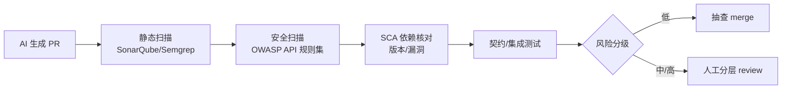

<!--
module:
  parent: ai
  slug: ai/engineering/ai-code-review
  type: article
  category: 主模块子文章
  summary: AI 生成后端代码审核验收方法论 —— 6 层审核体系 + 分级门禁矩阵 + 幻觉专项 + 工具链
-->

# AI 生成后端代码审核验收方法论

> 一句话定位：**AI 负责产出，人负责为风险背书** —— 用分层门禁把"能编译"和"能上线"这两件事分开。

AI Coding 把"写代码"的成本压到接近零，但**审核成本没变**，甚至更高——因为你审的不再是"人写的、逻辑连贯的代码"，而是"AI 生成的、局部正确但可能整体错位的代码"。本文给出一套可落地的验收体系。

← [返回: L3 工程实践](../README.md)

---

## 1. 为什么后端代码需要专门的审核体系

前端代码错了，用户会看到、会反馈、可热修；后端接口代码错了，后果是**不可逆**的三类：

| 出错维度 | 典型后果 | 可逆性 |
|---------|---------|--------|
| **钱** | 超卖、重复扣款、优惠叠加 | ❌ 资损难追回 |
| **数据** | 脏数据入库、批量误删、事务不一致 | ❌ 需回滚/人工修数 |
| **权限** | 越权访问、数据泄露、拖库 | ❌ 一旦泄露不可撤回 |

AI 生成后端代码的**根本矛盾**：AI 按"单请求 / 串行 / happy path"的心智模型生成代码，而后端故障恰恰发生在**并发 / 异常 / 恶意输入**的边界上——**这正是 AI 训练分布里样本最少的地方**。

---

## 2. 6 层审核体系（核心）

按"离故障有多近"从外到内分 6 层。每层给出**必查清单**。

### 2.1 第 ① 层：接口契约

| 检查项 | 反例 | 正例 |
|--------|------|------|
| 参数校验 | 直接信任入参 | `@Valid` + 边界（负数/超长/空） |
| 幂等 | 回调/提交无幂等键 | 幂等键 + 状态机 + 去重表 |
| 鉴权 | 只判"登录了" | 垂直（角色）+ 水平（数据归属） |
| 返回结构 | 直接抛异常栈 | 统一错误码 + 分页元信息 |

### 2.2 第 ② 层：业务正确性（AI 重灾区）

- **事务边界**：跨方法调用是否在同一事务？补偿逻辑是否存在？
- **并发**：扣库存/扣余额是否有乐观锁/行锁？"查-改-写"是否原子？
- **状态机**：订单/支付状态流转是否校验前置状态？能否逆向？
- **边界**：空集合、0、null、超大批量的处理。

```java
// ❌ AI 典型产出：查了再改，并发下丢更新
Account acc = accountMapper.findById(id);
acc.setBalance(acc.getBalance() - amount);
accountMapper.update(acc);

// ✅ 原子扣减 + 余额兜底
int ok = accountMapper.deductIfEnough(id, amount); // UPDATE ... WHERE balance >= amount
if (ok == 0) throw new BizException("余额不足");
```

### 2.3 第 ③ 层：安全（AI 极高漏检率）

对照 **OWASP API Security Top 10** 重点查：

- **BOLA / 水平越权（IDOR）**：AI 几乎从不加"这条数据是不是你的"过滤。所有 `findById(id)` 都要问：id 来自前端时，是否带上了 `userId` 维度？
- **注入**：动态排序、动态条件拼接字符串 → 白名单 + 参数化。
- **鉴权缺失**：AI 生成的新接口常忘记加权限注解。
- **敏感信息泄露**：返回体是否带了密码 hash、内部 id、堆栈。

### 2.4 第 ④ 层：性能

- **N+1**：循环里查库？→ 批量查 / JOIN。
- **索引**：新查询条件是否命中索引？AI 不知道你的索引设计。
- **大事务 / 全表**：无分页的 `findAll`、事务里嵌 RPC。
- **缓存**：击穿 / 穿透 / 雪崩的防护是否被 AI 省略。

### 2.5 第 ⑤ 层：可测试性与可维护性

- **真断言 vs 假测试**：AI 写的测试是否只断言了 `status == 200`，而没验业务结果？
- **异常处理**：是否吞异常（`catch (Exception e) {}`）？
- **日志**：关键分支是否可追溯？是否打印了敏感信息？

### 2.6 第 ⑥ 层：AI 幻觉专项

见 §4。

---

## 3. 分级门禁矩阵

不是所有接口用同一把尺子。**按风险等级配门禁**，把有限的人审预算花在刀刃上：

| 风险级 | 接口类型 | 机器门禁 | 人审要求 | AI 可否独立完成 |
|--------|---------|---------|---------|----------------|
| 🟢 低 | 内部只读 / 配置读取 | 静态扫描 + AI 测试 | 抽查 | ✅ 可 |
| 🟡 中 | 普通 CRUD 增删改 | + 安全规则集 | 过 ①②③ 层 + 补越权/边界用例 | ⚠️ 需人审 |
| 🔴 高 | 支付 / 资金 / 权限 / 对外 API | + SCA + 契约测试 | **逐行 review** + 安全扫描 | ❌ 禁止 |

**落地物**：把这张矩阵写进 `.claude/rules.md` 或 PR 模板，让 AI 生成时就知道"这类接口不能自己拍板"。

---

## 4. AI 幻觉在后端代码的 5 种典型形态

| 形态 | 例子 | 识别方法 |
|------|------|---------|
| 虚构 API/方法 | 调用不存在的 `repository.findByXxx()` | IDE 报错 / 编译期暴露 |
| 编造依赖版本 | `spring-boot 3.9.0`（不存在） | 对照 Maven Central |
| 幻觉配置项 | 编造 `spring.datasource.magic-pool` | 对照官方文档 |
| 看似合理的错误注释 | 注释说"已加锁"实则没加 | 别信注释，看代码 |
| 过时/危险 API | 用已废弃的加密算法（MD5 存密码） | 安全扫描 + 人工 |

**核心原则**：**编译能过 ≠ 语义正确 ≠ API 存在**。陌生 API 一律回官方文档核对，不要把 AI 的自信当成事实。

---

## 5. 工具链（机器先过，人再审）



| 环节 | 工具 | 挡住什么 |
|------|------|---------|
| 静态扫描 | SonarQube / Semgrep | 注入、空指针、坏味道 |
| 安全扫描 | OWASP 规则集 / Snyk | 越权、鉴权缺失、危险 API |
| 依赖核对 | SCA（Dependabot/OWASP DC） | 编造/带漏洞依赖 |
| 契约测试 | Spring Cloud Contract / Pact | 接口契约破坏 |
| AI Review Agent | Claude Code / CodeRabbit | 初筛，但**不能替代人对高风险背书** |

> 机器门禁挡"机械错误"，人审挡"语义对但业务错"——两者不可互相替代。

---

## 6. 落地流程

1. **生成前**：在 `.claude/rules.md` 写清编码规范、库版本、禁用清单、风险分级（Harness 优先，见 [harness-engineering](../harness-engineering/README.md)）。
2. **生成后**：AI 先跑本地 CI（静态 + 安全 + 测试），红的自己修。
3. **PR 模板**：强制勾选 6 层 checklist + 标注接口风险级。
4. **人审**：按分级矩阵，🔴 高风险逐行 review。
5. **合并后**：度量代码流失率（见 [`ai-code-churn`](../../../13.split-hairs/11.ai/ai-code-churn/README.md)），流失率高 → 回头补 Harness。

---

## 7. 相关章节

- 面试精炼版：[`13.split-hairs/11.ai/ai-code-review`](../../../13.split-hairs/11.ai/ai-code-review/README.md) — 6 层体系 + "绿色测试"陷阱 + 90 秒话术
- 上游：[`harness-engineering`](../harness-engineering/README.md) — 用规范/流程/工具约束 AI 产出（审核的前置）
- 关联：[`claude-code-practices`](../claude-code-practices/README.md) — AI 编码工具链实践
- 度量：[`ai-code-churn`](../../../13.split-hairs/11.ai/ai-code-churn/README.md) — 审核不足 → 代码流失率飙升
- 安全底座：[`05.security`](../../../13.split-hairs/05.security/) — OWASP / 越权 / 注入原理

---

← [返回: L3 工程实践](../README.md)
