<!--
module:
  parent: ai
  slug: ai/ai-platforms
  type: article
  category: 主模块子文章
  summary: AI 编排平台
-->

# AI 编排平台

> 最后更新: 2026-06-14
> ⬅️ [返回工程实践](../README.md) | [Dify](dify.md) | [Coze](coze.md) | [LangGraph](langgraph.md) | [BPMN+AI 融合](../../04-architecture/bpmn-ai-integration.md) | [11 AI 知识体系](../../README.md)

## 🎯 一句话定位

**AI 编排平台 = 把 LLM、工具、知识库、流程组装成可执行 AI 应用的开发平台**——Dify / Coze / LangGraph / n8n 等代表不同抽象层级（低代码 DSL / 字节生态 / 代码优先 / 工作流自动化），本章讲透选型决策与生产级落地。

---
## 引言：架构困境

AI 编排平台 的关键不是'选型'——是**选完之后怎么在 5 个 trade-off 里活下来**。

本篇用'决策困境'切入，比较几种主流路径并讲清取舍。

---

## 📚 章节导航（4 主线 + 4 文件）

| 主线 | 文件 | 核心内容 |
|:----|:----|:---------|
| **0 平台综述** | [README.md](README.md)（本文）| 6 维对比表 + 决策树 + 知识地图 |
| **1 低代码 DSL** | [Dify](dify.md) | LLMOps / Chatflow+Workflow+Agent / DSL YAML / MCP 双向 |
| **2 字节系生态** | [Coze](coze.md) | 表单/工作流双形态 / Agent 联邦 / 飞书/抖音/豆包深绑定 |
| **3 代码优先** | [LangGraph](langgraph.md) | StateGraph / Checkpoint / Time Travel / HITL / Supervisor |
| **4 融合范式** | [BPMN+AI 融合](../../04-architecture/bpmn-ai-integration.md) | 4 模式：fromAi() / Zeebe AI Worker / Engine-as-Tool / HITL |

---

## 🧭 知识地图

```mermaid
graph TB
    A[AI 编排平台]

    A --> L1[低代码 DSL<br/>Dify]
    A --> L2[字节系生态<br/>Coze]
    A --> L3[代码优先<br/>LangGraph]
    A --> L4[工作流自动化<br/>n8n]
    A --> L5[RAG 专注<br/>FastGPT/RAGFlow]
    A --> L6[融合范式<br/>BPMN+AI]

    L1 --> D1[可视化 + DSL YAML]
    L1 --> D2[Chatflow/Workflow/Agent]
    L1 --> D3[MCP 双向 v1.9.2+]

    L2 --> C1[字节系深绑定]
    L2 --> C2[Agent 联邦 3.0]
    L2 --> C3[接入 Claude Code]

    L3 --> G1[StateGraph 显式状态]
    L3 --> G2[Time Travel 调试]
    L3 --> G3[HITL interrupt 函数]

    L4 --> N1[400+ 集成节点]
    L4 --> N2[AI Transform]

    L5 --> F1[知识库管理]
    L5 --> F2[深度文档理解]

    L6 --> FUS1[模式 A fromAi]
    L6 --> FUS2[模式 B Zeebe Worker]
    L6 --> FUS3[模式 C Engine-as-Tool]
    L6 --> FUS4[模式 D HITL]

    classDef root fill:#e3f2fd,stroke:#1976d2,stroke-width:3px
    classDef lowcode fill:#fff3e0,stroke:#f57c00,stroke-width:2px
    classDef ecosystem fill:#f3e5f5,stroke:#7b1fa2,stroke-width:2px
    classDef codefirst fill:#e8f5e9,stroke:#388e3c,stroke-width:2px
    classDef fusion fill:#fce4ec,stroke:#c2185b,stroke-width:2px

    class A root
    class L1,L2,L3,L4,L5 lowcode
    class C1,C2,C3,D1,D2,D3,G1,G2,G3,N1,N2,F1,F2 ecosystem
    class FUS1,FUS2,FUS3,FUS4,FUS1 fusion
```



---

## ⚡ 6 大平台对比矩阵

| 维度 | **Dify** | **Coze** | **LangGraph** | **n8n** | **FastGPT** | **RAGFlow** |
|------|---------|---------|--------------|---------|-------------|-------------|
| **形态** | 低代码 + DSL YAML | 表单 + 工作流 | Python 代码 | 工作流自动化 | 知识库 + Flow | RAG 引擎 |
| **开源** | ✅ AGPL | ❌ 闭源 | ✅ MIT | ✅ Fair-code | ✅ MIT | ✅ Apache |
| **国内生态** | ⭐⭐⭐⭐ | ⭐⭐⭐⭐⭐ | ⭐⭐⭐ | ⭐⭐⭐ | ⭐⭐⭐ | ⭐⭐ |
| **国际化** | ⭐⭐⭐⭐ | ⭐⭐⭐ | ⭐⭐⭐⭐ | ⭐⭐⭐⭐⭐ | ⭐⭐⭐ | ⭐⭐ |
| **DAG 工作流** | ✅ 强 | ✅ 中 | ✅ 显式图 | ✅ 极强 | ✅ 中 | ⚠️ RAG 为主 |
| **RAG 能力** | ✅ 完整管道 | ⚠️ 知识库 | ⚠️ 需组装 | ⚠️ 集成 | ✅ 强 | ✅ 极强 |
| **私有化** | ✅ AGPL 免费 | ⚠️ 企业版贵 | ✅ 自部署 | ✅ 自部署 | ✅ 自部署 | ✅ 自部署 |
| **MCP** | ✅ v1.9.2+ | ✅ 双向 | ✅ 1.0+ | ⚠️ 部分 | ❌ | ❌ |
| **学习曲线** | 1 天 | 0.5 天 | 1-2 周 | 1 周 | 1-2 天 | 1-3 天 |
| **生产部署** | 1-3 天 | 1 天（云）| 1-2 周 | 1-3 天 | 1-3 天 | 3-7 天 |
| **企业级治理** | ⚠️ 中 | ⚠️ 中 | ⚠️ 中 | ⚠️ 中 | ⚠️ 中 | ⚠️ 中 |
| **代表场景** | 客服 + RAG 标准化 | 字节生态 C 端 | 复杂 Agent | 系统集成自动化 | 知识库问答 | 深度文档理解 |

---

## 📋 决策树

```
Q1: 项目首要目标？
├── 快速上线 MVP + 国内 C 端 + 字节生态 → Coze
├── 标准化 RAG/Chatbot + 私有化 + DSL 入 Git → Dify
├── 复杂 Agent + 状态可回放 + 代码优先 → LangGraph
├── 系统集成 / 跨 SaaS 自动化 → n8n
├── 知识库 + 文档问答为主 → FastGPT / RAGFlow
└── 强治理 / 合规审计 / 需嵌入 BPMN 流程 → BPMN+AI 融合

Q2: 团队技术栈？
├── 产品/运营为主，无工程师 → Coze（最易用）
├── 全栈/前端，Python 弱 → Dify（低代码）
├── Python 强 / 算法 → LangGraph
└── DevOps/集成 → n8n

Q3: 部署模式？
├── 完全云托管 → Coze（字节云）+ Dify Cloud
├── 私有化 + 国产化 → Dify AGPL
├── 自部署 + 高可控 → LangGraph + 自建
└── 混合云 → 全部都支持

Q4: 是否需要 BPMN 合规？
├── 需要（金融/医疗/政务）→ BPMN+AI 融合（Camunda 8.5+）
└── 不需要 → 任选 AI 平台
```

---

## 🧩 核心概念速查

| 概念 | 一句话定义 | 章节 |
|------|----------|:----:|
| **LLMOps** | LLM 应用全生命周期管理（Prompt/版本/Token 成本/可观测） | [Dify](dify.md) |
| **Chatflow** | Dify 对话流应用模式（有上下文多轮对话）| [Dify](dify.md) |
| **Workflow** | Dify 自动化流应用模式（单次执行）| [Dify](dify.md) |
| **Agent 联邦** | Coze 3.0 的 Master + 专家 Agent 协作模式 | [Coze](coze.md) |
| **StateGraph** | LangGraph 的显式状态机抽象 | [LangGraph](langgraph.md) |
| **Checkpoint** | LangGraph 的状态持久化机制 | [LangGraph](langgraph.md) |
| **Time Travel** | LangGraph 的历史状态回放能力 | [LangGraph](langgraph.md) |
| **HITL** | Human-in-the-Loop，人在回路审核 | [LangGraph](langgraph.md) |
| **MCP** | Model Context Protocol，LLM 工具调用协议标准 | [Dify](dify.md) |
| **DSL YAML** | Dify 工作流的可版本控制定义格式 | [Dify](dify.md) |
| **RAG** | Retrieval-Augmented Generation，检索增强生成 | [Dify](dify.md) / [BPMN+AI](../../04-architecture/bpmn-ai-integration.md) |
| **AI Agent Sub-process** | Camunda 8.5+ 的原生 AI 节点图元 | [BPMN+AI](../../04-architecture/bpmn-ai-integration.md) |
| **fromAi()** | Camunda 8.5+ 的 FEEL 函数，调用 LLM | [BPMN+AI](../../04-architecture/bpmn-ai-integration.md) |
| **Zeebe AI Worker** | 自研 Job Worker 包装 LLM/Agent 框架 | [BPMN+AI](../../04-architecture/bpmn-ai-integration.md) |

---

## 🤔 思考

1. **AI 编排平台会取代 BPMN 引擎吗？** 不会。两者解决不同问题——AI 平台强在**灵活推理 + 快速试错**；BPMN 强在**确定性 + 合规审计**。生产级落地常**组合使用**（见 [BPMN+AI 融合](../../04-architecture/bpmn-ai-integration.md) 4 模式）。
2. **Dify vs Coze 选哪个？** **Dify** 适合"工程化 + 私有化 + DSL 入 Git"；**Coze** 适合"字节生态 + C 端分发 + 快速跑通"。一个面向 DevOps，一个面向业务运营。
3. **LangGraph 适合所有 Agent 场景吗？** 不。**单轮对话 / 标准化 RAG** 用 Dify 更划算；**多步推理 / 长期状态 / 可重放**用 LangGraph。两者可通过 **MCP 互通**。
4. **n8n 是 AI 平台吗？** 本质是**工作流自动化工具**（400+ 集成节点），AI Transform Node 让它"能跑 AI"。适合"系统集成 + 轻量 AI"场景，不适合复杂 Agent。
5. **MCP 协议有什么价值？** MCP 让**LLM 工具调用协议标准化**——Dify / Coze / Claude Code / Cursor 互通。一个平台写的工具，所有平台都能用，**避免厂商锁定**。
6. **AI 平台私有化最痛的是什么？** 三个：**LLM 模型私有化**（Qwen/DeepSeek/GLM 适配）、**向量库私有化**（Qdrant/Milvus 自部署）、**可观测性私有化**（LangSmith 自托管或 Helicone）。多数项目卡在第二步。
7. **如何选择第一平台？** **80% 场景选 Dify**（平衡最好）+ 20% 复杂场景用 LangGraph；**C 端分发选 Coze**；**强治理叠加 Camunda 8 AI**。避免一上来就上 LangGraph 写代码（成本高 + 难招聘）。

---

## 相关章节

- ⬅️ [返回工程实践](../README.md) — 章节根目录
- [11 AI 知识体系](../../README.md) — 章节根目录
- [Dify](dify.md) — 低代码 DSL 优先 + 私有化首选
- [Coze](coze.md) — 字节系国内最强生态
- [LangGraph](langgraph.md) — 代码优先复杂 Agent 框架
- [BPMN+AI 融合](../../04-architecture/bpmn-ai-integration.md) — 4 模式生产级落地
- [07 工作流/微服务编排](../../../07.workflow/workflow-and-microservice-orchestration/README.md) — 流程引擎在分布式场景的演化
- [09.front-end / 09 前端与 AI](../../../09.front-end/09-frontend-and-ai/README.md) — AI SDK / AI Native UI / Vibe Coding：AI 平台的前端落地形态
