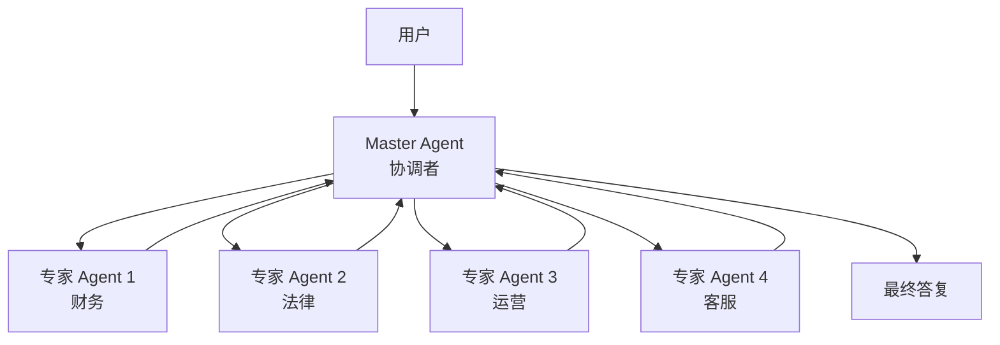
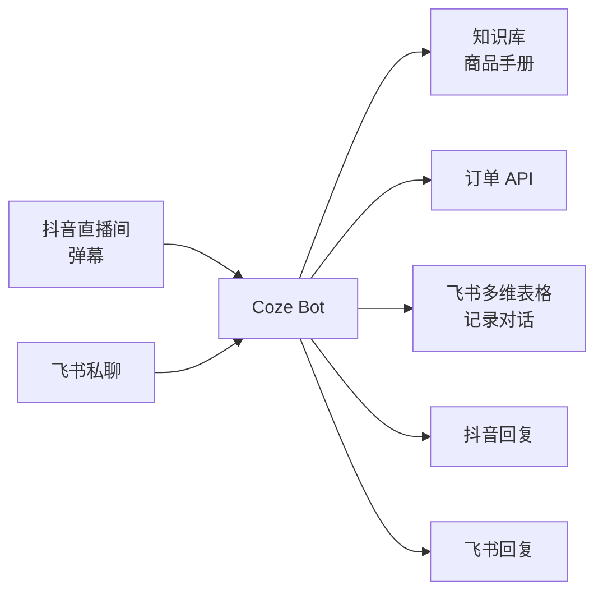

# Coze（扣子）

> 最后更新: 2026-06-14
> ⬅️ [返回 AI 平台](README.md) | [Dify](dify.md) | [LangGraph](langgraph.md) | [AI + BPMN 融合](bpmn-ai-integration.md) | [11 AI 知识体系](../README.md)

## 🎯 一句话定位

**Coze（扣子）= 字节系 AI Agent 平台 + 表单/工作流双形态 + 飞书/抖音/豆包生态深绑定 + Agent 联邦**——2026 年国内 C 端 + 字节生态最强的低代码 AI 编排平台。

---

## 一、解决什么问题？

| 痛点 | Coze 解法 |
|------|----------|
| **不会写代码** | 全可视化 + 表单 + 工作流拖拽 |
| **不知道用什么 LLM** | 内置豆包 / DeepSeek / 通义千问 / GPT / Claude + 一键切换 |
| **想接抖音/飞书/豆包** | 原生集成（10+ 字节系产品）|
| **Agent 不会写代码** | 官方插件市场（2000+ 插件）+ 私有插件 |
| **个人开发者无算力** | 字节云免费额度 + 弹性扩容 |
| **Agent 难以持续运行** | 长连接 + 状态保持 + 多轮对话 |

---

## 二、Coze 3.0（2026）核心新特性

### 2.1 Agent 联邦（Agent Federation）

**关键能力**：

- Master Agent 自动将复杂任务分发给专家 Agent
- 专家 Agent 可**独立发布到商店**被其他 Master 调用
- 跨 Agent 通信协议标准化

### 2.2 接入主流 CLI / IDE

**Coze 3.0 起接入**：

- **Claude Code**（Anthropic 官方 CLI）—— Coze Agent 可作为 Claude Code 工具
- **Codex CLI**（OpenAI 官方）—— Coze 可消费 Codex 的代码生成
- **OpenClaw**（字节开源）—— Coze 平台原生 CLI

### 2.3 字节系生态深绑定

| 集成 | 场景 |
|------|------|
| **飞书** | 多维表格 / 文档 / 视频会议机器人 / 审批 / 日历 |
| **抖音 / 抖音电商** | 直播弹幕回复 / 短视频脚本生成 / 商品推荐 |
| **豆包** | 豆包 App 插件 / 语音对话 / 智能体联动 |
| **巨量引擎** | 广告投放自动化 / 数据分析 |
| **即梦 AI** | 文生图 / 文生视频 / Agent 调用 |

---

## 三、核心组件

### 3.1 智能体（Bot）

- **人设与回复逻辑**：自然语言定义 Agent 行为
- **技能（Skills）**：插件 + 工作流 + 知识库 + 数据库
- **记忆（Memory）**：长期 + 短期
- **触发器（Trigger）**：Webhook / 定时 / 事件

### 3.2 工作流

- 节点：LLM / 插件 / 代码 / 条件 / 循环 / 知识库 / HTTP
- 触发：手动 / Webhook / 定时 / 飞书消息 / 抖音评论
- 输出：文本 / 文件 / 飞书卡片 / 邮件 / API 回调

### 3.3 插件

- **官方插件市场**：搜索 / 计算 / 天气 / 翻译 / 数据库 / GitHub / Notion 等 2000+
- **私有插件**：通过 OpenAPI 一键生成
- **插件调用链**：支持多插件组合

### 3.4 知识库

- **格式**：PDF / Word / Excel / Markdown / 网页 / 飞书文档
- **分段**：自动 + 自定义
- **检索**：向量 + 关键词 + ReRank

---

## 四、Coze vs Dify 6 维对比

| 维度 | **Coze（扣子）** | **Dify** |
|------|----------------|----------|
| **开源** | ❌ 闭源（国内 + 国际双版本）| ✅ AGPL 自托管 |
| **国内生态** | ⭐⭐⭐⭐⭐（字节系）| ⭐⭐⭐ |
| **国际化** | ⭐⭐⭐（Coze.com）| ⭐⭐⭐⭐（多语言文档 + 社区）|
| **DAG 工作流** | ✅（更偏表单）| ✅（DSL YAML 入 Git）|
| **Agent 联邦** | ✅ 官方支持 | ⚠️ 需自组装 |
| **企业版 / 私有化** | ⚠️ 商业版（价格较高）| ✅ AGPL 免费 + 商业版双轨 |

**选型口诀**：

- **字节生态深耕 / 国内 C 端** → Coze
- **私有化 + 国际化 + DSL 入 Git** → Dify
- **Agent 联邦 / 多 Agent 协作** → Coze 3.0+
- **复杂推理 + 代码优先** → LangGraph

---

## 五、典型用例

### 5.1 电商客服（飞书 + 抖音 + 抖音电商）

### 5.2 短视频运营

- 触发：新视频发布
- 流程：抓取评论 → LLM 分类（好评/差评/咨询）→ 好评自动感谢 → 差评通知客服 → 咨询自动回复
- 输出：飞书卡片 / 抖音私信

### 5.3 飞书办公助手

- 触发：@机器人 消息
- 流程：理解需求 → 调用飞书日历 / 多维表格 / 文档 / 审批 → 汇总结果
- 输出：飞书消息卡片

### 5.4 个人助手（豆包 / 抖音）

- 跨端同步：豆包 App / 抖音 / 网页
- 长期记忆：用户偏好、历史对话
- 主动推送：定时 + 事件触发

---

## 六、Coze 3.0 vs Coze 2.0 升级点

| 维度 | **Coze 2.0** | **Coze 3.0（2026）** |
|------|-------------|---------------------|
| **Agent 协作** | 单 Agent + 插件 | Agent 联邦（Master + 专家）|
| **CLI 接入** | ❌ | ✅ Claude Code / Codex / OpenClaw |
| **MCP** | ⚠️ 部分支持 | ✅ 双向 |
| **长连接** | ❌ Webhook 模式 | ✅ WebSocket 长连接 |
| **插件数量** | 1000+ | 2000+ |
| **LLM 选项** | 豆包 / GPT | 豆包 / DeepSeek / Qwen / GPT / Claude |

---

## 七、定价与商业化

| 方案 | 价格 | 适用 |
|------|------|------|
| **个人版** | 免费（有限 Token）| 个人 / 学习 |
| **专业版** | 99 元/月 | 独立开发者 |
| **团队版** | 699 元/月（10 人）| 中小团队 |
| **企业版** | 询价 | 大型企业 / 私有化 |

**字节云抵扣**：发布到商店的 Bot 被调用时，按 Token 消耗抵扣费用（C 端分发能力变现）。

---

## 🤔 思考

1. **Coze vs Dify 最大的区别？** Coze 走"**Agent 商店 + 生态分发**"路线（字节系 C 端流量入口），Dify 走"**DSL + 自托管 + 工程化**"路线（DevOps 友好）。前者适合"先跑起来再优化"，后者适合"先工程化再上线"。
2. **Coze 闭源是不是缺点？** 对**个人 / 业务团队**不是（功能完整 + 字节云托管）；对**大企业**是（数据合规 + 定制化受限，需走企业版）。
3. **Agent 联邦真的实用吗？** 适合**多领域复杂任务**（财务 + 法律 + 运营），但对**单领域 Agent** 反而是过度设计。多数项目 Master + 2-3 个专家 Agent 即可。
4. **Coze Bot 能直接部署到客户系统吗？** 2026 起支持 API 化调用 + 私有插件；但**完整私有化部署**仍需企业版，**与 Dify 自托管在合规上仍有差距**。
5. **Coze 接入 Claude Code 的意义？** Coze 提供**低代码 Agent 编排** + 字节生态，Claude Code 提供**代码生成能力**——两者通过 CLI/MCP 互为工具，对个人开发者是巨大赋能。

---

## 相关章节

- ⬅️ [返回 AI 平台](README.md) — 6 大平台对比与决策树
- [11 AI 知识体系](../README.md) — 章节根目录
- [Dify](dify.md) — DSL 入 Git + 私有化首选
- [LangGraph](langgraph.md) — 代码优先复杂 Agent 框架
- [AI + BPMN 融合](bpmn-ai-integration.md) — Coze + Camunda 8 混合架构（适合国内企业落地）
