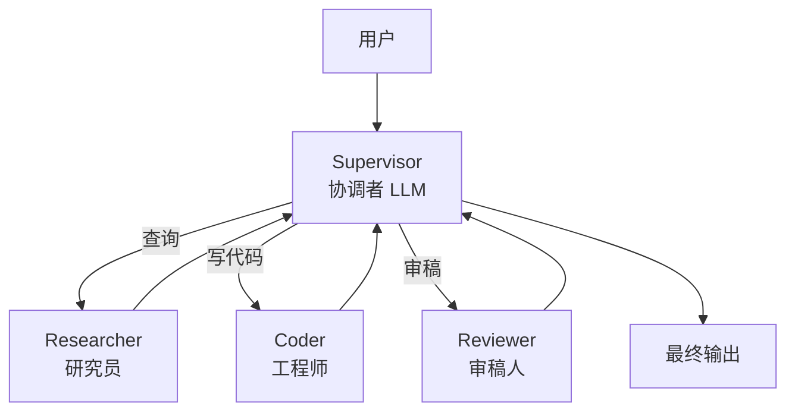

# LangGraph

> ⬅️ [返回 AI 平台](README.md) | [Dify](dify.md) | [Coze](coze.md) | [BPMN+AI 融合](../../04-architecture/bpmn-ai-integration.md) | [11 AI 知识体系](../README.md)

## 🎯 一句话定位

**LangGraph = LangChain 团队出品的代码优先 Agent 框架 + StateGraph + Checkpoint + Time Travel + HITL**——2026 年工业界最主流的复杂 Agent 编排框架，杀手锏是**状态可回放**与**人在回路**。

---

## 一、解决什么问题？

| 痛点 | LangGraph 解法 |
|------|---------------|
| **多 Agent 状态混乱** | 显式 `StateGraph` + 类型化状态（TypedDict / Pydantic）|
| **长流程不可重放** | `Checkpointer`（Memory / SQLite / Postgres）|
| **出错无法回到某一步** | `Time Travel` —— 历史状态可回放 |
| **LLM 输出需人工审核** | `interrupt()` 函数 —— 原生 HITL |
| **多 Agent 协作无标准** | `Supervisor` / `Swarm` 官方模式 |
| **多步推理调试难** | LangSmith 集成（Trace / Span / Token）|

---

## 二、核心概念

### 2.1 StateGraph 状态机

```python
from langgraph.graph import StateGraph, START, END
from typing import TypedDict

class AgentState(TypedDict):
    query: str
    context: list[str]
    answer: str
    step: int

def retrieve(state: AgentState) -> AgentState:
    """RAG 检索节点"""
    docs = vector_db.search(state["query"], top_k=5)
    return {"context": docs, "step": state["step"] + 1}

def generate(state: AgentState) -> AgentState:
    """LLM 答案生成节点"""
    answer = llm.invoke(
        f"基于上下文回答：{state['context']}\n问题：{state['query']}"
    )
    return {"answer": answer, "step": state["step"] + 1}

def should_continue(state: AgentState) -> str:
    """条件边"""
    if state["step"] >= 3 or state["answer"]:
        return END
    return "retrieve"

# 构建图
graph = StateGraph(AgentState)
graph.add_node("retrieve", retrieve)
graph.add_node("generate", generate)
graph.add_edge(START, "retrieve")
graph.add_edge("retrieve", "generate")
graph.add_conditional_edges("generate", should_continue)
app = graph.compile()
```

**核心抽象**：

- **State（状态）**：TypedDict / Pydantic 模型，所有节点共享
- **Node（节点）**：Python 函数，输入 state 返回新 state
- **Edge（边）**：连接节点的执行顺序
- **Conditional Edge（条件边）**：根据 state 决定下一个节点
- **START / END**：图入口和出口

### 2.2 Checkpoint 持久化

```python
from langgraph.checkpoint.sqlite import SqliteSaver

memory = SqliteSaver.from_conn_string("./checkpoints.db")
app = graph.compile(checkpointer=memory)

# 执行时指定 thread_id，会自动持久化每一步状态
config = {"configurable": {"thread_id": "user-123"}}
result = app.invoke({"query": "..."}, config=config)
```

**支持的 Checkpointer**：

- `MemorySaver`（开发用）
- `SqliteSaver` / `PostgresSaver`（生产用）
- `RedisSaver`（高吞吐）

### 2.3 Time Travel 时间旅行

```python
# 获取历史状态
history = app.get_state_history(config)
for state in history:
    print(f"Step {state.values['step']}: {state.values['answer']}")

# 回到第 2 步，从那里重新执行
app.update_state(config, values={"answer": ""}, as_node="generate")
result = app.invoke(None, config=config)
```

**价值**：

- **调试**：把任意中间状态导出分析
- **回滚**：用户不满意答案时回退到指定步骤
- **A/B 测试**：同一状态尝试不同 prompt

### 2.4 HITL 人在回路

```python
from langgraph.graph import StateGraph
from langgraph.checkpoint.memory import MemorySaver
from langgraph.types import interrupt, Command

def human_review(state: AgentState) -> AgentState:
    """暂停并等待人工审核"""
    answer = state["answer"]
    # interrupt() 暂停图执行，前端拿到 state 后人工确认
    user_decision = interrupt({
        "question": "是否批准这个答案？",
        "answer": answer
    })
    if user_decision == "approve":
        return state
    else:
        return {"answer": "已驳回，请重新生成"}

# 前端用 Command 恢复执行
app.invoke(Command(resume="approve"), config=config)
```

**典型场景**：

- AI 客服生成回答 → 主管人工审核 → 通过/驳回
- 财务 Agent 生成报销单 → 财务人员确认
- 代码生成 → 开发者 Code Review

---

## 三、多 Agent 编排模式

### 3.1 Supervisor 监督者模式



```python
from langgraph.prebuilt import create_supervisor

members = ["researcher", "coder", "reviewer"]
system_prompt = (
    "你是监督者，管理以下专家：{members}。"
    "根据用户需求分配任务给合适的专家。"
)
supervisor = create_supervisor(
    agents,  # 3 个专家 Agent
    model=llm,
    prompt=system_prompt
)
app = supervisor.compile()
```

### 3.2 Swarm 蜂群模式

无中心监督者，Agent 通过**共享消息队列**自主决定下一步：

```python
from langgraph.swarm import create_swarm

agents = [agent_a, agent_b, agent_c]
swarm = create_swarm(agents, default_active_agent="agent_a")
app = swarm.compile()
```

**适用**：

- **Supervisor**：任务明确分层（"先研究再编码"）
- **Swarm**：Agent 平等协作（"自由讨论"）

---

## 四、LangGraph vs CrewAI / AutoGen 5 维对比

| 维度 | **LangGraph** | **CrewAI** | **AutoGen（微软）** |
|------|--------------|-----------|---------------------|
| **生态** | LangChain（最丰富）| 独立框架 | 微软 Research |
| **状态管理** | ✅ StateGraph + Checkpoint | ⚠️ 任务列表 | ⚠️ 对话历史 |
| **Time Travel** | ✅ 原生 | ❌ | ❌ |
| **HITL** | ✅ `interrupt()` | ⚠️ 需自定义 | ✅ HumanInput |
| **代码风格** | 显式图（透明可调试）| 角色化（直觉）| 对话式（灵活）|

**选型建议**：

- **生产级复杂 Agent** → **LangGraph**（可观测 + 可重放）
- **角色化多 Agent / 顾问项目** → **CrewAI**
- **对话式多 Agent 探索** → **AutoGen**

---

## 五、LangGraph vs Dify（代码 vs 低代码）

| 维度 | **LangGraph** | **Dify** |
|------|--------------|----------|
| **形态** | Python 代码 | DSL YAML + 可视化 |
| **上手** | 1-2 周 | 1 天 |
| **可定制** | 极高（任何 Python 库）| 中（节点类型约束）|
| **状态管理** | 显式 TypedDict | 隐式变量 |
| **可观测** | LangSmith（需接入）| 内置 UI |
| **生产部署** | 1-2 周（工程化）| 1-3 天（开箱即用）|
| **适合** | 复杂 Agent / 多步推理 | 标准化 RAG / Chatbot |

**混合架构**：Dify 跑 80% 标准化，LangGraph 跑 20% 复杂推理，通过 **MCP / API 互通**。

---

## 六、典型用例

| 场景 | 关键能力 |
|------|----------|
| **RAG 研究助手** | Multi-step Retrieve + ReRank + Generate |
| **多 Agent 团队** | Supervisor + Researcher + Coder + Reviewer |
| **长流程 Agent** | Checkpointer + 跨 session 状态保持 |
| **人在回路审批** | `interrupt()` + 前端审核界面 |
| **A/B 测试** | Time Travel + 同一状态不同 prompt |
| **代码生成 + Review** | LLM 生成 → 人工 Review → LLM 重构 |

---

## 七、2025-2026 重要更新

| 版本 | 特性 |
|------|------|
| **0.1.x（2024-Q4）** | 基础 StateGraph + Checkpointer |
| **0.2.x（2025-Q1）** | Time Travel 稳定 + LangSmith 集成 |
| **0.3.x（2025-Q3）** | `interrupt()` HITL 完善 + Swarm 模式 |
| **1.0.x（2026-Q1）** | API 稳定 + 多模态原生 + MCP 双向 |

---

## 🤔 思考

1. **LangGraph 比 LangChain 好在哪？** LangChain 是 LLM 工具链的**乐高积木**（Prompt / Chain / Retriever / Memory 各种组件），但**没有流程控制**；LangGraph 提供**显式状态机**，把 LangChain 组件组织成可调试的执行图。**新项目直接用 LangGraph 即可**。
2. **StateGraph 是不是过度设计？** 对**单轮对话**是的；对**多步推理 / 长期状态 / 可重放**——它是**唯一成熟方案**。Checkpointer + Time Travel 是杀手锏。
3. **HITL 的关键不是技术是 UX？** 对。`interrupt()` API 简单，难的是**前端审核界面**——需要把 state 渲染成可读 UI、把人工决策通过 `Command` 传回图执行。多数项目 UI 工作量 > 后端。
4. **Supervisor vs Swarm 选哪个？** 90% 用 **Supervisor**（中心化决策更可控）；**Swarm** 适合"开放式讨论"（创意发散、多方案对比），但**调试难度指数级上升**。
5. **LangGraph 会被 BPMN 取代吗？** 不会。两者解决不同问题——LangGraph 服务于"快速试错 + 复杂推理"；BPMN 服务于"确定性 + 合规审计"。**生产中常组合**（详见 [BPMN+AI 融合](../../04-architecture/bpmn-ai-integration.md)）。

---

## 相关章节

- ⬅️ [返回 AI 平台](README.md) — 6 大平台对比与决策树
- [11 AI 知识体系](../README.md) — 章节根目录
- [Dify](dify.md) — 低代码 DSL 优先
- [Coze](coze.md) — 字节系 Agent 平台
- [BPMN+AI 融合](../../04-architecture/bpmn-ai-integration.md) — LangGraph + Camunda 8 混合架构（生产级落地）
