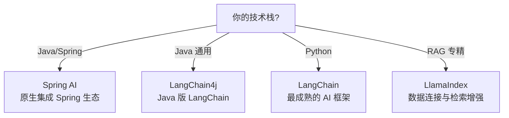

# AI 框架选型

## 引言：架构困境

AI 框架选型 的关键不是'选型'——是**选完之后怎么在 5 个 trade-off 里活下来**。

本篇用'决策困境'切入，比较几种主流路径并讲清取舍。

---

← 返回 [工程实践](../README.md)

## 子目录

| 目录 | 内容 |
|------|------|
| [deep-learning](deep-learning/) | 深度学习框架 — PyTorch / TensorFlow / MindSpore / PaddlePaddle 对比与选型 |
| [llm-app](llm-app/) | 大模型应用开发框架 — LangChain / LangChain4j / Spring AI / LlamaIndex 对比与选型 |

## 选型指南

## 相关章节

- 父级：[L3 工程实践](../README.md) — 框架 / 计算平台 / 本地部署 / AI 平台
- 关联：[11.ai/training Spring AI Agent 实战](../../training/README.md) — 16 课 Spring AI 实战课程
- 关联：[06.spring](../../../06.spring/) — Spring 全家桶（Spring AI 的底层生态）
