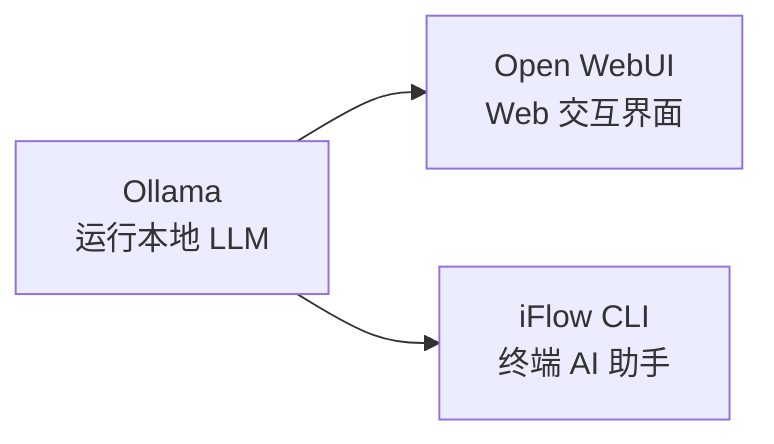

# 本地部署

## 引言：反直觉代码（[AUTO] 自动生成，待人工 review）

本地部署 本应该很简单，← 返回 [工程实践](../README.md)

**但实际**：面试/生产中常被问起或踩坑的是——
代码看着对、跑起来对，但仔细一问深一层就漏馅。本篇就从'反直觉'这个角度切入，把踩坑点和根因摆出来。

> 📌 本段由 `note/scripts/add-intro.py` 自动生成（场景模板 + README 摘录）。**下次 review 时请改为真实场景 + 数字 + 反思**，目前仅满足'有引言'的最低要求。

---

← 返回 [工程实践](../README.md)

## 子目录

| 目录 | 内容 |
|------|------|
| [ollama](ollama/) | Ollama — 本地 LLM 运行管理工具（含 [Linux 部署方案](ollama/linux-deploy/)） |
| [open-webui](open-webui/) | Open WebUI — 开源自托管 AI 交互平台，兼容 Ollama / OpenAI API |
| [iflow-cli](iflow-cli/) | iFlow CLI — 终端 AI 助手，集成免费模型，支持代码分析与自动化 |

## 快速上手

## 相关章节

- 父级：[L3 工程实践](../README.md) — 框架 / 计算平台 / 本地部署 / AI 平台
- 关联：[05.tools Docker](../../../05.tools/docker/) — 容器化部署基础
- 关联：[11.ai/training](../../training/README.md) — Spring AI Agent 16 课实战
