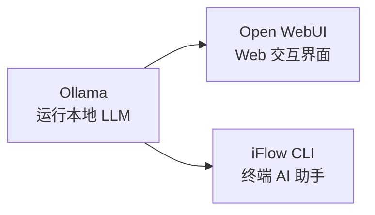

<!--
module:
  parent: ai
  slug: ai/local-deployment
  type: article
  category: 主模块子文章
  summary: 本地部署
-->

# 本地部署

## 引言：反直觉代码

本地部署 的关键不是语法——是**看起来对**的代码背后那些'踩坑点'。

本篇用 3 个反直觉片段切入，把面试/生产中常被问起、但一深入就漏馅的点摆出来。

---

← 返回 [工程实践](../README.md)

## 子目录

| 目录 | 内容 |
|------|------|
| [ollama](ollama/) | Ollama — 本地 LLM 运行管理工具（含 [Linux 部署方案](ollama/linux-deploy/)） |
| [open-webui](open-webui/) | Open WebUI — 开源自托管 AI 交互平台，兼容 Ollama / OpenAI API |
| [iflow-cli](iflow-cli/) | iFlow CLI — 终端 AI 助手，集成免费模型，支持代码分析与自动化 |

## 快速上手

## 相关章节

- 父级：[L3 工程实践](../README.md) — 框架 / 计算平台 / 本地部署 / AI 平台
- 关联：[05.tools Docker](../../../05.tools/02-docker/) — 容器化部署基础
- 关联：[11.ai/training](../../training/README.md) — Spring AI Agent 16 课实战
