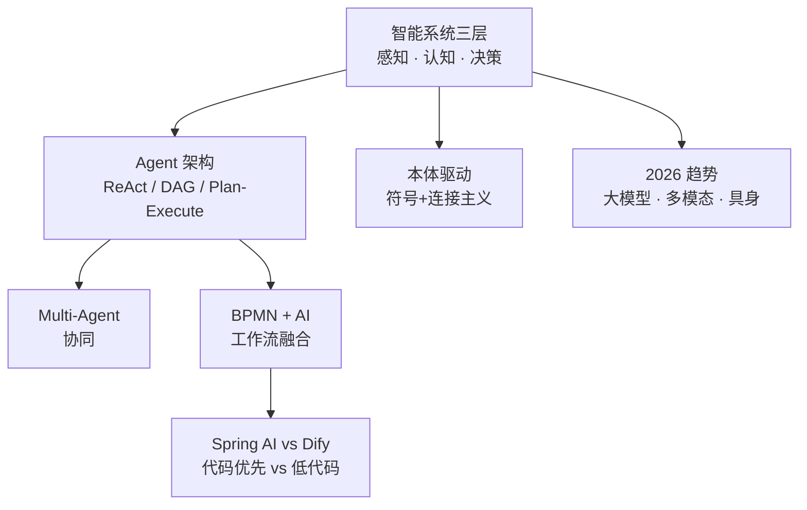

<!--
module:
  parent: ai
  slug: ai/architecture
  type: index
  category: 主模块子文章
  summary: AI 架构设计
-->

# L4 架构设计

> 从智能系统分层到技术趋势，系统级架构设计参考。

## 1. 目录导航

| 目录 / 文件 | 核心内容 | 一句话定位 |
|------------|---------|-----------|
| [intelligent-system-layers](intelligent-system-layers/) | 智能系统三层架构 — 感知与数据层 / 认知与模型层 / 决策与执行层 · AI 技术栈分层架构全景 | 系统分层方法论 |
| [agent-architecture](agent-architecture/) | **Agent 架构设计** — ReAct / DAG / Plan-and-Execute / Multi-Agent 4 大架构对比 + 选型决策树 + 真实案例 | Agent 架构选型 |
| [agent-execution-patterns](agent-execution-patterns/) 🆕 | **Agent 4 大执行模式深度** — ReAct / Plan-and-Execute / DAG / Multi-Agent 6 维对比 + 3 大重规划机制 + 5 分钟决策树 | 执行模式深度 |
| 🆕 [routing-architecture](routing-architecture/) | **分层路由架构** — 简单问答 Fast Path + 复杂 Agent Path 统一入口 · 3 级复杂度分类器 · 升级/降级机制 · 可观测性 | 请求入口路由 |
| [agent-memory](agent-memory/) | **Agent Memory 架构** — 时间 × 认知 × 工程三维分类 + 4 类业界框架 + 写读忘设计原则 | Agent 记忆体系 |
| [agent-context](agent-context/) 🆕 | **Agent 长上下文架构** — 6 大策略组合（Chunking / RAG / Memory / Sliding Window / Sub-Agents / Long-Context）+ 决策树 + 反模式 + 7 道面试题 | 长上下文选型 |
| [ontology-driven-agent](ontology-driven-agent/) | **本体驱动的智能体** — 让 AI 从"黑箱推理"走向"结构化认知"，融合符号主义与连接主义，构建可信可审计可演化的 AI 系统 | 可信 AI 范式 |
| [2026-trends](2026-trends/) | 2026 AI 技术矩阵 — 大模型 / 多模态 / 具身智能 三位一体趋势 | 前沿趋势速览 |
| [llm-control-evolution](llm-control-evolution/) 🆕 | **LLM 驾驭演进史** — Prompt → Context → Harness → Loop 4 阶段叙事 + 升级决策树 + 反模式 | 驾驭范式演进 |
| [bpmn-ai-integration.md](bpmn-ai-integration.md) | **AI + BPMN 融合** — 业务流程引擎与 AI Agent 集成（单文件） | 工作流引擎融合 |
| [spring-ai-vs-dify.md](spring-ai-vs-dify.md) | **Spring AI vs Dify** — Java 代码优先 vs 低代码平台的 7 维度决策 + 代码示例 + 混合架构（单文件） | 抽象层级选型 |

### 1.1 学习路径

架构设计承上启下：先理解 [技术栈](../02-technology-stack/) 各层组件，再看 [工程实践](../03-engineering/) 如何落地，最后用本模块的全局视角做系统设计。

---

## 2. 知识脉络

---

## 3. 速查表

| 概念 | 核心要点 | 典型场景 |
|------|---------|---------|
| **智能系统三层** | 感知层（数据采集）/ 认知层（模型推理）/ 决策层（行动执行） | 通用 AI 系统分层 |
| **ReAct** | Reason + Act 循环，单 Agent 探索 | 开放性任务 |
| **DAG** | 有向无环图，节点确定性执行 | 生产级流程 |
| **Plan-and-Execute** | 先规划再执行，可中途反思 | 复杂多步任务 |
| **Multi-Agent** | 多智能体分工协作 | 复杂业务流 |
| **本体驱动** | 知识图谱 + 规则 + LLM 推理 | 可信可审计 AI |
| **BPMN + AI** | 工作流引擎调用 AI Agent | 企业流程自动化 |
| **Spring AI vs Dify** | Java 代码优先 vs 低代码平台的抽象层级决策 | Java 微服务知识库系统 |
| **2026 三位一体** | 大模型 × 多模态 × 具身智能 | 前沿技术整合 |

---

## 4. 核心内容（按子模块展开）

- **[intelligent-system-layers](intelligent-system-layers/)**：感知与数据层 / 认知与模型层 / 决策与执行层；与一般软件架构对应
- **[agent-architecture](agent-architecture/)**：ReAct / DAG / Plan-and-Execute / Multi-Agent 4 大架构对比 + 选型决策树
- 🆕 **[agent-execution-patterns](agent-execution-patterns/)**：4 模式深度（ReAct 5 硬伤 / Plan-and-Execute 3 大重规划机制 / 6 维对比 / 决策树）
- **[agent-memory](agent-memory/)**：时间 × 认知 × 工程三维分类 + 4 类业界框架（LangChain / LangGraph / Mem0 / LlamaIndex）+ 写读忘设计原则
- 🆕 **[agent-context](agent-context/)**：Agent 长上下文 6 大策略组合（Chunking / RAG / Memory / Sliding Window / Sub-Agents / Long-Context LLMs）+ 5 分钟决策树 + 80 家连锁实战
- **[ontology-driven-agent](ontology-driven-agent/)**：融合符号主义（本体、知识图谱）与连接主义（LLM），构建可信可审计可演化系统
- **[2026-trends](2026-trends/)**：2026 AI 技术矩阵 — 大模型 / 多模态 / 具身智能三位一体趋势
- **[bpmn-ai-integration.md](bpmn-ai-integration.md)**：BPMN 业务流程引擎与 AI Agent 集成模式（单文件章节）
- **[spring-ai-vs-dify.md](spring-ai-vs-dify.md)**：Spring AI 与 Dify 在企业知识库系统场景的 7 维度决策对比、代码示例、混合架构范式（单文件章节）

---

## 5. 最佳实践

| 场景 | 实践要点 |
|------|---------|
| **Agent 架构选型** | 确定性流程 → DAG（可控可审计）；探索性任务 → ReAct（灵活但难调试）；复杂多步 → Plan-and-Execute；大规模协同 → Multi-Agent |
| **Memory 体系** | 短期直接放 prompt；长期语义用 KV（图谱）；长期情景用向量；长期程序用工具描述；外部知识用 RAG |
| **生产环境** | 通常用 DAG + Loop 混合架构，主流程 DAG 化，异常分支 ReAct 探索 |
| **本体驱动** | 关键决策走符号推理（可解释），开放问答走 LLM（灵活），混合架构取长补短 |
| **BPMN + AI 融合** | 标准流程节点用 BPMN，AI 决策节点调用 LLM Agent，关键审批仍走人工 |
| **Spring AI vs Dify 选型** | Java 微服务 + 强业务集成 + 同进程审计 → Spring AI；产品/运营主导 + 快速上线 → Dify；二者通过 MCP 互通 |
| **可审计性** | 所有 Agent 行为记录决策日志；可回溯 + 可解释 + 可重放 |

---

## 6. 常见面试题

| 题目 | 核心考点 |
|------|---------|
| 智能系统三层架构如何划分？ | 感知 / 认知 / 决策，对应数据 / 模型 / 行动 |
| ReAct vs DAG Agent 的取舍？ | 探索性 vs 确定性、可控性 vs 灵活性 |
| Multi-Agent 协同模式？ | 中心化（主-从）/ 去中心化（对等）/ 混合 |
| 本体驱动 AI 价值？ | 可解释 + 可审计 + 可演化，融合符号与连接主义 |
| BPMN + AI 集成的关键？ | 标准节点 + AI 决策节点 + 人工审批节点 |
| Spring AI vs Dify 如何选？ | Java 微服务 + 强业务集成 → Spring AI；快速 MVP + 产品主导 → Dify；通过 MCP 互通 |
| 2026 AI 三大趋势？ | 大模型 + 多模态 + 具身智能三位一体 |

---

## 7. 相关章节

- 上游：[L3 工程实践](../03-engineering/) → **L4 架构设计** → [L5 行业应用](../05-applications/)
- 关联：[04.system-design](../../04.system-design/) — 通用系统设计方法论（DDD、分布式、高可用）
- 关联：[07.workflow](../../07.workflow/README.md) — 工作流引擎与 AI Agent 集成（BPMN）
- 关联：[03-engineering/ai-platforms/spring-ai-vs-platforms.md](../03-engineering/ai-platforms/spring-ai-vs-platforms.md) — Spring AI vs 平台的速查卡
- 关联：[03-engineering/ai-platforms/dify.md](../03-engineering/ai-platforms/dify.md) / [Coze](../03-engineering/ai-platforms/coze.md) — 平台侧对照
- 关联：[03-engineering/frameworks/llm-app/README.md](../03-engineering/frameworks/llm-app/README.md) — Spring AI 工程框架详解

---

## 8. 开源参考

| 类别 | 项目 |
|------|------|
| Agent 框架 | LangGraph · AutoGen · CrewAI · Semantic Kernel |
| 本体工具 | OWL API · Protégé · Neo4j + LLM |
| 工作流引擎 | Camunda 7/8 · Flowable · Activiti · Temporal |
| 多智能体 | MetaGPT · ChatDev · AutoGen Studio |
| 监控可观测 | LangSmith · Langfuse · Phoenix (Arize) |

---

## 📊 本节统计

| 维度 | 数字 |
|------|------|
| 一级 leaf README 数 | 9（intelligent-system-layers / agent-architecture / agent-execution-patterns / routing-architecture / agent-memory / agent-context / ontology-driven-agent / 2026-trends / **llm-control-evolution**） |
| 二级 leaf README 数 | 0 |
| 单文件章节数 | 2（bpmn-ai-integration.md / spring-ai-vs-dify.md） |
| 速查表条目数 | 8 |
| 最佳实践条数 | 5 |
| 常见面试题数 | 6 |
| 开源参考项目数 | 5 类共 15+ 条 |
| frontmatter 覆盖 | 9 / 9 = 100%（单文件 bpmn-ai-integration.md 无 frontmatter 但为单文件章节） |
| 文末回链覆盖 | 9 / 9 = 100% |

---

← [返回 AI 知识体系](../README.md)