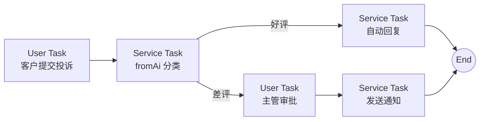
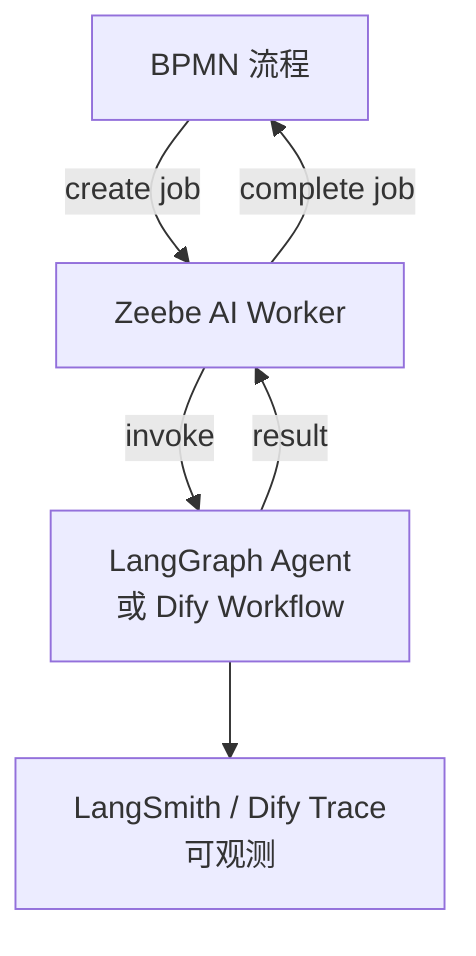
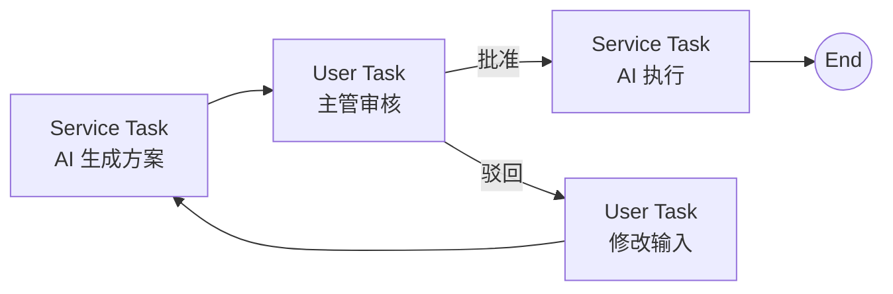

# AI + BPMN 融合

> ⬅️ [返回 AI 平台](../03-engineering/ai-platforms/README.md) | [Dify](../03-engineering/ai-platforms/dify.md) | [Coze](../03-engineering/ai-platforms/coze.md) | [LangGraph](../03-engineering/ai-platforms/langgraph.md) | [Camunda 8](../../07.workflow/process-engine/camunda/camunda-8/README.md) | [11 AI 知识体系](../README.md) | [07 工作流](../../07.workflow/README.md)

## 🎯 一句话定位

**AI + BPMN 融合 = 在 BPMN 确定性骨架中嵌入 AI 推理节点**——用 BPMN 管"流程编排 + 合规审计"，用 AI 管"灵活推理 + 概率决策"，是 2025-2026 年企业 AI 落地的**生产级范式**。

---

## 一、为什么需要 AI + BPMN 融合？

### 1.1 单独使用的痛点

| 单独使用 | 痛点 |
|---------|------|
| **只用 BPMN** | 流程僵化，遇到非结构化输入（合同/邮件/语音）无法处理 |
| **只用 AI Agent** | 难以审计、难以合规、缺乏确定性骨架、Token 成本不可控 |
| **AI + BPMN 融合** | BPMN 管骨架 + AI 管推理 + 互相弥补 |

### 1.2 融合的 3 大价值

1. **合规可审计**：BPMN 流程实例可追溯，AI 输出可标注
2. **降本增效**：AI 处理非结构化输入（占企业数据 80%），BPMN 处理结构化（占 20%）
3. **长流程可管理**：BPMN 提供 SLA / 超时 / 升级机制，AI 不再是"黑盒调用"

---

## 二、4 大融合模式

### 2.1 模式 A：LLM 包装为 Service Task（Camunda 8.5+）

**思路**：把 LLM 推理包装成 BPMN Service Task，通过 FEEL 表达式 `fromAi()` 调用。



**FEEL 表达式**：

```feel
{
  category: fromAi("判断投诉类型", { allowedValues: ["差评", "好评", "咨询"] }),
  priority: fromAi("评估紧急程度", { allowedValues: ["高", "中", "低"] }),
  summary: fromAi("生成 50 字以内的投诉摘要")
}
```

**优势**：

- 工程师友好（FEEL 表达式）
- 引擎原生支持，零外部依赖
- 流程实例可审计

**局限**：

- 仅支持**单步 LLM 调用**（无多步推理）
- 工具调用需手动实现
- 适合**轻量 AI 嵌入**场景

### 2.2 模式 B：自研 Zeebe AI Worker

**思路**：把 LLM/Agent 框架（LangGraph / Dify / CrewAI）包装为 Zeebe Job Worker。



**Java 代码示例**：

```java
@ZeebeWorker(type = "ai-classify-worker")
public void handle(final JobClient client, final ActivatedJob job) {
    Map<String, Object> vars = job.getVariablesAsMap();
    String text = (String) vars.get("complaintText");

    // 调用 Dify Workflow
    String difyResult = difyClient.runWorkflow(
        "complaint-classify",
        Map.of("text", text)
    );

    // 解析并完成 job
    Map<String, Object> result = parseJson(difyResult);
    client.newCompleteCommand(job.getKey())
          .variables(Map.of(
              "category", result.get("category"),
              "priority", result.get("priority")
          ))
          .send()
          .join();
}
```

**优势**：

- 完全控制推理逻辑
- 可接入任意 LLM/Agent 框架
- BPMN 流程不变，AI 节点可独立升级

**适用**：

- Camunda 8.5 之前的版本
- 需要复杂 Agent 推理
- 私有 LLM 接入

### 2.3 模式 C：Workflow Engine 作为 AI Agent 的工具

**思路**：AI Agent 反过来**调用 BPMN 引擎**作为其工具之一（LangGraph → Camunda 8）。

```python
# LangGraph Agent 中注册 Zeebe 工具
from langchain.tools import tool
from zeebe_client import ZeebeClient

zeebe = ZeebeClient()

@tool
def start_approval_workflow(order_id: str, amount: float) -> str:
    """启动订单审批流程（金额 > 10000 需主管审批）"""
    process_key = "order-approval"
    variables = {"orderId": order_id, "amount": amount}
    instance_key = zeebe.create_process_instance(process_key, variables)
    return f"审批流程已启动，instanceKey={instance_key}"

@tool
def check_approval_status(instance_key: str) -> str:
    """查询审批状态"""
    state = zeebe.get_workflow_instance(instance_key)
    return f"当前状态：{state['state']}, 进度：{state['progress']}%"

# Agent 工具列表
tools = [start_approval_workflow, check_approval_status]
```

**典型场景**：AI 客服收到"我有一个大订单要审批"请求 → Agent 自动调用 Zeebe 启动审批流程。

**优势**：

- AI 灵活性最强（Agent 自主决定何时调用流程）
- 既有 AI 能力又有流程合规

**风险**：

- AI 可能"忘记"调用流程 → 需要**强 Prompt 约束 + 工具调用审计**

### 2.4 模式 D：HITL 人在回路

**思路**：在 AI 推理节点后插入 BPMN User Task，人工审核后再继续。



**适用**：

- 高风险决策（贷款 / 医疗 / 投资）
- 合规要求双人复核
- AI 输出不确定时

**Camunda 8 实战**：

```xml
<bpmn:userTask id="review-approval" name="主管审核 AI 方案">
  <bpmn:extensionElements>
    <zeebe:TaskDefinition type="ai-review" />
    <zeebe:UserTaskForm>
      <zeebe:FormDefinition formKey="ai-review-form" />
    </zeebe:UserTaskForm>
  </bpmn:extensionElements>
</bpmn:userTask>
```

---

## 三、4 大模式决策树

```text
Q1: AI 推理复杂度？
├── 单步分类 / 提取 → 模式 A（fromAi() Service Task）
└── 多步推理 / 工具调用 → 继续

Q2: Camunda 版本？
├── 8.5+ 且轻量场景 → 模式 A（AI Agent Sub-process）
└── 8.5 之前 或 需要 LangGraph → 模式 B（自研 Zeebe AI Worker）

Q3: 谁主动？
├── BPMN 流程主动调 AI → 模式 A / B
└── AI Agent 主动调流程 → 模式 C（Workflow Engine as Tool）

Q4: 是否需要人工审核？
├── 关键决策必经人工 → 模式 D（HITL 强制）
└── 全自动 + 监控 → 模式 A / B + 告警
```

---

## 四、真实案例

### 4.1 欧洲某保险公司：理赔自动化

| 维度 | 数据 |
|------|------|
| **业务** | 汽车保险理赔 |
| **BPMN 引擎** | Camunda 8 |
| **AI** | 自研 LLM + 视觉模型 |
| **融合模式** | 模式 B + 模式 D |
| **效果** | 处理时间 -40%，人工成本 -60%，NPS +15 |

**流程**：

1. 客户上传事故照片 + 文字描述
2. AI Worker 调视觉模型识别损伤 + 调 LLM 提取文字
3. 提取结果回填到 Camunda 流程变量
4. BPMN 网关根据损伤程度自动分支
5. 高额理赔插入 User Task 主管审核
6. 自动出险 + 通知

### 4.2 国内某股份制银行：信贷审批

| 维度 | 数据 |
|------|------|
| **业务** | 个人信贷审批 |
| **BPMN 引擎** | Camunda 7（合规要求）|
| **AI** | Dify（私有化部署）|
| **融合模式** | 模式 B（Zeebe → Dify）|
| **效果** | 审批时效 -50%，合规 100% 留痕 |

**流程**：

1. 客户提交申请材料（PDF）
2. Dify RAG 提取关键信息（收入/负债/征信）
3. Camunda 7 流程根据提取结果走规则
4. 高风险申请触发人工审批（HITL）
5. 审批结果回填 Camunda 7 + 通知客户

### 4.3 某跨国制造企业：采购订单

| 维度 | 数据 |
|------|------|
| **业务** | 采购订单异常处理 |
| **BPMN 引擎** | Camunda 8 |
| **AI** | LangGraph + Claude |
| **融合模式** | 模式 C（LangGraph → Camunda）|
| **效果** | 异常处理 -30%，Agent 自动化率 65% |

**流程**：

1. ERP 触发异常事件到消息队列
2. LangGraph Agent 监听事件，自主判断异常类型
3. 需要审批的异常 → Agent 调用 Camunda 启动 BPMN
4. 自动可处理的异常 → Agent 调工具直接修复

---

## 五、5 步落地清单

### 步骤 1：识别流程中的 AI 节点

- 列出 3-5 个**非结构化输入**环节（合同/邮件/语音/图片）
- 每个环节预估 AI 替代人工的节省（小时 × 单价）

### 步骤 2：选择融合模式

- **单步分类** → 模式 A
- **复杂推理** → 模式 B
- **AI 主动调流程** → 模式 C
- **关键决策** → 模式 D

### 步骤 3：PoC 验证（2-4 周）

- 选 1 个**风险最低**的流程做 PoC
- 评估指标：准确率 / 处理时间 / 成本 / 用户满意度
- 收集审计日志，验证合规

### 步骤 4：评估体系

- **离线评估**：构造测试集，定期跑回归
- **在线评估**：A/B 测试 + 用户反馈
- **降级策略**：AI 不确定时 fallback 到人工

### 步骤 5：生产化

- 监控告警：LLM 延迟 / 准确率漂移 / Token 成本
- 版本管理：DSL / Prompt 入 Git
- 应急预案：LLM 服务不可用时 fallback 到规则引擎

---

## 六、2026 技术趋势

| 趋势 | 影响 |
|------|------|
| **MCP 协议普及** | AI 工具调用标准化，BPMN 工具可被任意 AI 消费 |
| **AI Agent Sub-process 一等公民** | Camunda 8.5+ 把 Agent 节点提升为内置图元 |
| **多模态原生** | BPMN 节点支持图像 / 语音 / 视频输入（GPT-4o / Claude 3.5）|
| **小模型 + 大模型混合** | 简单分类用本地 7B 小模型，复杂推理用云端 GPT-4o |
| **流程智能（Process Intelligence）** | AI 反哺 BPMN：流程挖掘 + 自动优化 |

---

## 🤔 思考

1. **AI + BPMN 融合 vs 端到端 Agent？** 端到端 Agent 灵活但难审计、难合规。**生产级落地**几乎都选融合——BPMN 管确定性骨架，AI 管非结构化推理，两者互补。
2. **模式 A 和模式 B 怎么选？** 单步分类 / 提取用模式 A（FEEL 简单）；多步推理 / 工具调用用模式 B（更灵活）。**Camunda 8.5+ 优先模式 A**，之前版本用模式 B。
3. **模式 C 的最大风险？** AI Agent 可能"忘记"调用流程（幻觉）→ 需要在 Prompt 中**强约束** + 在工具描述中**明示边界** + 监控告警。
4. **HITL 会让 AI 失去价值吗？** 不会。HITL 解决的是"**高风险决策的兜底**"，90% 的常规决策仍可全自动；HITL 让 AI 获得在企业落地的"信任票"。
5. **未来 3 年的趋势？** 2026-2028 年，**BPMN 引擎原生 AI 化**（Camunda 8.5+ 路线）+ **AI 平台原生流程化**（Dify 引入子流程）双向靠拢；最终可能融合为"**AI-native BPMN**"——既有图灵完备的图状编排，又有原生 LLM 节点 + 工具调用。

---

## 相关章节

- ⬅️ [返回 AI 平台](../03-engineering/ai-platforms/README.md) — 6 大平台对比与决策树
- [11 AI 知识体系](../README.md) — 章节根目录
- [07 工作流](../../07.workflow/README.md) — 章节根目录
- [Dify](../03-engineering/ai-platforms/dify.md) — 模式 A/B 中 LLM 推理的常见载体
- [LangGraph](../03-engineering/ai-platforms/langgraph.md) — 模式 B/C 中 Agent 框架的工业界主流
- [Camunda 8](../../07.workflow/process-engine/camunda/camunda-8/README.md) — 模式 A 8.5+ AI Agent Sub-process 详解
- [Zeebe](../../07.workflow/process-engine/camunda/camunda-8/zeebe/README.md) — 模式 B Zeebe AI Worker 实现
- [微服务编排](../../07.workflow/workflow-and-microservice-orchestration/README.md) — 流程引擎在微服务场景的演化
- [09.front-end / 05 架构 / BFF](../../09.front-end/05-architecture/bff/README.md) — BFF 模式详解：与 AI 融合中的"端侧适配层"实践
