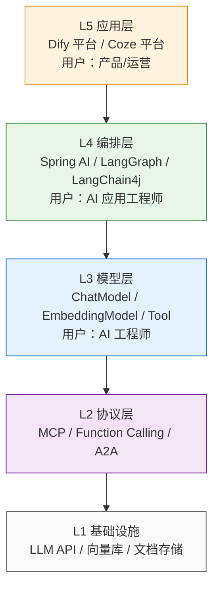
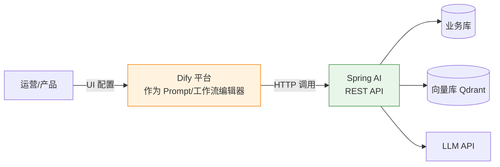
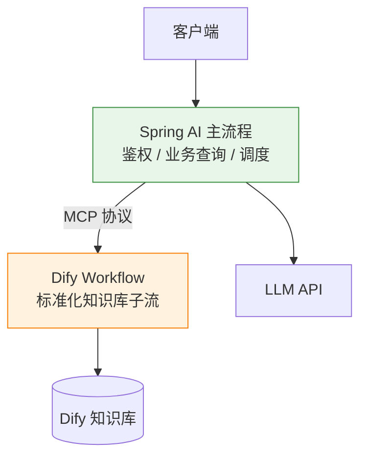

# Spring AI vs Dify：企业知识库系统的代码优先 vs 低代码架构决策

> ⬅️ [返回 L4 架构设计](README.md) | [代码优先 vs 平台（短卡）](../03-engineering/ai-platforms/spring-ai-vs-platforms.md) | [Dify](../03-engineering/ai-platforms/dify.md) | [Spring AI 工程](../03-engineering/frameworks/llm-app/README.md) | [BPMN+AI 融合](bpmn-ai-integration.md) | [11 AI 知识体系](../README.md)

## 🎯 一句话定位

**Spring AI vs Dify = 代码优先 vs 低代码的架构决策**——不是"谁取代谁"，而是"什么时候跳出平台抽象"。本文用**知识库系统**这一具体场景，把 7 个维度的差异拆开讲透，给出可执行的决策清单与混合架构范式。

---

## 引言：决策困境

> "有了 Dify 为什么还要自己用 Spring AI 开发知识库系统？"

这是 Java 后端团队 2025-2026 年最常问的问题之一。表层答案是"Dify 不够灵活"，但深层的架构选择涉及**抽象层级、团队能力、业务集成、合规审计**4 个维度的权衡。本文的目的是**把这个选择题变成判断题**——给定 7 个具体问题，答案自然浮现。

---

## 一、定位差异：抽象层级不同

### 1.1 抽象层级模型



- **Dify / Coze 在 L5**：用户面对的是 UI 配置和 DSL YAML，不接触底层 API
- **Spring AI 在 L4**：用户写 Java 业务代码，调用标准化的 `ChatClient` / `VectorStore`
- **互不替代**：Dify 内部也用 L4 的框架（如 LangGraph / 自研），Spring AI 也可被 Dify 外部 API 调用

### 1.2 核心差异表

| 维度 | Dify | **Spring AI** |
|------|------|---------------|
| **形态** | 平台（UI + DSL + 后端服务） | 框架（Java 库 + Spring Boot Starter） |
| **部署产物** | Docker Compose / K8s 全套 | 普通 Spring Boot 应用 |
| **业务代码位置** | 平台外的 HTTP API | 与业务代码同进程 |
| **状态存储** | 平台内置 DB（PG/Weaviate） | 业务库（任意） |
| **权限模型** | 平台自带的 5 角色 | 复用 Spring Security / Shiro |
| **链路追踪** | 平台 Trace + LangSmith 集成 | Micrometer + Zipkin + Langfuse |
| **Token 计费** | 平台统计 + 第三方集成 | Micrometer Counter + 自建看板 |
| **多租户** | 平台原生 | 需自己实现 |

---

## 二、知识库系统 7 维度对比

### 2.1 摄取（Ingestion）

| 维度 | Dify | **Spring AI** |
|------|------|---------------|
| 文件类型 | PDF/Word/Markdown/网页/Notion（50+ 内置） | PDF/Word/HTML/JSON（10+ 内置，可自扩展） |
| 增量更新 | ✅ 自动检测变更 | ⚠️ 需自己实现（Quartz / Spring Scheduling） |
| OCR | 内置 Tesseract / PaddleOCR | 需自己接入 |
| 自定义解析 | 插件机制 | 完全可控（继承 `DocumentReader`） |

**Spring AI 代码示例**：

```java
@Component
public class ContractDocumentReader implements DocumentReader {
    private final PdfDocumentReader pdfReader = new PdfDocumentReader();

    @Override
    public List<Document> read(Resource resource) {
        // 1. 用 PDF 库读取全文
        String text = pdfReader.extractText(resource);

        // 2. 自定义分段：按"第 N 条"切分（法律合同专用）
        List<String> clauses = splitByArticle(text);

        // 3. 附加元数据（用于后续过滤检索）
        return clauses.stream()
            .map(clause -> new Document(
                clause,
                Map.of(
                    "docType", "contract",
                    "clauseNo", extractClauseNo(clause),
                    "effectiveDate", "2026-01-01"
                )
            ))
            .toList();
    }
}
```

**Dify 做不到的**：Dify 的分段策略是"按字数 / 按段落 / 按标题"通用模式，**法律条文 / 合同条款 / 病历字段**这类强领域结构化数据 Dify 只能退化为通用分段，召回率会下降。

### 2.2 分段（Chunking）

| 策略 | Dify | **Spring AI** |
|------|------|---------------|
| 通用（按字数/段落/标题） | ✅ 一行配置 | ✅ TokenTextSplitter |
| 语义分段 | ✅ Embedding-based | ⚠️ 需自实现（SentenceSplitter） |
| 结构化分段 | ⚠️ 无 | ✅ 完全自定义 |
| 重叠（Overlap） | ✅ 滑窗配置 | ✅ 任意策略 |

**生产建议**：

- 80% 通用文档用 Dify 内置分段足够
- 20% 法律 / 医疗 / 合同场景必须自实现（用 Spring AI）

### 2.3 向量化（Embedding）

| 维度 | Dify | **Spring AI** |
|------|------|---------------|
| 模型选择 | 50+ 模型（OpenAI / Cohere / BGE / M3E） | 同样支持（`EmbeddingModel` 抽象） |
| 私有化 | 模型私有化即可 | 同上 |
| 批量调用 | 平台优化（并发/重试） | ⚠️ 需自己实现并发批处理 |
| 缓存 | 平台内置（避免重复 Embedding） | ⚠️ 需自己实现（Caffeine + Redis） |

**生产踩坑**：Dify 的 Embedding 缓存命中率通常 60-80%，显著降低 Token 成本；自研 Spring AI 必须自己实现。

### 2.4 检索（Retrieval）

| 策略 | Dify | **Spring AI** |
|------|------|---------------|
| 向量检索 | ✅ 内置 | ✅ `VectorStore` 抽象（Qdrant/Milvus/Chroma） |
| 全文检索 | ✅ 内置（ES / 内置引擎） | ⚠️ 需自己集成 ES |
| 混合检索 | ✅ Reciprocal Rank Fusion | ⚠️ 需自实现或用 Spring AI Alibaba |
| 重排（ReRank） | ✅ 内置 Cohere / BGE | ⚠️ 需自己接入 |
| 元数据过滤 | ✅ UI 配置 | ✅ `Filter.Expression` |
| 查询改写 | ✅ HyDE / Multi-Query | ⚠️ 需自实现 |

**关键差异**：Dify 把"向量 + 全文 + 重排"做成开箱即用的 Pipeline；Spring AI 给你零件让你自己装。

### 2.5 生成（Generation）

| 维度 | Dify | **Spring AI** |
|------|------|---------------|
| Prompt 模板 | UI 编辑器 + 版本管理 | 代码 + `PromptTemplate` |
| 流式输出 | ✅ 内置（SSE） | ✅ `ChatClient.stream()` |
| 多轮对话 | ✅ Chatflow 自动管理 | ⚠️ 需自己用 `MessageWindowChatMemory` |
| Function Calling | ✅ 内置 13+ 节点 | ✅ `@Tool` 注解 |
| 结构化输出 | ✅ JSON Schema 节点 | ✅ `BeanOutputConverter` |
| Prompt 版本管理 | ✅ 平台内置 | ⚠️ 需 Git 管理 |

### 2.6 集成（Integration）

| 维度 | Dify | **Spring AI** |
|------|------|---------------|
| 业务系统调用 | HTTP API / Webhook | 直接 `@Autowired` 业务 Service |
| 数据库读写 | 内置 DB 节点 | 直接调 `JdbcTemplate` / MyBatis / JPA |
| 事务一致性 | 平台外（最终一致） | `@Transactional`（强一致） |
| 权限继承 | 平台 5 角色 + 业务 RBAC 二次对接 | 复用 Spring Security 一套搞定 |
| 审计日志 | 平台日志 + 业务日志两套 | 同一链路（同一进程） |
| 限流/熔断 | 平台 Sentinel / 业务 Sentinel 两套 | 业务 Sentinel 一套搞定 |

**这是 Spring AI 的核心优势**：

```java
@Service
public class KnowledgeBaseService {
    private final ChatClient chatClient;
    private final VectorStore vectorStore;
    private final OrderRepository orderRepository;  // 业务 Service
    private final PermissionService permissionService;

    public String ask(String question, Long userId) {
        // 1. 权限校验（复用 Spring Security）
        permissionService.check(userId, "knowledge:query");

        // 2. RAG 检索
        List<Document> docs = vectorStore.similaritySearch(
            SearchRequest.query(question)
                .withTopK(5)
                .withFilterExpression("userId == " + userId)
        );

        // 3. 查询用户最近订单（业务系统集成）
        List<Order> recentOrders = orderRepository.findTop10ByUserIdOrderByCreatedAtDesc(userId);

        // 4. 构造 Prompt（业务上下文 + 知识库 + LLM）
        String answer = chatClient.prompt()
            .system("你是 XX 客服助手，基于知识库和用户订单回答")
            .user(question)
            .toolContext(Map.of("recentOrders", recentOrders))
            .call()
            .content();

        // 5. 审计日志（同一链路）
        auditLog.record(userId, question, answer);

        return answer;
    }
}
```

Dify 做不到：在同一个 `@Transactional` 里同时完成"权限校验 + 业务查询 + RAG 检索 + LLM 生成 + 审计日志"。Dify 的每个节点都是独立服务调用，事务边界难以保证。

### 2.7 治理（Governance）

| 维度 | Dify | **Spring AI** |
|------|------|---------------|
| 成本统计 | 平台 Token 看板 | Micrometer + Prometheus + 自建看板 |
| 审计日志 | 平台日志（独立存储） | 与业务日志统一（ELK / Loki） |
| 合规追溯 | 平台有限 | 完整（每条 LLM 调用都有 trace） |
| 数据出境 | 平台默认无审计 | 完全可控（可强制国内模型） |
| 私有化 | AGPL 免费 / 企业版付费 | Apache 2.0 完全免费 |
| License 风险 | AGPL 边界争议（修改需开源） | 无 |

**合规视角**：金融/医疗/政务行业，**审计日志的完整性、链路追踪的可解释性、数据出境的合规性**都是硬性要求。Spring AI 与业务同进程的天然优势，让这些要求"几乎免费"满足；Dify 则需要额外的"日志接入 + 审计对账"工作。

---

## 三、Spring AI 知识库系统最小可运行示例

### 3.1 Maven 依赖

```xml
<dependency>
    <groupId>org.springframework.ai</groupId>
    <artifactId>spring-ai-openai-spring-boot-starter</artifactId>
</dependency>
<dependency>
    <groupId>org.springframework.ai</groupId>
    <artifactId>spring-ai-qdrant-store-spring-boot-starter</artifactId>
</dependency>
<dependency>
    <groupId>org.springframework.ai</groupId>
    <artifactId>spring-ai-pdf-document-reader</artifactId>
</dependency>
```

### 3.2 配置文件

```yaml
spring:
  ai:
    openai:
      api-key: ${OPENAI_API_KEY}
      chat:
        options:
          model: gpt-4o
          temperature: 0.3
    vectorstore:
      qdrant:
        host: localhost
        port: 6333
        collection-name: knowledge-base
```

### 3.3 摄取服务

```java
@Service
public class IngestionService {
    private final VectorStore vectorStore;

    public void ingestPdf(Resource pdfResource, Map<String, Object> metadata) {
        // 1. 读取 PDF
        PdfDocumentReader pdfReader = new PdfDocumentReader(pdfResource);
        List<Document> rawDocs = pdfReader.get();

        // 2. 分段
        TokenTextSplitter splitter = new TokenTextSplitter(500, 50);
        List<Document> chunks = splitter.apply(rawDocs);

        // 3. 附加元数据
        chunks.forEach(chunk -> chunk.getMetadata().putAll(metadata));

        // 4. Embedding + 写入向量库
        vectorStore.accept(chunks);
    }
}
```

### 3.4 检索服务

```java
@Service
public class RetrievalService {
    private final VectorStore vectorStore;
    private final ChatClient chatClient;

    public String ask(String question) {
        // 1. 向量检索 Top-5
        List<Document> docs = vectorStore.similaritySearch(
            SearchRequest.query(question).withTopK(5)
        );

        // 2. 拼 Prompt
        String context = docs.stream()
            .map(Document::getContent)
            .collect(Collectors.joining("\n\n"));

        // 3. 生成
        return chatClient.prompt()
            .system("基于以下上下文回答：\n" + context)
            .user(question)
            .call()
            .content();
    }
}
```

### 3.5 Spring AI Alibaba 增强版（可选）

如果用阿里云模型 + Agent 框架，建议 Spring AI Alibaba：

```xml
<dependency>
    <groupId>com.alibaba.cloud.ai</groupId>
    <artifactId>spring-ai-alibaba-starter</artifactId>
</dependency>
```

提供 `Graph` / `Node` / `CompiledGraph` 抽象，**比 LangGraph 更适合 Java 团队**。

---

## 四、混合架构：1+1 > 2

### 4.1 模式 A：Dify 做编辑器 + Spring AI 做执行引擎



**适用**：

- 产品/运营需要可视化编辑 Prompt/工作流
- 但 RAG 检索/业务集成必须由 Spring AI 完成
- **典型场景**：企业内部知识库 + 客服场景

**Dify 配置**（外部 API 节点）：

```yaml
nodes:
  - id: api-call
    type: http-request
    config:
      method: POST
      url: https://java-api.company.com/api/v1/qa
      body: |
        {
          "question": "{{sys.query}}",
          "userId": "{{sys.user_id}}"
        }
```

### 4.2 模式 B：Spring AI 主流程 + Dify 知识库子流



**适用**：

- 主流程是业务系统（必须用 Spring AI）
- 知识库子流是标准化问答（用 Dify 更划算）
- **典型场景**：电商客服 + 商品知识库

**Spring AI 调用 Dify**：

```java
@Service
public class DifyIntegrationService {
    private final RestClient difyClient;

    public String queryKnowledgeBase(String question) {
        return difyClient.post()
            .uri("/v1/workflows/run")
            .body(Map.of(
                "inputs", Map.of("question", question),
                "user", "spring-ai-service"
            ))
            .retrieve()
            .body(String.class);
    }
}
```

### 4.3 模式 C：MCP 互通（2026 推荐）

Dify v1.9.2+ 原生支持 MCP Server/Client，Spring AI 通过 MCP 客户端对接：

```java
// Spring AI 作为 MCP 客户端
@Bean
public McpClient difyMcpClient() {
    return McpClient.builder()
        .server("http://dify:5002/sse")  // Dify MCP Server
        .build();
}

// Spring AI Agent 调用 Dify 工具
@Tool(name = "knowledge_base_query", description = "查询企业知识库")
public String knowledgeBaseQuery(@ToolParam String question) {
    return difyMcpClient.callTool("knowledge_base_query", Map.of("question", question));
}
```

---

## 五、何时选 Dify / 何时选 Spring AI（决策清单）

回答下面 7 个问题，答案自然浮现：

| # | 问题 | 选 Dify | 选 Spring AI |
|---|------|--------|--------------|
| 1 | 1-2 周内要上线 MVP 吗？ | ✅ | ⚠️ 紧张 |
| 2 | 团队主力是产品/运营？ | ✅ | ❌ |
| 3 | 系统已有 Spring Boot 微服务？ | ⚠️ 难集成 | ✅ |
| 4 | 需要直接调订单/用户/库存业务 Service？ | ❌ 跨进程麻烦 | ✅ |
| 5 | 文档是合同/法律条文/病历等强结构化？ | ⚠️ 通用分段 | ✅ 自定义分段 |
| 6 | 金融/医疗/政务强合规审计？ | ⚠️ 需额外对账 | ✅ 同进程日志 |
| 7 | 团队 100% Java 后端？ | ⚠️ 跨语言栈 | ✅ |

**判定规则**：

- **Dify 命中 ≥ 4 个**：选 Dify
- **Spring AI 命中 ≥ 4 个**：选 Spring AI
- **双方都命中 3-4 个**：选混合架构（模式 A 或 C）

---

## 六、生产踩坑点

### 6.1 Dify 踩坑

1. **AGPL License 风险**：修改 Dify 源码需开源，**SaaS 内部使用 OK，对外提供服务有边界争议**
2. **多租户隔离**：Dify 内置 workspace，但隔离级别不如业务系统（数据库、向量库共享）
3. **审计日志断层**：平台日志与业务日志两套存储，合规对账痛苦
4. **企业版昂贵**：5000-20000 美元/月，规模化后成本超过自研
5. **生态绑定**：长期使用 Dify 后想迁移，DSL YAML 难以转换到代码

### 6.2 Spring AI 踩坑

1. **上线慢**：1-2 周起步，需要 Java 工程师投入
2. **可观测性需自建**：Micrometer + Prometheus + Langfuse 三件套缺一不可
3. **Token 成本治理**：缓存、并发批处理、配额限流都要自己写
4. **RAG 质量调优**：分段、检索、重排没有银弹，需要迭代
5. **模型升级影响**：GPT-4 → GPT-5 可能行为变化，需 A/B 测试

---

## 七、与 LangChain4j / LangGraph 的取舍

| 维度 | Spring AI | LangChain4j | LangGraph |
|------|-----------|-------------|-----------|
| 语言 | Java | Java | Python |
| 抽象层级 | L4（框架） | L4（框架） | L4（框架） |
| Spring 集成 | ✅ 原生 | ⚠️ Spring Boot Starter（社区） | ❌ |
| Agent 能力 | ⚠️ 基础（Spring AI Alibaba 增强） | ⚠️ 基础 | ✅ 显式 StateGraph |
| 状态可回放 | ⚠️ Spring AI Alibaba 支持 | ⚠️ 需自实现 | ✅ Checkpoint + Time Travel |
| 生态规模 | ⭐⭐⭐ | ⭐⭐⭐ | ⭐⭐⭐⭐⭐ |
| 团队要求 | Java 后端 | Java 后端 | Python / 算法 |
| 选型建议 | Java 微服务为主 | 已有 Java 非 Spring | 复杂 Agent 探索 |

---

## 🤔 思考

1. **Dify 会被 Spring AI 取代吗？** 不会。两者抽象层级不同，Dify 在 L5 仍是低代码王者。Spring AI 抢的是 L4 的"Java 代码优先"位置。
2. **Spring AI 最终会统一 L4 吗？** 不会。LangChain（Python）、Semantic Kernel（.NET）、Spring AI（Java）会长期共存。**真正的统一层是 MCP（Model Context Protocol）**——Dify、Coze、LangGraph、Spring AI 都通过 MCP 互通。
3. **Spring AI 的杀手锏是什么？** 不是功能（LangChain4j 也有），而是 **Spring 官方背书 + 标准化抽象 + 阿里增强**。Java 微服务团队选 Spring AI 而不是 LangChain4j，本质是选"Spring 生态"。
4. **什么时候应该混合？** 80% 场景单边就够了。剩下 20% 真正需要混合：**前端可视化编辑 + 后端业务集成**（模式 A），**主流程业务化 + 子流标准化**（模式 B）。
5. **未来 1-2 年的趋势？** Dify / Coze 会持续吃掉"运营/产品主导场景"；Spring AI / LangChain4j 会持续吃掉"Java 工程师主导场景"；两者通过 MCP 互通形成**两层架构**（平台 + 框架）。**不要选边站，要选层级**。

---

## 相关章节

- ⬅️ [返回 L4 架构设计](README.md)
- ➡️ [代码优先 vs 平台（短卡）](../03-engineering/ai-platforms/spring-ai-vs-platforms.md)
- [Dify](../03-engineering/ai-platforms/dify.md)
- [Spring AI 工程](../03-engineering/frameworks/llm-app/README.md)
- [BPMN+AI 融合](bpmn-ai-integration.md) — 另一种跨界决策范式
- [大模型应用框架](../03-engineering/frameworks/llm-app/README.md) — Spring AI / LangChain4j / LangChain / LlamaIndex 框架对比
- [13.split-hairs/11.ai](../../13.split-hairs/11.ai/README.md) — 面试深挖（建议补充本主题的 3 个高频问题）

← [返回笔记目录](../../README.md)