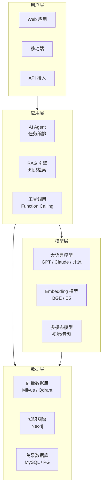

<!--
module:
  parent: ai
  slug: ai/applications
  type: index
  category: 主模块子文章
  summary: AI 行业应用
-->

# L5 行业应用

> AI 在真实业务场景中的落地实践。从概念验证到生产部署，每个行业都有其独特的挑战和解决方案。

## 1. 目录导航

| 目录 | 核心内容 | 一句话定位 |
|------|---------|-----------|
| [automotive](automotive/) | **AI 重塑汽车行业** — 智能座舱 / GAN 工业设计 / 监督学习→强化学习演进 | 传统行业 AI 转型范本 |
| [embodied-ai](embodied-ai/) | 具身智能 — 感知-推理-执行闭环、柔性适配机制、自动驾驶与数字孪生工厂 | 下一代 AI 形态 |
| [ai-written-prd](ai-written-prd/) | AI 撰写 PRD — 产品需求文档的自动化生成 | 企业效率提升 |
| [shopify-ai-agent](shopify-ai-agent/) | Shopify AI Agent — 电商 AI 代理实践 | 电商 AI 落地案例 |
| [case-studies](case-studies/) | **12 个 AI 应用案例** — 编程/客服/法律/教育/金融/办公/销售/医疗/制造 9 个行业的标杆实践 | 看别人如何重塑工作流 |

### 1.1 学习路径

行业应用是架构设计的下游：先看 [L4 架构设计](../04-architecture/) 理解系统分层，再看本模块如何将 AI 能力落地到具体行业。

**推荐阅读顺序：**
1. [L2 技术栈](../02-technology-stack/) → 掌握 AI 基础能力
2. [L3 工程实践](../03-engineering/) → 框架与部署
3. [L4 架构设计](../04-architecture/) → 系统分层设计
4. **L5 行业应用**（本模块） → 场景落地

---

## 2. 行业版图

```text
AI 行业应用
├── 🏭 制造业
│   ├── 智能座舱（HMI + 语音交互）
│   ├── 质检（GAN + 计算机视觉）
│   └── 预测性维护（时序异常检测）
├── 🚗 汽车
│   ├── 自动驾驶（感知-决策-控制）
│   ├── 数字孪生工厂
│   └── 智能客服（NLP + 知识图谱）
├── 🏥 医疗健康
│   ├── 医学影像（CT/MRI 辅助诊断）
│   ├── 药物发现（分子生成 + 虚拟筛选）
│   └── 临床决策支持
├── 💰 金融
│   ├── 智能风控（实时反欺诈）
│   ├── 量化交易（强化学习 + 时序预测）
│   └── 智能客服（多轮对话）
├── 🛒 零售电商
│   ├── 推荐系统（召回 + 排序）
│   ├── 智能搜索（语义理解）
│   └── 内容生成（商品描述 / 营销文案）
├── 🎮 游戏
│   ├── NPC 行为（强化学习）
│   ├── 程序化生成（PCG + AI）
│   └── 反作弊（异常检测）
├── 🤖 具身智能
│   ├── 工业机器人（柔性适配）
│   ├── 服务机器人（导航 + 交互）
│   └── 人形机器人（全身控制）
└── 🏢 企业服务
    ├── AI Agent（办公自动化）
    ├── 知识库问答（RAG）
    └── 代码生成（Copilot / Claude Code）
```

---

## 3. 速查表

| 行业 | 核心 AI 能力 | 典型落地场景 |
|------|------------|------------|
| **汽车** | 智能座舱 / GAN 工业设计 / 自动驾驶 | 蔚来 NOMI、特斯拉 FSD |
| **编程** | 代码生成 + Agent | Claude Code、Cursor Tab |
| **客服** | 多轮对话 + RAG | Klarna、Salesforce Agentforce |
| **法律** | 文档理解 + 案例检索 | Harvey AI |
| **教育** | 个性化辅导 | Khan Academy Khanmigo |
| **金融** | 风控 + 量化 + 文档 | JPMorgan COIN |
| **办公** | 文档 + 会议 + 数据 | Microsoft 365 Copilot |
| **企业搜索** | 跨系统信息检索 | Glean |
| **医疗** | 影像 + 药物 + 护理 | Hippocratic AI |
| **制造** | 工业 Copilot | Siemens Industrial Copilot |
| **语言学习** | 对话 + 反馈 | Duolingo Max |
| **具身智能** | 感知-推理-执行 | Figure AI、Optimus |

---

## 4. 核心内容（按子模块展开）

- **[automotive](automotive/)**（+ 4 子）：
  - [gan-industrial-design](automotive/gan-industrial-design/) — GAN 工业设计
  - [ml-to-rl](automotive/ml-to-rl/) — 监督学习到强化学习演进
  - [overview](automotive/overview/) — 汽车 AI 全景
  - [smart-cockpit](automotive/smart-cockpit/) — 智能座舱
- **[embodied-ai](embodied-ai/)**：感知-推理-执行闭环、柔性适配机制、自动驾驶与数字孪生工厂
- **[ai-written-prd](ai-written-prd/)**：产品需求文档的自动化生成
- **[shopify-ai-agent](shopify-ai-agent/)**：电商 AI 代理实践
- **[case-studies](case-studies/)**（+ 12 子）：12 个行业标杆案例
  - 编程：[Claude Code](case-studies/01-anthropic-claude-code/) · [Cursor Tab](case-studies/02-cursor-tab/)
  - 客服：[Klarna](case-studies/03-klarna-ai-customer-service/)
  - 法律：[Harvey AI](case-studies/04-harvey-ai-legal/)
  - 教育：[Khan Academy Khanmigo](case-studies/05-khan-academy-khanmigo/)
  - 语言学习：[Duolingo Max](case-studies/06-duolingo-max/)
  - 金融：[JPMorgan COIN](case-studies/07-jpmorgan-coin/)
  - 办公：[Microsoft 365 Copilot](case-studies/08-microsoft-365-copilot/)
  - 企业搜索：[Glean](case-studies/09-glean-enterprise-search/)
  - 销售：[Salesforce Agentforce](case-studies/10-salesforce-agentforce/)
  - 医疗：[Hippocratic AI](case-studies/11-hippocratic-ai/)
  - 制造：[Siemens Industrial Copilot](case-studies/12-siemens-industrial-copilot/)

---

## 5. 最佳实践

| 场景 | 实践要点 |
|------|---------|
| **数据质量** | 行业数据噪声大、标注成本高 → 数据清洗 + 主动学习 + 合成数据 |
| **实时性** | 在线推理延迟 < 100ms → 模型量化 + TensorRT + 边缘部署 |
| **可靠性** | 金融/医疗零容忍错误 → 多模型集成 + 规则兜底 + 人工审核 |
| **合规性** | 数据隐私、可解释性 → 联邦学习 + 本地部署 + SHAP/LIME 解释 |
| **成本控制** | GPU 推理成本高 → 模型蒸馏 + 批处理 + 弹性伸缩 |
| **知识更新** | 领域知识快速迭代 → RAG + 向量数据库 + 定期微调 |

---

## 6. 通用落地架构



---

## 7. 常见面试题

| 题目 | 核心考点 |
|------|---------|
| AI 落地的通用挑战？ | 数据质量 / 实时性 / 可靠性 / 合规性 / 成本 / 知识更新 |
| RAG vs 微调在行业中的选择？ | 知识更新频繁 → RAG；风格/任务定制 → 微调 |
| AI Agent 落地案例（举 3 个）？ | Claude Code / Salesforce Agentforce / Microsoft Copilot |
| 智能座舱的 AI 能力？ | 语音交互 + HMI + 个性化推荐 + 多模态感知 |
| 数字孪生工厂价值？ | 虚拟调试 + 预测维护 + 工艺优化 |

---

## 8. 相关章节

- 上游：[L4 架构设计](../04-architecture/) → **L5 行业应用**
- 关联：[08.application-systems](../../08.application-systems/) — 21 类业务系统速查（MES/ERP/WMS/CRM）
- 关联：[12.story #01 AI Agent 架构](../../12.story/01-ai-agent-architecture.md) — Agent 7 大模块叙事
- 关联：[12.story #02 系统架构演进](../../12.story/02-system-architecture-evolution.md) — 架构演进历史
- 关联：[07.workflow](../../07.workflow/) — 工作流引擎与 AI 集成

---

## 📊 本节统计

| 维度 | 数字 |
|------|------|
| 一级 leaf README 数 | 5（automotive / embodied-ai / ai-written-prd / shopify-ai-agent / case-studies） |
| 二级 leaf README 数 | 16（automotive:4 + case-studies:12） |
| 总 leaf README 数 | 21 |
| 行业覆盖 | 12 个（编程/客服/法律/教育/金融/办公/销售/医疗/制造/语言/汽车/具身） |
| 速查表条目数 | 12 行业 × 3 维度 = 36 字段 |
| 最佳实践条数 | 6 |
| 常见面试题数 | 5 |
| frontmatter 覆盖 | 21 / 21 = 100% |
| 文末回链覆盖 | 21 / 21 = 100% |

---

← [返回 AI 知识体系](../README.md)