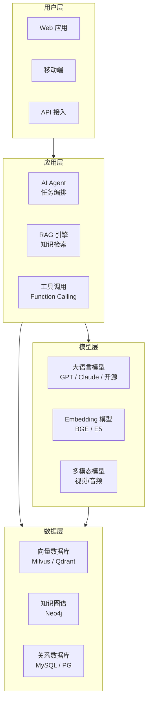

# AI 行业应用

← 返回 [总览](../README.md)

> AI 在真实业务场景中的落地实践。从概念验证到生产部署，每个行业都有其独特的挑战和解决方案。

---

## 行业版图

```
AI 行业应用
├── 🏭 制造业
│   ├── 智能座舱（HMI + 语音交互）
│   ├── 质检（GAN + 计算机视觉）
│   └── 预测性维护（时序异常检测）
├── 🚗 汽车
│   ├── 自动驾驶（感知-决策-控制）
│   ├── 数字孪生工厂
│   └── 智能客服（NLP + 知识图谱）
├── 🏥 医疗健康
│   ├── 医学影像（CT/MRI 辅助诊断）
│   ├── 药物发现（分子生成 + 虚拟筛选）
│   └── 临床决策支持
├── 💰 金融
│   ├── 智能风控（实时反欺诈）
│   ├── 量化交易（强化学习 + 时序预测）
│   └── 智能客服（多轮对话）
├── 🛒 零售电商
│   ├── 推荐系统（召回 + 排序）
│   ├── 智能搜索（语义理解）
│   └── 内容生成（商品描述 / 营销文案）
├── 🎮 游戏
│   ├── NPC 行为（强化学习）
│   ├── 程序化生成（PCG + AI）
│   └── 反作弊（异常检测）
├── 🤖 具身智能
│   ├── 工业机器人（柔性适配）
│   ├── 服务机器人（导航 + 交互）
│   └── 人形机器人（全身控制）
└── 🏢 企业服务
    ├── AI Agent（办公自动化）
    ├── 知识库问答（RAG）
    └── 代码生成（Copilot / Claude Code）
```

---

## 子目录

| 目录 | 内容 | 核心价值 |
|------|------|---------|
| [automotive](automotive/) | **AI 重塑汽车行业** — 智能座舱 / GAN 工业设计 / 监督学习→强化学习演进 | 传统行业 AI 转型范本 |
| [embodied-ai](embodied-ai/) | 具身智能 — 感知-推理-执行闭环、柔性适配机制、自动驾驶与数字孪生工厂 | 下一代 AI 形态 |
| [ai-written-prd](ai-written-prd/) | AI 撰写 PRD — 产品需求文档的自动化生成 | 企业效率提升 |
| [shopify-ai-agent](shopify-ai-agent/) | Shopify AI Agent — 电商 AI 代理实践 | 电商 AI 落地案例 |

---

## 行业落地关键挑战

| 挑战 | 说明 | 应对策略 |
|------|------|---------|
| **数据质量** | 行业数据噪声大、标注成本高 | 数据清洗 + 主动学习 + 合成数据 |
| **实时性** | 在线推理延迟要求 < 100ms | 模型量化 + TensorRT + 边缘部署 |
| **可靠性** | 金融/医疗零容忍错误 | 多模型集成 + 规则兜底 + 人工审核 |
| **合规性** | 数据隐私、可解释性要求 | 联邦学习 + 本地部署 + SHAP/LIME 解释 |
| **成本控制** | GPU 推理成本高 | 模型蒸馏 + 批处理 + 弹性伸缩 |
| **知识更新** | 领域知识快速迭代 | RAG + 向量数据库 + 定期微调 |

---

## 通用落地架构



---

## 学习路径

行业应用是架构设计的下游：先看 [L4 架构设计](../04-architecture/) 理解系统分层，再看本模块如何将 AI 能力落地到具体行业。

**推荐阅读顺序：**
1. [L2 技术栈](../02-technology-stack/) → 掌握 AI 基础能力
2. [L3 工程实践](../03-engineering/) → 框架与部署
3. [L4 架构设计](../04-architecture/) → 系统分层设计
4. **L5 行业应用**（本模块） → 场景落地

---

## 相关章节

- 上游：[L4 架构设计](../04-architecture/) → **L5 行业应用**
- 关联：[08.application-systems](../../08.application-systems/) — 21 类业务系统速查（MES/ERP/WMS/CRM）
- 关联：[12.story #01 AI Agent 架构](../../12.story/01-ai-agent-architecture.md) — Agent 7 大模块叙事
- 关联：[12.story #02 系统架构演进](../../12.story/02-system-architecture-evolution.md) — 架构演进历史
- 关联：[07.workflow](../../07.workflow/) — 工作流引擎与 AI 集成
