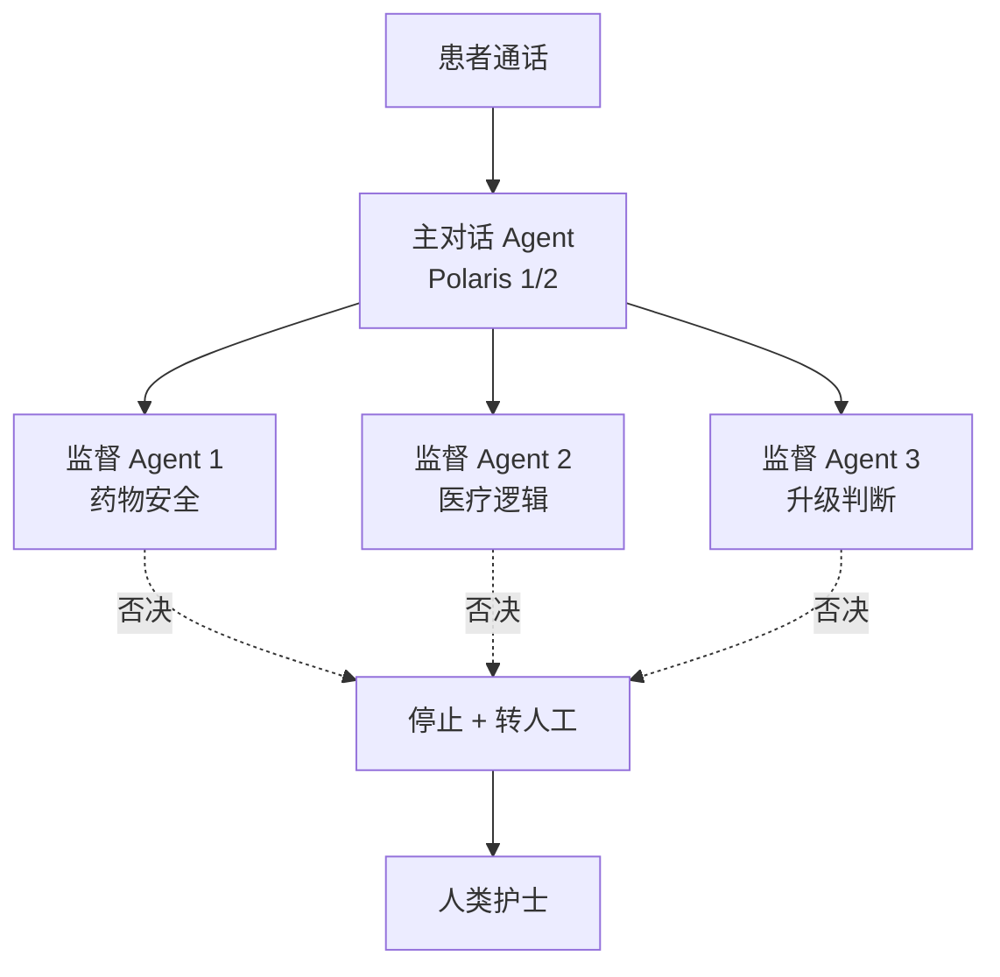

<!--
module:
  parent: ai
  slug: ai/case-hippocratic
  type: article
  category: 主模块子文章
  summary: Hippocratic AI 护理
-->

# Hippocratic AI：不替代医生的护理 Agent，7×24 患者随访的边界设计

#医疗 #编程 #客服 #HippocraticAI #边界设计 #护理Agent

> **一句话总结**：Hippocratic AI 把"我们不替代医生"写在产品第一行——靠这套边界，它在医疗 AI 红海里，把"非替代"做成了护城河。
>
> 原文链接：https://hippocraticai.com/
> 业务及融资参考：https://news.qq.com/rain/a/20250717A09G9000

---
---

## 一、医疗 AI 的"信任悬崖"

让 AI 接管护理电话看似完美——AI 可以 7×24 在线、永远不疲惫、覆盖每位出院患者。但医疗场景的容错率是反常识的：AI 错报一次血糖、错把"Benazepril"听成"Benadryl"，代价就是人命。**医疗 AI 是典型的"低频高损"——1000 次对话里只要 1 次致命错，整个产品就完蛋**。

Hippocratic AI 创始人 Munjal Shah 在 2022 年 12 月正式发布产品时，第一份对外文件里没有堆技术参数，而是反复强调一句话："safety-first healthcare workforce"。这三个词后来成为公司一切设计的总纲。

---

## 二、产品边界：四道红线

打开 Hippocratic AI 官网（hippocraticai.com），第一行大字写着"Our AI agents do not diagnose or prescribe"——不诊断、不开处方。这不是 PR 话术，而是**写进产品协议里的硬约束**：

**任务边界**——目前 1000+ 个 AI Agent 全部分布在"术前准备、术后随访、慢病管理、患者教育"四类场景。诊断和处方这两件事，AI 即使技术上能做，产品也不接。

**能力边界**——AI 在对话中只做两件事：通知（比如"您明天需要空腹抽血"）和记录（比如"患者反馈伤口有渗液"）。任何超出这两件事的请求，AI 都按预设剧本引导到人工。

**升级边界**——遇到任何"模糊、紧急、超出剧本"的信号，AI 立刻把对话转给人类护士。Hippocratic 把"什么时候转人工"做成了一个独立的质量指标，纳入每次通话的考核。

**合规边界**——所有产品线绕开最严格的 FDA 三类医疗器械审批。AI 只做"沟通与记录"，不参与"医疗决策"。

**这四道红线合起来，定义了 Hippocratic 的产品形态：AI 永远站在医生背后，不站到前面**。

---

## 三、Polaris 星座架构：边界怎么"工程化"

"不诊断"听上去是一句话，但要让它在 7×24 的真实通话里守住，需要专门的架构。Hippocratic 用了自研模型 Polaris 1 和 Polaris 2，把"边界"翻译成具体的工程机制。

**星座架构**：一个 Primary Agent 负责主对话，挂在它背后的是一组 Specialist Support Agents 监督模型集群。每个监督 Agent 盯一个独立的"红线"——药物识别、医疗逻辑、升级判断等。

Hippocratic 公开过一个真实案例：AI 在一次患者随访中把"Benazepril"听成了"Benadryl"——这是两个完全不同的药。在 Polaris 架构下，**主对话之外至少有 3 个监督 Agent 并行核对药物名**。任何一层投反对票，主对话必须停下，并立刻触发升级流程。

这正是"边界"在工程层的实现：**把"不能出错"翻译成多个独立模型并行验证 + 一票否决**。

---

## 四、落地数据：1.8 亿通电话的飞轮

2025 年 7 月披露的数据：累计 1.8 亿通真实患者电话；60+ 家医疗机构签约；AI Agent 收费 10 美元/小时；临床准确率 99.4%。

这些数字背后是一条清晰的飞轮：Hippocratic 通过 1.8 亿通真实通话积累了远超学术数据集的医疗语料，反过来让 Polaris 模型的"边界判断"越来越准；越准的模型让更多医院愿意签约；更多签约带来更多通话数据。

**Hippocratic 把自己锁死在"非诊断"这一格子里，反而获得了巨大的 TAM**：不去抢医生那 20% 的诊断工作，而是去补注册护士（RN）那 80% 的"高人力、低价值"工作——术后电话、慢病提醒、患者教育。这一块市场长期被医院忽视，却是 AI 最容易安全落地的地方。

---

## 五、对我们的启发："非替代"是高风险行业的护城河

Hippocratic AI 留下的方法论，**对所有做"高风险行业 AI 落地"的团队都成立**。

**第一，定位决定路径。** AI 最聪明的策略不是"假装比人类更厉害"，而是"把自己放在不需要代替人类的位置"。Hippocratic 不去抢"AI 医生"的标签，而是做"AI 护士"——后者市场更大、监管更轻、用户接受度更高。

**第二，边界需要被工程化，不能只停留在口号。** "不诊断"听上去是一句话，Hippocratic 把它翻译成 22 个监督 Agent + 一票否决机制 + 升级链路 + 临床准确率指标。**没有工程化的边界，等于没边界**——一次 PR 危机就会让整条防线崩塌。

**第三，"非替代"打开了被通用 AI 玩家忽略的市场缝隙。** 当所有人都在比"AI 能做什么"，Hippocratic 选择"AI 不做什么"。这种克制让它避开了和 OpenAI、Google、Anthropic 的正面竞争，**用"非替代"切到了被通用玩家忽略的、却最大量的医疗沟通场景**。

第四，AI 真正的护城河，往往不在模型参数，而在它进入某个高风险行业时**带去的整套安全工程机制**。Hippocratic 卖的不是"更准的 LLM"，而是"一个医疗团队能放心外包的 LLM"。这是另一种产品形态——AI 不再是"工具"，而是"可被监管的劳动力"。

---

*本文基于 Hippocratic AI 官网与海外独角兽报道整理，感谢分享。*

---

← [返回 AI 应用案例库](../README.md)
