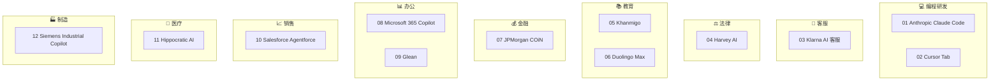

<!--
module:
  parent: ai
  slug: ai/case-studies
  type: article
  category: 主模块子文章
  summary: AI 应用案例库
-->

# AI 应用案例库

> 12 篇精选案例，覆盖 9 个行业，每篇聚焦一个"AI 重塑工作流"的标杆故事。
> 与现有 `ai-written-prd/` (Uber)、`shopify-ai-agent/` (Shopify) 同属"启发式"案例。

---
---

## 行业版图

## 12 篇速查表

| # | 标题 | 行业 | 一句话总结 | 核心机制 |
|---|------|------|-----------|---------|
| 01 | Anthropic Claude Code | 编程 | AI 写 AI 的飞轮 | 内部对 Agent 输出的 review 机制 |
| 02 | Cursor Tab | 编程 | 预测你的下一次编辑 | 编辑级预测 + 克制设计 |
| 03 | Klarna AI 客服 | 客服 | 先激进、后回调 | 情绪劳动是 AI 盲区 |
| 04 | Harvey AI | 法律 | 30% 员工是律师 | 垂直 know-how 是壁垒 |
| 05 | Khanmigo | 教育 | 苏格拉底式导师 | 不直接给答案的产品哲学 |
| 06 | Duolingo Max | 教育 | GPT-4 陪练角色 | 练习密度无限化 |
| 07 | JPMorgan COiN | 金融 | 36 万小时→秒级 | LLM 时代前的"白领流水线"先驱 |
| 08 | Microsoft 365 Copilot | 办公 | 工具→协作者 | 存量 SaaS 的 AI 升级路径 |
| 09 | Glean | 办公 | 散落知识一站搜 | RAG 的真正杀手场景 |
| 10 | Salesforce Agentforce | 销售 | 销售 Agent 自主跟进 | RPA → 自主 Agent 跃迁 |
| 11 | Hippocratic AI | 医疗 | 不替代医生的护理 Agent | 高风险行业的边界设计 |
| 12 | Siemens Industrial Copilot | 制造 | 自然语言生成 PLC | 工业 know-how > 模型 |

## 横向对比维度

**按产品阶段**:
- **验证期**: 04 Harvey, 09 Glean, 11 Hippocratic
- **规模化**: 01 Anthropic, 02 Cursor, 05 Khanmigo, 08 MS Copilot, 10 Agentforce
- **回调/反思**: 03 Klarna
- **先驱**: 07 JPMorgan (早于 LLM，AI 流程化的早期预演)

**按机制设计重点**:
- **克制设计**: 02 Cursor, 05 Khanmigo
- **非替代定位**: 03 Klarna（后段反思）, 11 Hippocratic
- **垂直 know-how**: 04 Harvey, 12 Siemens
- **自主决策**: 01 Anthropic, 10 Agentforce
- **存量改造**: 07 JPMorgan, 08 MS Copilot
- **连接器/集成**: 09 Glean
- **练习密度**: 06 Duolingo

## 学习路径建议

- 关注"克制设计": 02 → 05
- 关注"AI 落地的边界": 03 → 11
- 关注"垂直 know-how": 04 → 12
- 关注"传统行业转型": 07 → 08 → 12

## 相关章节

- 上游：[L4 架构设计](../../04-architecture/) — 系统分层与 AI Agent
- 同级：[automotive](../automotive/)、[embodied-ai](../embodied-ai/)、[ai-written-prd](../ai-written-prd/)、[shopify-ai-agent](../shopify-ai-agent/)
