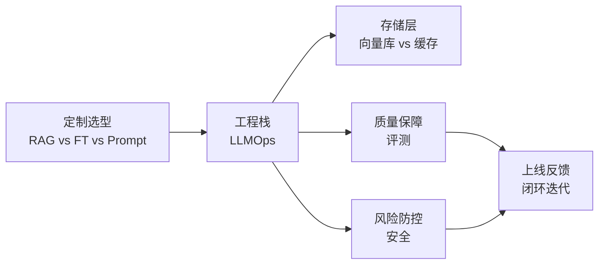

<!--
module:
  parent: ai
  slug: ai/llmops
  type: article
  category: 主模块子文章
  summary: LLMOps：从 RAG 到向量库到评测到安全的运维体系。
-->

# LLMOps：大语言模型生产运维体系

> 从 RAG vs 微调选型，到 LLMOps 栈搭建、向量库与缓存协同、评测体系、安全防护，一站式梳理 LLM 上线全链路。

## 目录导航

| 序号 | 主题 | 核心内容 |
|------|------|----------|
| 1 | [RAG vs Fine-tuning vs Prompt](01-rag-vs-finetuning/README.md) | 三大定制策略对比、选型决策、组合使用 |
| 2 | [LLMOps 栈](02-llmops-stack/README.md) | 数据/训练/部署/监控/反馈完整工程栈 |
| 3 | [向量库 vs 缓存](03-vector-db-vs-cache/README.md) | Embedding 检索 vs KV 缓存的边界与协同 |
| 4 | [LLM 评测](04-llm-evaluation/README.md) | 自动化评测、人工评测、A/B、红队对抗 |
| 5 | [LLM 安全](05-llm-security/README.md) | Prompt 注入、越狱、数据泄漏、内容合规 |

## 知识脉络

## 适用场景

- **AI 应用工程师**：从原型到生产环境落地的全链路参考
- **平台 / SRE**：搭建 LLM 推理平台与监控体系
- **安全 / 合规**：构建 LLM 内容安全与数据防护方案
- **PM / 产品经理**：理解 LLM 项目的工程复杂度与运维成本

---

← [返回 AI 知识体系](../README.md)