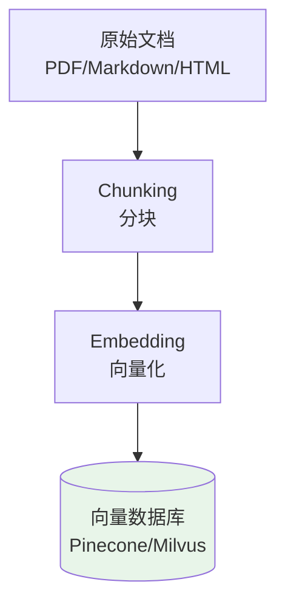
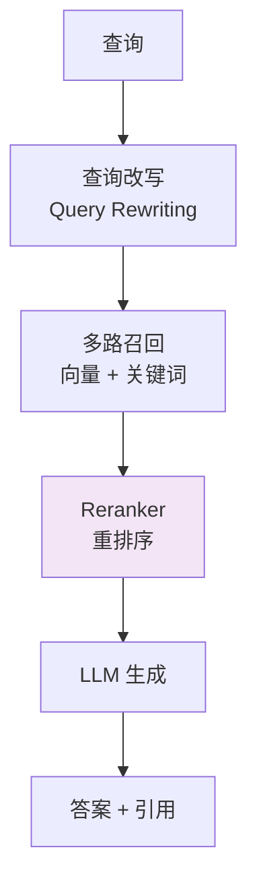

<!--
module:
  parent: ai
  slug: ai/rag-vs-finetuning
  type: article
  category: 主模块子文章
  summary: RAG vs Fine-tuning vs Prompt
-->

# RAG vs Fine-tuning vs Prompt Engineering：LLM 定制三大策略深度对比

> 一份按场景梳理的 LLM 定制速查手册：从 Prompt 到 RAG 到 Fine-tuning 的完整选型决策。

---
---

## 一、LLM 定制三大策略

| 策略 | 原理 | 适用 |
|------|------|------|
| **Prompt Engineering** | 优化输入提示 | 通用任务 / 一次性需求 |
| **RAG** | 检索增强生成（外挂知识库）| 知识密集 / 时效性 |
| **Fine-tuning** | 改模型参数 | 特定风格 / 任务 |

---

## 二、Prompt Engineering（提示工程）

### 2.1 核心模式

| 模式 | 说明 |
|------|------|
| **Zero-shot** | 直接问 |
| **Few-shot** | 给几个示例 |
| **CoT（思维链）** | "让我们一步步思考" |
| **ReAct** | 思考 + 行动 + 观察 |
| **Self-Consistency** | 多次采样投票 |

### 2.2 优势 vs 局限

| 优势 | 局限 |
|------|------|
| ✅ 零成本（不训练）| ❌ 受上下文窗口限制 |
| ✅ 立即生效 | ❌ 知识陈旧（训练截止）|
| ✅ 易于调试 | ❌ 复杂指令不稳定 |

---

## 三、RAG（检索增强生成）

### 3.1 核心架构

```text
用户问题 → Embedding → 向量数据库检索 → Top-K 文档
                ↓
        LLM（问题 + 检索结果）→ 生成答案
```

### 3.2 优势 vs 局限

| 优势 | 局限 |
|------|------|
| ✅ 知识实时更新（数据库）| ❌ 检索质量决定答案质量 |
| ✅ 无需训练（成本低）| ❌ 上下文窗口限制 |
| ✅ 答案可溯源（引用文档）| ❌ 检索增加延迟 |
| ✅ 保护隐私（数据不出域）| ❌ 需要维护向量数据库 |

### 3.3 典型场景

- 企业知识库问答
- 客服 / 售后机器人
- 文档摘要 / 内容生成
- 实时信息查询（新闻 / 股价）

---

## 四、Fine-tuning（微调）

### 4.1 训练方法

| 方法 | 原理 | 数据量 | 显存 |
|------|------|--------|------|
| **Full Fine-tuning** | 改所有参数 | 1 万+ | 100+ GB |
| **LoRA** | 改低秩矩阵 | 1000+ | 16-24 GB |
| **QLoRA** | 量化 + LoRA | 1000+ | 8-12 GB |
| **PEFT** | 多种高效方法 | 100+ | 中等 |

### 4.2 优势 vs 局限

| 优势 | 局限 |
|------|------|
| ✅ 改变模型行为 | ❌ 训练成本高 |
| ✅ 风格 / 格式定制 | ❌ 数据准备难 |
| ✅ 推理更快（无 RAG 检索）| ❌ 知识陈旧 |
| ✅ 离线可用 | ❌ 可能过拟合 |

### 4.3 典型场景

- 特定写作风格（律师 / 医生口吻）
- 特定任务（情感分析 / 实体抽取）
- 特定格式（始终输出 JSON）
- 减少 Token（无需 RAG 检索）

---

## 五、3 大策略决策树

```text
Q1: 是否需要实时更新的知识？
├── 是 → RAG
└── 否 ↓

Q2: 是否需要改变模型行为 / 风格？
├── 是 → Fine-tuning
└── 否 ↓

Q3: 是否需要复杂指令 / 推理？
├── 是 → Prompt Engineering（CoT / ReAct）
└── 否 → 简单 Prompt 即可

Q4: 数据规模？
├── < 100 条 → Prompt Engineering
├── 100-1000 条 → LoRA 微调
├── 1000+ 条 → RAG 或 QLoRA
└── 10 万+ 条 → 全参数微调（成本高）

Q5: 预算？
├── 极低（< 1 万）→ Prompt Engineering
├── 低（1-10 万）→ RAG
├── 中（10-100 万）→ LoRA / QLoRA
└── 高（100 万+）→ Full Fine-tuning
```

---

## 六、3 大策略组合（实战最佳实践）

```text
最佳实践 = Prompt + RAG + Fine-tuning（按需组合）
```

| 层次 | 策略 | 作用 |
|------|------|------|
| **基础层** | Prompt Engineering | 通用对话 / 推理 |
| **中间层** | RAG | 知识问答 / 实时数据 |
| **专业层** | Fine-tuning | 风格 / 任务定制 |

### 实战示例：法律咨询助手

```text
┌────────────────────────────────┐
│ 1. Prompt：                     │
│    "你是专业律师，引用法条"      │
└────────────────────────────────┘
                ↓
┌────────────────────────────────┐
│ 2. RAG：                         │
│    检索相关法条 + 案例库          │
└────────────────────────────────┘
                ↓
┌────────────────────────────────┐
│ 3. Fine-tuning：                 │
│    训练出"律所专业写作风格"        │
└────────────────────────────────┘
                ↓
        最终输出（专业 + 准确 + 有依据）
```

---

## 七、3 大策略成本对比

| 策略 | 初期成本 | 运营成本 | 可扩展性 |
|------|---------|---------|---------|
| **Prompt** | 💰 极低 | 💰 极低 | ⭐⭐⭐⭐⭐ |
| **RAG** | 💰💰 低 | 💰💰 中（向量库）| ⭐⭐⭐⭐ |
| **Fine-tuning** | 💰💰💰💰 高 | 💰 低 | ⭐⭐⭐ |

---

## 八、典型案例对比

| 案例 | 推荐策略 | 理由 |
|------|---------|------|
| **客服问答**（产品手册）| RAG | 知识实时更新 |
| **代码助手**（GitHub Copilot）| Fine-tuning | 学习代码风格 |
| **通用聊天** | Prompt | 无需定制 |
| **法律 / 医疗咨询** | RAG + Fine-tuning | 知识 + 风格 |
| **内容审核** | Fine-tuning | 分类任务 |
| **新闻摘要** | RAG | 实时新闻 |
| **数学推理** | Prompt（CoT）| 通用推理 |

---

## 九、工具与平台

| 任务 | 工具 |
|------|------|
| **Prompt 调试** | LangSmith / PromptLayer |
| **RAG 框架** | LangChain / LlamaIndex / Haystack |
| **向量数据库** | Pinecone / Weaviate / Milvus / Qdrant |
| **Fine-tuning** | Hugging Face / Axolotl / LLaMA-Factory |
| **LoRA** | PEFT / bitsandbytes |

---

## 十、最佳实践

1. **从 Prompt 开始**：80% 任务用 Prompt 就够
2. **RAG 在数据驱动场景**：知识库 / 实时数据必备
3. **Fine-tuning 在风格 / 任务**：不要用微调做"知识更新"
4. **组合使用**：Prompt + RAG + Fine-tuning 三大神器
5. **数据为王**：RAG 需要好文档 / Fine-tuning 需要好数据
6. **持续评估**：每个策略都要有量化指标
7. **A/B 测试**：策略切换要小流量验证

---

---

## 十一、RAG 架构设计深度

### 11.1 完整流程

#### 离线索引阶段



```python
from langchain.text_splitter import RecursiveCharacterTextSplitter
from langchain.embeddings import OpenAIEmbeddings
from langchain.vectorstores import Pinecone

# 1. 分块
splitter = RecursiveCharacterTextSplitter(
    chunk_size=1000,      # 每块 1000 字符
    chunk_overlap=200,    # 重叠 200 字符（保持上下文）
)
chunks = splitter.split_documents(documents)

# 2. 向量化 + 存储
embeddings = OpenAIEmbeddings()
vectorstore = Pinecone.from_documents(chunks, embeddings, index_name="docs")
```

#### 在线查询阶段

```python
def rag_query(question: str):
    # 1. 检索
    relevant_chunks = vectorstore.similarity_search(question, k=5)
    context = "\n\n".join(chunk.page_content for chunk in relevant_chunks)

    # 2. 构造 Prompt
    prompt = f"""基于以下上下文回答问题。如果上下文中没有答案，说明不知道。

上下文：
{context}

问题：{question}

答案："""

    # 3. 生成
    response = llm.invoke(prompt)
    return response
```

### 11.2 Chunking 策略

| 策略 | 原理 | 适用 |
|------|------|------|
| **固定大小** | 每块 N 字符 | 简单通用 |
| **按段落** | 按 `\n\n` 分割 | 结构化文档 |
| **递归分割** | 先按大分隔（标题），再按小（段落） | 长文档 |
| **语义分割** | 按语义相似度切分 | 复杂文本 |
| **文档结构** | 按代码函数、Markdown 标题 | 代码、MD |

**经验值**：
- 块大小：**500-1500 字符**（太小丢上下文，太大噪音多）
- 重叠：**10-20%**（保持连续性）

### 11.3 向量数据库选型

| 数据库 | 类型 | 适用 |
|--------|------|------|
| **Pinecone** | 云托管 | 快速启动，免运维 |
| **Weaviate** | 开源 + 云 | GraphQL 查询，多模态 |
| **Milvus** | 开源 | 大规模，高性能 |
| **Qdrant** | 开源 | Rust 实现，性能优秀 |
| **pgvector** | PostgreSQL 插件 | 已有 PG 的团队 |
| **Chroma** | 开源 | 轻量，本地开发 |

### 11.4 Embedding 模型选型

| 模型 | 维度 | 多语言 | 适用 |
|------|------|--------|------|
| **OpenAI text-embedding-3** | 1536 | ✅ | 通用首选 |
| **Cohere embed-v3** | 1024 | ✅ | 多语言优秀 |
| **BGE-M3**（BAAI） | 1024 | ✅ | 开源最佳 |
| **Jina v2** | 768 | ✅ | 长文本支持 |
| **Nomic Embed** | 768 | ✅ | 开源轻量 |

**中文场景**：强烈推荐 **BGE-M3** 或 **Cohere embed-v3**（OpenAI 对中文支持弱）。

### 11.5 Advanced RAG 优化

| 优化层 | 优化项 | 说明 |
|------|------|------|
| **检索优化** | 混合检索 | 向量检索 + BM25 关键词检索 |
| **检索优化** | 重排序（Reranking） | 用 Cross-Encoder 重排检索结果 |
| **检索优化** | 元数据过滤 | 按时间 / 作者 / 类别过滤 |
| **检索优化** | 查询扩展 | 用 LLM 改写 / 扩展查询 |
| **生成优化** | 引用源 | 在回答中标注来源片段 |
| **生成优化** | 置信度过滤 | 检索分数低于阈值不生成 |
| **生成优化** | Prompt 工程 | 强调"基于上下文回答，不知道就说不知道" |



---

## 面试陷阱速览

> 完整陷阱 + 反直觉 + 30 秒话术见 [13.split-hairs RAG](../../../13.split-hairs/11.ai/rag/README.md)

---

## 相关延伸：RAG 在 AI Coding 上的边界

RAG 适合**低频更新、结构化内容**（FAQ / 文档 / 合规），但**不适合高频更新的代码库**——Claude Code 等主流 AI Coding 工具主动放弃了 RAG，改用 Agentic Search。

- 深度原理：[Agentic Search vs RAG](../agentic-search-vs-rag/README.md)
- 面试题（高频反直觉）：[为什么 Claude Code 放弃了 RAG](../../../13.split-hairs/11.ai/claude-code-agentic-search/README.md)
- 实践原文：[Claude Code 最佳实践](../../03-engineering/claude-code-practices/README.md)

---

## 🔗 本专题兄弟章节

| # | 章节 | 一句话定位 |
|---|------|-----------|
| 1 | [RAG vs Fine-tuning vs Prompt](../01-rag-vs-finetuning/README.md) | 三大定制策略对比与选型决策 |
| 2 | [LLMOps 栈](../02-llmops-stack/README.md) | 数据/训练/部署/监控/反馈全链路工程栈 |
| 3 | [向量库 vs 缓存](../03-vector-db-vs-cache/README.md) | Embedding 检索 vs KV 缓存边界与协同 |
| 4 | [LLM 评测](../04-llm-evaluation/README.md) | 自动化指标 + 人工评测 + A/B + 红队对抗 |
| 5 | [LLM 安全](../05-llm-security/README.md) | OWASP LLM Top 10 + 6 层防御 + Guardrails 实战 |
| 6 | [RAG 超范围拒答](../06-rag-out-of-domain-rejection/README.md) | 6 大检测机制 + 5 大拒答模式 + 4 步调优 |

← [返回: L8 LLMOps](../README.md) · 📅 2026-06-28 · 更新：2026-07-03