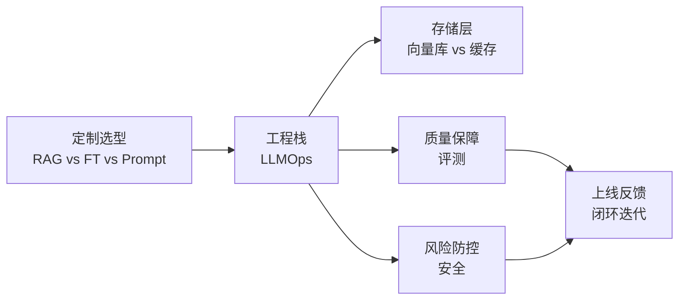

<!--
module:
  parent: ai
  slug: ai/llmops
  type: index
  category: 主模块子文章
  summary: LLMOps：从 RAG 到向量库到评测到安全的运维体系。
-->

# LLMOps：大语言模型生产运维体系

> 从 RAG vs 微调选型，到 LLMOps 栈搭建、向量库与缓存协同、评测体系、安全防护，一站式梳理 LLM 上线全链路。

## 1. 目录导航

| 序号 | 主题 | 核心内容 | 一句话定位 |
|------|------|---------|-----------|
| 01 | [RAG vs Fine-tuning vs Prompt](01-rag-vs-finetuning/) | 三大定制策略对比、选型决策、组合使用 | 定制选型第一站 |
| 02 | [LLMOps 栈](02-llmops-stack/) | 数据/训练/部署/监控/反馈完整工程栈 | 全链路工程化 |
| 03 | [向量库 vs 缓存](03-vector-db-vs-cache/) | Embedding 检索 vs KV 缓存的边界与协同 | 存储层选型 |
| 04 | [LLM 评测](04-llm-evaluation/) | 自动化评测、人工评测、A/B、红队对抗 | 质量保障 |
| 05 | [Agent 评测](../06-agent-evaluation) | 6 大指标维度（任务完成率/步骤效率/工具使用/成本/满意度/稳定性）+ 5 种评估方法 | Agent 性能量化 |
| 06 | [LLM 安全](05-llm-security/) | Prompt 注入、越狱、数据泄漏、内容合规 | 风险防控 |
| 07 | 🆕 [RAG 超范围拒答](06-rag-out-of-domain-rejection/) | 6 大检测机制 + 5 大拒答模式 + 4 步阈值调优 + 6 OSS 实战 | RAG 质量治理 |
| 08 | 🆕 [Agentic Search vs RAG](agentic-search-vs-rag/) | RAG 3 大工程问题 + Agentic Search 3 大优势 + Claude Code 5 大 Harness 扩展点 + 场景化决策矩阵 | AI Coding 检索范式 |

### 1.1 学习路径

- **AI 应用工程师**：01 → 02 → 04 → 05（从原型到生产环境落地的全链路参考）
- **平台 / SRE**：02 → 03 → 04（搭建 LLM 推理平台与监控体系）
- **安全 / 合规**：05 → 04（构建 LLM 内容安全与数据防护方案）
- **PM / 产品经理**：01 → 02 → 04（理解 LLM 项目的工程复杂度与运维成本）

---

## 2. 知识脉络

---

## 3. 速查表

| 概念 | 核心要点 | 典型场景 |
|------|---------|---------|
| **RAG** | 检索增强生成（外挂知识库） | 知识密集 / 时效性 |
| **Fine-tuning** | 改模型参数（SFT / LoRA / QLoRA） | 特定风格 / 任务 |
| **Prompt Engineering** | 优化输入提示 | 通用任务 / 一次性需求 |
| **LLMOps 栈** | 数据/训练/部署/监控/反馈闭环 | 全链路工程化 |
| **向量库** | Embedding 检索（Milvus / Qdrant / Chroma） | 语义搜索 / RAG |
| **KV 缓存** | 推理加速（vLLM / SGLang） | 高并发低延迟 |
| **LLM 评测** | 自动化 + 人工 + A/B + 红队 | 质量保障 |
| **Prompt 注入** | 恶意输入劫持 LLM | 安全防护 |

---

## 4. 核心内容（按子模块展开）

- **[01-rag-vs-finetuning](01-rag-vs-finetuning/)**：RAG vs Fine-tuning vs Prompt Engineering 三大定制策略深度对比与选型决策
- **[02-llmops-stack](02-llmops-stack/)**：LLMOps 完整工程栈 — 数据 / 训练 / 部署 / 监控 / 反馈
- **[03-vector-db-vs-cache](03-vector-db-vs-cache/)**：向量库 vs KV 缓存的边界与协同（语义检索 vs 推理加速）
- **[04-llm-evaluation](04-llm-evaluation/)**：LLM 评测体系 — 自动化指标（BLEU/ROUGE/BERTScore）+ 人工评测 + A/B 测试 + 红队对抗
- **[06-agent-evaluation](../06-agent-evaluation)**：Agent 性能评估 — 6 大指标维度（任务完成率/步骤效率/工具使用/成本/满意度/稳定性）+ 5 种评估方法
- **[05-llm-security](05-llm-security/)**：LLM 安全防护 — Prompt 注入 / 越狱 / 数据泄漏 / 内容合规
- 🆕 **[agentic-search-vs-rag](agentic-search-vs-rag/)**：Agentic Search 取代 RAG 的范式革命 — RAG 3 大工程问题 + Agentic Search 3 大优势 + Claude Code 5 大 Harness 扩展点 + 8 场景决策矩阵

---

## 5. 最佳实践

| 场景 | 实践要点 |
|------|---------|
| **定制选型** | 知识更新频繁 → RAG；风格/任务定制 → FT；通用任务 → Prompt；可组合使用 |
| **LLMOps 栈搭建** | 数据版本化（DVC/LakeFS）→ 训练流水线（Kubeflow/MLflow）→ 部署（vLLM/TGI）→ 监控（Langfuse/Phoenix）→ 反馈闭环 |
| **向量库选型** | 中小规模（<10M）→ Chroma；大规模（>10M）→ Milvus/Qdrant；云原生 → Weaviate |
| **评测体系** | 自动化指标兜底 + LLM-as-a-Judge + 人工抽检 + 线上 A/B + 红队对抗 |
| **安全防护** | Prompt 注入检测 + 输出内容审核 + 数据脱敏 + 工具调用白名单 + 审计日志 |

---

## 6. 常见面试题

| 题目 | 核心考点 |
|------|---------|
| RAG vs Fine-tuning vs Prompt 选型？ | 知识更新 / 风格定制 / 通用任务三类决策 |
| LLMOps vs MLOps 的区别？ | 数据从结构化扩展到非结构化；评测从准确率扩展到开放式质量 |
| 向量库与 KV 缓存的边界？ | 语义检索（跨请求）vs 推理加速（同请求） |
| LLM 评测的难点？ | 开放式生成无标准答案；自动化 + 人工 + LLM-as-Judge 多管齐下 |
| Prompt 注入防御？ | 输入清洗 + 指令隔离 + 输出过滤 + 工具白名单 |
| 反馈闭环如何设计？ | 用户反馈 → 标注 → 训练集 → 增量训练 → 评测 → 上线 |

---

## 7. 相关章节

- 上游：[L2 技术栈](../02-technology-stack/) → [L3 工程实践](../03-engineering/) → **LLMOps**
- 关联：[03.database](../../03.database/README.md) — 向量数据库底层（Milvus/Qdrant 实现）
- 关联：[04.system-design](../../04.system-design/README.md) — 系统设计（监控、可观测性）
- 面试：[13.split-hairs AI 新概念](../../13.split-hairs/11.ai/README.md) — RAG / Fine-tuning 面试精炼版

---

## 8. 开源参考

| 类别 | 项目 |
|------|------|
| 编排框架 | LangChain · LlamaIndex · Haystack |
| 推理引擎 | vLLM · TGI (Text Generation Inference) · SGLang · TensorRT-LLM |
| 向量数据库 | Milvus · Qdrant · Chroma · Weaviate · Pinecone |
| 评测工具 | LangSmith · Langfuse · Phoenix (Arize) · Ragas · TruLens |
| 安全工具 | Guardrails AI · NeMo Guardrails · Lakera Guard |
| 实验管理 | MLflow · Weights & Biases · DVC |

---

## 📊 本节统计

| 维度 | 数字 |
|------|------|
| 一级 leaf README 数 | 8（01-rag-vs-finetuning / 02-llmops-stack / 03-vector-db-vs-cache / 04-llm-evaluation / 06-agent-evaluation / 05-llm-security / 06-rag-out-of-domain-rejection / **agentic-search-vs-rag**） |
| 二级 leaf README 数 | 0 |
| 总 leaf README 数 | 8 |
| 学习路径主题数 | 4（应用工程师 / 平台 SRE / 安全合规 / PM） |
| 速查表条目数 | 8 |
| 最佳实践条数 | 5 |
| 常见面试题数 | 6 |
| 开源参考项目数 | 6 类共 20+ 条 |
| frontmatter 覆盖 | 8 / 8 = 100% |
| 文末回链覆盖 | 8 / 8 = 100% |

---

← [返回 AI 知识体系](../README.md)