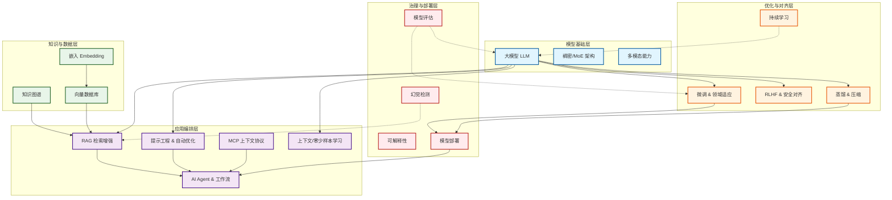

# 大模型（LLM）及其应用生态中的关键技术栈

随着人工智能技术的飞速发展，大语言模型（LLM）已从单纯的研究课题演变为驱动各行各业创新的核心引擎。构建一个成熟、可靠且高效的 LLM 应用，不仅仅依赖于模型本身，更需要一个庞大且复杂的技术生态栈支持。本文旨在梳理大模型及其应用生态中的关键技术栈，明确其概念定义，划分技术领域，并解析各技术栈之间的依赖与协作关系。

## 1. 核心概念名称和定义

在深入技术栈之前，我们需要明确生态中基础术语的定义。以下基于行业标准及上下文整理出的核心概念：

| 概念名称 | 定义简述 |
| :--- | :--- |
| **大模型 (LLM)** | 基于海量数据训练的深度学习模型，具备理解和生成人类语言的能力。 |
| **RAG** | 检索增强生成，结合外部知识库检索与文本生成，提升准确性。 |
| **AI Agent** | 能感知环境、规划行动并调用工具以完成复杂目标的自主实体。 |
| **Agent 工作流** | 协调多个 Agent 或步骤以实现端到端应用的预定义任务序列。 |
| **MCP (模型上下文协议)** | 规范模型如何动态管理、访问和整合上下文信息的标准化协议。 |
| **微调 (Fine-tuning)** | 使用特定数据在预训练模型基础上进一步训练，以适应新任务。 |
| **提示工程 (Prompt Engineering)** | 设计输入提示以引导模型生成更精确、可控输出的技术。 |
| **上下文学习 (In-Context Learning)** | 模型通过输入中的示例即时学习，无需更新参数。 |
| **零/少样本学习** | 无示例（零样本）或极少示例（少样本）下模型泛化适应新任务。 |
| **模型蒸馏** | 将大模型知识迁移至小模型，压缩规模并保持性能。 |
| **RLHF** | 利用人类反馈作为奖励信号，优化模型行为符合人类价值观。 |
| **多模态** | 处理和融合文本、图像、音频等多种数据模态的能力。 |
| **知识图谱** | 以实体 - 关系三元组表示信息的结构化知识库。 |
| **向量数据库** | 专为高效存储和检索高维向量（嵌入）设计的数据库。 |
| **嵌入 (Embedding)** | 将离散数据映射为低维连续向量，捕获语义相似性。 |
| **对齐 (Alignment)** | 调整模型行为，使其与人类意图和社会规范保持一致。 |
| **可解释性** | 使模型决策过程透明化，便于人类理解与信任。 |
| **幻觉 (Hallucination)** | 模型生成看似合理但事实错误或虚构内容的现象。 |
| **模型评估** | 使用指标和分析系统测量模型性能、鲁棒性和公平性。 |
| **模型部署** | 将模型集成到生产环境，提供实时推理能力。 |
| **模型压缩** | 通过剪枝、量化等技术减小模型规模，提升效率。 |
| **持续学习** | 模型在序列化任务中持续学习新知识，避免灾难性遗忘。 |
| **领域适应** | 调整模型以适应新领域数据分布的技术。 |
| **安全对齐** | 针对有害内容的对齐机制，确保输出安全、无害。 |
| **自动提示优化** | 利用算法自动生成和优化提示，最大化模型性能。 |
| **稠密模型** | 所有参数参与每次计算的神经网络架构。 |
| **混合专家模型 (MoE)** | 稀疏架构，对每个输入仅激活部分专家子网络，平衡规模与效率。 |

## 2. 技术领域划分与栈详解

为了更清晰地理解这些技术如何协作，我们将上述技术栈划分为五个核心领域：**模型基础层**、**优化与对齐层**、**知识与数据层**、**应用编排层**、**治理与部署层**。

### 2.1 模型基础层 (Model Foundation Layer)
这是整个生态的基石，决定了智能的上限。
*   **包含技术栈**：大模型 (LLM)、稠密模型、混合专家模型 (MoE)、多模态。
*   **解决什么问题**：提供通用的语言理解、逻辑推理及跨模态感知能力。MoE 架构解决了参数规模膨胀带来的计算成本问题，多模态则打破了单一文本的限制。
*   **依赖与关联**：
    *   依赖海量预训练数据和算力基础设施。
    *   是**优化与对齐层**的操作对象。
    *   为**应用编排层**提供推理引擎。

### 2.2 优化与对齐层 (Optimization & Alignment Layer)
该领域关注如何让通用模型变得更专业、更安全、更高效。
*   **包含技术栈**：微调、RLHF、模型蒸馏、模型压缩、持续学习、领域适应、对齐、安全对齐。
*   **解决什么问题**：
    *   **专业化**：通过微调和领域适应，使模型懂行业术语（如医疗、法律）。
    *   **价值观**：通过 RLHF、对齐和安全对齐，减少偏见和有害输出。
    *   **效率**：通过蒸馏和压缩，使模型能在边缘设备或低成本服务器上运行。
    *   **进化**：通过持续学习，让模型随时间推移掌握新知识。
*   **依赖与关联**：
    *   依赖**模型基础层**的预训练权重。
    *   依赖人类反馈数据（用于 RLHF）。
    *   输出优化后的模型权重，供**模型部署**使用。

### 2.3 知识与数据层 (Knowledge & Data Layer)
大模型存在知识截止和幻觉问题，该层为模型提供“外挂大脑”和长期记忆。
*   **包含技术栈**：嵌入 (Embedding)、向量数据库、知识图谱。
*   **解决什么问题**：
    *   **语义检索**：Embedding 将非结构化数据转化为向量，向量数据库实现高效相似性搜索。
    *   **事实准确性**：知识图谱提供结构化事实，辅助模型推理，减少幻觉。
    *   **私有数据接入**：允许企业在不重新训练模型的情况下使用内部数据。
*   **依赖与关联**：
    *   依赖原始业务数据。
    *   是**RAG**技术的核心组件。
    *   为**应用编排层**提供实时上下文信息。

### 2.4 应用编排层 (Application Orchestration Layer)
这是用户直接交互的层面，负责将模型能力转化为实际业务价值。
*   **包含技术栈**：RAG、AI Agent、Agent 工作流、提示工程、上下文学习、零/少样本学习、自动提示优化、MCP。
*   **解决什么问题**：
    *   **任务自动化**：Agent 和工作流能自主规划并调用工具（如搜索、API）完成复杂任务。
    *   **效果增强**：RAG 结合检索与生成；提示工程和自动优化确保模型输出质量。
    *   **上下文管理**：MCP 和上下文学习管理对话历史和任务状态。
*   **依赖与关联**：
    *   依赖**模型基础层**提供推理能力。
    *   依赖**知识与数据层**提供检索内容。
    *   直接面向最终用户或业务系统。

### 2.5 治理与部署层 (Governance & Deployment Layer)
确保模型在生产环境中稳定、可信、可控地运行。
*   **包含技术栈**：模型评估、幻觉检测、可解释性、模型部署。
*   **解决什么问题**：
    *   **质量监控**：模型评估量化性能；幻觉检测识别错误信息。
    *   **信任建立**：可解释性让黑盒决策透明化。
    *   **服务化**：模型部署将算法转化为 API 服务。
*   **依赖与关联**：
    *   贯穿整个生命周期，对**优化层**的效果进行验证。
    *   保障**应用编排层**的稳定性。
    *   反馈数据可用于后续的**持续学习**或**RLHF**。

## 3. 关键技术栈全景图

下图展示了上述五个领域之间的逻辑关系与数据流向。从底层的模型架构，到中间的知识增强与优化，再到上层的应用编排，最后由治理层进行全链路监控。

### 全景图解读
1.  **纵向支撑**：**模型基础层**位于底部，支撑上层的优化与应用；**治理与部署层**贯穿右侧，确保从模型训练到应用服务的全流程可控。
2.  **横向增强**：**知识与数据层**位于左侧，通过 RAG 等技术为应用层提供实时、准确的外部信息，弥补模型内部知识的不足。
3.  **核心闭环**：**优化与对齐层**接收来自治理层的评估反馈（如 RLHF 中的人类偏好），不断迭代模型权重，形成“训练 - 评估 - 优化”的闭环。
4.  **交互核心**：**应用编排层**是用户感知的核心，它调度模型、检索知识、规划 Agent 动作，将技术能力转化为业务结果。

## 结语

大模型应用生态并非单一技术的堆砌，而是一个高度协同的系统工程。从底层的 MoE 架构设计，到中间的向量检索与 RAG 增强，再到上层的 Agent 自主规划，每一个技术栈都在解决特定的瓶颈。理解这些技术栈的定义、领域划分及其相互依赖关系，是构建下一代智能应用的关键。未来，随着 MCP 等协议的标准化以及多模态能力的进一步融合，这一技术栈将更加模块化、自动化，推动 AI 从“对话”走向“行动”。