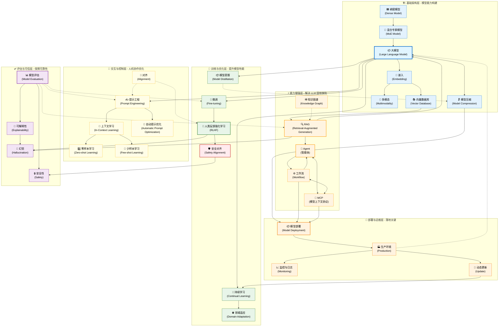
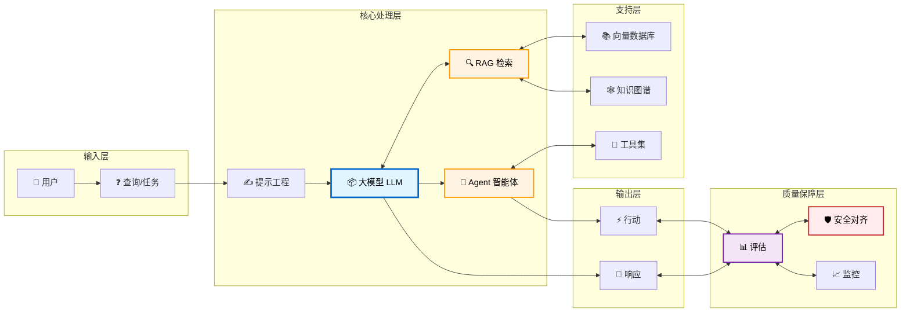

# 大模型（LLM）及其应用生态中的关键技术栈

1. **大模型（Large Language Model, LLM）**：一种基于海量数据训练的深度学习模型，参数规模巨大，能够理解和生成人类语言以执行多种任务。
2. **RAG（Retrieval-Augmented Generation）**：一种技术框架，通过结合实时检索外部知识库与文本生成，提升模型输出的准确性和相关性。
3. **Agent（智能体）**：一个自主AI实体，能感知环境、规划行动并执行工具调用以完成复杂目标。
4. **工作流（Workflow）**：一个预定义的任务序列或自动化流程，用于协调多个步骤（如数据处理、模型调用）以实现端到端应用。
5. **模型上下文协议(MCP)**：一种标准化协议，规范大型语言模型如何动态管理、访问和整合上下文信息以提升推理质量（注：MCP非广泛标准术语，此处基于上下文推断）。
6. **微调（Fine-tuning）**：在预训练模型基础上，使用特定领域数据进一步训练以适应新任务或数据分布的过程。
7. **提示工程（Prompt Engineering）**：通过精心设计输入提示（如指令、示例）来引导模型生成更精确、可控输出的技术。
8. **上下文学习（In-Context Learning）**：模型通过输入中提供的少量示例即时学习任务模式，而无需更新内部参数。
9. **零样本/少样本学习（Zero-shot / Few-shot Learning）**：零样本指模型无任务示例直接泛化，少样本指仅需极少量示例就能适应新任务。
10. **模型蒸馏（Model Distillation）**：将大型教师模型的知识（如预测分布）迁移至小型学生模型，以压缩规模并保持性能。
11. **人类反馈强化学习（RLHF）**：利用人类偏好作为奖励信号，通过强化学习优化模型行为，使其输出更符合人类价值观。
12. **多模态（Multimodality）**：模型处理和融合多种数据模态（如文本、图像、音频）的能力，以实现跨模态理解和生成。
13. **知识图谱（Knowledge Graph）**：一种结构化知识库，以实体-关系三元组形式表示信息，支持语义推理和查询。
14. **向量数据库（Vector Database）**：专为高效存储、索引和检索高维向量（如嵌入）设计的数据库，用于相似性搜索。
15. **嵌入（Embedding）**：将离散数据（如词或图像）映射为低维连续向量，以捕获语义或特征相似性。
16. **对齐（Alignment）**：调整模型行为，使其输出与人类意图、价值观和社会规范保持一致的过程。
17. **可解释性（Explainability）**：使模型决策过程透明化，便于人类理解、验证和信任其内部机制。
18. **幻觉（Hallucination）**：模型生成看似合理但事实错误或虚构内容的现象，常因训练数据偏差或推理缺陷导致。
19. **模型评估（Model Evaluation）**：使用定量指标（如准确率）和定性分析系统测量模型性能、鲁棒性和公平性。
20. **模型部署（Model Deployment）**：将训练好的模型集成到生产环境（如API或云服务），以提供实时推理能力。
21. **模型压缩（Model Compression）**：通过剪枝、量化或知识蒸馏等技术减小模型规模，提升推理效率而不显著损失精度。
22. **持续学习（Continual Learning）**：模型在序列化任务中持续学习新知识，同时避免灾难性遗忘先前技能的能力。
23. **领域适应（Domain Adaptation）**：调整预训练模型以适应新领域数据分布的技术，通常通过微调或特征对齐实现。
24. **安全对齐（Safety Alignment）**：专门针对有害内容（如偏见、毒性）的对齐机制，确保模型输出安全、无害且符合伦理。
25. **自动提示优化（Automatic Prompt Optimization）**：利用算法（如梯度搜索或强化学习）自动生成和优化提示，以最大化模型性能。
26. **稠密模型（Dense Model）**：一种神经网络架构，其中每个输入都通过所有网络层和参数进行处理，所有参数参与每次计算。
27. **混合专家模型（MoE Model, Mixture of Experts）**：一种稀疏架构，将模型分为多个"专家"子网络，对每个输入仅激活部分专家，实现参数规模与计算效率的平衡。

这些概念共同构成了当前大模型（LLM）及其应用生态中的关键技术栈。它们之间并非孤立存在，而是彼此交织、协同支撑一个完整的智能系统。

---

## **一、基础架构层**（模型能力构建）
1. **大模型（LLM）**
    - **核心**：所有技术的基座，通过海量数据训练获得通用语言理解与生成能力。
2. **嵌入（Embedding）**
    - **作用**：将文本/多模态数据转化为向量，是**向量数据库**和**RAG**的底层基础。
3. **模型压缩（Model Compression）**
    - **目标**：通过蒸馏（**模型蒸馏**）、量化、剪枝等技术，降低 LLM 部署成本，为**模型部署**提供轻量化方案。
4. **多模态（Multimodality）**
    - **扩展**：使 LLM 处理文本、图像、音频等多源数据，依赖跨模态**嵌入**技术。
5. **稠密模型（Dense Model）**
    - **特点**：传统架构，所有参数参与每次前向传播，计算密集但可控性强。
6. **混合专家模型（MoE Model）**
    - **优势**：通过稀疏激活机制，用少量计算资源调用海量参数，突破**稠密模型**的计算瓶颈。

> **关系链**：`LLM → 嵌入 → 向量数据库/RAG`；`LLM + 模型压缩 → 高效部署`；`稠密模型 → MoE 架构演进`

---

## **二、能力增强层**（解决 LLM 固有缺陷）
| **技术**            | **解决的核心问题**     | **依赖技术**        | **关联技术**         |
|-------------------|-----------------|-----------------|------------------|
| **RAG**           | 知识更新慢、幻觉        | 向量数据库 + 嵌入      | 知识图谱（结构化知识补充）    |
| **Agent**（智能体）    | 复杂任务分解与工具调用     | 工作流 + MCP 协议     | RAG（获取外部知识）      |
| **工作流（Workflow）** | 任务流程自动化         | Agent 编排 + MCP 协议 | 持续学习（动态优化流程）     |
| **模型上下文协议 (MCP)**  | Agent 间/工具间通信标准化 | -               | 工作流、Agent 系统的核心协议 |
| **MoE 架构**         | 计算效率与参数规模平衡    | 稠密模型演进 + 路由算法   | 模型压缩、模型部署       |

> **关键关系**：
> - **RAG** 通过**向量数据库**检索外部知识，抑制**幻觉**，补充 LLM 静态知识。
> - **Agent** 依赖**工作流**拆解任务，通过**MCP 协议**调用工具（如 RAG、代码执行器）。
> - **知识图谱** 与 **向量数据库** 互补：图谱提供逻辑关系，向量库提供语义相似性。
> - **稠密模型** 与 **MoE** 对比：前者适合中小规模稳定场景，后者适合千亿级参数大规模场景。

---

## **三、训练与优化层**（提升模型性能）
| **技术**                       | **目标**          | **与LLM的关系**    |
|------------------------------|-----------------|----------------|
| **微调（Fine-tuning）**          | 适配特定领域/任务       | 在预训练LLM基础上增量训练 |
| **人类反馈强化学习（RLHF）**           | 价值观对齐、减少有害输出    | 通过人类偏好优化微调后模型  |
| **持续学习（Continual Learning）** | 避免灾难性遗忘，增量学习新知识 | 解决微调导致的旧知识覆盖问题 |
| **领域适应（Domain Adaptation）**  | 跨领域迁移（如医疗→法律）   | 微调/提示工程的特殊场景   |
| **模型蒸馏（Model Distillation）** | 用大模型指导小模型训练     | 模型压缩的核心手段之一    |

> **协同关系**：
> - **微调** + **RLHF** = **安全对齐（Safety Alignment）**（确保输出符合人类价值观）。
> - **持续学习** 需结合**领域适应**技术，避免知识冲突。
> - **模型蒸馏** 为边缘设备部署提供轻量模型（**模型部署**的前置步骤）。

---

## **四、交互与控制层**（人机协作优化）
1. **提示工程（Prompt Engineering）**
    - **核心**：设计输入提示引导LLM输出，低成本优化效果。
2. **上下文学习（In-Context Learning）**
    - **机制**：通过提示中的示例（**少样本学习**）激发LLM能力，是**零样本学习**的升级。
3. **自动提示优化（Automatic Prompt Optimization）**
    - **进化**：用算法（如梯度搜索、LLM自我迭代）替代人工设计提示。
4. **对齐（Alignment）**
    - **目标**：使模型行为符合人类意图，贯穿**RLHF**、**安全对齐**、**提示工程**。

> **关键路径**：  
> `人工提示工程 → 自动提示优化 → 结合ICL实现少样本适应`  
> **对齐**是终极目标：通过RLHF（训练层）、安全规则（部署层）、提示约束（交互层）多维度实现。

---

## **五、评估与可信层**（保障可靠性）
| **概念**                     | **作用**           | **关联技术**       |
|----------------------------|------------------|----------------|
| **幻觉（Hallucination）**      | 评估模型事实准确性        | RAG（抑制幻觉）、模型评估 |
| **模型评估（Model Evaluation）** | 量化性能（准确性/安全性/效率） | 可解释性、对齐指标      |
| **可解释性（Explainability）**   | 分析模型决策逻辑         | 安全对齐、幻觉归因      |
| **安全对齐（Safety Alignment）** | 防御越狱、偏见、有害内容     | RLHF、内容过滤规则    |

> **闭环关系**：  
> **评估**发现**幻觉** → 用**RAG/RLHF/提示工程**修复 → 通过**可解释性**验证修复效果 → 重新**评估**。

---

## **六、部署与运维层**（落地关键）
- **模型部署（Model Deployment）**  
  依赖**模型压缩**（减小体积）、**工作流引擎**（任务调度）、**MCP 协议**（服务通信）。
- **持续学习**与**领域适应**  
  在部署后动态更新模型，适应新数据分布（需解决灾难性遗忘）。
- **向量数据库**  
  为 RAG 提供低延迟检索，是生产环境的关键组件。
- **架构选型**  
  **稠密模型**适合延迟敏感场景，**MoE**适合需要超大容量的推理任务。

---

## **全局关系图**


---

## **简化版关系图（聚焦核心流程）**


---

## **技术栈层次关系图**

```mermaid
graph BT
    LLM["📦 大模型 (LLM)<br/>基座与核心"]
    
    LLM --> Architecture["🏗️ 架构选择"]
    Architecture --> Dense["稠密模型<br/>稳定场景"]
    Architecture --> MoE["MoE 模型<br/>大规模场景"]
    
    LLM --> Enhancement["⚡ 能力增强"]
    Enhancement --> RAG["RAG<br/>知识检索"]
    Enhancement --> Agent["Agent<br/>任务执行"]
    Enhancement --> Workflow["工作流<br/>流程编排"]
    
    LLM --> Optimization["🎯 训练优化"]
    Optimization --> FineTuning["微调"]
    Optimization --> RLHF["RLHF 对齐"]
    Optimization --> Distillation["蒸馏压缩"]
    
    LLM --> Interaction["💬 交互控制"]
    Interaction --> Prompt["提示工程"]
    Interaction --> ICL["上下文学习"]
    Interaction --> AutoPrompt["自动优化"]
    
    LLM --> Evaluation["✅ 评估可信"]
    Evaluation --> Metrics["性能评估"]
    Evaluation --> Explain["可解释性"]
    Evaluation --> Safety["安全对齐"]
    
    LLM --> Deployment["🚀 部署运维"]
    Deployment --> Production["生产环境"]
    Deployment --> Monitoring["监控日志"]
    Deployment --> Update["持续学习"]
    
    style LLM fill:#e1f5ff,stroke:#0066cc,stroke-width:4px,color:#000
    style RAG fill:#fff4e1,stroke:#ff9900,stroke-width:2px,color:#000
    style Agent fill:#fff4e1,stroke:#ff9900,stroke-width:2px,color:#000
    style RLHF fill:#e8f5e9,stroke:#2e7d32,stroke-width:2px,color:#000
    style Safety fill:#ffebee,stroke:#c62828,stroke-width:2px,color:#000
    style Evaluation fill:#f3e5f5,stroke:#7b1fa2,stroke-width:2px,color:#000
```


---

## **关键洞见**
1. **RAG与Agent是互补架构**：
    - RAG解决**知识局限**，Agent解决**任务复杂性**；二者通过工作流集成（如Agent调用RAG工具）。
2. **对齐是贯穿性目标**：  
   从训练（RLHF）→ 交互（提示约束）→ 部署（安全规则）多层保障。
3. **成本-性能权衡**：
    - 轻量方案：**提示工程** + **RAG**（无需训练）
    - 高精度方案：**微调** + **RLHF** + **知识图谱**（高成本）
4. **幻觉治理三角**：
   ```mermaid
   graph LR
    RAG[外部知识检索] -->|抑制| Hallucination[幻觉]
    RLHF[人类反馈] -->|价值观约束| Hallucination
    Evaluation[严格评估] -->|检测| Hallucination
   ```

> **总结**：现代 LLM 系统 = **基座模型**（稠密/MoE） × **增强架构**（RAG/Agent） × **对齐机制**（RLHF/安全规则） × **持续进化**（评估 - 优化闭环）。理解这些概念的关系，本质是理解如何构建**可靠、高效、可控**的 AI 系统。