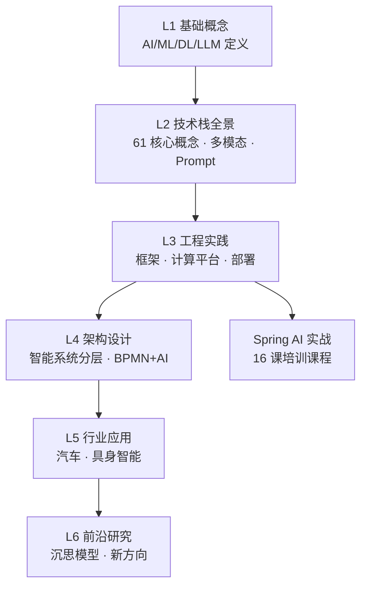

# AI 知识体系

> 从基础概念到行业落地，系统化理解人工智能技术栈。

本目录按 **知识层级递进** 组织，从理论到实践，从底层算法到上层应用。

---

## 目录导航

| 层级 | 目录 | 内容 |
|------|------|------|
| **L1 基础概念** | [01-fundamentals](01-fundamentals/) | AI/ML/DL/LLM 基础定义、神经网络层次、架构对比 |
| **L2 技术栈** | [02-technology-stack](02-technology-stack/) | LLM 生态全景(61核心概念)、多模态、Prompt工程、显存估算 |
| **L3 工程实践** | [03-engineering](03-engineering/) | 深度学习框架、应用开发框架、计算平台、本地部署、[AI 编排平台](03-engineering/ai-platforms/)（Dify/Coze/LangGraph）|
| **L4 架构设计** | [04-architecture](04-architecture/) | 智能系统分层架构、[AI + BPMN 融合](04-architecture/bpmn-ai-integration.md)、2026技术趋势 |
| **L5 行业应用** | [05-applications](05-applications/) | 汽车行业落地、具身智能 |
| **L6 前沿研究** | [06-research](06-research/) | 沉思模型(Rumination)等前沿探索 |
| **教学课程** | [training](training/) | Spring AI 实战教学课程 |

## 知识脉络

## 学习路径

- **初学者**：L1 → L2 建立认知框架
- **工程师**：L2 → L3 掌握落地能力
- **架构师**：L3 → L4 系统级设计
- **行业研究者**：L5 → L6 探索未来方向

## 相关章节

- 关联：[`04.system-design`](../04.system-design/) — 通用系统设计（AI 系统也遵循分布式/高可用原则）
- 关联：[`06.spring`](../06.spring/) — Spring 生态（Spring AI 的底层支撑）
- 关联：[`07.workflow`](../07.workflow/) — 工作流引擎（BPMN + AI Agent 融合）
- 面试：[`13.split-hairs/11.ai`](../13.split-hairs/11.ai/README.md) — 5 篇 AI 高频面试题
