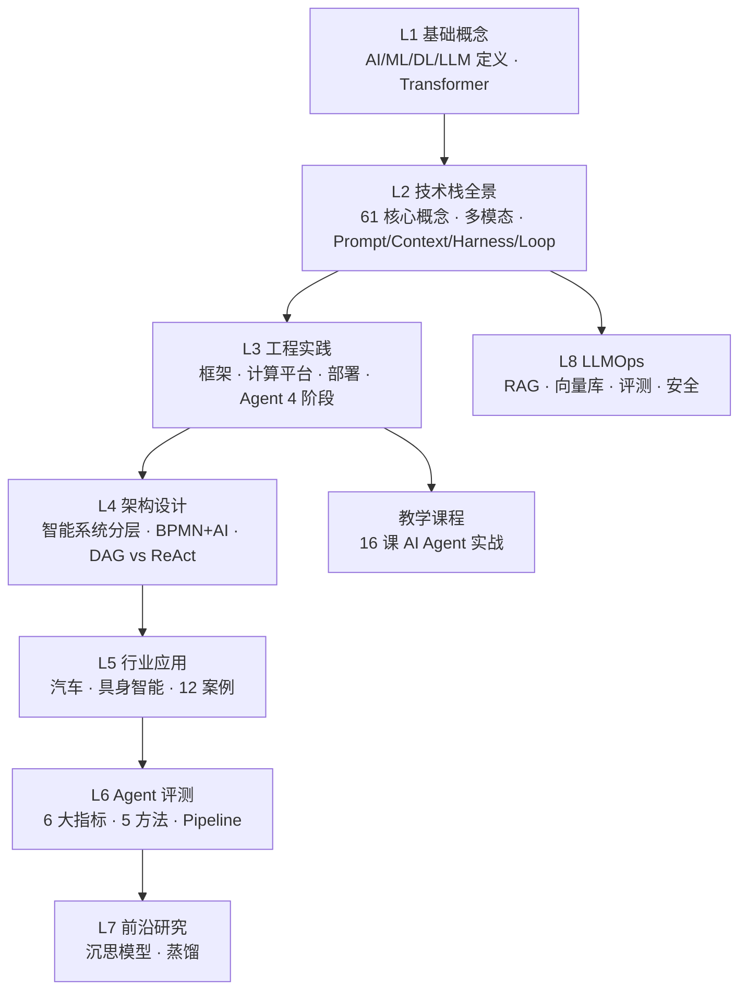

<!--
module:
  number: 11
  slug: ai
  topic: AI 知识体系
  audience: AI 工程师 / 后端
  category: 主模块
  summary: 从基础概念到行业落地，系统化理解人工智能技术栈。
-->

# 十一、AI 知识体系

> 从基础概念到行业落地，系统化理解人工智能技术栈。

本目录按 **L1-L8 知识层级递进 + 教学课程** 九大主题组织，从理论到实践，从底层算法到上层应用。

---

## 1. 模块导航

| 序号 | 主题 | 核心内容 | 子 README |
|------|------|---------|-----------|
| 01 | [L1 基础概念](01-fundamentals/) | LLM 定义 · Transformer · 神经网络层次 · Embedding · Dense vs MoE | [子入口](01-fundamentals/) |
| 02 | [L2 技术栈](02-technology-stack/) | 61 核心概念全景 · 多模态 · Prompt/Context/Harness/Loop · Function Calling · Token 计费 | [子入口](02-technology-stack/) |
| 03 | [L3 工程实践](03-engineering/) | 深度学习/LLM 应用框架 · 计算平台 · 本地部署 · Dify/Coze · Claude Code · Agent 4 阶段 | [子入口](03-engineering/) |
| 04 | [L4 架构设计](04-architecture/) | 智能系统分层 · AI + BPMN 融合 · DAG vs ReAct · 本体驱动 Agent · 2026 趋势 | [子入口](04-architecture/) |
| 05 | [L5 行业应用](05-applications/) | 汽车 · 具身智能 · AI 撰写 PRD · Shopify AI · 12 个行业标杆案例 | [子入口](05-applications/) |
| 06 | [L6 Agent 评测](06-agent-evaluation/) | 6 大指标 · 5 种方法 · LLM-as-Judge · Pipeline · 阿里面试 · 7 反模式 · 选型决策树 | [子入口](06-agent-evaluation/) |
| 07 | [L7 前沿研究](07-research/) | 沉思模型 · 知识蒸馏 · 推理增强 · 多模态融合 | [子入口](07-research/) |
| 08 | [L8 LLMOps](08-llmops/) | RAG vs 微调 · LLMOps 栈 · 向量库 vs 缓存 · 评测 · 安全 | [子入口](08-llmops/) |
| 09 | [教学课程](training/) | AI Agent 应用开发 16 课培训（Spring AI · MCP · Skills · 多智能体 · 安全） | [子入口](training/) |

### 1.1 学习路径

- **新人入门**：L1 基础概念 → L2 技术栈 → L3 工程实践
- **AI 应用工程师**：L2 → L3 → L8 LLMOps
- **AI 架构师**：L3 → L4 架构设计 → L5 行业应用 → L6 Agent 评测
- **前沿研究者**：L1 → L2 → L7 前沿研究 → L4 架构设计
- **教学/培训**：L1 → L2 → 教学课程 16 课
- **📌 主线推荐**：[LLM 驾驭演进史](04-architecture/llm-control-evolution/README.md) — 理解全貌后跳读 L2/L3 详情

---

## 2. 知识脉络

---

## 3. 速查表 / Cheat Sheet

### 3.1 核心概念

| 概念 | 核心要点 | 典型场景 |
|------|---------|---------|
| **LLM** | 大语言模型，Transformer 架构，预训练 + 微调 | 文本生成、对话 |
| **Transformer** | Self-Attention + 位置编码，并行计算 | 所有现代 LLM 基座 |
| **Token** | 模型最小处理单元，BPE/WordPiece 分词 | 计费与上下文长度 |
| **Embedding** | 将文本映射到高维向量空间 | 语义搜索、RAG |
| **RAG** | 检索增强生成，向量检索 + LLM 生成 | 知识库问答 |
| **Prompt Engineering** | 通过提示词引导 LLM 输出（CoT/Few-shot/Role） | 无需微调的提升效果 |
| **Context Engineering** | 为 LLM 提供完整"上下文"（系统提示+工具+历史+RAG+记忆） | Agent 时代的主流范式 |
| **Harness Engineering** | 用规范/流程/工具约束 Agent 行为（OpenSpec / CI/CD） | Agent 自我约束工程 |
| **Loop Engineering** | 循环调用 Agent 直到任务完成（Task+Verifier+Feedback） | 探索性任务自动化 |
| **Fine-tuning** | 在特定数据上继续训练（LoRA/QLoRA 高效微调） | 领域适配 |
| **Agent** | LLM + 工具调用 + 记忆 + 规划 | 自主完成任务 |
| **DAG vs ReAct** | ReAct 适合探索 / DAG 适合确定性流程 | Agent 架构选型 |
| **MCP** | Model Context Protocol，标准化工具接入协议 | Agent 工具扩展 |
| **MoE** | Mixture of Experts，稀疏激活提升效率 | GPT-4 / Mixtral |

### 3.2 研发效能度量

| 指标 | 维度 | 适用 |
|------|------|------|
| **DORA 4 指标** | 部署频率 / 前置时间 / 失败率 / MTTR | AI 时代研发效能 |
| **SPACE 5 维度** | Satisfaction / Performance / Activity / Communication / Efficiency | 开发者生产力 |
| **代码流失率** | 6 周内被修改/重写/删除的代码比例 | AI 时代最被忽视的健康指标 |

---

## 4. 核心内容（按子模块展开）

- **L1 基础概念**（5 leaf）：AI/ML/DL/LLM 基础定义、Transformer 架构、神经网络层次、Embedding 本质、Dense vs MoE 选型
- **L2 技术栈**（7 leaf + 5 deep）：61 核心概念全景图、多模态（2 子）、Prompt/Context/Harness/Loop 四阶段演进（Prompt 子 3）、Function Calling、显存估算、Token 计费
- **L3 工程实践**（8 leaf + 7 deep）：深度学习/大模型应用框架选型（Frameworks 子 3）、CUDA/ROCm/CANN 计算平台对比、Ollama/Open WebUI/iFlow CLI 本地部署（4 子）、Dify/Coze 编排平台、Claude Code 实践、Production Agent
- **L4 架构设计**（4 leaf + 1 单文件）：智能系统三层分层、Agent 4 大架构对比选型、本体驱动 Agent、2026 AI 技术矩阵；外加 `bpmn-ai-integration.md` 单文件
- **L5 行业应用**（5 leaf + 16 deep）：AI 重塑汽车（Automotive 子 4）、具身智能、AI 撰写 PRD、Shopify AI Agent、12 个行业标杆案例（编程/客服/法律/教育/金融/办公/销售/医疗/制造）
- **L6 前沿研究**（2 leaf + 1 deep）：沉思模型范式、知识蒸馏（Distillation 子 1）
- **LLMOps**（5 leaf）：RAG vs Fine-tuning vs Prompt 选型、LLMOps 栈、向量库 vs 缓存、评测体系、安全防护
- **教学课程**（16 leaf + 50 变体）：AI Agent 应用开发 16 课，每课含 README.md（主索引）+ 1-4 个 README1.md/README2.md/README3.md 变体（UI 截图/补充材料）

---

## 5. 最佳实践

| 场景 | 实践要点 |
|------|---------|
| **Prompt → Context 演进** | 单轮 Prompt 已不够，Agent 时代用 Context Engineering 提供完整上下文 |
| **RAG vs Fine-tuning** | 知识密集型/时效性 → RAG；风格/任务定制 → Fine-tuning；通用任务 → Prompt |
| **Agent 架构选型** | 确定性流程用 DAG（可控可审计），探索性任务用 ReAct（灵活但难调试），生产用 DAG+Loop 混合 |
| **本地部署** | Ollama（拉模型）+ Open WebUI（可视化）+ iFlow CLI（Java 集成），按需选 7B/13B/70B |
| **行业落地** | 数据清洗 + 主动学习 + 合成数据；模型量化 + TensorRT + 边缘部署；联邦学习 + SHAP/LIME 解释 |
| **Agent 安全** | OpenSpec / Spec-Kit 规范化；Hooks + 沙箱；红队对抗评测；Prompt 注入防御 |

---

## 6. 常见面试题

| 题目 | 核心考点 |
|------|---------|
| Transformer 与 RNN/LSTM 的本质区别？ | Self-Attention 并行 + 解决长距离依赖 |
| Embedding 与 Vectorization 的本质？ | 流形假说 + 高维语义空间 |
| RAG 与 Fine-tuning 怎么选？ | 知识更新/风格定制/通用任务三类决策 |
| Prompt / Context / Harness / Loop 范式演进？ | 单轮 → 多轮 → 规范约束 → 循环调用 |
| DAG 与 ReAct Agent 的取舍？ | 可控可审计 vs 灵活探索；生产用混合架构 |
| LLM 显存怎么估算？ | 模型参数 + 优化器 + 激活 + KV Cache 四大块 |
| MoE 为什么能降低推理成本？ | 稀疏激活 + 专家路由 + 负载均衡 |

---

## 7. 相关章节

- 上游：[`04.system-design`](../04.system-design/) — 通用系统设计（AI 系统也遵循分布式/高可用原则）
- 上游：[`06.spring`](../06.spring/) — Spring 生态（Spring AI 的底层支撑）
- 关联：[`07.workflow`](../07.workflow/) — 工作流引擎（BPMN + AI Agent 融合）
- 关联：[`10.big-data`](../10.big-data/) — 大数据（LLM 训练数据湖 / 实时特征）
- 关联：[`08.application-systems`](../08.application-systems/) — 业务系统（AI Agent 应用场景）
- 面试：[`13.split-hairs/11.ai`](../13.split-hairs/11.ai/README.md) — AI 面试深挖（精炼版）

---

## 8. 开源参考

| 类别 | 项目 |
|------|------|
| AI 集成框架 | Spring AI · LangChain · LangChain4j · LlamaIndex |
| 编排平台 | Dify · Coze · n8n · FastGPT · RAGFlow |
| 本地部署 | Ollama · Open WebUI · iFlow CLI |
| 向量数据库 | Qdrant · Milvus · Chroma · Weaviate |
| 模型协议 | MCP（Model Context Protocol） |
| 前沿研究 | Hugging Face · Papers With Code · arXiv |

---

## 📊 本节统计

| 维度 | 数字 |
|------|------|
| 一级分类数 | 8（L1-L6 + LLMOps + training） |
| 总 README 数（仅标准 README.md） | 90（1 顶层 + 8 分类 + 81 leaf） |
| 总文件数 | 251 |
| 总目录数 | 158 |
| 总变体 README 文件数（README1/2/3.md 等） | 49（见下注） |
| 总 README（含变体） | 139（90 + 49） |

### 8 分类 leaf 数量明细

| 分类 | 一级 leaf | 二级 leaf | 合计 |
|------|----------|----------|------|
| 01-fundamentals | 5 | 0 | 5 |
| 02-technology-stack | 7 | 5 | 12 |
| 03-engineering | 8 | 7 | 15 |
| 04-architecture | 4 | 0 | 4 |
| 05-applications | 5 | 16 | 21 |
| 07-research | 2 | 1 | 3 |
| 08-llmops | 5 | 0 | 5 |
| training | 16 | 0 | 16 |
| **leaf 合计** | **52** | **29** | **81** |

> 注 1：04-architecture 含 1 个单文件 `bpmn-ai-integration.md`（BPMN + AI 融合），不在 leaf README 计数内
>
> 注 2：教学课程 lesson1-16 内有 README1.md / README2.md / README3.md 变体共 49 个文件，主要承载 UI 截图（Coze/Dify 教程界面，详见 CONTRIBUTING.md §5.3），不计入 leaf README 计数
>
> 注 3：frontmatter 覆盖率与文末回链覆盖见各分类 README 自身的"📊 本节统计"段

---

← [返回笔记目录](../README.md)