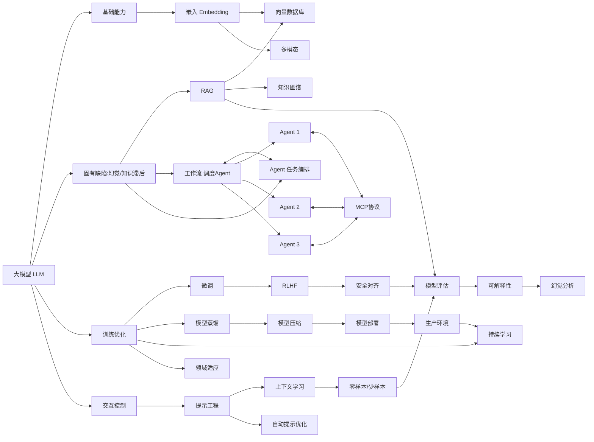

# 关键技术栈


- 大模型（Large Language Model, LLM） 
- RAG（Retrieval-Augmented Generation）
- Agent（智能体）
- 工作流（Workflow）
- 模型上下文协议(MCP)
- 微调（Fine-tuning）
- 提示工程（Prompt Engineering）
- 上下文学习（In-Context Learning）
- 零样本/少样本学习（Zero-shot / Few-shot Learning）
- 模型蒸馏（Model Distillation）
- 人类反馈强化学习（RLHF）
- 多模态（Multimodality）
- 知识图谱（Knowledge Graph）
- 向量数据库（Vector Database）
- 嵌入（Embedding）
- 对齐（Alignment）
- 可解释性（Explainability）
- 幻觉（Hallucination）
- 模型评估（Model Evaluation）
- 模型部署（Model Deployment）
- 模型压缩（Model Compression）
- 持续学习（Continual Learning）
- 领域适应（Domain Adaptation）
- 安全对齐（Safety Alignment）
- 自动提示优化（Automatic Prompt Optimization）
这些概念共同构成了当前大模型（LLM）及其应用生态中的关键技术栈。它们之间并非孤立存在，而是彼此交织、协同支撑一个完整的智能系统。

---

## **一、基础架构层**（模型能力构建）
1. **大模型（LLM）**
    - **核心**：所有技术的基座，通过海量数据训练获得通用语言理解与生成能力。
2. **嵌入（Embedding）**
    - **作用**：将文本/多模态数据转化为向量，是**向量数据库**和**RAG**的底层基础。
3. **模型压缩（Model Compression）**
    - **目标**：通过蒸馏（**模型蒸馏**）、量化、剪枝等技术，降低LLM部署成本，为**模型部署**提供轻量化方案。
4. **多模态（Multimodality）**
    - **扩展**：使LLM处理文本、图像、音频等多源数据，依赖跨模态**嵌入**技术。

> **关系链**：`LLM → 嵌入 → 向量数据库/RAG`；`LLM + 模型压缩 → 高效部署`

---

## **二、能力增强层**（解决LLM固有缺陷）
| **技术**            | **解决的核心问题**     | **依赖技术**        | **关联技术**         |
|-------------------|-----------------|-----------------|------------------|
| **RAG**           | 知识更新慢、幻觉        | 向量数据库 + 嵌入      | 知识图谱（结构化知识补充）    |
| **Agent**（智能体）    | 复杂任务分解与工具调用     | 工作流 + MCP协议     | RAG（获取外部知识）      |
| **工作流（Workflow）** | 任务流程自动化         | Agent编排 + MCP协议 | 持续学习（动态优化流程）     |
| **模型上下文协议(MCP)**  | Agent间/工具间通信标准化 | -               | 工作流、Agent系统的核心协议 |

> **关键关系**：
> - **RAG** 通过**向量数据库**检索外部知识，抑制**幻觉**，补充LLM静态知识。
> - **Agent** 依赖**工作流**拆解任务，通过**MCP协议**调用工具（如RAG、代码执行器）。
> - **知识图谱** 与 **向量数据库** 互补：图谱提供逻辑关系，向量库提供语义相似性。

---

## **三、训练与优化层**（提升模型性能）
| **技术**                       | **目标**          | **与LLM的关系**    |
|------------------------------|-----------------|----------------|
| **微调（Fine-tuning）**          | 适配特定领域/任务       | 在预训练LLM基础上增量训练 |
| **人类反馈强化学习（RLHF）**           | 价值观对齐、减少有害输出    | 通过人类偏好优化微调后模型  |
| **持续学习（Continual Learning）** | 避免灾难性遗忘，增量学习新知识 | 解决微调导致的旧知识覆盖问题 |
| **领域适应（Domain Adaptation）**  | 跨领域迁移（如医疗→法律）   | 微调/提示工程的特殊场景   |
| **模型蒸馏（Model Distillation）** | 用大模型指导小模型训练     | 模型压缩的核心手段之一    |

> **协同关系**：
> - **微调** + **RLHF** = **安全对齐（Safety Alignment）**（确保输出符合人类价值观）。
> - **持续学习** 需结合**领域适应**技术，避免知识冲突。
> - **模型蒸馏** 为边缘设备部署提供轻量模型（**模型部署**的前置步骤）。

---

## **四、交互与控制层**（人机协作优化）
1. **提示工程（Prompt Engineering）**
    - **核心**：设计输入提示引导LLM输出，低成本优化效果。
2. **上下文学习（In-Context Learning）**
    - **机制**：通过提示中的示例（**少样本学习**）激发LLM能力，是**零样本学习**的升级。
3. **自动提示优化（Automatic Prompt Optimization）**
    - **进化**：用算法（如梯度搜索、LLM自我迭代）替代人工设计提示。
4. **对齐（Alignment）**
    - **目标**：使模型行为符合人类意图，贯穿**RLHF**、**安全对齐**、**提示工程**。

> **关键路径**：  
> `人工提示工程 → 自动提示优化 → 结合ICL实现少样本适应`  
> **对齐**是终极目标：通过RLHF（训练层）、安全规则（部署层）、提示约束（交互层）多维度实现。

---

## **五、评估与可信层**（保障可靠性）
| **概念**                     | **作用**           | **关联技术**       |
|----------------------------|------------------|----------------|
| **幻觉（Hallucination）**      | 评估模型事实准确性        | RAG（抑制幻觉）、模型评估 |
| **模型评估（Model Evaluation）** | 量化性能（准确性/安全性/效率） | 可解释性、对齐指标      |
| **可解释性（Explainability）**   | 分析模型决策逻辑         | 安全对齐、幻觉归因      |
| **安全对齐（Safety Alignment）** | 防御越狱、偏见、有害内容     | RLHF、内容过滤规则    |

> **闭环关系**：  
> **评估**发现**幻觉** → 用**RAG/RLHF/提示工程**修复 → 通过**可解释性**验证修复效果 → 重新**评估**。

---

## **六、部署与运维层**（落地关键）
- **模型部署（Model Deployment）**  
  依赖**模型压缩**（减小体积）、**工作流引擎**（任务调度）、**MCP协议**（服务通信）。
- **持续学习**与**领域适应**  
  在部署后动态更新模型，适应新数据分布（需解决灾难性遗忘）。
- **向量数据库**  
  为RAG提供低延迟检索，是生产环境的关键组件。

---

## **全局关系图**


graph LR
subgraph 互相依赖关系
H[Agent] <--> I[工作流]
I[

---

## **关键洞见**
1. **RAG与Agent是互补架构**：
    - RAG解决**知识局限**，Agent解决**任务复杂性**；二者通过工作流集成（如Agent调用RAG工具）。
2. **对齐是贯穿性目标**：  
   从训练（RLHF）→ 交互（提示约束）→ 部署（安全规则）多层保障。
3. **成本-性能权衡**：
    - 轻量方案：**提示工程** + **RAG**（无需训练）
    - 高精度方案：**微调** + **RLHF** + **知识图谱**（高成本）
4. **幻觉治理三角**：
   ```mermaid
   graph LR
    RAG[外部知识检索] -->|抑制| Hallucination[幻觉]
    RLHF[人类反馈] -->|价值观约束| Hallucination
    Evaluation[严格评估] -->|检测| Hallucination
   ```

> **总结**：现代LLM系统 = **基座模型** × **增强架构**（RAG/Agent） × **对齐机制**（RLHF/安全规则） × **持续进化**（评估-优化闭环）。理解这些概念的关系，本质是理解如何构建**可靠、高效、可控**的AI系统。