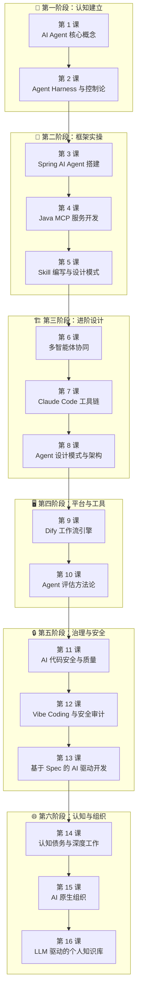

# AI Agent 应用开发培训课程

> 从概念到实战，系统掌握 AI Agent 开发全栈能力。  
> 16 节课 · 6 个阶段 · 覆盖 LLM / Prompt / RAG / MCP / Skills / 多智能体 / Agent 设计 / 工程实践 / 认知与组织

---
## 引言：反直觉代码（[AUTO] 自动生成，待人工 review）

AI Agent 应用开发培训课程 本应该很简单，从概念到实战，系统掌握 AI Agent 开发全栈能力

**但实际**：面试/生产中常被问起或踩坑的是——
代码看着对、跑起来对，但仔细一问深一层就漏馅。本篇就从'反直觉'这个角度切入，把踩坑点和根因摆出来。

> 📌 本段由 `note/scripts/add-intro.py` 自动生成（场景模板 + README 摘录）。**下次 review 时请改为真实场景 + 数字 + 反思**，目前仅满足'有引言'的最低要求。

---


## 课程全景图



---

## 课程导航

### 第一阶段：认知建立

> 理解 AI Agent 的核心架构，建立正确的 Harness 工程思维。

| 课号 | 课程 | 核心问题 | 建议时长 |
|:----:|:-----|:---------|:--------:|
| 1 | [AI Agent 核心概念](lesson1/README.md) | AI Agent 由哪些组件构成？LLM、Prompt、RAG、MCP 如何协作？ | 120 min |
| 2 | [Agent Harness 与控制论](lesson2/README.md) | 为什么 2026 年的竞争焦点从模型能力转向系统可靠性？含认知债务研究 | 110 min |

### 第二阶段：框架实操

> 用 Spring AI + MCP + Skills 搭建真正能做事的 Agent。

| 课号 | 课程 | 核心问题 | 建议时长 |
|:----:|:-----|:---------|:--------:|
| 3 | [Spring AI Agent 搭建](lesson3/README.md) | 如何从零搭建一个具备对话和工具调用能力的 Agent？ | 105 min |
| 4 | [Java MCP 服务开发](lesson4/README.md) | 如何开发 MCP Server 并发布到 Maven 中央仓库？ | 135 min |
| 5 | [Skill 编写与设计模式](lesson5/README.md) | Skill 的五种设计模式是什么？如何编写高质量 Skill？ | 90 min |

### 第三阶段：进阶设计

> 从单智能体到多智能体，从工具使用到架构设计。

| 课号 | 课程 | 核心问题 | 建议时长 |
|:----:|:-----|:---------|:--------:|
| 6 | [多智能体协同](lesson6/README.md) | 多智能体有哪些协调模式？什么真正有效？ | 115 min |
| 7 | [Claude Code 工具链](lesson7/README.md) | Claude Code 的配置、MCP 生态、Spec-Kit 如何协同？ | 120 min |
| 8 | [Agent 设计模式与架构](lesson8/README.md) | Session-Harness-Sandbox 三元架构如何设计？ | 60 min |

### 第四阶段：平台与工具

> 用低代码平台和评估体系提升 Agent 开发效率与质量。

| 课号 | 课程 | 核心问题 | 建议时长 |
|:----:|:-----|:---------|:--------:|
| 9 | [Dify 工作流引擎](lesson9/README.md) | 如何用 Dify 部署和搭建 Agent 工作流？ | 90 min |
| 10 | [Agent 评估方法论](lesson10/README.md) | 如何系统性地评估 Agent 的质量？含持续演化评估 | 110 min |

### 第五阶段：治理与安全

> 看清 AI 编码的风险边界，建立规范化的 AI 开发流程。

| 课号 | 课程 | 核心问题 | 建议时长 |
|:----:|:-----|:---------|:--------:|
| 11 | [AI 代码安全与质量](lesson11/README.md) | AI 生成代码有哪些安全隐患？如何治理？ | 120 min |
| 12 | [Vibe Coding 与安全审计](lesson12/README.md) | Vibe Coding 的企业级局限性是什么？ | 85 min |
| 13 | [基于 Spec 的 AI 驱动开发](lesson13/README.md) | 如何用规范化流程取代"感觉驱动"的 AI 开发？ | 30 min |

### 第六阶段：认知与组织

> 从个体认知到组织架构，重新审视人与 AI 的关系。

| 课号 | 课程 | 核心问题 | 建议时长 |
|:----:|:-----|:---------|:--------:|
| 14 | [AI 时代的认知债务与深度工作](lesson14/README.md) | 过度使用 AI 为何导致创意下降 28%、决策信心下降 34%？ | 85 min |
| 15 | [AI 原生组织](lesson15/README.md) | 如何将公司重塑为递归自进化的智能体网络？ | 75 min |
| 16 | [LLM 驱动的个人知识库](lesson16/README.md) | 如何用 LLM 构建一个会"生长"的持久化知识库？ | 35 min |

---

## 学习路线建议

### 🚀 快速入门路线（约 4 小时）
```
第 1 课（核心概念）→ 第 3 课（Spring AI 搭建）→ 第 7 课（Claude Code 工具链）
```
适合：想快速上手 AI Agent 开发的工程师

### 🔬 深度研究路线（约 14 小时）
```
第 1 课 → 第 2 课 → 第 3 课 → 第 4 课 → 第 5 课 → 第 6 课 → 第 8 课 → 第 10 课 → 第 14 课
```
适合：想系统掌握 Agent 架构设计的技术负责人

### 🛠️ 工程实战路线（约 8 小时）
```
第 3 课 → 第 4 课 → 第 7 课 → 第 9 课 → 第 12 课 → 第 13 课
```
适合：想立即在项目中使用 AI Agent 的开发者

---

## 环境准备

| 工具 | 用途 | 安装方式 |
|:-----|:-----|:---------|
| JDK 17+ | Spring AI 开发 | [Oracle JDK](https://www.oracle.com/java/technologies/downloads/) |
| Maven 3.8+ | Java 项目管理 | [Apache Maven](https://maven.apache.org/download.cgi) |
| Node.js 18+ | Claude Code CLI | [Node.js](https://nodejs.org/) |
| Claude Code | AI 编码助手 | `npm install -g @anthropic-ai/claude-code` |
| Docker Desktop | Dify 部署 | [Docker](https://www.docker.com/products/docker-desktop/) |
| 百炼 API Key | 通义千问模型 | [阿里云百炼](https://bailian.console.aliyun.com/) |

---

## 🎬 配套视频

视频资源位于 `视频/` 目录：

| 编号 | 视频 | 对应课程 |
|:----:|:-----|:---------|
| 1 | 实战 Harness 工程文档内容简述 | 第 2 课 |
| 2 | Claude Code CLI + qwen-plus 环境安装 | 第 7 课 |
| 3 | 结合 MCP 工具的自动化测试演示 | 第 4 课 |
| 4 | Spec-Kit + Claude Code 基本开发流程演示 | 第 13 课 |
| 5 | IDEA + Claude 开发全流程演示 | 第 3 课 |

---

## 辅助资料

| 资料 | 说明 |
|:-----|:-----|
| [百度网盘 Skill 示例](lesson1/SKILL.md) | 完整的 Skill 定义文件，展示 Skills 的核心要素 |
| [启明 11 手机介绍](lesson1/qiming11.md) | RAG 演示用的知识库文档 |
| [Spring AI Chat Demo](lesson1/demo/) | 第一课的 Spring AI 演示项目 |

---

> 🚀 从 [第 1 课：AI Agent 核心概念](lesson1/README.md) 开始你的 AI Agent 之旅。
