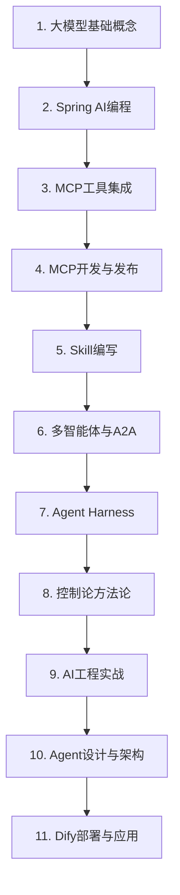

# 培训课件

## 📚 课程目录

### 1. 大模型基础能力与概念
> AI Agent = LLM + 提示词 + 知识库 + 工具调用  
> [lession1](lession1)

### 2. 编程实战一
> Spring AI基础应用开发，包括大模型集成、对话记忆、RAG等  
> [lession2](lession2)

### 3. 编程实战二
> MCP工具调用集成与自研MCP服务开发  
> [lession3](lession3)

### 4. Java MCP开发、使用全流程
> 使用Java开发MCP服务并发布到Maven中央仓库完整指南  
> [lession4](lession4)

### 5. Skill编写
> AI系统中的Skill概念、架构、设计模式与最佳实践  
> [lession5](lession5)

### 6. 多智能体与A2A协议
> 从单智能体到多智能体协同，A2A架构的工程实践与落地指南  
> [lession6](lession6)

### 7. Agent Harness概念
> 2026年AI应用竞争焦点：从模型能力转向系统可靠性  
> [lession7](lession7)

### 8. 控制论（Cybernetics）
> 在智能体优先的世界中利用Codex，驾驭AI的方法论  
> [lession8](lession8)

### 9. AI工程实战
> Claude Code配置、MCP生态、插件系统、Spec-Kit规范驱动开发  
> [lession9](lession9)

### 10. AI Agent设计与工程实践
> AI智能体的设计原则、架构模式（Session-Harness-Sandbox）与工程实践  
> [lession10](lession10)

### 11. Dify教程
> 使用Docker Compose部署Dify，搭建智能客服助手对话流（Chatflow）  
> [lession11](lession11)

---

## 🎬 配套视频

视频资源位于 `视频/` 目录：
- 1.《实战Harness工程》文档内容简述20260425.mp4
- 2.Claude Code CLI+qwen-plus环境安装20260426.mp4
- 3.结合MCP工具的自动化测试演示20260425.mp4
- 4.Spec-KIt+Claude Code基本开发流程演示20260425.mp4
- 5.idea+claude开发全流程演示20260427.mp4

---

## 📊 学习路径

### 阶段划分
| 阶段 | 课程 | 核心能力 |
|------|------|----------|
| 基础入门 | 1-2 | 理解AI Agent核心架构，掌握Spring AI基础开发 |
| 工具集成 | 3-4 | 掌握MCP协议，能够开发和发布MCP服务 |
| 能力扩展 | 5-6 | 掌握Skill设计模式，理解多智能体协同 |
| 架构进阶 | 7-8 | 理解Agent Harness概念与控制论方法论 |
| 工程实战 | 9-11 | 掌握Claude Code、Spec-Kit、Dify等工程工具 |
