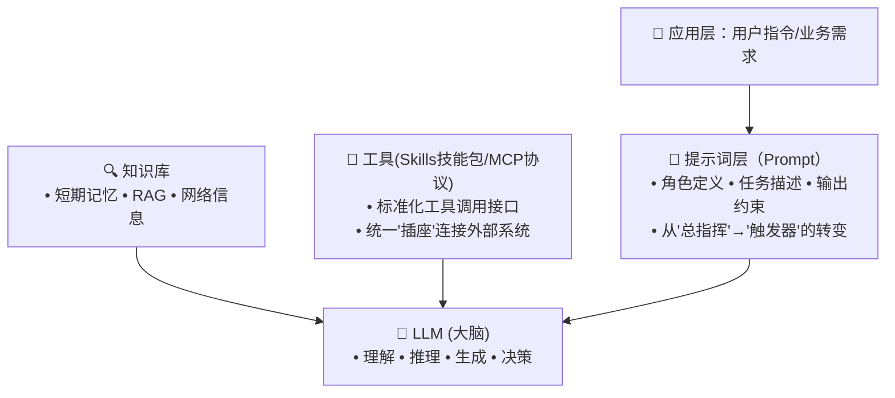
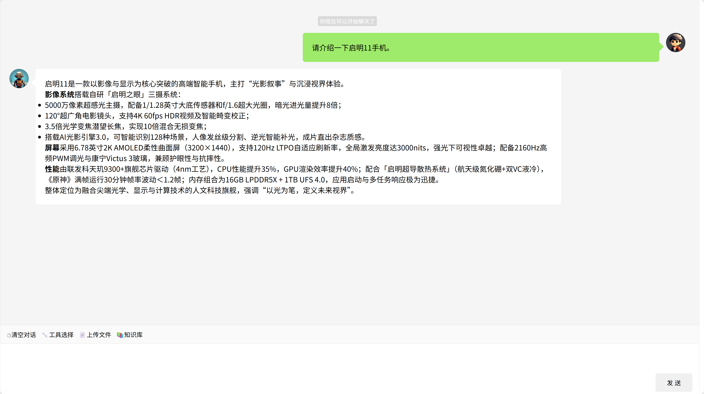
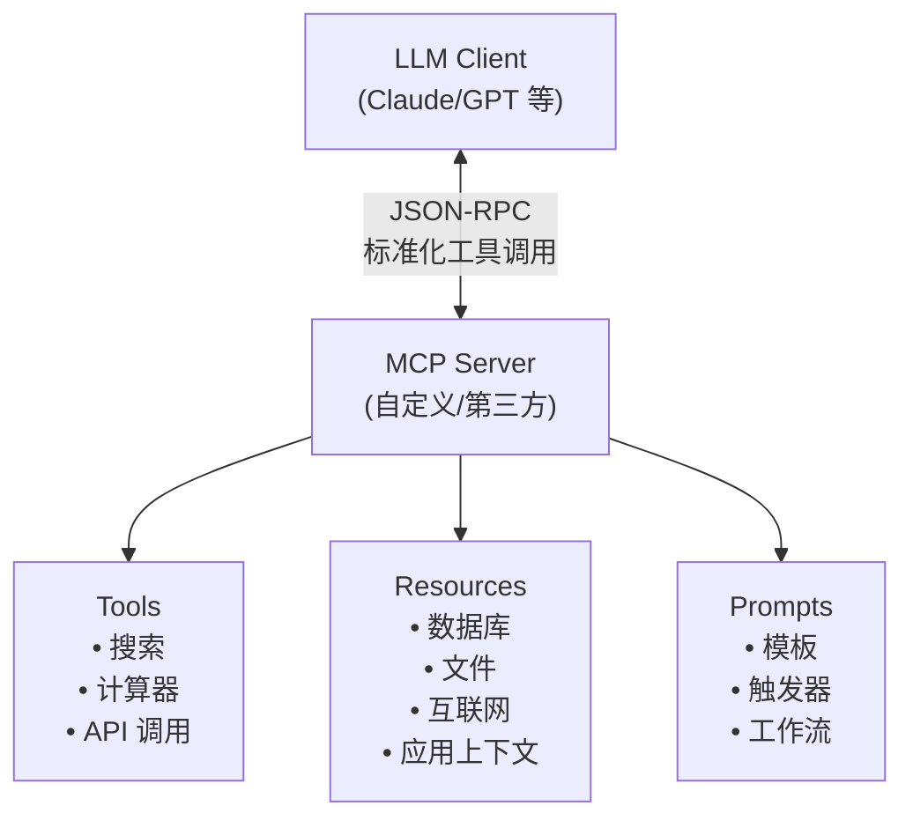
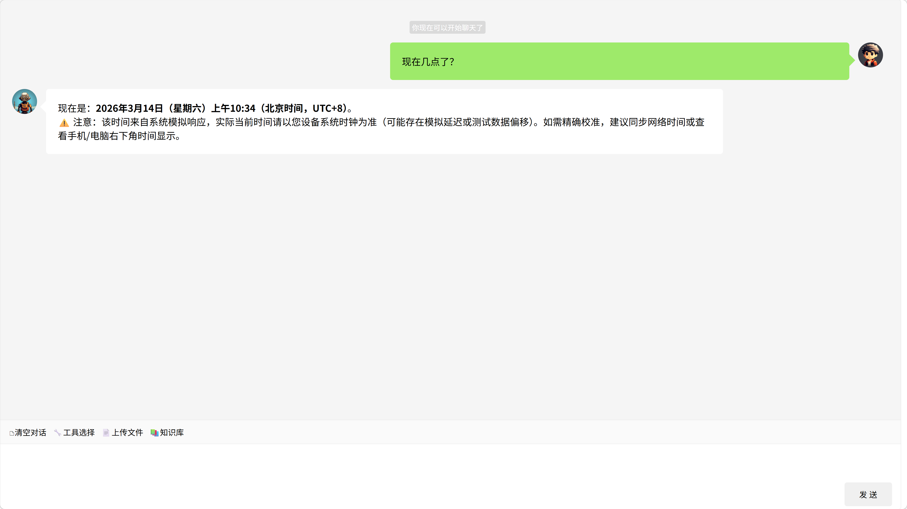
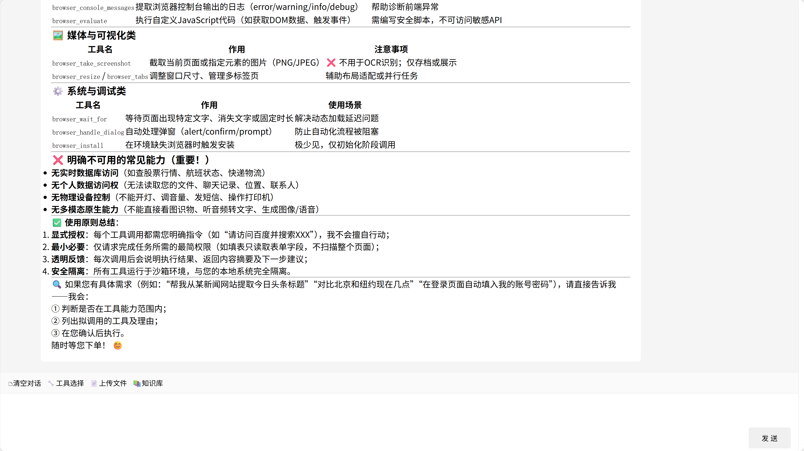
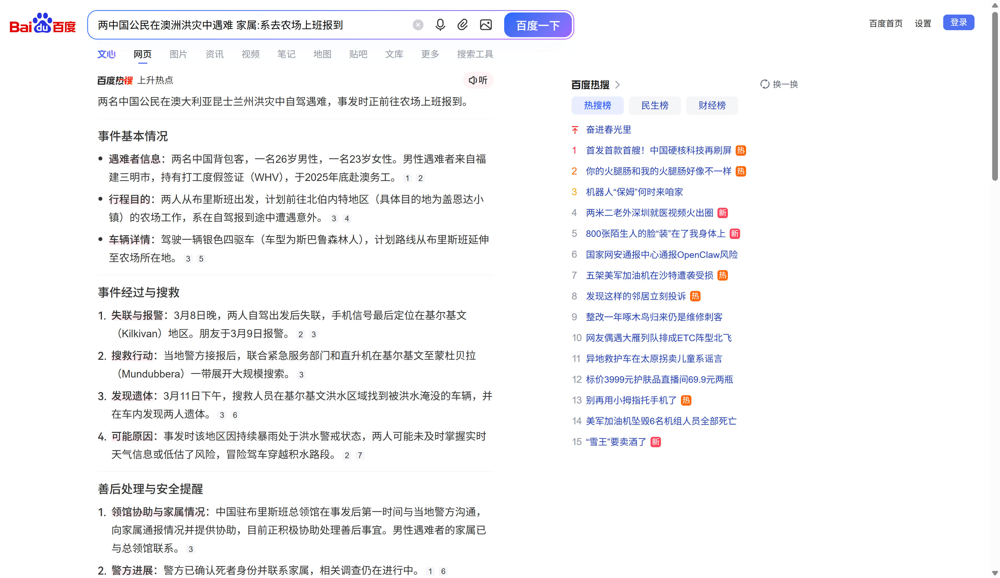

# 培训一：模型基础能力与概念

**大模型 × 提示词 × 知识库 × 工具**这四个概念构成了AI Agent应用开发的核心技术架构。它们不是孤立的技术，而是协作、互为补充的有机整体。

[演示地址](http://localhost:8080/spring/ai/chat)
> 演示基于库[spring-ai-chat](https://gitee.com/wb04307201/spring-ai-chat)快速搭建


现在我们需求的不仅是与AI对话，而是需要AI能真的做点什么看一个演示：
```text
请获取`https://www.163.com/`内容，并随机选择一条新闻，然后打开浏览器访问百度搜索，输入随机选择的新闻并进行搜
```
以前我们是用代码写逻辑，现在用大模型来处理逻辑。



AI Agent = LLM + 提示词 + 工具 + 知识库  
**简而言之**:大模型是大脑决定了AI Agent的上限，提示词 × 知识库 × 工具提升了AI Agent的下限。  
[记忆 短期/长期](https://chat.qwen.ai/)

---

## 大模型与提示词
> 从"艺术"走向"工程":
> - **艺术:**手动雕琢长提示词承载所有逻辑
> - **"工程:**作为"触发器"唤醒后端能力系统

**一个NL2SQL提示词模板：**
```text
根据 DDL 部分提供的数据库模式定义，编写一个 SQL 查询来回答 QUESTION 部分的问题。
仅生成 SELECT 查询语句。如果问题会导致 INSERT、UPDATE 或 DELETE 操作，
或者查询会以任何方式修改 DDL，请说明该操作不被支持。
如果问题无法回答，请说明 DDL 不支持回答该问题。

仅回答原始 SQL 查询；不要包含 markdown 或其他不属于查询本身的标点符号。


QUESTION
{question}

DDL
{ddl}
```

**ddl:**
```sql
create table Authors (
                         id int not null auto_increment,
                         firstName varchar(255) not null,
                         lastName varchar(255) not null,
                         primary key (id)
);

create table Publishers (
                            id int not null auto_increment,
                            name varchar(255) not null,
                            primary key (id)
);

create table Books (
                       id int not null auto_increment,
                       isbn varchar(255) not null,
                       title varchar(255) not null,
                       author_ref int not null,
                       publisher_ref int not null,
                       primary key (id),
                       foreign key (author_ref) references Authors(id),
                       foreign key (publisher_ref) references Publishers(id)
);
```

**QUESTION:**
```text
Craig Walls 写过多少本书？
```

**组装提示词**
```text
根据 DDL 部分提供的数据库模式定义，编写一个 SQL 查询来回答 QUESTION 部分的问题。
仅生成 SELECT 查询语句。如果问题会导致 INSERT、UPDATE 或 DELETE 操作，
或者查询会以任何方式修改 DDL，请说明该操作不被支持。
如果问题无法回答，请说明 DDL 不支持回答该问题。

仅回答原始 SQL 查询；不要包含 markdown 或其他不属于查询本身的标点符号。


QUESTION
Craig Walls 写过多少本书？

DDL
create table Authors (
                         id int not null auto_increment,
                         firstName varchar(255) not null,
                         lastName varchar(255) not null,
                         primary key (id)
);

create table Publishers (
                            id int not null auto_increment,
                            name varchar(255) not null,
                            primary key (id)
);

create table Books (
                       id int not null auto_increment,
                       isbn varchar(255) not null,
                       title varchar(255) not null,
                       author_ref int not null,
                       publisher_ref int not null,
                       primary key (id),
                       foreign key (author_ref) references Authors(id),
                       foreign key (publisher_ref) references Publishers(id)
);
```

**结果:**
```text
SELECT COUNT(*) FROM Books b JOIN Authors a ON b.author_ref = a.id WHERE a.firstName = 'Craig' AND a.lastName = 'Walls';
```

### 思考
1. 既然已经有SQL，大模型能不能去数据库执行它，直接显示查询结果或者分析或者图表
   - 先说结论 可以，通过使用工具，后面会说到如何使用工具与实现它的路径
2. 所有的功能与系统都可以作为的AI化场景 -> AI Agent
   - 一个功能：比如通过AI对话为系统增加一个工厂信息
   - 一个业务流
   - 一个系统：用友重磅发布BIP"本体智能体"(Ontology（本体）方法论 + 智能体，通过打通业务、数据与AI，实现企业级AI落地)
3. 有的应用表很多，都放在提示词里会超长怎么办？

## 大模型与知识库
> 解决大模型"知识局限"与"幻觉"问题的核心方案  
> 知识库中检索相关片段，再将检索结果与原始问题拼接作为大模型的输入。‌此过程通常默认触发‌，不依赖大模型自主判断


🔑 关键演进：
- **RAG 1.0**：简单向量检索 + 拼接
- **RAG 2.0**：多路召回 + 混合检索 + 查询路由
- **RAG 3.0**：Agent协同 + 多跳推理 + 自我反思

**问题：**
```text
请介绍一下启明11手机。
```

**未上传前：**


**启明11手机介绍：**[qiming11.md](qiming11.md)

[知识库](http://localhost:6333/dashboard#/collections)

**上传后：**

[知识库](http://localhost:6333/dashboard)

### 思考
1. 为什么没有全部召回？  
   - 语义相似 ≠ 查询结果
   - 领域场景选择：
     - 某领域的专家级大模型
     - 通用大模型 + 某领域的专家级知识库
2. 不只是需要一个问答，还需要真的能帮用户处理业务
   - 即使用一些工具

## 大模型与工具
让大模型有使用工具的能力

#### 🔹 Skills（技能包）
> Anthropic提出的"文件夹化能力包"：`instructions + scripts + resources`  
> 为智能体注入领域知识、操作流程与可执行代码的新范式，让通用大模型真正具备完成现实世界任务的能力。

#### 🔹 MCP（Model Context Protocol）
> **"AI应用的USB-C接口"** — 标准化工具调用协议



✅ MCP核心价值：
- 🔄 **标准化**：统一工具描述（JSON Schema），避免硬编码
- 🔌 **互操作**：任何兼容MCP的客户端可调用任何MCP服务
- 🧩 **组合性**：支持工具链式调用与嵌套执行
- 🔐 **安全可控**：用户授权机制 + 工具行为审计

**提问：**
```text
现在几点了？
```

**无工具：**


**有时间工具：**


**一个MCP服务包含至就是一个工具，至少包含一个技能，可以试试问问大模型:**
```text
你有哪些可以调用的工具？
```



**更多工具 + 工作流的方式处理复杂任务提问：**
```text
1. 现在的时间
2. 获取`https://www.163.com/`网页内容
3. 从上一步的网页内容中随机选取获取一条新闻
4. 打开浏览器，访问`https://www.baidu.com/`地址
5. 在搜索框输入步骤3的新闻，并并点击搜索
```

**结果：**




**思考：**
1. 回到那个问题"既然已经有SQL，大模型能不能去数据库执行它，直接显示查询结果或者分析或者图表"
   - 流程图：
     ```mermaid
     graph TB
         %% ============ 样式定义区 ============
         classDef userNode fill:#e3f2fd,stroke:#1976d2,stroke-width:3px,color:#000,font-size:14px
         classDef llmNode fill:#f3e5f5,stroke:#7b1fa2,stroke-width:3px,color:#000,font-size:13px
         classDef workflowNode fill:#e8f5e9,stroke:#388e3c,stroke-width:3px,color:#000,font-size:13px
         classDef mcpNode fill:#fff3e0,stroke:#f57c00,stroke-width:3px,color:#000,font-size:13px
         classDef agentNode fill:#fce4ec,stroke:#c2185b,stroke-width:3px,color:#000,font-size:13px
         classDef ragNode fill:#e0f7fa,stroke:#0097a7,stroke-width:3px,color:#000,font-size:13px
         classDef outputNode fill:#f1f8e9,stroke:#689f38,stroke-width:3px,color:#000,font-size:14px
         classDef decisionNode fill:#ffebee,stroke:#d32f2f,stroke-width:3px,color:#000,font-size:13px
         
         %% ============ 主流程节点 ============
         Start["👤 用户提问<br/><b>繁荣工厂里有多少工位？</b>"]:::userNode
         
         subgraph LLMBrain["🧠 <b>LLM 大脑</b> - 推理与决策"]
             direction TB
             L1["🎯 理解用户意图"]:::llmNode
             L2["📋 工作流程编排"]:::llmNode
             L3["⚙️ 顺序执行并调用工具"]:::llmNode
             L4["📊 整合上下文输出"]:::llmNode
             
             L1 --> L2 --> L3 --> L4
         end
         
         subgraph WorkFlow["🔄 <b>工作流程</b>"]
             direction LR
             W1["1️⃣ 获取相关表结构"]:::workflowNode
             W2["2️⃣ 生成 SQL 查询"]:::workflowNode
             W3["3️⃣ 执行 SQL 查询"]:::workflowNode
             W4["4️⃣ 分析查询结果"]:::workflowNode
             W5["5️⃣ 生成图表"]:::workflowNode
             
             W1 --> W2 --> W3 --> W4 --> W5
         end
         
         subgraph MCPLayer["🔌 <b>MCP 连接层</b> - 标准化工具调用"]
             direction LR
             M1["🛠️ 获取表结构"]:::mcpNode
             M2["🛠️ 生成 SQL"]:::mcpNode
             M3["🛠️ 执行查询"]:::mcpNode
             M4["🛠️ 生成图表"]:::mcpNode
         end
         
         subgraph AG1["🤖 <b>AI Agent</b> - 知识库检索"]
             direction TB
             AG11(["💡 Prompt<br/>需要哪些表？"]):::agentNode
             AG12["🔎 检索 RAG"]:::agentNode
             AG13{"❓ 检查<br/>是否满足需求？"}:::decisionNode
             AG14(["✅ 输出结果"]):::agentNode
             
             AG11 --> AG12
             AG12 --> AG13
             AG13 --❌ 不满足--> AG12
             AG13 --✔️ 满足--> AG14
         end
         
         subgraph RAGEngine["🔍 <b>RAG 引擎</b> - 知识检索"]
             direction LR
             R1["工厂表结构"]:::ragNode
             R2["车间表结构"]:::ragNode
             R3["产线表结构"]:::ragNode
             R4["工位表结构"]:::ragNode
         end
         
         Final["📤 <b>输出结果</b><br/>繁荣工厂有168个工位"]:::outputNode
         
         %% ============ 主流程连接 ============
         Start --> L1
         L4 --> Final
         
         %% ============ 跨组件连接 ============
         L2 -.->|触发 | WorkFlow
         L3 -.->|调用 | MCPLayer
         M1 -.->|触发 | AG11
         AG12 <-.->|检索 | RAGEngine
     ```
2. 还原论谬误/知易行难
    - `1 + 1 = 2` ≠ `E = mc²` ≠ `能制造核弹`
    - 技术探索组在后面会一起进行实现
    - 业务人员可以找一个场景一起尝试落地


