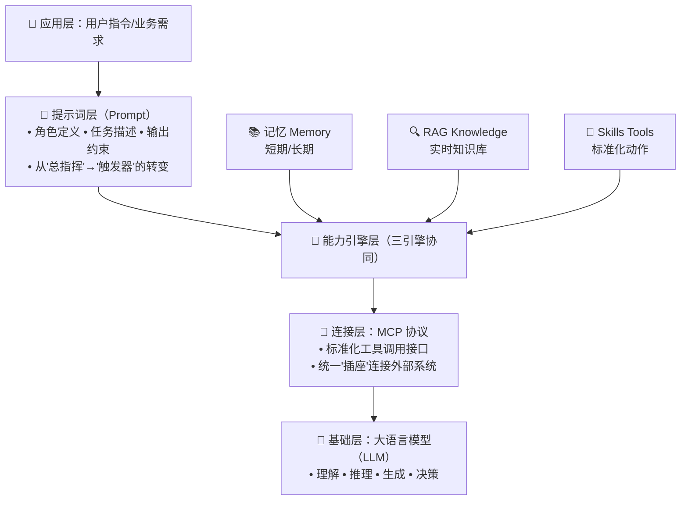
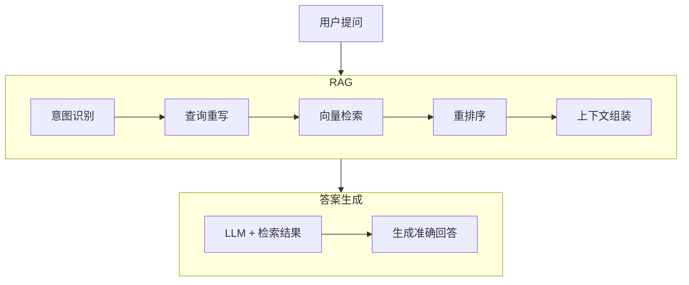
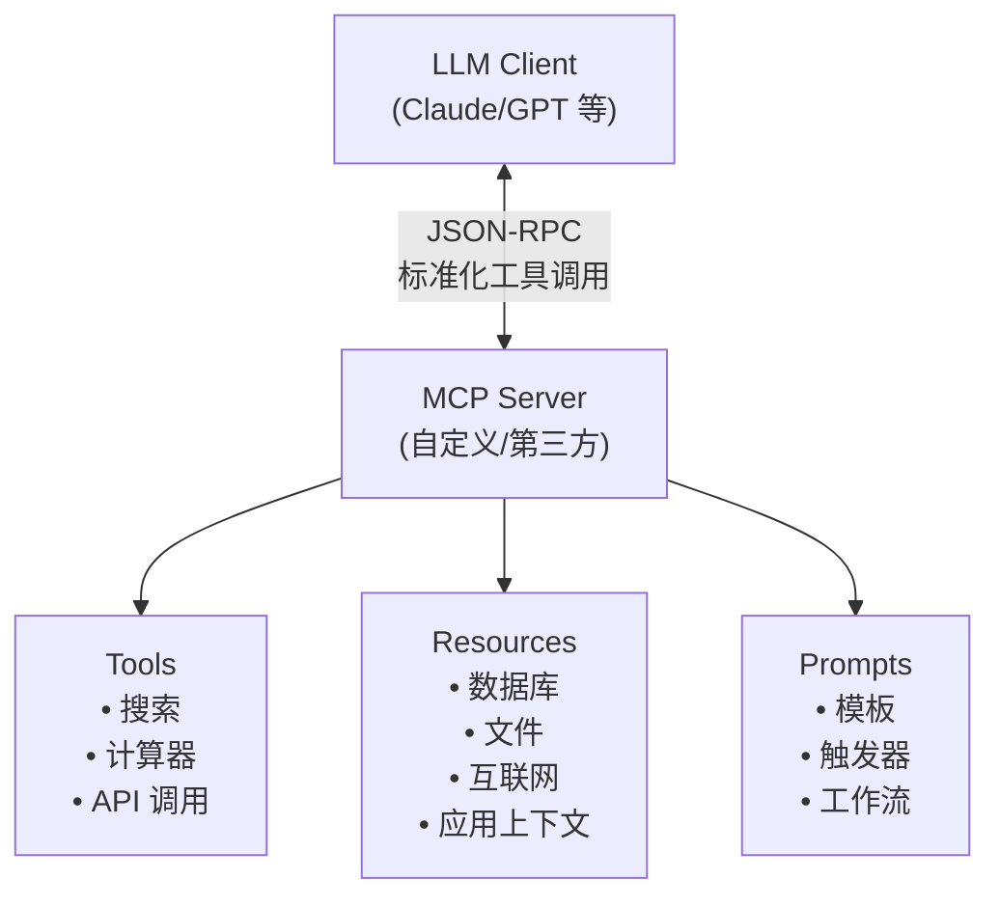

# 培训一：模型基础能力与概念

**大模型 × 提示词 × RAG × Skills/MCP**这四个概念构成了大模型应用开发的核心技术架构。它们不是孤立的技术，而是分层协作、互为补充的有机整体。



**简而言之:**大模是大脑，它(的优劣)决定了(场景应用的)上限，提示词 × RAG × Skills/MCP提升(场景应用的)下限。

---

结合演示了解下基本的能力组成与作用
[演示地址](http://localhost:8080/spring/ai/chat)
> 演示基于项目[spring-ai-chat](https://gitee.com/wb04307201/spring-ai-chat)快速搭建

## 大模型与提示词
**一个NL2SQL提示词模板：**
```text
根据 DDL 部分提供的数据库模式定义，编写一个 SQL 查询来回答 QUESTION 部分的问题。
仅生成 SELECT 查询语句。如果问题会导致 INSERT、UPDATE 或 DELETE 操作，
或者查询会以任何方式修改 DDL，请说明该操作不被支持。
如果问题无法回答，请说明 DDL 不支持回答该问题。

仅回答原始 SQL 查询；不要包含 markdown 或其他不属于查询本身的标点符号。


QUESTION
{question}

DDL
{ddl}
```

**ddl:**
```sql
create table Authors (
                         id int not null auto_increment,
                         firstName varchar(255) not null,
                         lastName varchar(255) not null,
                         primary key (id)
);

create table Publishers (
                            id int not null auto_increment,
                            name varchar(255) not null,
                            primary key (id)
);

create table Books (
                       id int not null auto_increment,
                       isbn varchar(255) not null,
                       title varchar(255) not null,
                       author_ref int not null,
                       publisher_ref int not null,
                       primary key (id),
                       foreign key (author_ref) references Authors(id),
                       foreign key (publisher_ref) references Publishers(id)
);
```

**QUESTION:**
```text
Craig Walls 写过多少本书？
```

**组装提示词**
```text
根据 DDL 部分提供的数据库模式定义，编写一个 SQL 查询来回答 QUESTION 部分的问题。
仅生成 SELECT 查询语句。如果问题会导致 INSERT、UPDATE 或 DELETE 操作，
或者查询会以任何方式修改 DDL，请说明该操作不被支持。
如果问题无法回答，请说明 DDL 不支持回答该问题。

仅回答原始 SQL 查询；不要包含 markdown 或其他不属于查询本身的标点符号。


QUESTION
Craig Walls 写过多少本书？

DDL
create table Authors (
                         id int not null auto_increment,
                         firstName varchar(255) not null,
                         lastName varchar(255) not null,
                         primary key (id)
);

create table Publishers (
                            id int not null auto_increment,
                            name varchar(255) not null,
                            primary key (id)
);

create table Books (
                       id int not null auto_increment,
                       isbn varchar(255) not null,
                       title varchar(255) not null,
                       author_ref int not null,
                       publisher_ref int not null,
                       primary key (id),
                       foreign key (author_ref) references Authors(id),
                       foreign key (publisher_ref) references Publishers(id)
);
```

**结果:**
```text
SELECT COUNT(*) FROM Books b JOIN Authors a ON b.author_ref = a.id WHERE a.firstName = 'Craig' AND a.lastName = 'Walls';
```

### 思考
1. 既然已经有SQL，大模型能不能帮去数据库执行它，用户只想看查询结果
   - **从"艺术"走向"工程":**手动雕琢长提示词承载所有逻辑 -> 作为"触发器"唤醒后端能力系统或作为工作流按顺序触发
   - 一个场景：用户通过自然输入，返回查询结果
2. 有的应用表很多，都放在提示词里会超长怎么办？


## 大模型与rag
解决大模型"知识局限"与"幻觉"问题的核心方案



🔑 关键演进：
- **RAG 1.0**：简单向量检索 + 拼接
- **RAG 2.0**：多路召回 + 混合检索 + 查询路由
- **RAG 3.0**：Agent协同 + 多跳推理 + 自我反思

**一段编造的知识：**
[qiming11.md](qiming11.md)

**问题：**
```text
请介绍一下启明11手机。
```

**未上传前：**


**上传后：**

[知识库](http://localhost:6333/dashboard)

### 思考
1. 为什么没有全部召回？  
   - 语义相似 ≠ 查询结果
   - 领域场景选择：
    - 某领域的专家级大模型
    - 通用大模型 + 某领域的专家级知识库
   - 一个场景：某领域的专家级知识库建设
2. 知识库不够灵活即使的信息怎么办？
3. 不只是需要一个问答，还需要真的能帮用户处理业务

## 大模型与skills/mcp

让大模型有使用工具的能力

#### 🔹 Skills（技能包）
> Anthropic提出的"文件夹化能力包"：`instructions + scripts + resources`
> 为智能体注入领域知识、操作流程与可执行代码的新范式，让通用大模型真正具备完成现实世界任务的能力。

#### 🔹 MCP（Model Context Protocol）
> **"AI应用的USB-C接口"** — 标准化工具调用协议



✅ MCP核心价值：
- 🔄 **标准化**：统一工具描述（JSON Schema），避免硬编码
- 🔌 **互操作**：任何兼容MCP的客户端可调用任何MCP服务
- 🧩 **组合性**：支持工具链式调用与嵌套执行
- 🔐 **安全可控**：用户授权机制 + 工具行为审计

**提问：**
```text
现在几点了？
```

**无工具：**


**有时间工具：**


**一个MCP服务包含至就是一个工具，至少包含一个技能，可以试试问问大模型:**
```text
你有哪些可以调用的工具？
```


**更多工具 + 工作流的方式处理复杂任务提问：**
```text
1. 现在的时间
2. 获取`https://www.163.com/`网页内容
3. 从上一步的网页内容中随机选取获取一条新闻
4. 打开浏览器，访问`https://www.baidu.com/`地址
5. 在搜索框输入步骤3的新闻，并并点击搜索
```

**结果：**


**思考：**
1. `1 + 1 = 2` ≠ `推算出 E = mc²` ≠ `能制造核弹`
   - 知易行难
   - 而这就是我们未来的生存空间
2. 回到那个问题“既然已经有SQL，大模型能不能帮去数据库执行它，用户只想看查询结果”
   - 流程图：
     ```mermaid
     graph TD
         Start[用户自然语言提问] --> Step1[意图识别与任务分类]
    
         Step1 --> Step1a{是否数据库查询？}
    
         Step1a -->|是 | Step2[任务拆解：NL2SQL + 执行]
         Step1a -->|否 | Step1b{是否需要外部知识？}
    
         Step1b -->|是 | RAG_Path[RAG 检索流程]
         Step1b -->|否 | Direct_LLM[直接 LLM 回答]
    
         subgraph RAG 检索流程
             RAG_Path --> RAG1[查询重写与优化]
             RAG1 --> RAG2[向量检索]
             RAG2 --> RAG3[重排序]
             RAG3 --> RAG4[上下文组装]
             RAG4 --> RAG5[LLM 生成回答]
         end
         
         subgraph 数据库查询执行流程
             Step2 --> Step3[从 RAG/缓存获取表结构 DDL]
             Step3 --> Step4[Prompt 工程：DDL + 问题 → NL2SQL]
             Step4 --> Step5[LLM 生成 SQL 查询语句]
             Step5 --> Step6[SQL 验证与安全检查]
        
             Step6 --> Step7{SQL 是否合法？}
             Step7 -->|否 | Step8[返回错误：不支持的查询]
             Step7 -->|是 | Step9[通过 MCP 调用数据库工具]
        
             Step9 --> Step10[执行 SQL 查询]
             Step10 --> Step11[获取查询结果]
             Step11 --> Step12[结果格式化与自然语言转换]
             Step12 --> Step13[返回用户可读的答案]
         end
    
         Step8 --> End[返回给用户]
         Step13 --> End
         RAG5 --> End
         Direct_LLM --> End
    
         style Start fill:#e1f5ff
         style End fill:#fff4e1
         style Step2 fill:#ffe6e6
         style Step9 fill:#e6ffe6
     ```


