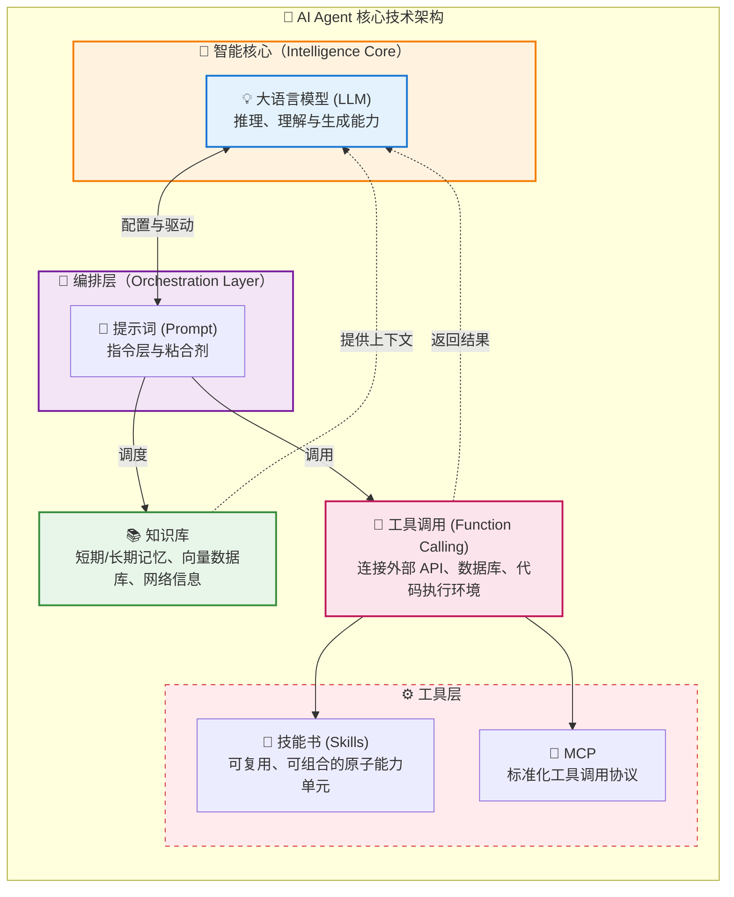
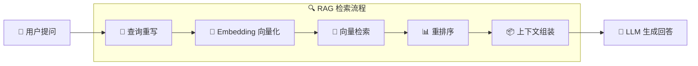
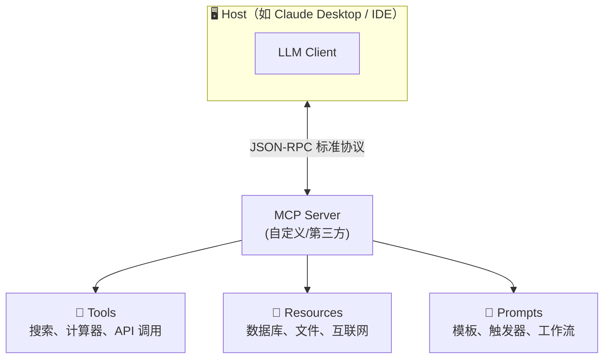
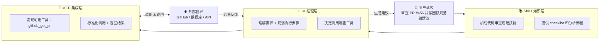

# 大模型基础能力与概念

> ⬅️ [返回目录](README.md) | 下一篇：[智医同源](README2.md)

---

## 核心能力
**大模型 × 提示词 × 知识库 × 工具**这四个核心能力构成了AI Agent应用开发的核心技术架构。它们不是孤立的技术，而是协作、互为补充的有机整体。
- 大语言模型（LLM）：提供推理、理解与生成能力
- 提示词（Prompt）：贯穿所有组件的“指令层”与“粘合剂”
  - 作为 LLM 的“配置层”，将 LLM + 提示词 视为一个整体单元，称为 “智能核心 (Intelligence Core)"
  - 作为“编排层” (Orchestration Layer)，将提示词视为调度其他组件的胶水。
- 知识库：短期/长期记忆、向量数据库、网络信息
  - RAG（检索增强生成）：从外部知识库中检索相关信息，注入上下文
  - 对话记忆：维护多轮对话的上下文连贯性
- 工具调用（Function Calling）：连接外部API、数据库、代码执行环境
  - 技能书（Skills）：可复用、可组合、有明确输入输出的原子能力单元
  - MCP：标准化工具调用协议


## 进阶能力
在核心能力之上，以下能力帮助 Agent 处理更复杂的任务：
- 规划算法：任务分解（如ReAct、ToT、Plan-and-Execute）
- 反馈循环：自我反思、人类反馈强化学习（RLHF）

[演示地址](http://localhost:8080/spring/ai/chat)
> 演示基于库[spring-ai-chat](https://gitee.com/wb04307201/spring-ai-chat)快速搭建
> ⚠️ 需先在本地启动 demo 项目后才能访问上述地址

现在我们需要的不仅是与AI对话，而是需要AI能真的做点什么，来看一个演示：
```text
请获取`https://www.163.com/`内容，并随机选择一条新闻，然后打开浏览器访问百度搜索，输入随机选择的新闻并进行搜索
```
以前我们是用代码写逻辑，现在用大模型来处理逻辑。



AI Agent = LLM + 提示词 + 知识库 + 工具调用  
**简而言之**：大模型是大脑，决定了AI Agent的上限，提示词、知识库、工具调用提升了AI Agent的下限。

[智医同源：大模型时代的”君臣佐使”配伍之道](README2.md)

---

## 提示词
> 从"总指挥"到"触发器"的转变

**一个NL2SQL提示词模板：**
```text
根据 DDL 部分提供的数据库模式定义，编写一个 SQL 查询来回答 QUESTION 部分的问题。
仅生成 SELECT 查询语句。如果问题会导致 INSERT、UPDATE 或 DELETE 操作，
或者查询会以任何方式修改 DDL，请说明该操作不被支持。
如果问题无法回答，请说明 DDL 不支持回答该问题。

仅回答原始 SQL 查询；不要包含 markdown 或其他不属于查询本身的标点符号。


QUESTION
{question}

DDL
{ddl}
```

**DDL:**
```sql
create table Authors (
                         id int not null auto_increment,
                         firstName varchar(255) not null,
                         lastName varchar(255) not null,
                         primary key (id)
);

create table Publishers (
                            id int not null auto_increment,
                            name varchar(255) not null,
                            primary key (id)
);

create table Books (
                       id int not null auto_increment,
                       isbn varchar(255) not null,
                       title varchar(255) not null,
                       author_ref int not null,
                       publisher_ref int not null,
                       primary key (id),
                       foreign key (author_ref) references Authors(id),
                       foreign key (publisher_ref) references Publishers(id)
);
```

**QUESTION:**
```text
Craig Walls 写过多少本书？
```

**组装提示词**

将上述提示词模板、DDL、QUESTION 三部分拼接后发送给大模型。

**结果:**
```text
SELECT COUNT(*) FROM Books b JOIN Authors a ON b.author_ref = a.id WHERE a.firstName = 'Craig' AND a.lastName = 'Walls';
```

### 思考
1. 承载业务处理的规范
   - 提示词模板本身就是在定义业务规则：只生成 SELECT、禁止修改操作、无法回答时明确拒绝
2. 既然已经有SQL，大模型能不能去数据库执行它，直接显示查询结果或者分析或者图表？
   - 可以，通过工具调用实现。在讲完知识库和工具调用后，我们会看一个完整的实现路径
3. 所有的功能与系统都可以作为AI化场景 -> AI Agent
   - 一个功能：比如通过AI对话为系统增加一个工厂信息
   - 一个业务流
   - 一个系统：用友BIP"本体智能体"，通过 Ontology 本体方法论 + 智能体，打通业务、数据与AI，实现企业级AI落地
4. 有的应用表很多，都放在提示词里会超长怎么办？
   - → 可通过向量检索动态召回与问题相关的表结构，而非全量注入提示词

## 知识库
> 解决大模型"知识局限"与"幻觉"问题的核心方案  
> 核心思路：从知识库中检索相关片段，将检索结果与原始问题拼接作为大模型的输入。



🔑 关键演进：
- **RAG 1.0**：简单向量检索 + 拼接
- **RAG 2.0**：多路召回 + 混合检索 + 查询路由
- **RAG 3.0**：Agent协同 + 多跳推理 + 自我反思

**问题：**
```text
请介绍一下启明11手机。
```

**未上传前：**


**启明11手机介绍：**[qiming11.md](qiming11.md)

[知识库](http://localhost:6333/dashboard#/collections)

**上传后：**

[知识库](http://localhost:6333/dashboard)

### 思考
1. 为什么没有全部召回？  
   - 语义相似 ≠ 查询结果
   - 领域场景选择：
     - 某领域的专家级大模型
     - 通用大模型 + 某领域的专家级知识库
2. RAG的调用时机分为：
   - **预处理阶段**：每次对话都触发
   - **运行时阶段**：运行按需触发
3. 知识库按用途分为
   - 纯知识型
   - 技能型

## 工具(MCP)
> **"AI应用的USB-C接口"** — 标准化工具调用协议



✅ MCP核心价值：
- 🔄 **标准化**：统一工具描述（JSON Schema），避免硬编码
- 🔌 **互操作**：任何兼容MCP的客户端可调用任何MCP服务
- 🧩 **组合性**：支持工具链式调用与嵌套执行
- 🔐 **安全可控**：用户授权机制 + 工具行为审计

**提问：**
```text
现在几点了？
```

**无工具：**


**有时间工具：**


**一个MCP服务至少包含一个工具，并至少配套一个技能，可以试试问问大模型:**
```text
你有哪些可以调用的工具？
```


也可以约定一个工作流，让大模型逐步执行。例如：
```text
1. 现在的时间
2. 获取`https://www.163.com/`网页内容
3. 从上一步的网页内容中随机选取获取一条新闻
4. 打开浏览器，访问`https://www.baidu.com/`地址
5. 在搜索框输入步骤3的新闻，并点击搜索
```

**结果：**


### 思考
1. 不每次都输入一大堆，能不能封装起来？→ 可以，这就是 Skill 的作用，见下一节

## 技能（Skill）
对提示词的一种封装，封装领域知识、工作流和最佳实践为可复用模块

**Skill 核心要素：**
1. **元数据** - name、description、tools
2. **触发条件** - 何时执行
3. **安全规则** - 禁止事项
4. **前置检查** - 安装/登录验证
5. **操作命令** - 用法和示例
6. **确认策略** - 风险分级处理

[百度网盘(Baidu Drive)文件管理Skill示例](SKILL.md)

> MCP + Skills 的生产级组合实践，详见 [README3 第五章：MCP + Skills](README3.md#五mcp--skills能力与知识的协同进化)

> Spring AI使用skills可参照[Anthropic的skills部分](https://docs.spring.io/spring-ai/reference/api/chat/anthropic-chat.html#_skills)

## 工具与技能的关系
- *MCP 解决“能做什么”*：提供标准化工具连接能力，让 AI 安全调用数据库、API、文件等外部资源。
- *Skills 解决“怎么做”‌*：封装领域知识和工作流程，指导 AI 如何组合工具完成特定任务。



### 思考
1. 回顾提示词章节的问题："既然已经有SQL，大模型能不能去数据库执行它，直接显示查询结果或者分析或者图表？"
   
   现在我们有了完整的技术栈（知识库 + LLM + 工具调用），来看一个端到端的实现路径：
   
   这个流程图展示了从用户提问到最终输出的完整过程：
   - 首先通过 RAG 知识库检索相关表结构
   - 然后 LLM 理解意图、生成 SQL、分析结果
   - 最后通过 MCP 工具执行查询和生成图表
   
   ```mermaid
   flowchart TB
         Start["👤 用户提问<br/>繁荣工厂里有多少工位？"]

         subgraph RAGLayer["🔍 RAG 知识库检索"]
             R1["检索相关表结构<br/>（工厂表、车间表、产线表、工位表）"]
         end

         subgraph LLMLayer["🧠 LLM 推理"]
             L1["理解意图 + 组装上下文"]
             L2["生成 SQL 查询"]
             L3["分析查询结果 + 生成图表"]
         end

         subgraph MCPLayer["🔌 MCP 工具调用"]
             M1["🛠️ 执行 SQL 查询"]
             M2["🛠️ 生成图表"]
         end

         Final["📤 输出结果<br/>繁荣工厂有168个工位"]

         Start --> RAGLayer
         RAGLayer -->|"返回表结构"| L1
         L1 --> L2
         L2 -->|"SQL"| M1
         M1 -->|"查询结果"| L3
         L3 -->|"图表数据"| M2
         M2 --> Final
     ```
2. 还原论谬误/知易行难
    - `1 + 1 = 2` ≠ `E = mc²` ≠ `能制造核弹`
    - 技术探索组在后面会一起进行实现
    - 场景探索组可以找一个场景一起尝试落地

---

> ⬅️ [返回目录](README.md) | 下一篇：[智医同源](README2.md)
