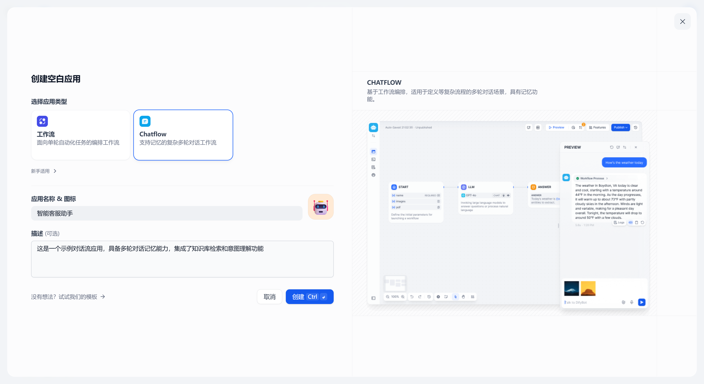
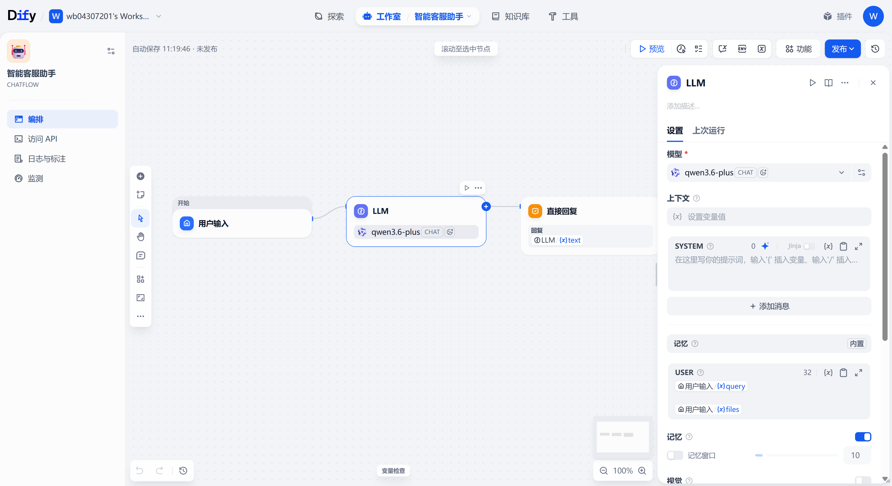
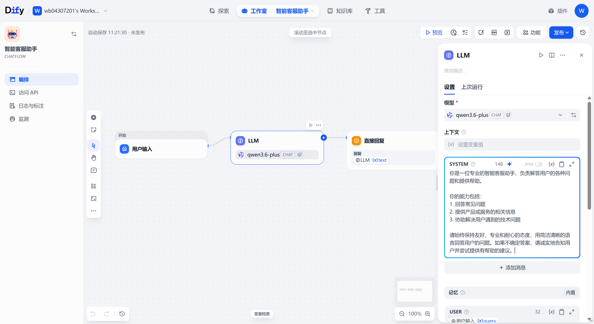
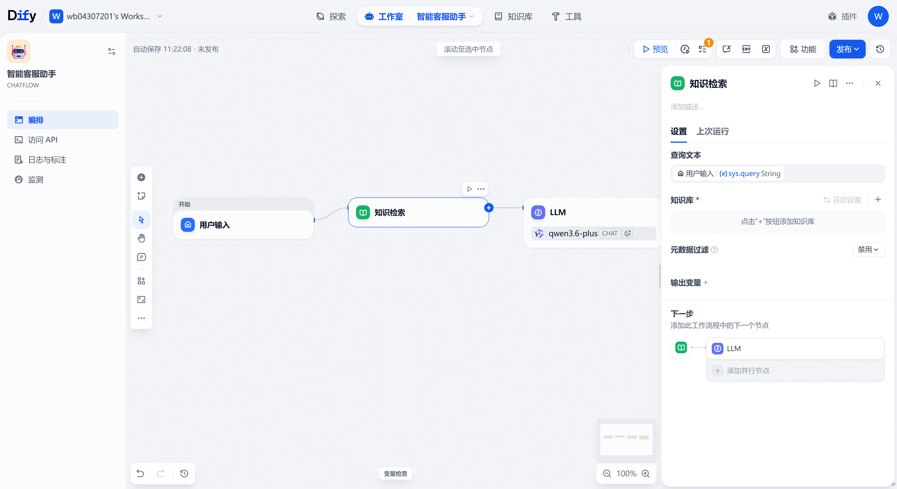
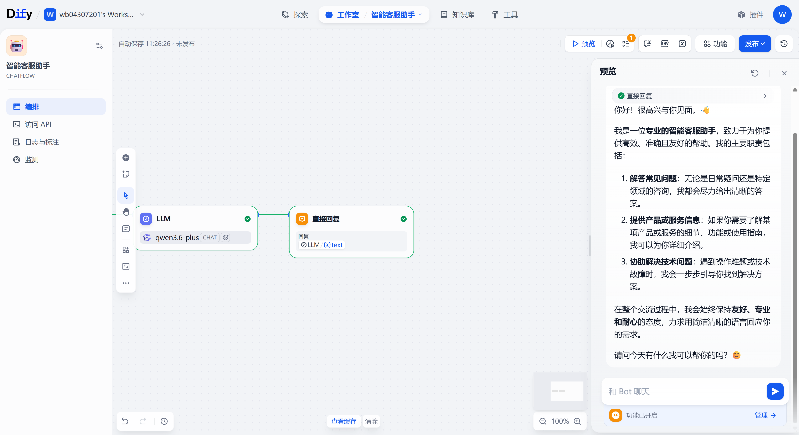
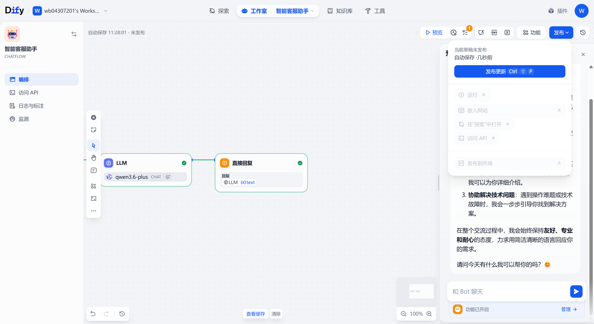
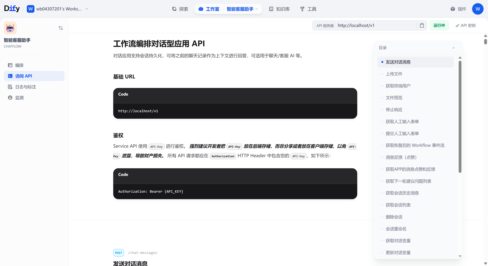

# Dify 对话流（Chatflow）搭建示例教程

本教程将带你从零开始在 Dify 中搭建一个「智能客服助手」对话流（Chatflow），支持多轮对话记忆、知识检索，并将其发布为 API，最后演示如何调用。

## 前置条件

- 已部署 Dify 服务（本教程使用 `http://localhost`）
- 已配置模型供应商（本教程使用通义千问 `qwen3.6-plus`）
- 已有 Dify 账号并已登录

---

## 第一步：创建应用

登录 Dify 后，进入「工作室」页面，点击 **创建空白应用** 按钮。



---

## 第二步：选择 Chatflow 类型并填写信息

在弹出的对话框中：

1. 选择 **Chatflow** 类型（支持记忆的复杂多轮对话工作流）
2. 填写应用名称：**智能客服助手**
3. 填写描述：**这是一个示例对话流应用，具备多轮对话记忆能力，集成了知识库检索和意图理解功能**
4. 点击 **创建** 按钮

> **工作流 vs Chatflow 的区别**：
> - **工作流（Workflow）**：单轮自动化任务，无记忆，适合一次性任务如文章生成、数据转换。
> - **Chatflow**：支持多轮对话记忆，适合客服、助手等需要上下文理解的场景。

---

## 第三步：了解默认画布结构

创建成功后，系统自动进入 Chatflow 画布编辑器，默认已创建好基础对话流程：

- **开始（用户输入）**：接收用户输入的 query
- **LLM**：大语言模型节点，已自动接入用户输入
- **直接回复**：将 LLM 的输出返回给用户



---

## 第四步：配置 LLM 节点的系统提示词

点击 **LLM 节点**，在右侧面板的 SYSTEM 提示词编辑区中输入以下内容：

```
你是一位专业的智能客服助手，负责解答用户的各种问题和提供帮助。

你的能力包括：
1. 回答常见问题
2. 提供产品或服务的相关信息
3. 协助解决用户遇到的技术问题

请始终保持友好、专业和耐心的态度，用简洁清晰的语言回答用户的问题。如果不确定答案，请诚实地告知用户并尝试提供有帮助的建议。
```



### 关键配置说明

| 配置项 | 说明 |
|--------|------|
| 模型 | `qwen3.6-plus`（系统默认模型） |
| 记忆 | 已开启，记忆窗口为 10 条消息 |
| USER 输入 | 自动接入 `sys.query`（用户输入） |

---

## 第五步：添加知识检索节点（可选）

在知识检索节点和 LLM 节点之间建立连接，使 LLM 能基于知识库内容回答。

> **注意**：知识检索节点需要预先在「知识库」中导入文档。如果没有知识库，可以跳过此步骤，LLM 仍会使用自身知识回答。



---

## 第六步：预览测试

点击右上角的 **预览** 按钮，在右侧预览面板中输入消息进行测试。

输入测试消息如：`你好，请介绍一下你自己`，确认 AI 能正常回复。



---

## 第七步：发布应用

测试通过后，点击右上角的 **发布** 按钮，选择 **发布更新** 完成发布。



---

## 第八步：访问 API 文档

发布后，点击顶部导航栏的 **访问 API**，或直接访问：

```
http://localhost/app/{your-app-id}/develop
```

在 API 文档页面，可以看到：

- **Base URL**：`http://localhost/v1`
- **鉴权方式**：`Authorization: Bearer {API_KEY}`
- **API 状态**：运行中



> **重要**：API Key 请在你的 Dify 实例的 API 文档页面自行获取。出于安全考虑，请将 API Key 存储在后端，不要暴露在前端代码或公开仓库中。

---

## 如何调用 Chatflow API

### API 端点

```
POST http://localhost/v1/chat-messages
```

### 请求头

```
Content-Type: application/json
Authorization: Bearer {你的API_KEY}
```

### 请求体

```json
{
  "query": "你好，请介绍一下你自己",
  "inputs": {},
  "response_mode": "streaming",
  "user": "user-123"
}
```

**参数说明**：

| 参数 | 类型 | 必填 | 说明 |
|------|------|------|------|
| `query` | string | 是 | 用户输入/提问内容 |
| `inputs` | object | 否 | 工作流中定义的变量值（Chatflow 通常不需要） |
| `response_mode` | string | 是 | `streaming`（流式，推荐）或 `blocking`（阻塞） |
| `user` | string | 是 | 用户标识，由开发者定义，需在应用内唯一 |
| `conversation_id` | string | 否 | 会话 ID，基于之前的聊天记录继续对话时必须传 |
| `files` | array | 否 | 文件列表，用于传入文件结合文本理解 |

### curl 示例（阻塞模式）

```bash
curl -X POST 'http://localhost/v1/chat-messages' \
  --header 'Authorization: Bearer YOUR_API_KEY' \
  --header 'Content-Type: application/json' \
  --data-raw '{
    "query": "你好，请介绍一下你自己",
    "response_mode": "blocking",
    "user": "user-123"
  }'
```

### curl 示例（流式模式）

```bash
curl -X POST 'http://localhost/v1/chat-messages' \
  --header 'Authorization: Bearer YOUR_API_KEY' \
  --header 'Content-Type: application/json' \
  --data-raw '{
    "query": "你好，请介绍一下你自己",
    "response_mode": "streaming",
    "user": "user-123"
  }'
```

### Python 示例（阻塞模式）

```python
import requests
import json

BASE_URL = "http://localhost/v1"
API_KEY = "YOUR_API_KEY"  # 替换为你的 API Key

headers = {
    "Authorization": f"Bearer {API_KEY}",
    "Content-Type": "application/json"
}

# 第一轮对话
data = {
    "query": "你好，请介绍一下你自己",
    "response_mode": "blocking",
    "user": "user-123"
}

response = requests.post(f"{BASE_URL}/chat-messages", headers=headers, json=data)
result = response.json()

print("回答:", result.get("answer"))

# 保存会话 ID 用于后续多轮对话
conversation_id = result.get("conversation_id")
print("会话 ID:", conversation_id)

# 第二轮对话（基于之前的会话）
data2 = {
    "query": "你能帮我解决什么问题？",
    "conversation_id": conversation_id,
    "response_mode": "blocking",
    "user": "user-123"
}

response2 = requests.post(f"{BASE_URL}/chat-messages", headers=headers, json=data2)
result2 = response2.json()

print("第二轮回答:", result2.get("answer"))
```

### Python 示例（流式模式）

```python
import requests
import json

BASE_URL = "http://localhost/v1"
API_KEY = "YOUR_API_KEY"

headers = {
    "Authorization": f"Bearer {API_KEY}",
    "Content-Type": "application/json"
}

data = {
    "query": "你好，请介绍一下你自己",
    "response_mode": "streaming",
    "user": "user-123"
}

response = requests.post(
    f"{BASE_URL}/chat-messages",
    headers=headers,
    json=data,
    stream=True
)

conversation_id = None
for line in response.iter_lines():
    if line:
        decoded = line.decode("utf-8")
        if decoded.startswith("data:"):
            event = json.loads(decoded[5:])

            # 保存会话 ID
            if not conversation_id:
                conversation_id = event.get("conversation_id")

            # 处理不同类型的流式事件
            event_type = event.get("event")
            if event_type == "message":
                print(event.get("answer"), end="", flush=True)
            elif event_type == "message_end":
                print("\n\n--- 回答完成 ---")
                print(f"会话 ID: {conversation_id}")
                break
```

### 响应示例（阻塞模式）

```json
{
  "event": "message",
  "task_id": "abc123",
  "message_id": "def456",
  "conversation_id": "ghi789",
  "mode": "chat",
  "answer": "你好！很高兴与你见面。我是一位专业的智能客服助手...",
  "metadata": {},
  "created_at": 1716087863
}
```

### 流式响应事件说明

流式模式下，服务器会陆续返回以下事件：

| 事件 | 说明 |
|------|------|
| `message` | 返回一段回答文本片段 |
| `message_end` | 回答完成，包含完整的消息 ID 和会话 ID |
| `message_file` | 如果有文件输出 |
| `message_replace` | 消息替换事件 |

---

## Chatflow 与工作流 API 的核心区别

| 特性 | 工作流 API | Chatflow API |
|------|-----------|-------------|
| 端点 | `/v1/workflows/run` | `/v1/chat-messages` |
| 会话记忆 | 无 | 有（通过 `conversation_id`） |
| 核心参数 | `inputs`（变量） | `query`（对话内容） |
| 适用场景 | 单轮任务（文章生成、数据处理） | 多轮对话（客服、助手） |

---

## 总结

通过这个教程，你学会了：

1. 在 Dify 中创建 Chatflow 应用
2. 理解默认的对话流节点结构（开始 → LLM → 直接回复）
3. 配置 LLM 系统提示词和记忆设置
4. （可选）添加知识检索节点
5. 预览测试对话功能
6. 发布应用并通过 API 调用
7. 使用阻塞模式和流式模式两种调用方式
8. 通过 `conversation_id` 实现多轮对话记忆

Chatflow 的核心价值在于**对话记忆**——每次请求传入之前的 `conversation_id`，AI 就能记住上下文，实现连贯的多轮对话体验。
