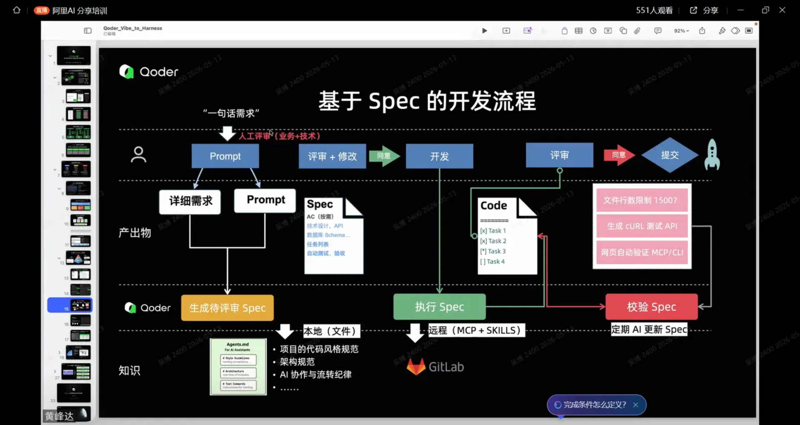
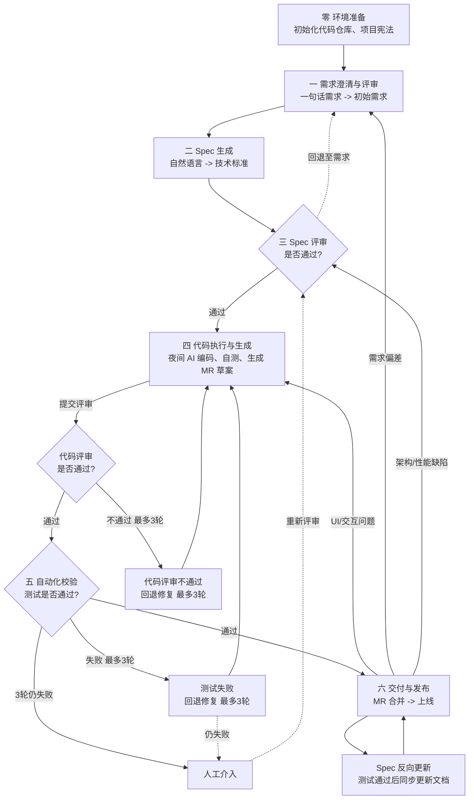

# 基于 Spec 的 AI 驱动开发流程

## 1. 背景与摘要

为应对传统开发中需求偏差、规范不一、测试不足等痛点，本报告系统梳理**标准基于 Spec（规格说明书）的 AI 驱动开发流程**，明确其核心业务单元、角色分工与技术栈，为后续项目实践提供标准化框架参考。

---

| 版本 | 日期 | 说明 |
| :--- | :--- | :--- |
| v0.1 | 2026-05-21 | 初始版本 |

---

## 2. 标准流程核心框架

> 
> *(说明：此图直观展示了从"一句话需求"到"最终提交"的完整链路，核心特征为"人工评审卡点 + AI 执行主力 + Spec 作为唯一真理来源")*

### 2.1 流程标准定义

> **注**：表中 `/speckit-*` 命令为流程设计中定义的指令标识，具体实现可对接 Qoder、Claude Code 等 AI 编码工具的对应插件或自定义命令。若环境中尚未实现对应命令，可参照其职责描述手动执行等效操作。

| 单元 | 节点名称 | 核心输入 | 核心输出 | AI 核心职责 | 角色 | 命令 |
| :--- | :--- | :--- | :--- | :--- | :--- | :--- |
| **零** | **环境准备** | 技术架构 | 初始化代码仓库、项目宪法 | 脚手架生成：初始化 Git 仓库、配置规范工具、生成项目宪法文件 | 技术决策人、技术负责人 | `/speckit-constitution` - 建立项目宪法、初始化规范工具 |
| **一** | **需求澄清与评审** | 一句话需求 | 评审通过的初始需求 | AI 辅助分析需求完整性、识别歧义与潜在风险 | 需求负责人、项目决策人、AI 智能体 | `/speckit-specify` 创建功能规范、`/speckit-clarify` 澄清需求 |
| **二** | **Spec 生成** | 需求+Prompt+项目宪法 | 待评审 Spec | 结构化翻译：自然语言→技术标准（API/DB/Task/AC） | 需求负责人、技术负责人、项目决策人、技术决策人、AI 智能体 | `/speckit-plan` 创建技术计划、`/speckit-checklist` 质量检查清单、`/speckit-tasks` 分解为任务、`/speckit-analyze` 一致性分析 |
| **三** | **Spec 评审与锁定** | 待评审 Spec | 已确认 Spec（开发基线） | 辅助修改：按人工反馈实时迭代 Spec 内容 | 项目决策人、技术负责人 | 无需命令，人工评审为主 |
| **四** | **代码执行与生成** | 已确认 Spec+代码库上下文 | 源代码 (Code)+任务状态+MR 草案 | **异步生成**：下班前输入 Spec，夜间 AI 自动编码、基础自测、生成 MR 草案与任务状态报告 | 技术负责人、代码评审人、AI 智能体 | `/speckit-implement` - 执行实现 |
| **四'** | **代码评审** | AI 生成代码+MR 草案 | 评审结论（通过/回退） | 辅助说明：按人工评审意见迭代修复代码 | 代码评审人、技术负责人、AI 智能体 | 无需命令，人工评审为主 |
| **五** | **自动化校验** | 已确认 Spec+源代码 | 测试报告 + 更新后 Spec | 对照 Spec 执行浏览器自动化测试：端到端验证、性能检测、反向更新文档 | 测试负责人、AI 智能体 | 无专用命令，依赖 CI/CD 或 Playwright CLI |
| **六** | **交付与发布** | Code+测试报告 | 上线版本 | 辅助提交：生成 MR/PR 描述、辅助合并发布 | 项目决策人、技术负责人、代码评审人 | 无需命令，人工决策为主 |

### 2.2 标准角色分工

| 角色类别 | 核心职责定义 |
| :--- | :--- |
| **项目决策人** | 需求/Spec 评审拍板、资源协调、进度把控、上线批准、最终验收决策 |
| **技术决策人** | 维护《项目宪法》，负责基础设施配置、技术兜底、复杂逻辑干预、文档体系维护 |
| **需求负责人** | 输出标准化需求卡片，编写 Prompt 引导 AI 生成 Spec，把控业务逻辑完整性，参与评审与验收 |
| **技术负责人** | 将功能规范转化为技术设计（API 定义、数据模型、任务分解），评估技术可行性与风险，为 AI 提供架构级上下文约束，评审 AI 生成代码的技术合理性 |
| **代码评审人** | 负责日间代码质量审查、逻辑校验与规范检查，确认 AI 生成代码符合 Spec 与安全基线，把控合并准入标准 |
| **测试负责人** | 制定测试策略与用例设计，编写/审查 Playwright E2E 脚本并运行自动化测试，分析测试报告，跟进缺陷修复验证，确保核心路径 100% 覆盖 |
| **AI 智能体** | 翻译官（需求→Spec）、执行者（Spec→Code）、测试员（生成 Playwright 脚本并运行）、文档维护者（代码变更→反向更新 Spec） |

### 2.3 关键输入输出与质量控制

* **输入侧**：`一句话需求`、`Prompt`、`项目宪法`（定义命名规范、目录结构、AI 协作纪律）
* **输出侧**：`Spec 文档`（含 API/DB/AC/Task）、`源代码`、`自动化测试报告`、`流程观察记录`
* **质量控制**：
    * Spec 锁定前禁止随意变更，变更需走评审流程
    * 代码必须通过 ESLint/Prettier 检查，符合架构约束
    * 自动化测试覆盖率需达标，核心路径 100% 覆盖
    * 所有产物版本化管控，关键文档使用 Git Tag 标记
    * 代码需通过安全基线检查：依赖漏洞扫描（如 `npm audit`）、静态安全分析（SAST）
* **回退与迭代机制**：
    * **需求回退**：Spec 评审（单元三）发现需求不可行或成本过高时，需退回需求侧（单元一）重新澄清
    * **代码评审回退**：代码评审不通过时，标记问题并回退至单元四修复，最多迭代 3 轮后触发人工介入
    * **测试回退**：单元五校验失败时，标记失败用例并回退至单元四修复，最多迭代 3 轮后触发人工介入
    * **上线回退**：上线后发现问题按根因分类回退至对应单元（详见 2.5 节）
    * **Spec 变更**：任何阶段发现的 Spec 缺陷需同步更新文档并重新评审锁定

### 2.4 自动化校验技术栈（Playwright + Chrome DevTools Protocol）

标准流程在单元五采用 **Playwright + Chrome DevTools Protocol (CDP)** 实现紧凑型自动验证：

1. **真实浏览器环境**：在 Chromium/Chrome 中执行 E2E 测试，确保验证结果与用户实际体验一致
2. **深度性能检测**：通过 CDP 获取页面加载性能、内存使用、网络请求耗时等底层指标
3. **智能错误捕获**：自动捕获 JavaScript 异常、网络请求失败、控制台警告，并生成可视化报告（截图/录屏）
4. **闭环自验证**：测试失败自动记录日志并回退至单元四修复（最多 3 轮迭代），测试通过后自动反向更新 Spec 文档

在 CI/CD 流水线中，上述能力串联为：**Playwright 执行 E2E 脚本 → CDP 收集性能与错误数据 → 生成 HTML 报告 → 阈值判定（通过/失败）→ 失败触发回退、通过触发 Spec 反向更新与合并**。其中 Spec 反向更新是指：测试通过后，AI 根据实际代码变更自动同步更新 Spec 文档中的 API 定义、数据模型和验收条件，确保文档与代码保持一致。

### 2.5 核心运行机制：日间评审与夜间生成

为最大化人机协同效能，标准流程采用**"人休机不休"**的异步交付节奏：

* **夜间自动生成**：下班前将锁定的 Spec 输入大模型并触发开发任务，AI 利用夜间算力空闲期自动完成代码编写、基础自测与文档反向更新。
* **日间集中评审**：次日白天，代码评审人集中对 AI 生成代码进行审查。重点核对：Spec 实现一致性、核心业务逻辑正确性、安全漏洞与性能隐患、代码规范符合度。
* **准入合并机制**：日间评审通过后进入自动化校验（单元五），校验通过后触发 Spec 反向更新，随后由代码评审人确认并提交合并请求（MR），合入主分支。评审未通过或校验失败的部分标记为待修复项，回退至单元四进入下一轮夜间迭代，最多 3 轮后触发人工介入，实现高效、可控的持续交付。
* **上线后运维反馈**：功能上线后接入监控体系（错误日志、性能指标、用户反馈），发现问题按根因分类回退至对应单元：
  - **UI/交互问题** → 回退至单元四修复
  - **需求偏差** → 回退至单元一重新澄清
  - **架构或性能缺陷** → 回退至单元三重新评审技术设计
  - 经上述路径仍无法解决的复杂问题 → 触发人工介入（R3）

### 2.6 并行任务与多需求管理

流程天然支持**多需求并行**——每个需求独立走完从零到六的全链路：

* **独立 Spec 隔离**：不同需求对应不同的 Spec 文件，互不干扰，可分配给不同的 AI 实例并发执行
* **并行冲突规避**：同一代码文件的并发修改需通过 Feature Branch 隔离，合并时解决冲突后再走校验
* **优先级调度**：高优先级需求可抢占夜间 AI 算力资源，低优先级需求顺延至下一轮

### 附录：术语说明

| 术语 | 说明 |
| :--- | :--- |
| **项目宪法** | 项目的技术治理原则文件，定义命名规范、目录结构、技术栈约束、AI 协作纪律等，作为 AI 生成代码的硬约束 |