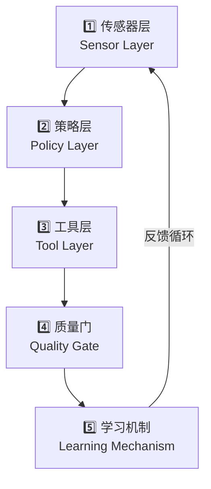

> ⬅️ [返回目录](README.md)

# 📝 递归自进化的智能体循环：YC 合伙人 Tom Blomfield 分享

> **来源**：[YouTube - How to Build a Self-Improving Company with AI](https://www.youtube.com/watch?v=t-G67yKAHBQ)
> **演讲者**：Tom Blomfield（Y Combinator 合伙人）
> **主题**：AI 原生组织、自进化智能体、组织重构

---

## 🔑 核心观点

> **未来的公司不应再是传统的层级结构，而应被重塑为一系列递归、自我进化的智能体循环。那些掌握这一理念的创始人，将打造出能在他们睡觉时自我优化的企业。**

---

## 🏛️ 一、打破传统：从"罗马军团"到"AI 原生"

今天的大多数公司就像"罗马军团"：依赖人类作为信息传递的节点，形成严格的层级控制。

一年前，人们谈论 AI 时总是聚焦于"副驾驶（Copilot）"模式——比如让工程师效率提高 20%。但 Tom 认为这是一个错误的思维模型。**仅仅给旧有工作模式加装一个更强大的 AI 引擎是不够的，真正的 AI 原生公司需要彻底重构组织的运作方式。**

```
传统模式（罗马军团）：
  CEO → VP → Director → Manager → IC
  信息层层传递，决策层层审批

AI 原生模式：
  人类边界 ←→ 智能体网络 ←→ 数据传感器
  信息直达，智能体自主决策，人类守护边界
```

---

## 🔄 二、核心机制：五层智能体循环

公司不应被视为静态的层级，而应被重塑为一个由智能体驱动的循环系统：



### 各层详解

| 层级 | 职责 | 示例 |
|------|------|------|
| **1️⃣ 传感器层** | 收集外部数据 | 客户邮件、支持工单、代码变更、产品遥测 |
| **2️⃣ 策略层** | 设定规则与边界 | 智能体可以做什么、何时需要人类授权、必须记录什么 |
| **3️⃣ 工具层** | 提供确定性 API | 查询数据库、查看日历、调用内部系统 |
| **4️⃣ 质量门** | 保障输出安全 | Evals、安全过滤器、高风险操作的人工审查 |
| **5️⃣ 学习机制** | 驱动系统进化 | 发现失败点、反馈循环回系统顶部、自动优化 |

---

## 🔥 三、YC 内部的"震撼时刻"

Tom 分享了 YC 内部的真实案例：

### 初始阶段：简单的查询智能体（Copilot 级别）

YC 最初只是开发了一个简单的查询智能体，帮助员工快速找到内部文档中的信息。但这只是"副驾驶"级别的提升。

### 突破阶段：监控智能体（自进化级别）

真正的突破发生在他们部署了一个**监控智能体**之后：

```text
监控智能体的工作循环：
1. 审查所有 YC 员工对 AI 的查询
2. 发现某个查询失败
3. 自动分析原因：
   - 需要新工具？
   - 需要更新技能文件？
   - 需要新索引？
4. 在夜间自动：
   - 编写代码
   - 提交合并请求
   - 审查并部署
5. 第二天员工再次查询时，问题已经解决
```

> 💡 **这就是"自我进化"的威力：公司可以在创始人睡觉时变得更好。**

---

## 💰 四、组织变革：消耗 Token，而不是增加人头

在这种模式下，传统的"中层管理"将走向终结，因为信息不再需要人类层层传递。

Tom 提出了一个极具颠覆性的口号：

> **"Burn Tokens, Not Headcount"（消耗 Token，而不是增加人头）**

当你识别出公司中可以像这样运转的环节，并让人类退居监控或监督角色时，你只需要不断投入算力（Token），公司就会自动优化。

---

## 📖 五、关键前提：让一切对 AI"可读"

要让上述循环运转，必须让公司的所有运作对 AI 透明、可读。

### 记录一切

所有的合伙人邮件、Slack 消息、私聊、甚至过去几个月的所有 Office Hour 都必须被记录。

> **对智能体来说，没有被记录的事情就等于没有发生。**

### 自我更新的"活"手册

软件代码是短暂的，但**上下文（Context）才是真正有价值的**。

**YC 的真实案例**：

YC 合伙人 Harj 利用过去三个月录制的 2000 小时 Office Hour 音频，在一个周末完成了：

```
2000 小时音频
    ↓ AI 转录
    ↓ AI 分类（融资、招聘、创始人纠纷等）
    ↓ AI 合成
150 页全新"用户手册"
    ↓ 每月自动更新
    ↓ 新建议 vs 现有手册 → 吸收或摒弃
持续进化的"公司大脑"
```

这份手册不仅质量远超旧版，而且现在每个月都会自动更新——**它不是一个文档，而是一个活的系统**。

---

## 🧑 六、人类的新角色：守护公司的"边界"

如果 AI 构成了公司的"大脑"（处理所有数据、技能和知识），那么人类的位置在哪里？

Tom 认为，人类将处于这个智能体网络的**边缘（Edge）**，负责与真实世界进行接触。

### 人类不可替代的领域

| 领域 | 原因 |
|------|------|
| 🆕 **新颖情况** | 模型目前还无法触及的前所未见的问题 |
| ⚖️ **伦理与高风险决策** | 如创始人考虑与联合创始人分道扬镳 |
| 🤝 **信任建立场景** | 核心销售对话、关键合作伙伴谈判 |
| 🎯 **战略方向判断** | 公司该往哪个方向走，只有创始人能决定 |

> Tom 认为核心销售对话在未来 20 年仍需要人类在场。

---

## 📌 核心启示

> **AI 原生组织的终极形态不是一个更高效的层级结构，而是一个能自我进化的智能体网络。人类从信息传递的"管道"变为守护边界的"哨兵"，公司从依赖人力的"军团"变为消耗 Token 的"有机体"。**

---

*上一篇：[第一章：创始人手册](README1.md) | 下一篇：[第三章：AI 换岗不裁员](README3.md)*
