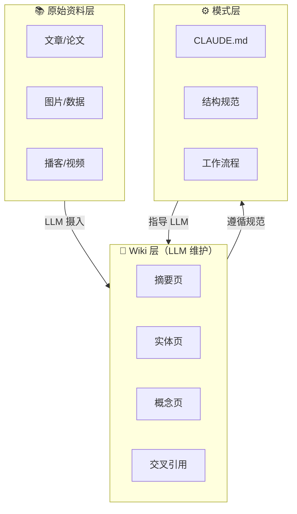

# 第 16 课：LLM 驱动的个人知识库

> **LLM Wiki × 知识复利 × Memex** —— 把"每次查询都重新检索"升级为"知识编译一次、持续复利"。

---

## 学习目标

学完本课后，你将能够：

- 理解 LLM Wiki 与传统 RAG（检索增强生成）的本质区别：持久化知识资产 vs 临时检索
- 掌握 LLM Wiki 的三层架构（原始资料层→Wiki 层→模式层）和三大核心操作（摄入→查询→检查）
- 设计适合自己领域的 Wiki 结构规范（Schema），与 LLM 协作构建和维护知识库
- 选择合适的工具链（Obsidian + LLM + 搜索工具）搭建个人 LLM Wiki 系统

## 前置条件

- 前置课程：[第 1 课：AI Agent 核心概念](../lession1/README.md)（理解 LLM 和 RAG 的基本概念）
- 知识准备：具备使用 LLM 处理文档的基本经验
- 推荐了解：Markdown 编辑工具（如 Obsidian）

## 核心概念速查

```text
传统 RAG 模式：
  上传文件 → 提问时检索片段 → 生成答案 → 丢弃（无积累）

LLM Wiki 模式：
  新资料 → LLM 阅读提取 → 整合到 Wiki → 知识复利
  Wiki = 结构化的、相互链接的 Markdown 文件集合
  你负责：筛选资料、探索方向、提出好问题
  LLM 负责：总结、交叉引用、归档、维护一致性
```

## 章节导航

| 章节 | 文件 | 核心问题 | 建议时长 |
|:----:|:-----|:---------|:--------:|
| 第一章 | [LLM Wiki 模式](README1.md) | 如何用 LLM 构建一个会"生长"的个人知识库？ | 35 min |

---

## 核心架构图



---

> 🚀 从 [第一章：LLM Wiki 模式](README1.md) 开始 | ⬅️ [返回课程总目录](../README.md)

---

⬅️ 上一课：[AI 原生组织](../lession15/README.md)
