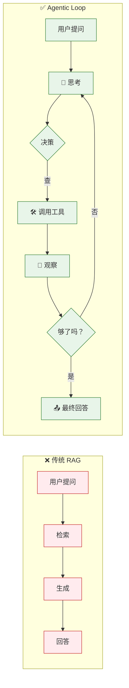
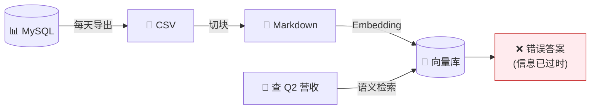
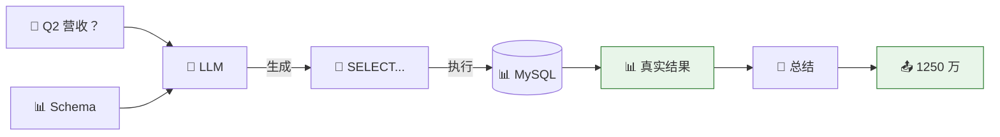
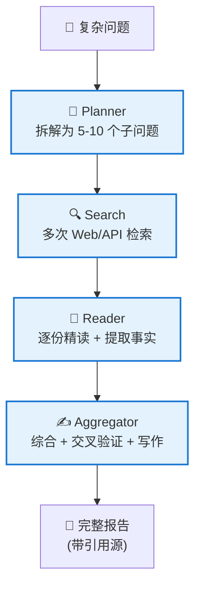

# 知识接入 5 路径全景：从"上 RAG"到"先选工具"

> ⬅️ [返回目录](README.md) | 上一篇：[LLM Wiki 模式](README1.md) | 下一篇：[生产级 RAG 深入](README3.md)

---

## 🎯 一句话定位

**RAG 不再是默认答案**——2025 年大模型知识接入有 5 条技术路径：长 Context + Caching、生产级 RAG、Agentic Retrieval、SQL、Deep Research。每条路有它的主场，**先选工具，再动手**。  
本节是全景速览；生产级 RAG 单独成[第三章](README3.md)深入剖析。

---

## 📊 5 路径速查表

| # | 路径 | 一句话定位 | 适用规模 | 月成本量级 | 工程量 |
|:--|:--|:--|:--|:--|:--|
| 1 | **长 Context + Caching** | 几百份文档内最甜，零工程 | < 200 份 | ~$120 | 0.5 人天 |
| 2 | **生产级 RAG** | 万级文档重型武器 | 10K+ 份 | ~$840 | 25 人天 |
| 3 | **Agentic Retrieval** | 代码/多跳任务让 Agent 自己查 | — | 中等 | 5 人天 |
| 4 | **结构化 SQL** | 业务数据别 dump 文档 | 数据库 | 低 | 2 人天 |
| 5 | **Deep Research** | 复杂研究类问题 | — | $5–$20/次 | 10 人天 |

---

## 🛤️ 路径 1：长 Context + Prompt Caching

### 一句话定位

几百份文档内的最优解——不建向量库，全塞 prompt，靠缓存把成本压到 1/10。

### 适用 vs 不适用

| ✅ 适用 | ❌ 不适用 |
|:--|:--|
| 文档 < 200 份 | 文档 > 200 万 token |
| 知识相对稳定 | 文档每天变（缓存失效） |
| 单次查询成本敏感 | 强合规需要逐条引用源 |
| 团队工程资源紧张 | 大量多模态内容 |

### 上下文窗口演进

| 模型 | Context 窗口 | ≈ 中文字数 |
|:--|:--|:--|
| Claude Sonnet 4.5 | 1M tokens | 75 万 |
| Gemini 1.5 Pro | 2M tokens | 150 万 |
| GPT-4.1 | 1M tokens | 75 万 |

**实操换算**：200 份 × 3,000 字 = 60 万字 → 全部装下。

### 缓存定价（Claude 3.5 Sonnet）

| 操作 | 价格 | 对比 |
|:--|:--|:--|
| 基础 Input | $3 / MTok | 100% |
| Cache Write | $3.75 / MTok | +25% 溢价 |
| **Cache Read** | **$0.30 / MTok** | **10%（-90%）** |

### Anthropic 官方实测数据

| 场景 | 延迟（无缓存） | 延迟（有缓存） | 成本下降 |
|:--|:--|:--|:--|
| 100K token 长文档问答 | 11.5s | 2.4s | **-90%** |
| 10 轮长 system prompt 对话 | ~10s | ~2.5s | -53% |

### 陷阱：Lost in the Middle

长 context ≠ 等同短 context。**关键信息如果放中间地带，召回率显著掉**。

**解法**：
- 重要文档放首尾
- 控制在 200 份甜蜜区
- 显式分块、加索引编号

---

## 🛤️ 路径 2：生产级 RAG（深入见 [第三章](README3.md)）

### 一句话定位

重型武器——三条件缺一不可：①大数据量（10K+）②语义模糊查询 ③没法塞 Context。

### 升级路径速览

网上教程教的 baseline RAG（切块→Embedding→向量库→检索→生成）做 demo 可以，做产品即翻车。**生产级 RAG 三件套**：

| 升级 | 效果 |
|:--|:--|
| **+ BM25（Hybrid）** | 召回失败率 -21% |
| **+ Contextual Retrieval** | -49% |
| **+ Reranker** | **-67%**（性价比最高） |

### 何时选 RAG

- ✅ 10K+ 文档 + 语义模糊查询
- ✅ 数据每天变（需要增量更新索引）
- ❌ < 200 份 → 改用路径 1
- ❌ 代码 / 多跳任务 → 改用路径 3

> 👉 完整升级路径、Anthropic 官方数据、工具链选型见 [第三章：生产级 RAG 深入](README3.md)

---

## 🛤️ 路径 3：Agentic Retrieval

### 一句话定位

**范式转变**——从 `retrieve → generate` 静态流水线，变为 **Agent Loop**：让 LLM 自决"查不查、查什么、查够没"。

### 范式对比

### 代码场景：全面碾压

| 任务 | 传统 RAG | Agent（grep + read） |
|:--|:--|:--|
| 跨文件追溯 bug | 42% | **89%** |
| 找函数定义 | 65% | 95% |

> Cursor、Claude Code、Devin——**没一个走纯 RAG**。

### 三大陷阱

1. **成本爆炸**：10 步 = $0.40（vs RAG $0.02）
2. **弱模型灾难**：模型门槛 ≥ Sonnet / GPT-4o 级
3. **延迟与不可控**：多步串行 5–30 秒，路径可能不重现

### 工具集

| 类别 | 工具 |
|:--|:--|
| 平台 | Claude Code、Cursor、Devin、LangGraph、AutoGen |
| 代码工具 | grep、glob、read_file、bash |
| 通用工具 | web_search、sql_query、http |

---

## 🛤️ 路径 4：结构化数据走 SQL

### 一句话定位

**业务表别 dump 文档**——把 MySQL 业务表导出成 markdown 丢进向量库是反模式（精度爆死、实时性归零）。正解：**让模型生成 SQL 直接查数据库**。

### 反模式

### 正解：Text-to-SQL

### SQL vs RAG 何时用谁

| 维度 | SQL | RAG |
|:--|:--|:--|
| 数据形态 | 结构化表 | 非结构化文档 |
| 查询类型 | 聚合 / 过滤 / 统计 | 语义相似度 |
| 实时性 | 数据库新鲜即新鲜 | 取决于索引更新 |
| 精度 | 100% | 60–90% |

### 工具链

| 框架 | 特点 |
|:--|:--|
| **Vanna** | Text-to-SQL 专用，RAG 增强 schema 检索 |
| **LlamaIndex SQL** | 集成 LlamaIndex |
| **WrenAI** | 开源，支持多数据库 |
| **自拼最小方案** | Schema + Few-shot + Sonnet 三件套 |

### 进阶：Hybrid（SQL + RAG 混合）

典型场景电商客服：先用 SQL 拿订单号 → 再用 RAG 查物流文档 → 综合回答。

---

## 🛤️ 路径 5：Deep Research 架构

### 一句话定位

**最重一档**——多轮检索 + 综合生成，给尽调、学术综述、行业研究用。**一次查询 = 一篇报告**。

### 核心架构：四件套

### 成本与延迟

| 维度 | 数值 |
|:--|:--|
| 一次查询成本 | $5 – $20 |
| 调用次数 | 40+ LLM + 30+ Web Search |
| 延迟 | 5 – 15 分钟 |
| 输出长度 | 5,000 – 50,000 字 |
| 引用源 | 30 – 100+ |

### 行业产品（都没走 RAG）

| 产品 | 提供方 | 特点 |
|:--|:--|:--|
| Deep Research | OpenAI | o3 推理驱动 |
| Deep Research | Google（Gemini） | 2M context + 跨模态 |
| Pro Research | Perplexity | 实时性强 |
| Manus / Genspark | 国产 | 多 agent 协作 |

### 何时降级

- 子问题数 ≤ 2 → 改用 Agent + 单次 RAG
- 简单聚合问题 → 改用 Text-to-SQL
- 已知结构 → 改用 RAG + 总结
- 仅当 ≥ 5 个子问题、跨多源 → 走 Deep Research

---

## 🔀 路径对比与组合

### 决策矩阵

| | 小数据（< 200 份） | 大数据（10K+ 份） |
|:--|:--|:--|
| **精确匹配**（关键词 / 代码） | 直接问 LLM / `grep` | Agent + SQL / `grep` |
| **语义模糊**（描述 ≠ 命名） | 长 Context + Caching | 重型 RAG |

### 实际项目通常是混合方案

> **单一方案通吃是反模式**。每个数据集选最匹配它的方案。

示例（详见[第四章：少府智库](README4.md)）：

| 数据类别 | 方案 | 理由 |
|:--|:--|:--|
| 100 份 PDF 论文 | 生产级 RAG | 单塞 Context 太长 |
| 1000 条印象笔记 | 长 Context + Wiki | 持续追加，Wiki 维护可控 |
| 50 段播客转录 | Deep Research | 单份价值低，需综合多源 |
| 实验数据库 | Text-to-SQL | 100% 精度，实时 |

---

## 🛠️ 工具链总览（一表贯通）

| 类别 | 推荐工具 | 适用路径 |
|:--|:--|:--|
| **LLM** | Claude Sonnet 4.5（主力）/ Opus 4.x（深研）/ Haiku（预处理） | 全部 |
| **向量库** | Qdrant / Weaviate / Pinecone | RAG、Agent |
| **全文检索** | OpenSearch / Elasticsearch（BM25） | RAG、Agent |
| **Reranker** | Cohere Rerank 3.5 / Voyage Rerank | RAG |
| **Embedding** | Voyage 3 / Gemini text-embedding-004 / BGE | RAG、Agent |
| **Agent 平台** | Claude Code / Cursor / LangGraph / AutoGen | Agent |
| **Text-to-SQL** | Vanna / WrenAI / LlamaIndex SQL | SQL |
| **Deep Research 框架** | LangGraph / OpenAI SDK | Deep Research |
| **Wiki 工具** | Obsidian + Claude Code | LLM Wiki |
| **Eval** | RAGAS / Phoenix / TruLens | 全部 |
| **缓存** | Anthropic Prompt Caching | 长 Context |

---

## 🤔 思考

1. **你的项目能用几号路径**：从数据规模与查询模糊度判断，主路径是 1、2、3、4、5 哪个？
2. **混合方案的合理性**：你的知识是否包含多种类型（文档 + 数据库 + 实时数据），需不需要混搭？
3. **什么时候回到甜蜜区**：当项目从大数据降为小数据时，是否考虑降级到路径 1，省成本省工程？

---

> ⬅️ [返回目录](README.md) | 上一篇：[LLM Wiki 模式](README1.md) | 下一篇：[生产级 RAG 深入](README3.md)
