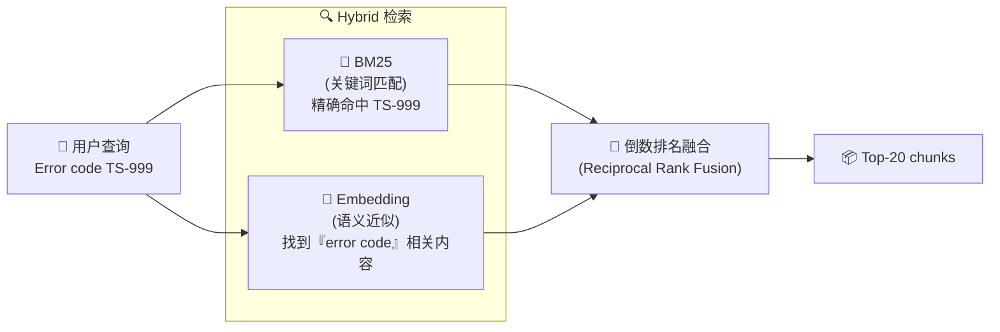
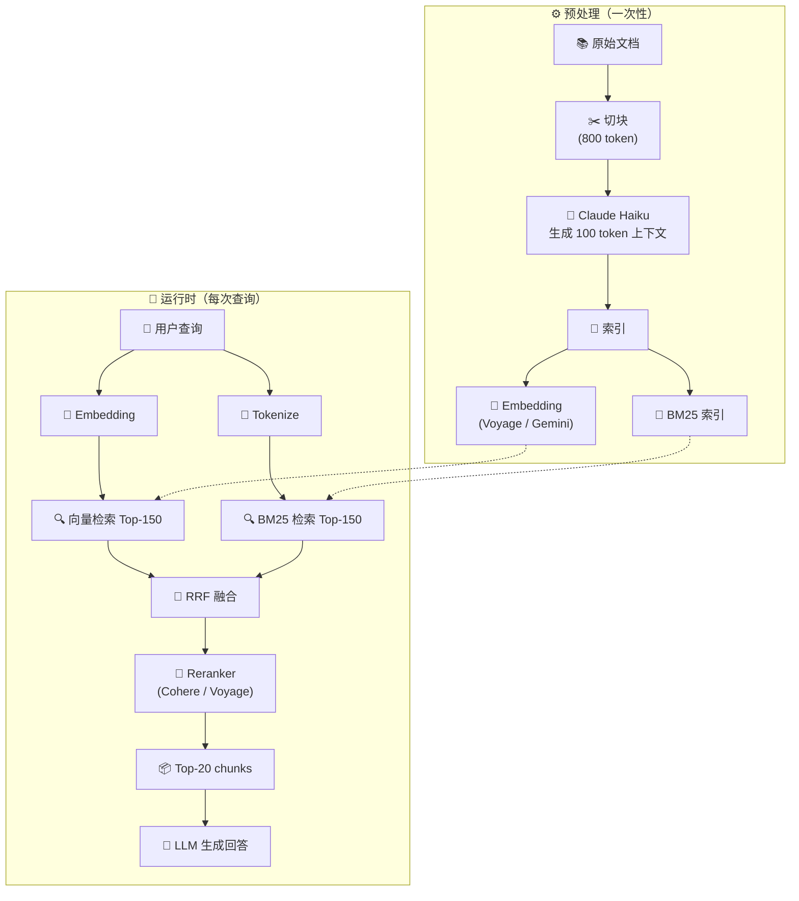

# 生产级 RAG：Hybrid + Rerank + Contextual

> ⬅️ [返回目录](README.md) | 上一篇：[长 Context + Caching](README2.md) | 下一篇：[Agentic Retrieval](README4.md)

---

## 🎯 一句话定位

**重型武器**——三条件缺一不可：①大数据量（10K+ 文档）②语义模糊查询（描述 ≠ 命名）③没法塞 Context。  
> 网上教程教的 baseline RAG（切块→Embedding→向量库→检索→生成）做 demo 可以，做产品即翻车。**生产级 RAG 必须三件套齐全：Hybrid + Rerank + Contextual。**

---

## 🚫 反模式：Baseline RAG 别上线

### 典型翻车场景

```
用户： "我想了解 ACME 公司 2023 Q2 的营收增长情况"
系统： "抱歉，我找到的文档片段是『营收增长了 3%』，无法确定具体公司或时间"
```

**根因**：传统 RAG 把文档切成 chunk 后，**上下文丢失**——chunk 不知道"我是谁、来自何时"。

### Baseline RAG 的三大问题

| 问题 | 说明 |
|:--|:--|
| ❌ 单向量检索 | 精确匹配场景（如错误码 `TS-999`）完全失效 |
| ❌ 上下文丢失 | 切块后丢失公司名、时间、章节等关键元信息 |
| ❌ 召回噪音大 | 100 个 chunk 灌给模型，模型分不清重点 |

---

## ⭐ 三大必做升级

### 升级 1：Hybrid Search（混合检索）

**原理**：BM25（关键词命中）+ Embedding（语义近似）双路召回，短板互补。



**为什么需要 BM25**：

- 错误码 / API 名称 / 配置项 / 代码标识符：embedding 找不到，BM25 一抓一个准
- Anthropic 实验数据：BM25 + Embedding 比单 Embedding 召回失败率降低 **49%**

### 升级 2：Reranker（重排序）— 性价比最高

**原理**：召回 Top-100，Reranker 精选 Top-5，喂给 LLM。

**对比数据**（Anthropic 2024）：

| 升级项 | 失败率降低 | 性价比 |
|:--|:--|:--|
| 换 Embedding 模型 | +2pp | 低（边际收益小） |
| **加 Reranker** | **+25pp** | **高（10x 提升）** |

**主流 Reranker**：

| 服务商 | 模型 | 备注 |
|:--|:--|:--|
| Cohere | `rerank-3.5` | 行业标杆，Anthropic 实验用 |
| Voyage AI | `rerank-2` | 性价比高 |
| BGE | `bge-reranker-v2-m3` | 开源本地部署 |

### 升级 3：Contextual Retrieval（上下文检索）— Anthropic 2024 提案

**核心思路**：在 Embedding 和 BM25 索引前，**给每个 chunk 预生成 50–100 token 的上下文摘要**，拼到 chunk 前面。

**示例**：

```text
原 chunk：
"该公司的营收增长了 3%。"

加上下文后（Contextualized chunk）：
"这段内容来自 ACME 公司 2023 年第二季度的 SEC 财务文件；
上季度营收为 3.14 亿美元。该公司的营收增长了 3%。"
```

**实现提示词**（Anthropic 用 Claude 3 Haiku）：

```text
<document>
{{WHOLE_DOCUMENT}}
</document>
Here is the chunk we want to situate within the whole document
<chunk>
{{CHUNK_CONTENT}}
</chunk>
Please give a short succinct context to situate this chunk within the
overall document for the purposes of improving search retrieval of
the chunk. Answer only with the succinct context and nothing else.
```

**成本数据**（Anthropic 2024）：
- 预处理成本：**$1.02 / 百万文档 token**（用 Prompt Caching 一次性写入）
- 800 token chunk、8K token 文档、100 token 上下文 → 总成本可控

---

## 📊 升级效果：Anthropic 官方数据

实验覆盖多个领域（代码库、小说、ArXiv 论文、科学论文），多个 embedding 模型，多种检索策略：

| 方案 | 检索失败率（Top-20） | 改善幅度 |
|:--|:--|:--|
| 基线（单 Embedding） | 5.7% | — |
| + BM25 | ~4.5% | -21% |
| **+ Contextual Embeddings** | **3.7%** | **-35%** |
| **+ Contextual Embeddings + Contextual BM25** | **2.9%** | **-49%** |
| **+ 上述全部 + Reranker** | **1.9%** | **-67%** |

> 🎯 **核心收益**：三件套叠加，检索失败率降为原来的 **1/3**。

---

## 🔄 完整生产级 RAG 流程



---

## 🛠️ 工具链

### 框架层

| 框架 | 优势 | 备注 |
|:--|:--|:--|
| **LangChain** | 生态最全 | 文档多，社区活跃 |
| **LlamaIndex** | 检索抽象最完善 | RAG 场景首选 |
| **Haystack** | 生产级 pipeline | 适合企业部署 |
| **Spring AI** | Java 团队友好 | 集成 Spring 生态 |

### 向量数据库

| 数据库 | 部署 | 特点 |
|:--|:--|:--|
| **Qdrant** | 自托管/云 | 性能强，Rust 实现 |
| **Weaviate** | 自托管/云 | 模块化设计 |
| **Pinecone** | 全托管 | 免运维，按量付费 |
| **Milvus** | 自托管 | 大规模场景 |
| **pgvector** | PostgreSQL 扩展 | 已有 PG 团队 |

### Embedding 模型（按效果排序）

| 排名 | 模型 | 提供方 | 备注 |
|:--|:--|:--|:--|
| 🥇 | `voyage-3` | Voyage AI | Anthropic 实验推荐 |
| 🥈 | `text-embedding-004` | Gemini | Google，效果接近 Voyage |
| 🥉 | `text-embedding-3-large` | OpenAI | 通用性好 |
| 4 | `bge-large-zh-v1.5` | BGE（开源） | 中文场景 |

### Reranker

| 服务 | 模型 | 价格量级 |
|:--|:--|:--|
| Cohere | `rerank-3.5` | $2 / 1K queries |
| Voyage AI | `rerank-2` | 更低 |
| BGE | `bge-reranker-v2-m3` | 免费（自部署） |

---

## 💡 实战经验

### 1. Chunking 策略

| 文档类型 | 推荐切分 | 备注 |
|:--|:--|:--|
| Markdown / 文本 | 按段落 / 标题 | 保持语义完整 |
| 代码 | 按函数 / 类 | 用 AST 切分 |
| PDF 表格 | **不切块**，单独索引 | 走 text-to-SQL 更优 |
| 长文档 | 滑动窗口（800 token + 200 overlap） | 平衡召回与精度 |

### 2. 实施检查清单

- [ ] BM25 索引已建立并可用
- [ ] Reranker API 已集成
- [ ] Contextual Retrieval 预处理已执行（用 Haiku 一次性处理 + Caching 节省成本）
- [ ] Eval 集 ≥ 100 个真实 query
- [ ] 监控：召回率、答案准确率、平均延迟
- [ ] Top-K = 20（Anthropic 实验最优值）

### 3. 何时不升级 Reranker？

Reranker 也增加延迟（一次额外 API 调用）。如果：

- 召回数量已经 ≤ 20：不需要 Reranker
- 实时性要求极致（< 200ms）：评估 Reranker 延迟影响
- 成本敏感：先 Hybrid + Contextual，最后再加 Reranker

---

## 🤔 思考

1. **你的项目需要 RAG 吗**：检查三条件——大数据 + 语义模糊 + 塞不下 Context。缺一不可。
2. **Baseline RAG vs 三件套**：你当前是 baseline 吗？升级到 Hybrid + Rerank + Contextual，预计失败率能从多少降到多少？
3. **Reranker 的 ROI**：Cohere Rerank $2/1K queries，相对于召回失败率 -25pp 的提升，值不值？

---

> ⬅️ [返回目录](README.md) | 上一篇：[长 Context + Caching](README2.md) | 下一篇：[Agentic Retrieval](README4.md)
