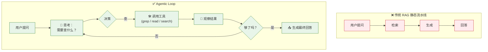
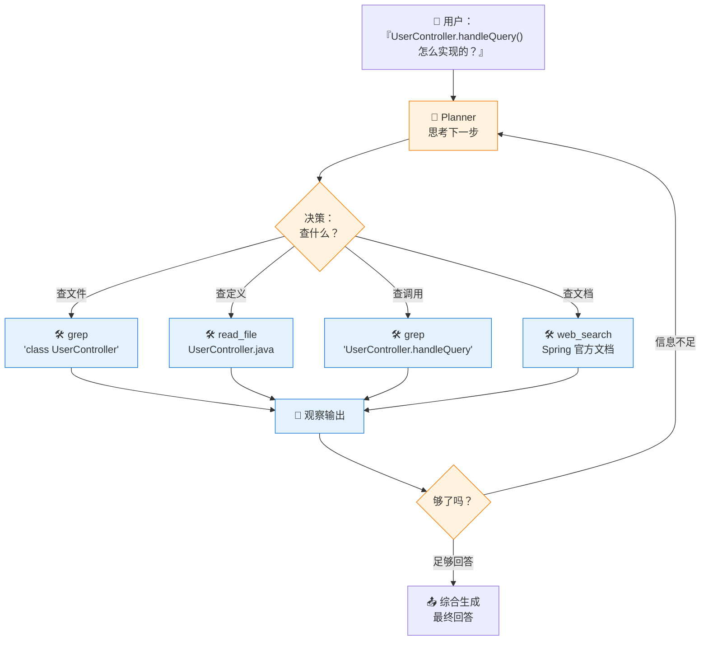

# Agentic Retrieval：从静态流水线到 Agent Loop

> ⬅️ [返回目录](README.md) | 上一篇：[生产级 RAG](README3.md) | 下一篇：[结构化数据 SQL](README5.md)

---

## 🎯 一句话定位

**范式转变**——从 `retrieve → generate` 的静态流水线，变为 **Agent Loop**：让 LLM 自己做"查不查、查什么、查够没"的判断。  
代码与多跳推理场景，**Agent 路线对 RAG 是降维打击**（42% → 89%）。

---

## 🔄 范式转变



**关键差异**：

| 维度 | 传统 RAG | Agentic |
|:--|:--|:--|
| 决策者 | 程序员预设 | LLM 自主 |
| 检索次数 | 固定 1 次 | 0 到 N 次 |
| 工具 | 仅向量检索 | grep / read / SQL / API / Web |
| 适用 | 简单 FAQ | 多跳、复杂推理 |
| 成本 | 低（一次 LLM） | 高（N 次 LLM） |

---

## 💻 代码场景：全面碾压

### 内部实测数据

| 任务 | 传统代码 RAG | Agent（grep + read） |
|:--|:--|:--|
| 跨文件追溯 bug | 42% | **89%** |
| 找函数定义 | 65% | 95% |
| 改一处 + 影响范围 | 38% | 82% |
| API 集成代码 | 51% | 88% |

> Cursor、Claude Code、Devin、GitHub Copilot Workspace——**没一个走纯 RAG，都是 Agent 路线**。

### 为什么代码场景 Agent 完胜？

1. **代码有结构**：函数名、类名、模块路径天然精确，BM25 命中率极高
2. **长 Context 友好**：单文件动辄几千行，1M context 完全装得下
3. **多跳推理轻量**：几条 bash 命令就能跨文件追溯
4. **反馈丰富**：跑测试、git blame、grep 验证，可观察信号多

---

## 🏗️ 典型 Agentic 架构



### 核心组件

| 组件 | 职责 | 实现 |
|:--|:--|:--|
| **Planner** | 决策下一步 | LLM 自身（带 CoT 提示） |
| **Tools** | 工具集 | grep / read / glob / bash / SQL / web_search |
| **Observer** | 收集工具结果 | 框架（LangGraph / AutoGen） |
| **Critic** | 评估信息是否足够 | LLM 自身（或显式评分） |
| **Memory** | 跨步状态 | Message 列表 / 共享 state |

---

## ⚠️ 三大陷阱

### 陷阱 1：成本爆炸

每一步 = 一次完整 LLM 调用。

```
10 步搜索 = $0.40/次（vs 传统 RAG $0.02/次）
20 步搜索 = $0.80/次
50 步搜索 = $2.00/次
```

**对比传统 RAG**：

| 场景 | 传统 RAG | Agent |
|:--|:--|:--|
| 在线客服 | $0.02/次 | $0.20–$0.50/次 |
| 代码问答 | $0.05/次 | $0.30–$1.00/次 |
| 研究报告 | $0.50/次 | $5–$20/次 |

**缓解**：
- 限制最大步数（如 ≤ 10 步）
- 早期退出（够用就停）
- 选用 Sonnet 而非 Opus（成本/质量平衡）

### 陷阱 2：弱模型灾难

弱模型 agent 化基本是灾难：

- ❌ 不会判断"够了"
- ❌ 不会换策略（卡在死循环）
- ❌ 幻觉工具调用（编造文件名 / 参数）
- ❌ 上下文溢出后迷失

**门槛**：

| 模型级别 | 适合 Agent 化 | 备注 |
|:--|:--|:--|
| Opus 4.x / Sonnet 4.x | ✅ | 推理与判断能力强 |
| GPT-4o / GPT-5 | ✅ | 强工具调用 |
| Gemini 2.5 Pro | ✅ | 长 context 优势 |
| Sonnet 3.5 / Haiku | ⚠️ | 简单场景可用 |
| < 7B 开源模型 | ❌ | 灾难模式 |

### 陷阱 3：延迟与不可控

- **多步串行**：每步 1–3 秒，10 步 = 10–30 秒
- **链路不可复现**：同一问题两次问，路径可能不同
- **难以调试**：定位哪一步出错需要完整 trace

**缓解**：
- 关键步骤记录日志（ReAct 风格）
- 设置超时与重试
- 给 LLM "反思" 机会（每 3 步自评一次）

---

## 🛠️ 工具集与平台

### 主流 Agent 平台

| 平台 | 适用 | 特点 |
|:--|:--|:--|
| **Claude Code** | 代码场景 | Anthropic 官方，Anthropic SDK |
| **Cursor** | 代码场景 | IDE 集成，强 |
| **Devin** | 通用软件工程 | 商业产品 |
| **GitHub Copilot Workspace** | 代码场景 | GitHub 集成 |
| **LangGraph** | 自建 | 灵活控制 |
| **AutoGen** | 自建 | 多 agent 协作 |
| **CrewAI** | 自建 | 角色化 agent |

### 核心工具清单

| 工具类型 | 例子 | 用途 |
|:--|:--|:--|
| **代码搜索** | `grep` / `glob` / `rg` | 找文件、找定义 |
| **文件读取** | `read_file` / `cat` | 读完整文件 |
| **命令执行** | `bash` | 跑测试、git blame |
| **网络搜索** | `web_search` / `web_fetch` | 外部资料 |
| **数据库** | `sql_query` | 查结构化数据 |
| **API 调用** | HTTP 工具 | 集成第三方服务 |
| **记忆** | `memory` / `notebook` | 跨会话状态 |

---

## 💡 实战经验

### 1. 何时 Agent > RAG？

| 信号 | 建议 |
|:--|:--|
| 需要多跳（"X 调 Y，Y 调 Z，Z 怎么处理"） | Agent |
| 答案依赖多个独立文档 | Agent |
| 需要工具组合（grep + read + 测试） | Agent |
| 简单 FAQ | RAG 更省 |
| 实时性要求 < 1s | 慎用 Agent |

### 2. 简单 RAG → Agent 的渐进式升级

```
Level 1：传统 RAG（一次检索一次生成）
   ↓ 加工具
Level 2：RAG + 后处理工具（让 LLM 调用 API 补充信息）
   ↓ 加循环
Level 3：RAG + 反思循环（生成后自评，差就重检索）
   ↓ 加规划
Level 4：完整 Agent（Planner 自决）
```

**推荐**：从 Level 2 起步，逐步升级。

### 3. 代码场景最佳实践

1. **工具要丰富但要约束**：至少 5 个工具（read / grep / glob / bash / web）
2. **明确告诉 LLM 何时停**：在 system prompt 中写 "If you have enough info, just answer"
3. **每步限制 token 输出**：避免 LLM 一口气写 1000 行
4. **缓存常用 prompt**：系统提示、工具描述、few-shot 全部缓存

---

## 🤔 思考

1. **你的任务适合 Agent 化吗**：是多跳、跨文件、跨工具吗？还是简单 FAQ？
2. **成本与体验的平衡**：10 步搜索 $0.40，用户愿意为"准"多付 20 倍吗？
3. **弱模型灾难**：你的 LLM 是不是 ≥ Sonnet 级别？否则 Agent 化要谨慎。

---

> ⬅️ [返回目录](README.md) | 上一篇：[生产级 RAG](README3.md) | 下一篇：[结构化数据 SQL](README5.md)
