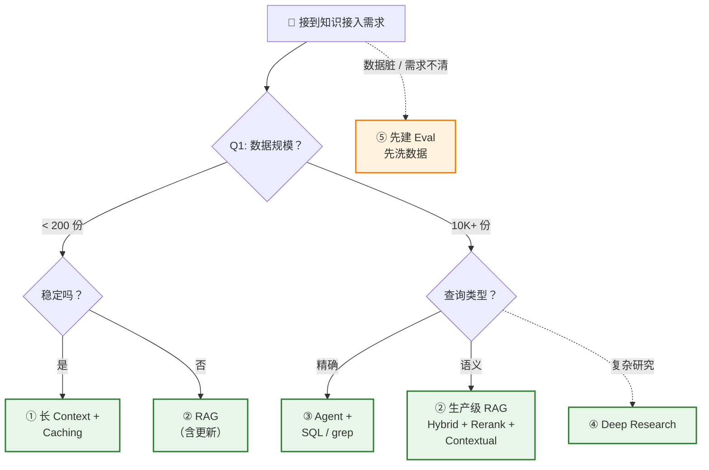
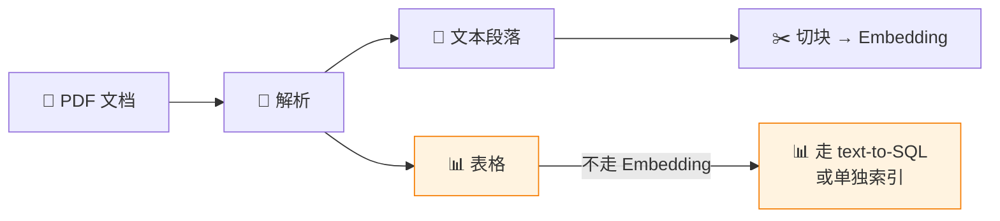

# 决策框架与综合实战：Eval + 数据质量 + 少府智库

> ⬅️ [返回目录](README.md) | 上一篇：[生产级 RAG 深入](README3.md)

---

## 🎯 一句话定位

**5 条路径都讲完了，但 80% 的项目翻车不是架构问题**——是 Eval 缺失、数据质量差。  
本章讲三件事：①**决策清单**（5 选 1）②**避坑指南**（Eval + 数据洗涮）③**综合实战**（少府智库完整搭建）。

---

## 📋 终极决策清单（5 选 1）

| 场景 | 推荐方案 | 关键依据 |
|:--|:--|:--|
| **① 小数据 + 稳定**（< 200 份文档，知识不常变） | **长 Context + Prompt Caching** | 别折腾，最甜 |
| **② 大数据 + 语义模糊**（10K+ 文档，查询绕） | **生产级 RAG**（Hybrid + Rerank + Contextual） | 别用 baseline |
| **③ 代码 / 结构化 / 多跳**（代码库、数据库、多步推理） | **Agent + grep / SQL / API** | 别建向量索引 |
| **④ 复杂研究 + 用户付得起**（尽调、学术综述、长报告） | **Deep Research 架构** | Planner → Search → Reader → Aggregator |
| **⑤ 以上都不确定**（需求不清、数据脏、没数据） | **先建 Eval · 先洗数据** | 再选架构 |

### 决策树



---

## 🚧 避坑 1：没建 Eval（评估体系）

### 真实案例

> 某团队改了一个 prompt，小测试集（5 个 query）+18% 准确率，**全员庆祝**。  
> 下周用户报 bug，真实日志整体召回率 -15%。**没人知道**，因为没人测真实流量。

### 铁律

> **Eval 比换 embedding 模型重要 10x**。没 eval，任何升级都是赌。

### 行动清单

**第一天就开始建 Eval**：

1. **从真实日志挖 100 个 query**
   - 用户真实问过的问题
   - 标注预期答案（人手标 / LLM 辅助标）
   - 覆盖简单 / 中等 / 复杂

2. **建立指标体系**

| 指标 | 计算方式 | 目标 |
|:--|:--|:--|
| 召回率（Recall@K） | 相关文档中出现在 Top-K 的比例 | ≥ 80% |
| 答案准确率 | LLM-as-judge 或人工评分 | ≥ 85% |
| 答案忠实度 | 答案是否仅基于检索内容（无幻觉） | ≥ 90% |
| 延迟 P95 | 第 95 百分位响应时间 | < 3s（在线）/ < 30s（Agent） |
| 成本 / 查询 | Token + API 费用 | 视场景定 |

3. **每次改动都跑一遍**
   - 换 embedding → 跑 eval
   - 调 prompt → 跑 eval
   - 升级 Reranker → 跑 eval
   - 加 RAG 路由 → 跑 eval

### 推荐工具

| 工具 | 特点 | 适合 |
|:--|:--|:--|
| **RAGAS** | RAG 专用指标 | 开箱即用 |
| **Phoenix（Arize）** | 全链路 tracing | 生产监控 |
| **TruLens** | 反馈函数化 | 快速实验 |
| **DeepEval** | 单元测试风格 | CI/CD 集成 |
| **LangSmith** | LangChain 配套 | LangChain 项目 |

---

## 🧹 避坑 2：数据质量 < 算法

### 残酷真相

> **三个月的项目，算法工作（embedding / rerank）只需 ~2 周，数据洗涮需要 ~10 周。**  
> 这不是工程师水平差——这是 RAG / Agent / LLM 系统的固有特性：**garbage in, garbage out**。

### Chunking 之前的"脏活"

#### 1. 格式归一

| 源格式 | 归一化策略 |
|:--|:--|
| PDF | 用 `unstructured` / `pymupdf` 抽文本 + 保留结构 |
| HTML | 清洗标签，保留 DOM 结构 |
| Word | 转 markdown |
| 图片（OCR 后） | 进 Embedding 前用 LLM 重新描述 |
| 多源混合 | 统一为 markdown / JSON |

#### 2. 表格单独处理



**为什么表格不进 Embedding**：
- 表格结构化，行列关系重要
- 切块破坏表格语义
- 走 text-to-SQL 精度 100%

#### 3. Metadata 设计（**比 embedding 还重要**）

每个 chunk 应至少包含：

```json
{
  "content": "营收增长了 3%。",
  "metadata": {
    "source": "ACME_2023Q2_10K.pdf",
    "page": 47,
    "section": "财务摘要",
    "company": "ACME",
    "fiscal_year": 2023,
    "fiscal_quarter": "Q2",
    "version": "v2023-08-01",
    "department": "Finance",
    "tags": ["earnings", "10-K"]
  }
}
```

**强大 metadata 让你无需重训模型就能过滤**。

#### 4. 冲突 / 过时机制

| 情况 | 处理 |
|:--|:--|
| 同一事实，多个版本 | **新版覆盖旧版**，旧版本打 `superseded` 标记 |
| 多源说法矛盾 | 标注矛盾，人工 / Agent 复核 |
| 文档过期 | 加 `expired_at` 字段，过期不进检索 |
| 政策类文档更新 | 维护版本链，`version` + `supersedes` 字段 |

---

## 🆘 逃生舱

**如果不想洗数据**，还有两条退路：

### 退路 1：长 Context + Caching

把原始脏数据直接塞 prompt，让**模型自己消化**：
- ✅ 跳过数据清洗
- ✅ 跳过 chunking
- ❌ 文档量超 200 万 token 时塞不下

### 退路 2：LLM Wiki（[第一章](README1.md)）

让 LLM 帮你整理资料，构建持久化 Wiki：
- ✅ LLM 自动摘要、链接、维护一致性
- ✅ 人类只负责"筛选资料 + 提出好问题"
- ❌ 启动成本：要建 Schema 与工作流

---

## 📊 资源分配建议

一个 3 个月项目的典型时间分配：

```
第 1 周   ███░░░░░░░  Eval 体系搭建 + 100 个测试 query
第 2–3 周 ██████░░░░  数据清洗（归一、表格、metadata）
第 4–5 周 ████░░░░░░  选架构 + 跑 baseline
第 6–9 周 ████████░░  升级优化（Hybrid / Rerank / Contextual）
第 10 周  ███░░░░░░░  真实流量灰度
第 11–12 周 ████░░░░  调优 + 文档
```

**对比常见错误分配**：

```
❌ 错误：
第 1 周  ███░░░░░░░ 调研向量库
第 2 周  ███░░░░░░░ 调研 embedding
第 3 周  ████░░░░░░ 调研 Reranker
... 8 周过去了，没建 Eval，没洗数据
最后 4 周调 prompt 调 embedding，毫无章法
```

---

## 🌟 未来 1-2 年判断

1. **Prompt Caching 继续挤压 RAG 空间**：Context 1M → 2M → 5M，缓存折扣 90% → 95% → 99%
2. **所有严肃系统 agentic 化**：从 `retrieve-then-generate` 静态流水线，走向 `Agent loop`
3. **Eval 工具被卷**：架构趋同后，比的是谁的评估闭环转得快
4. **数据治理是终极竞争力**：模型趋同 → 算法趋同 → 数据差异化

---

## 🎯 综合示例：少府智库 — 5 路径混合的个人知识库

把[第二章](README2.md)的 5 条路径 + 上面决策框架，落到一个真实项目上。

### 📖 背景设定

> 少府，一位独立研究员。日常需要处理：
> - 100 份 PDF 学术论文（电池技术、AI Agent、材料科学）
> - 1000 条印象笔记（灵感、摘录、读书笔记）
> - 50 段播客转录（访谈、圆桌、报告）
> - 偶尔查询：业务数据库（实验室的实验数据）

### 核心需求

| 场景 | 频率 | 延迟要求 | 成本预算 |
|:--|:--|:--|:--|
| 论文细节查询 | 高（每天 5–10 次） | < 5s | 低 |
| 跨论文综合分析 | 中（每周 2–3 次） | < 30s | 中 |
| 写综述报告 | 低（每月 1–2 次） | 10 min+ | 较高 |
| 查实验数据 | 中（每天 2–3 次） | < 2s | 低 |

### 第一步：数据盘点

按本章决策框架，逐类数据评估：

| 数据类别 | 规模 | 形态 | 查询类型 | 决策 |
|:--|:--|:--|:--|:--|
| **PDF 论文** | 1.0M tokens | 非结构化 | 语义模糊 | 生产级 RAG |
| **印象笔记** | 0.5M tokens | 半结构化 | 混合 | 长 Context + Wiki |
| **播客转录** | 1.5M tokens | 长文本 | 跨源综合 | Deep Research |
| **实验数据库** | 1 万行 | 高度结构化 | 精确聚合 | Text-to-SQL |

> **关键洞察**：**单一方案通吃是反模式**。每个数据集选择最匹配它的方案。

### 第二步：架构设计

| 组件 | 工具选型 | 章节对应 |
|:--|:--|:--|
| 论文 RAG | OpenSearch（BM25 + Vector）+ Cohere Rerank + Sonnet 4.5 | [第三章](README3.md) |
| 印象笔记 Wiki | Obsidian + Claude Code + Prompt Caching | [第一章](README1.md) + [第二章](README2.md) |
| Deep Research | LangGraph 自建 | [第二章路径 5](README2.md#-路径-5deep-research-架构) |
| SQL 助手 | Vanna + SQLite/Postgres | [第二章路径 4](README2.md#-路径-4结构化数据走-sql) |
| 统一 LLM | Claude Sonnet 4.5（主力） + Opus 4.x（深研） | — |

### 第三步：搭建流程

#### 阶段 1：Eval 先行（第 1 周）

> **不管用什么方案，先建 Eval**——本章铁律。

```text
[ ] 1. 收集 100 个真实 query
[ ] 2. 标注预期答案
[ ] 3. 选 Eval 工具（RAGAS 起步）
[ ] 4. 建立基线（用最朴素方案跑一遍，记录指标）
```

**基线指标（朴素方案）**：

| 维度 | 指标 | 基线值 |
|:--|:--|:--|
| 论文 RAG | Recall@20 | 62% |
| 笔记 Wiki | 找到率 | 78% |
| 实验 SQL | 正确率 | 85% |
| 整体 | 用户满意度 | 3.2/5 |

#### 阶段 2：数据洗涮（第 2–3 周）

```bash
# 1. PDF 格式归一
python -m unstructured partition_pdf papers/ --output-dir parsed/

# 2. 提取表格（不切块，单独索引）
python extract_tables.py parsed/ --output tables/

# 3. 加 metadata
python enrich_metadata.py parsed/ --schema metadata_schema.json
```

#### 阶段 3：RAG 升级（第 4–5 周）

**核心动作**：从 baseline RAG 升级到 Hybrid + Rerank + Contextual，详见[第三章](README3.md)。

**升级后跑 Eval**：

| 指标 | 基线 | 升级后 | 提升 |
|:--|:--|:--|:--|
| Recall@20 | 62% | 84% | +22pp |
| 答案忠实度 | 71% | 89% | +18pp |

#### 阶段 4：Wiki 搭建（第 6 周）

**Schema 设计**（实体 / 概念 / 摘要三类）见[第一章](README1.md)。

#### 阶段 5：Deep Research 集成（第 7–8 周）

仅在需要时调用（写月报 / 综述）。

#### 阶段 6：上线与迭代（第 9–12 周）

```text
第 9 周    灰度 10% 真实流量
第 10 周   收集反馈 + bug 修复
第 11 周   跑完整 Eval，对比基线
第 12 周   写文档 + 培训自己
```

### 第四步：效果评估

**三个月后指标**：

| 维度 | 基线 | 三个月后 | 提升 |
|:--|:--|:--|:--|
| 论文 RAG Recall@20 | 62% | **84%** | +22pp |
| 论文答案忠实度 | 71% | **89%** | +18pp |
| 笔记找到率 | 78% | **94%** | +16pp |
| 实验 SQL 正确率 | 85% | **96%** | +11pp |
| 综述写作时间 | 4 小时 | **45 分钟** | -81% |
| 用户满意度 | 3.2/5 | **4.6/5** | +44% |

**成本分析**：

| 组件 | 月查询量 | 单价 | 月成本 |
|:--|:--|:--|:--|
| 论文 RAG | 300 次 | $0.08 | $24 |
| 笔记 Wiki | 500 次 | $0.02（缓存命中） | $10 |
| Deep Research | 10 次 | $8.00 | $80 |
| SQL 助手 | 100 次 | $0.03 | $3 |
| **合计** | — | — | **$117/月** |

> 对比全用 RAG 的方案（$840/月），节省 **86%**。

### 💡 关键经验

1. **单一方案通吃是反模式**——每个数据集选最匹配的方案
2. **Eval 是唯一稳定锚**——每改一个参数都跑 Eval
3. **数据质量 > 算法**——格式归一、表格单独、Metadata 优先
4. **LLM Wiki 是粘合剂**——5 条路径的输出可沉淀为持久化知识资产

---

## 🤔 思考

1. **你的 Eval 现状**：你有多少真实 query 标注？跑了多少次评估？评估的指标覆盖度？
2. **数据脏活优先级**：你项目里，最该先洗的是格式归一、表格处理、还是 metadata？
3. **逃生舱的判断**：你的项目适合"先洗数据"，还是"塞 prompt 让模型扛"？
4. **混合方案 vs 单一方案**：你的项目能不能拆成 2-3 类数据，每类用不同方案？

---

> ⬅️ [返回目录](README.md) | 上一篇：[生产级 RAG 深入](README3.md)
