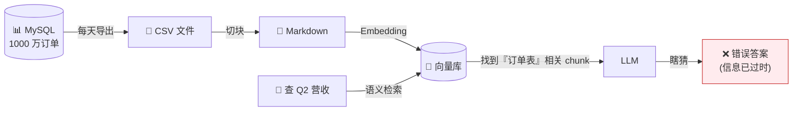
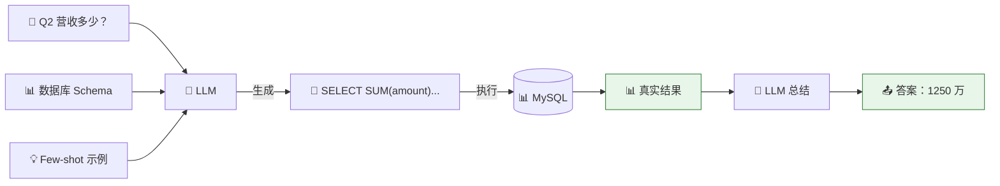
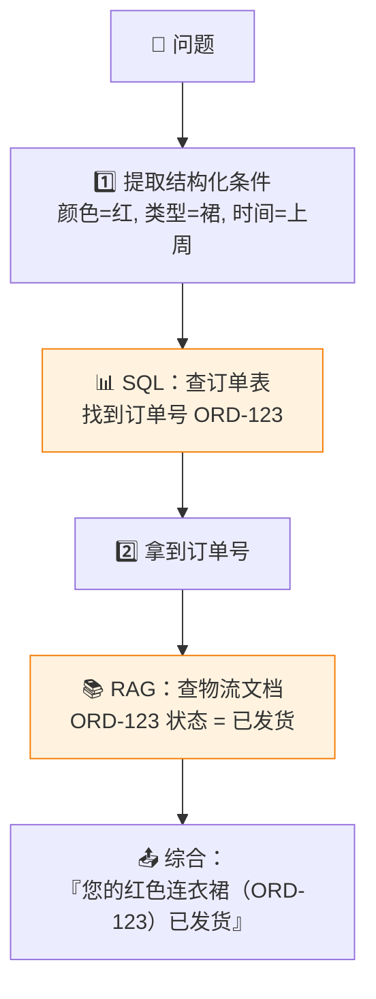

# 结构化数据走 SQL：业务数据的正确打开方式

> ⬅️ [返回目录](README.md) | 上一篇：[Agentic Retrieval](README4.md) | 下一篇：[Deep Research](README6.md)

---

## 🎯 一句话定位

**业务数据别 dump 文档**——把 MySQL 业务表导出成 markdown 丢进向量库是反模式（精度爆死、实时性归零）。  
正解：**让模型生成 SQL 直接查数据库**——Text-to-SQL，精度 100%，永远新鲜。

---

## 🚫 反模式：业务表 Dump 文档

### 典型错误做法



### 三大问题

| 问题 | 后果 |
|:--|:--|
| ❌ **精度爆死** | 向量相似 ≠ 数据匹配，差一个数字答案错 |
| ❌ **实时性归零** | 导出 → 索引 → 检索，延迟小时级 |
| ❌ **数据一致性** | 同一问题两次问，答案可能不同 |

---

## ✅ 正解：Text-to-SQL

### 原理



### 端到端实现

**第 1 步：准备 Schema + Few-shot**

```sql
-- 喂给 LLM 的 schema
CREATE TABLE orders (
    id INT PRIMARY KEY,
    customer_id INT,
    amount DECIMAL(10, 2),
    status VARCHAR(20),
    created_at DATETIME
);

CREATE TABLE customers (
    id INT PRIMARY KEY,
    name VARCHAR(100),
    region VARCHAR(50)
);
```

**第 2 步：NL2SQL Prompt 模板**

```text
根据 DATABASE_SCHEMA 部分提供的数据库模式定义，编写一个 SQL 查询
来回答 QUESTION 部分的问题。

规则：
- 仅生成 SELECT 查询语句
- 如果问题会导致 INSERT、UPDATE、DELETE，拒绝并说明
- 如果 DDL 不支持回答该问题，明确说明

DATABASE_SCHEMA
{ddl}

FEW_SHOT_EXAMPLES
{examples}

QUESTION
{question}
```

**第 3 步：执行 + 总结**

```python
import sqlite3

def nl2sql_and_execute(question: str, schema: str, db_path: str) -> str:
    # 1. LLM 生成 SQL
    sql = llm.generate(prompt_template.format(ddl=schema, question=question))

    # 2. 校验 SQL（只允许 SELECT）
    if not sql.upper().strip().startswith("SELECT"):
        return "操作不被支持"

    # 3. 执行
    conn = sqlite3.connect(db_path)
    result = conn.execute(sql).fetchall()
    conn.close()

    # 4. LLM 总结自然语言答案
    answer = llm.summarize(f"SQL: {sql}\n结果: {result}\n请用自然语言回答")
    return answer
```

---

## 🔧 工具链

### 开源框架

| 框架 | 特点 | 备注 |
|:--|:--|:--|
| **Vanna** | Text-to-SQL 专用 | RAG 增强 schema 检索 |
| **LlamaIndex SQL** | 集成 LlamaIndex | 与 RAG 混合场景 |
| **SQLChain（LangChain）** | LangChain 模块 | 灵活 |
| **WrenAI** | 开源 Text-to-SQL | 支持多数据库 |
| **Chat2DB** | 国产开源 | 中文友好 |

### 自拼最小方案

```python
# 最小三件套：Schema + Few-shot + Sonnet
import anthropic

client = anthropic.Anthropic()

def text_to_sql(question: str, schema: str, examples: list) -> str:
    response = client.messages.create(
        model="claude-sonnet-4-5",
        max_tokens=512,
        system=f"""你是 SQL 专家。根据 schema 生成 SELECT 查询。
        Schema: {schema}
        Examples: {examples}""",
        messages=[{"role": "user", "content": question}],
    )
    return response.content[0].text
```

---

## 🆚 SQL vs RAG 何时用谁？

| 维度 | SQL | RAG |
|:--|:--|:--|
| **数据形态** | 结构化表（行列明确） | 非结构化文档 |
| **查询类型** | 聚合 / 过滤 / 统计 / 排序 | 语义相似度 / 模糊匹配 |
| **实时性** | 数据库新鲜即新鲜 | 取决于索引更新频率 |
| **精度** | 100%（精确匹配） | 60–90%（语义近似） |
| **可解释性** | SQL 可审计 | 黑盒 |
| **可处理规模** | 千万级行 | 文档数百万 |
| **典型工具** | Vanna / WrenAI | LangChain / LlamaIndex |

### 决策流程

```
数据有明确表结构吗？
├── 是 → 走 SQL（精度、实时性、可解释性都更好）
└── 否 → 是文档 / 笔记 / 邮件吗？
         ├── 是 → 走 RAG
         └── 否 → 考虑 Hybrid（SQL + RAG 混合）
```

---

## 🌟 进阶：Hybrid（SQL + RAG 混合）

### 典型场景：电商客服

**问题**：客户问"我上周买的那个红色连衣裙发货了吗？"

**混合流程**：



### 端到端实现

```python
def hybrid_query(question: str):
    # 1. LLM 提取结构化条件
    conditions = extract_conditions(question)
    # 例如 {"color": "red", "category": "dress", "time_range": "last_week"}

    # 2. 走 SQL 查订单
    order = query_db("""
        SELECT order_id, status
        FROM orders o JOIN products p ON o.product_id = p.id
        WHERE p.color = ? AND p.category = ?
          AND o.created_at > date('now', '-7 days')
    """, conditions)

    # 3. 拿订单号查 RAG（物流文档）
    shipping = rag_search(f"order {order['order_id']} shipping status")

    # 4. 综合回答
    return f"您的{conditions['category']}（订单 {order['order_id']}）{shipping}"
```

---

## 🛠️ 实战经验

### 1. Schema 注入策略

| 库表数量 | 策略 |
|:--|:--|
| < 20 张 | 全量注入 prompt |
| 20–100 张 | 按业务模块切片，按需注入 |
| 100+ 张 | **RAG 检索相关表结构**（meta-RAG） |

### 2. SQL 安全约束

```python
def safe_execute(sql: str):
    # 黑名单：禁止任何修改/删除
    forbidden = ["INSERT", "UPDATE", "DELETE", "DROP", "ALTER", "TRUNCATE"]
    sql_upper = sql.upper()
    for kw in forbidden:
        if kw in sql_upper:
            raise PermissionError(f"SQL 包含禁止关键字: {kw}")

    # 限制返回行数
    if "LIMIT" not in sql_upper:
        sql += " LIMIT 100"

    # 只读账号连接
    return readonly_db.execute(sql)
```

### 3. 错误处理

- **语法错误**：让 LLM 自我修正（最多重试 3 次）
- **逻辑错误**：让 LLM 解释意图，校验是否符合问题
- **超时**：设置 statement timeout（< 10s）
- **空结果**：明确告知"未找到"，避免幻觉

---

## 💡 业务场景案例

### 案例 1：财务报表问答

```
用户：本季度华东区销售额超过 100 万的代理商有哪些？
SQL：SELECT agent_name FROM sales
     WHERE region = '华东'
       AND amount > 1000000
       AND quarter = 'Q2-2025'
```

### 案例 2：HR 数据查询

```
用户：研发部 5 年以上工龄、本科以上学历的员工有多少？
SQL：SELECT COUNT(*) FROM employees
     WHERE dept = '研发'
       AND years_of_service >= 5
       AND education IN ('本科', '硕士', '博士')
```

### 案例 3：日志分析

```
用户：过去 24 小时 ERROR 级别、含 "OutOfMemory" 的日志有多少条？
SQL：SELECT COUNT(*), sample_log FROM logs
     WHERE level = 'ERROR'
       AND message LIKE '%OutOfMemory%'
       AND timestamp > datetime('now', '-1 day')
```

---

## 🤔 思考

1. **你的业务数据能 SQL 化吗**：你的知识需求里有多少是结构化查询可以解决的？
2. **Hybrid 混合的价值**：你的场景里，是否存在"先 SQL 拿 ID，再 RAG 查文档"的需求？
3. **SQL 安全 vs 灵活性**：你的系统是否允许 LLM 直接执行 SQL？还是必须人工确认？

---

> ⬅️ [返回目录](README.md) | 上一篇：[Agentic Retrieval](README4.md) | 下一篇：[Deep Research](README6.md)
