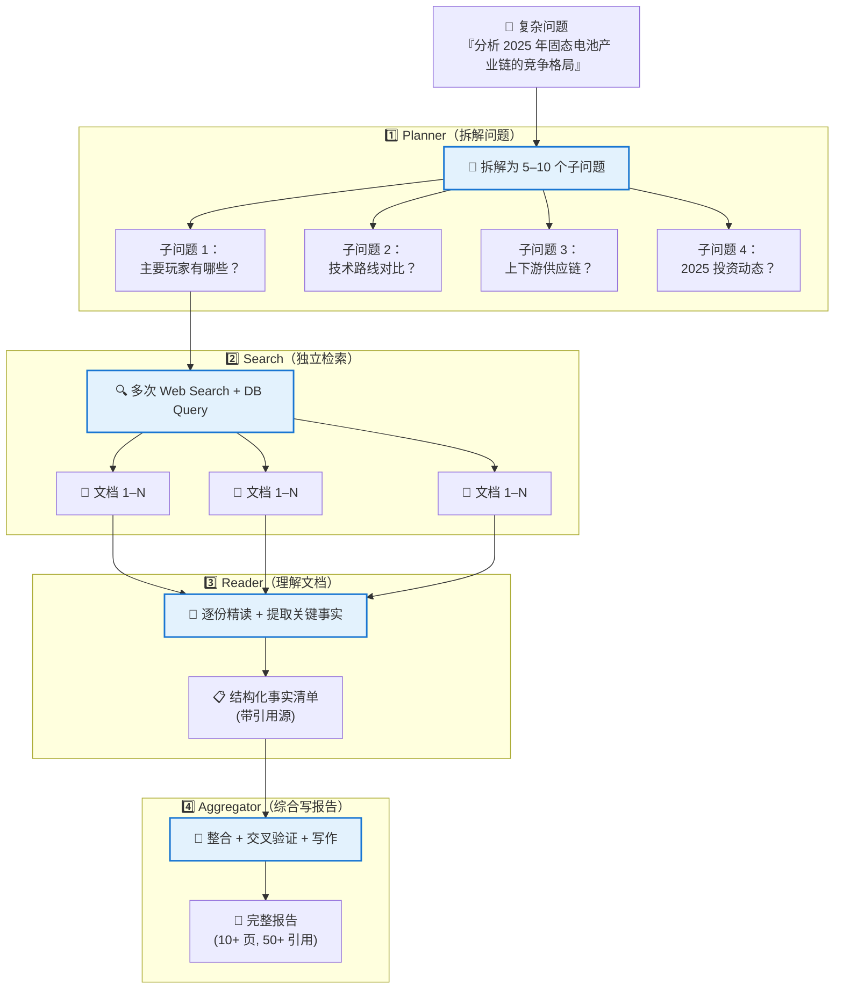

# Deep Research 架构：一次查询 = 一篇报告

> ⬅️ [返回目录](README.md) | 上一篇：[结构化数据 SQL](README5.md) | 下一篇：[决策框架与最佳实践](README7.md)

---

## 🎯 一句话定位

**最重一档**——多轮检索 + 综合生成，给尽调、学术综述、行业研究等复杂问题用。  
**一次查询的成本**：$5–$20，**延迟**：5–15 分钟，**调用次数**：40+ LLM + 30+ Web Search。  
**OpenAI / Google / Perplexity 的深研产品——没一个是 RAG。**

---

## 🏗️ 核心架构：四件套



### 各阶段职责

| 阶段 | 职责 | 关键能力 |
|:--|:--|:--|
| **Planner** | 把大问题拆成可执行的子问题 | 任务分解、依赖图 |
| **Search** | 每个子问题独立检索 | Web Search / DB / API / 文件 |
| **Reader** | 精读每份文档，提取事实 | 摘要、抽取、引用 |
| **Aggregator** | 综合 + 交叉验证 + 写作 | 长文生成、引用标注 |

---

## 💰 成本与延迟

| 维度 | 数值 | 备注 |
|:--|:--|:--|
| 一次查询成本 | $5 – $20 | Sonnet 4.5 量级 |
| 总调用次数 | 40+ LLM + 30+ Web Search | 子问题展开 + 验证 |
| 单查询延迟 | 5 – 15 分钟 | 串行步骤多 |
| 输出长度 | 5,000 – 50,000 字 | 类似一份报告 |
| 引用源数量 | 30 – 100+ | 每个事实都需可追溯 |

> 🎯 **这不是"查询"**——这是把一次提问变成一篇**研究报告**的工作量外包给 AI。

---

## 🎯 适用 vs 不适用

| ✅ 适用 | ❌ 不适用 |
|:--|:--|
| 尽调报告（投资 / 并购） | 简单 FAQ |
| 学术综述（论文 / 专利） | 实时对话（延迟太长） |
| 行业研究（市场 / 竞争） | 成本敏感场景 |
| 复杂多跳问题 | 强实时性（< 1s） |
| 用户付得起 + 问题足够复杂 | 普通客服问答 |

---

## 🌐 行业产品对比

| 产品 | 提供方 | 特点 | 检索来源 |
|:--|:--|:--|:--|
| **Deep Research** | OpenAI | o3 模型驱动，深度推理 | Web |
| **Deep Research** | Google（Gemini） | 2M context 优势，跨模态 | Web + 用户文件 |
| **Pro Research** | Perplexity | 实时性强，引用清晰 | Web |
| **Manus** | 国产 | 多 agent 协作，工具丰富 | Web + DB + 工具 |
| **Genspark** | 国产 | Sparkpage 概念，多源合成 | Web + 多源 |
| **Self-built** | 自建 | LangGraph / AutoGen 编排 | 灵活 |

> **共同点**：都不是 RAG，都是 Agent Loop + 多次检索 + 长文生成。

---

## 🛠️ 自建实现（LangGraph 示例）

### 最小可运行示例

```python
from langgraph.graph import StateGraph
from typing import TypedDict, List

class ResearchState(TypedDict):
    question: str
    sub_questions: List[str]
    documents: List[dict]
    facts: List[dict]
    report: str

def planner(state: ResearchState) -> ResearchState:
    """拆解问题"""
    sub_qs = llm.generate(f"""
    把以下问题拆解为 5–8 个可独立检索的子问题：
    {state['question']}

    输出 JSON 列表：["子问题1", "子问题2", ...]
    """)
    state['sub_questions'] = parse_json(sub_qs)
    return state

def searcher(state: ResearchState) -> ResearchState:
    """对每个子问题独立检索"""
    all_docs = []
    for sub_q in state['sub_questions']:
        results = web_search(sub_q, top_k=10)
        all_docs.extend(results)
    state['documents'] = deduplicate(all_docs)
    return state

def reader(state: ResearchState) -> ResearchState:
    """逐份精读，提取事实"""
    facts = []
    for doc in state['documents']:
        extracted = llm.generate(f"""
        从以下文档中提取与原问题相关的事实，标注引用源：

        原问题：{state['question']}
        文档：{doc['content']}

        输出 JSON：{{"fact": "...", "source": "...", "confidence": 0.0-1.0}}
        """)
        facts.append(parse_json(extracted))
    state['facts'] = facts
    return state

def aggregator(state: ResearchState) -> ResearchState:
    """综合生成报告"""
    report = llm.generate(f"""
    基于以下事实，撰写一份结构化研究报告：

    问题：{state['question']}
    事实清单：{state['facts']}

    要求：
    - 章节清晰（背景 / 分析 / 结论）
    - 每个论点附引用源
    - 标注事实置信度
    - 8000-15000 字
    """)
    state['report'] = report
    return state

# 组装工作流
workflow = StateGraph(ResearchState)
workflow.add_node("planner", planner)
workflow.add_node("searcher", searcher)
workflow.add_node("reader", reader)
workflow.add_node("aggregator", aggregator)

workflow.set_entry_point("planner")
workflow.add_edge("planner", "searcher")
workflow.add_edge("searcher", "reader")
workflow.add_edge("reader", "aggregator")
workflow.set_finish_point("aggregator")

app = workflow.compile()
result = app.invoke({"question": "分析 2025 固态电池产业链"})
print(result['report'])
```

---

## 💡 实战经验

### 1. 子问题拆解质量决定上限

**好的拆解**（按维度 + 依赖）：
```
1. 主要玩家及市场份额
2. 技术路线对比（聚合物 / 氧化物 / 硫化物）
3. 上游原材料供应链
4. 下游应用场景（车 / 储能 / 消费电子）
5. 2025 投资动态
6. 政策与监管
7. 风险与挑战
```

**差的拆解**（太宽泛）：
```
1. 介绍一下固态电池
2. 它的发展历史
3. 未来会怎样
```

### 2. 检索源的多样性

| 检索源 | 适合问题 | 注意事项 |
|:--|:--|:--|
| Web 公开搜索 | 行业动态、新闻 | 时效性强，但需验证 |
| 学术数据库 | 论文、专利 | 质量高，访问受限 |
| 企业内部 DB | 业务数据、合同 | 走 SQL 更优 |
| 用户上传文件 | 项目文档 | 走 RAG 更优 |
| API（财报 / 工商） | 财务、股权 | 实时准确 |

**原则**：Deep Research 应同时调用 ≥ 3 种来源，单一来源会被偏见带偏。

### 3. 引用与交叉验证

每个事实必须标注：
- **来源 URL / 文档 ID**
- **检索时间**
- **置信度**（多源印证 = 高，单一来源 = 中）

**Aggregator 阶段必做**：
- 矛盾检测（两份来源说法不一致 → 标注 + 进一步检索）
- 时效检查（用最新版本替换过时版本）
- 完整性检查（每个子问题都有结论）

### 4. 何时降级

如果用户问题不复杂：

```
子问题数 ≤ 2：考虑直接 Agent + 单次 RAG
简单聚合问题：考虑 Text-to-SQL
已知结构：考虑 RAG + 总结
仅当 ≥ 5 个子问题、跨多源、需要长报告 → 走 Deep Research
```

---

## 🤖 行业产品内部架构推测

虽然商业产品不公开细节，但从行为推测：

| 阶段 | OpenAI Deep Research | Gemini Deep Research |
|:--|:--|:--|
| Planner | o3 推理模型 | Gemini 2.5 Pro |
| Search | Bing Search API | Google Search + 用户文件 |
| Reader | o3 + 摘要 | Gemini 长 context |
| Aggregator | o3 长文生成 | Gemini 长文生成 |
| 特殊能力 | 多步推理 + 反思 | 跨模态（图 / 表） |

> **共性**：模型自身（而非专用模型）驱动全流程，强调 reasoning 而非 retrieval。

---

## 🤔 思考

1. **你的问题值得 Deep Research 吗**：复杂度 ≥ 5 个子问题？用户能等 10 分钟？付得起 $10+？
2. **检索源策略**：你的项目里，最有价值的检索源是哪个？多源印证怎么做？
3. **引用与可信度**：报告交付时，是否每个事实都附了引用源？矛盾如何处理？

---

> ⬅️ [返回目录](README.md) | 上一篇：[结构化数据 SQL](README5.md) | 下一篇：[决策框架与最佳实践](README7.md)
