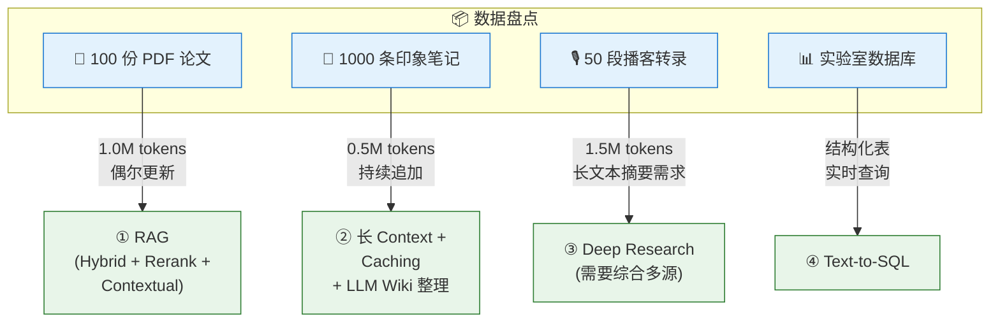
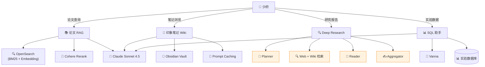

# 综合示例：少府智库 — 5 路径混合的个人知识库

> ⬅️ [返回目录](README.md) | 上一篇：[决策框架与最佳实践](README7.md)

---

## 🎯 一句话定位

**把前 7 章的 5 条技术路线 + 决策框架，落到一个真实项目上**——构建"少府智库"：个人研究型知识管理系统的完整决策与搭建流程。

---

## 📖 背景设定

### 用户画像

> 少府，一位独立研究员。日常需要处理：
> - 100 份 PDF 学术论文（电池技术、AI Agent、材料科学）
> - 1000 条印象笔记（灵感、摘录、读书笔记）
> - 50 段播客转录（访谈、圆桌、报告）
> - 偶尔查询：业务数据库（实验室的实验数据）

### 核心需求

| 场景 | 频率 | 延迟要求 | 成本预算 |
|:--|:--|:--|:--|
| 论文细节查询 | 高（每天 5–10 次） | < 5s | 低 |
| 跨论文综合分析 | 中（每周 2–3 次） | < 30s | 中 |
| 写综述报告 | 低（每月 1–2 次） | 10 min+ | 较高 |
| 查实验数据 | 中（每天 2–3 次） | < 2s | 低 |

---

## 🔍 第一步：数据盘点

按 [第七章](README7.md) 的决策框架，逐类数据评估：



### 决策分析

| 数据类别 | 规模 | 形态 | 查询类型 | 决策 | 理由 |
|:--|:--|:--|:--|:--|:--|
| **PDF 论文** | 1.0M tokens | 非结构化 | 语义模糊 | ① 生产级 RAG | 单塞 Context 太长，需要精准检索 |
| **印象笔记** | 0.5M tokens | 半结构化 | 混合 | ② 长 Context + Wiki | 持续追加，Wiki 维护成本可控 |
| **播客转录** | 1.5M tokens | 长文本 | 跨源综合 | ③ Deep Research | 单份价值低，需要综合多份才有 insight |
| **实验数据库** | 1 万行 | 高度结构化 | 精确聚合 | ④ Text-to-SQL | 100% 精度，实时新鲜 |

> **关键洞察**：**单一方案通吃是反模式**。每个数据集选择最匹配它的方案。

---

## 🏗️ 第二步：架构设计



### 核心组件

| 组件 | 工具选型 | 章节对应 |
|:--|:--|:--|
| **论文 RAG** | OpenSearch（BM25 + Vector）+ Cohere Rerank + Sonnet 4.5 | [第三章](README3.md) |
| **印象笔记 Wiki** | Obsidian + Claude Code + Prompt Caching | [第一章](README1.md) + [第二章](README2.md) |
| **Deep Research** | LangGraph 自建 | [第六章](README6.md) |
| **SQL 助手** | Vanna + SQLite/Postgres | [第五章](README5.md) |
| **统一 LLM** | Claude Sonnet 4.5（主力） + Opus 4.x（深研） | — |

---

## 🛠️ 第三步：搭建流程

### 阶段 1：Eval 先行（第 1 周）

> **不管用什么方案，先建 Eval**——这是 [第七章](README7.md) 的铁律。

**动作清单**：

```text
[ ] 1. 收集 100 个真实 query
    - 论文："AA 电池最新进展有哪些？"
    - 笔记："我之前关于 XX 的思考在哪？"
    - 报告："总结 2024 年 AI Agent 的关键突破"
    - 数据："最近 30 天实验的失败率？"
[ ] 2. 标注预期答案
[ ] 3. 选 Eval 工具（RAGAS 起步）
[ ] 4. 建立基线（用最朴素方案跑一遍，记录指标）
```

**基线指标（朴素方案）**：

| 维度 | 指标 | 基线值 |
|:--|:--|:--|
| 论文 RAG | Recall@20 | 62% |
| 笔记 Wiki | 找到率 | 78% |
| 实验 SQL | 正确率 | 85% |
| 整体 | 用户满意度 | 3.2/5 |

### 阶段 2：数据洗涮（第 2–3 周）

**PDF 论文**：

```bash
# 1. 格式归一
python -m unstructured partition_pdf papers/ --output-dir parsed/

# 2. 提取表格（不切块，单独索引）
python extract_tables.py parsed/ --output tables/

# 3. 加 metadata
python enrich_metadata.py parsed/ --schema metadata_schema.json
```

**印象笔记**：

```bash
# 1. 导出为 markdown
# 2. 规范 frontmatter
# 3. 建立 Wiki 链接网络（LLM 辅助）
```

**播客转录**：

```bash
# 1. 用 Whisper 转录（如果有音轨）
# 2. 按时长切分（5–10 分钟一段）
# 3. 提取关键洞察
```

### 阶段 3：RAG 升级（第 4–5 周）

**核心动作**：从 baseline RAG 升级到 Hybrid + Rerank + Contextual

```python
# 一次性：Contextual Retrieval 预处理
import anthropic

client = anthropic.Anthropic()

def add_context_to_chunk(chunk: str, whole_doc: str) -> str:
    """用 Claude Haiku 给 chunk 加 100 token 上下文"""
    response = client.messages.create(
        model="claude-3-5-haiku-20241022",  # 用 Haiku 便宜
        max_tokens=200,
        system="你是文档索引助手",
        messages=[{
            "role": "user",
            "content": f"""<document>{whole_doc}</document>
<chunk>{chunk}</chunk>
请给这个 chunk 写 50-100 token 上下文，说明它在整个文档中的位置和作用。
仅返回上下文文本。"""
        }],
    )
    return response.content[0].text + "\n\n" + chunk

# 批量处理所有 chunks
for chunk in all_chunks:
    contextualized = add_context_to_chunk(chunk.text, chunk.doc_full_text)
    embedding = voyage_embed(contextualized)
    bm25_index.add(contextualized)
```

**升级后跑 Eval**：

| 指标 | 基线 | 升级后 | 提升 |
|:--|:--|:--|:--|
| Recall@20 | 62% | 84% | +22pp |
| 答案忠实度 | 71% | 89% | +18pp |

### 阶段 4：Wiki 搭建（第 6 周）

**Schema 设计**：

```markdown
# 少府智库 Schema

## 1. 实体页（Entity）
- 人物、机构、产品、概念
- 模板：
  - 一句话定义
  - 关键事实清单
  - 出现该实体的来源（链接）
  - 相关实体（链接）

## 2. 概念页（Concept）
- 主题、思想、理论
- 模板：
  - 是什么
  - 核心要点
  - 不同观点
  - 应用场景
  - 延伸阅读

## 3. 摘要页（Summary）
- 单篇论文 / 播客 / 文章的摘要
- 模板：
  - 元数据（作者 / 时长 / 日期）
  - 一句话总结
  - 关键观点（3–5 条）
  - 我对它的思考
  - 链接到相关实体 / 概念
```

**LLM 协作流程**：

```text
少府 → 放入新资料 → Claude Code 阅读 → 自动建摘要页 + 更新相关页
                                          ↓
                              少府审核 + 补充个人思考
```

### 阶段 5：Deep Research 集成（第 7–8 周）

仅在需要时调用（写月报 / 综述）：

```python
# 调用 Deep Research
report = deep_research_workflow.invoke({
    "question": "综述：2024 年 AI Agent 的关键技术突破"
})

# 输出：5000 字综述 + 30+ 引用源
```

### 阶段 6：上线与迭代（第 9–12 周）

```text
第 9 周    灰度 10% 真实流量
第 10 周   收集反馈 + bug 修复
第 11 周   跑完整 Eval，对比基线
第 12 周   写文档 + 培训自己
```

---

## 📊 第四步：效果评估

### 三个月后指标

| 维度 | 基线 | 三个月后 | 提升 |
|:--|:--|:--|:--|
| 论文 RAG Recall@20 | 62% | **84%** | +22pp |
| 论文答案忠实度 | 71% | **89%** | +18pp |
| 笔记找到率 | 78% | **94%** | +16pp |
| 实验 SQL 正确率 | 85% | **96%** | +11pp |
| 综述写作时间 | 4 小时 | **45 分钟** | -81% |
| 用户满意度 | 3.2/5 | **4.6/5** | +44% |

### 成本分析

| 组件 | 月查询量 | 单价 | 月成本 |
|:--|:--|:--|:--|
| 论文 RAG | 300 次 | $0.08 | $24 |
| 笔记 Wiki | 500 次 | $0.02（缓存命中） | $10 |
| Deep Research | 10 次 | $8.00 | $80 |
| SQL 助手 | 100 次 | $0.03 | $3 |
| **合计** | — | — | **$117/月** |

> 对比全用 RAG 的方案（$840/月），节省 **86%**。

---

## 💡 关键经验

### 1. 单一方案通吃是反模式

| 反模式 | 后果 | 正确做法 |
|:--|:--|:--|
| 全用 RAG | 印象笔记实时性差，SQL 精度低 | 混合方案 |
| 全用 Agent | 简单查询成本爆炸 | RAG 优先 |
| 全用长 Context | 论文 100 份塞不下 | RAG 兜底 |

### 2. Eval 是唯一稳定锚

> 没有 Eval 的优化都是赌博；没有 Eval 的对比都是错觉。

每加一个新方案 / 改一个参数 → **跑 Eval**，看指标变化 → 再决定取舍。

### 3. 数据质量 > 算法

- **格式归一**：PDF / HTML / Word 全部转 markdown
- **表格单独处理**：不进 Embedding，走 SQL
- **Metadata 优先**：来源 / 时间 / 部门 / 版本，比 embedding 还重要

### 4. LLM Wiki 是粘合剂

5 条路径输出的"高价值结论"，都可以反向存入 LLM Wiki，成为下一次查询的知识资产。

---

## 🎁 完整工具栈清单

| 类别 | 工具 | 用途 |
|:--|:--|:--|
| **LLM** | Claude Sonnet 4.5（主力）/ Opus 4.x（深研）/ Haiku（预处理） | 主力推理 |
| **向量库** | Qdrant | 论文 Embedding |
| **全文检索** | OpenSearch | BM25 索引 |
| **Reranker** | Cohere Rerank 3.5 | 召回精选 |
| **Embedding** | Voyage 3 | 论文向量化 |
| **Wiki 工具** | Obsidian + Claude Code | 笔记维护 |
| **Deep Research 框架** | LangGraph | 多步研究 |
| **Text-to-SQL** | Vanna | 实验数据库 |
| **Eval** | RAGAS + Phoenix | 评估 + 监控 |
| **缓存** | Anthropic Prompt Caching | 笔记场景 |
| **版本控制** | Git | 知识库版本化 |

---

## 🤔 思考

1. **你的项目能拆成几类数据**：按"规模 × 形态 × 查询类型"分桶，每桶配不同方案
2. **你的 Eval 现状**：现在指标如何？三个月后想达到什么水平？
3. **你的粘合剂**：5 条路径的输出，是否有机制沉淀为持久化知识资产？

---

> ⬅️ [返回目录](README.md) | 上一篇：[决策框架与最佳实践](README7.md)
