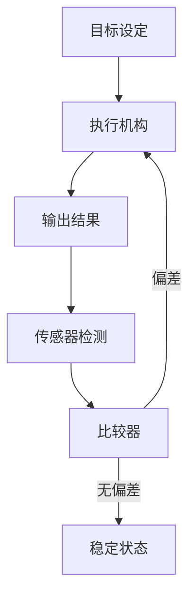
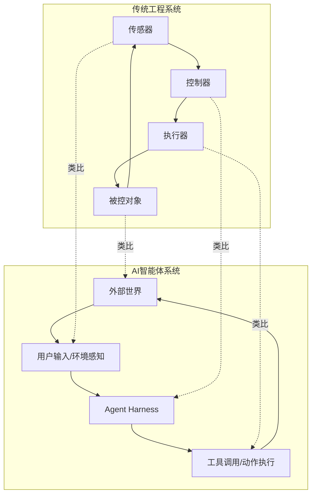
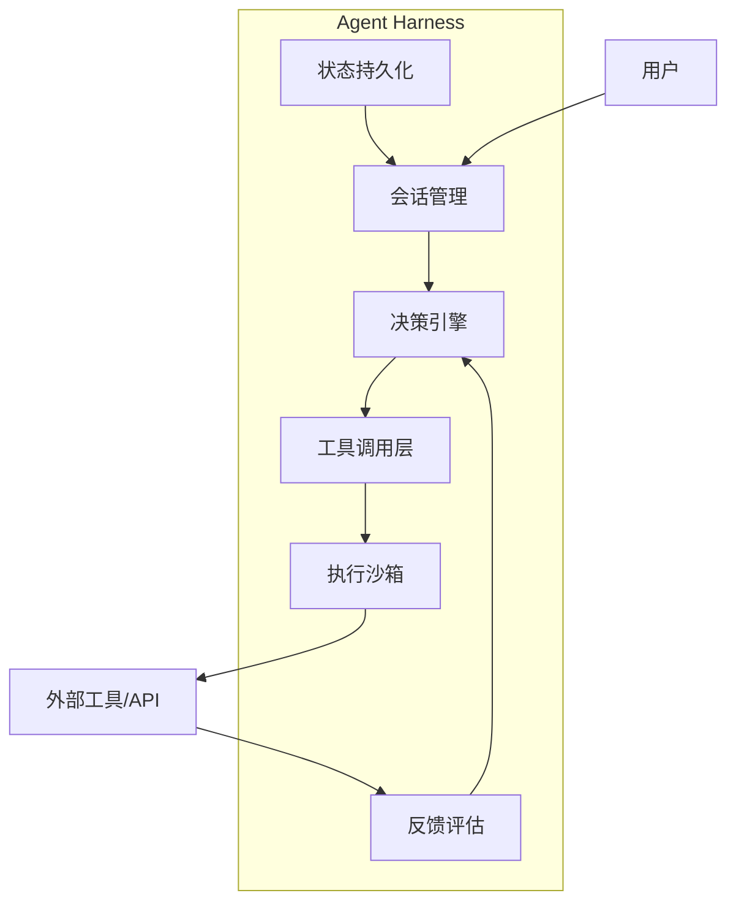

# 钱学森与工程控制论：AI时代的思想回响

> **"工程控制论是研究控制论这门科学对工程实践的应用。它是一门技术科学，它的目的是把控制论的一般理论应用到工程系统中去。"**
> —— 钱学森

---

## 一、工程控制论的诞生

### 时代背景
1948年，诺伯特·维纳（Norbert Wiener）出版《控制论》，标志着控制论这门新学科的诞生。然而，维纳的控制论更偏重于理论和数学基础。

### 钱学森的贡献
1954年，钱学森在美国出版《工程控制论》（*Engineering Cybernetics*），首次将控制论的抽象理论与工程实践紧密结合：

```
维纳的控制论（理论）
    ↓
钱学森的工程控制论（应用）
    ↓
各类工程系统的设计与控制
```

---

## 二、工程控制论的核心概念

### 1. 系统论视角
- **整体观**：系统是由相互关联的部分组成的整体
- **涌现性**：整体行为大于各部分行为之和
- **层次结构**：系统可分解为不同层次的子系统

### 2. 反馈控制原理



**反馈控制的核心要素**：
| 要素 | 功能 | AI智能体对应 |
|------|------|-------------|
| 传感器 | 感知系统状态 | 智能体的输入感知 |
| 比较器 | 计算目标与实际偏差 | 智能体的决策逻辑 |
| 执行器 | 调整系统行为 | 智能体的工具调用 |
| 控制器 | 设计控制策略 | Agent Harness |

### 3. 最优控制理论
在约束条件下，寻找使系统性能指标达到最优的控制策略。

### 4. 稳定性理论
研究系统在受到扰动后能否恢复到平衡状态的理论。

---

## 三、工程控制论与AI智能体的深层联系

### 1. 智能体控制系统 = 工程控制论的现代实例



### 2. 核心概念对应关系

| 工程控制论概念 | 数学表达 | AI智能体应用场景 |
|-------------|---------|----------------|
| **状态空间** | X(t) | 智能体的内部状态表示 |
| **状态方程** | Ẋ = f(X,U) | 智能体的状态转移函数 |
| **输出方程** | Y = g(X,U) | 智能体的响应生成 |
| **反馈增益** | K | 智能体的奖励/惩罚机制 |
| **稳定性** | Lyapunov稳定 | 智能体的行为一致性 |
| **能控性** | rank(C) = n | 智能体的可干预程度 |
| **能观测性** | rank(O) = n | 智能体的状态感知能力 |

### 3. 钱学森思想在AI时代的具体应用

#### 应用一：多智能体协作的稳定性分析
工程控制论中的**耦合系统稳定性理论**可直接应用于多智能体系统：
- 分析智能体之间的相互作用
- 设计协作协议保证系统稳定
- 防止智能体之间的冲突和振荡

#### 应用二：智能体的自适应控制
借鉴**自适应控制理论**：
- 智能体根据环境变化自动调整策略
- 在线学习优化控制参数
- 适应不同用户的偏好和需求

#### 应用三：智能体行为的最优控制
利用**最优控制理论**：
- 定义智能体的目标函数（如效率、准确性、安全性）
- 寻找最优决策路径
- 在约束条件下最大化收益

---

## 四、工程控制论的方法论指导

### 钱学森的"三步法"

```
Step 1: 建立系统模型
    ↓
Step 2: 分析系统特性（稳定性、能控性、能观测性）
    ↓
Step 3: 设计控制策略并验证
```

### 在AI智能体开发中的实践

#### Step 1: 建立智能体模型
- 定义智能体的状态空间
- 建立行为决策模型
- 设计状态转移规则

#### Step 2: 分析智能体特性
- **稳定性分析**：智能体在长时间运行中是否会出现行为漂移
- **能控性分析**：能否通过外部干预引导智能体行为
- **能观测性分析**：能否准确感知智能体的内部状态

#### Step 3: 设计控制策略
- 设计反馈机制（如人类反馈、自动评估）
- 建立奖励/惩罚系统
- 实现自适应调整机制

---

## 五、工程控制论视角下的Agent Harness设计

### 架构设计原则

| 工程控制论原则 | Agent Harness设计要求 |
|-------------|---------------------|
| **反馈闭环** | 必须建立完整的感知-决策-执行-评估闭环 |
| **稳定性保障** | 设计故障恢复和降级机制 |
| **可控性** | 提供人工干预和停止机制 |
| **可观测性** | 全面记录智能体行为和状态 |
| **最优控制** | 优化智能体的资源使用和响应速度 |

### 典型架构



---

## 六、结语：跨越时代的智慧

钱学森先生在1954年提出的工程控制论思想，在今天的AI智能体时代依然具有强大的生命力：

> **过去**：工程控制论指导了自动化生产线、航天控制系统等传统工程领域
> 
> **现在**：工程控制论为AI智能体的设计、控制和优化提供了理论基础
> 
> **未来**：工程控制论将继续在通用人工智能的研究中发挥重要作用

---

## 📚 延伸阅读

### 经典著作
- 钱学森，《工程控制论》（1954）
- Norbert Wiener，《控制论》（1948）
- Richard Bellman，《动态规划》（1957）

### 相关链接
- [钱学森图书馆](http://www.qxs.tsinghua.edu.cn/)
- [控制论与系统科学学会](http://www.ccss.org.cn/)
- [OpenAI Harness Engineering](https://openai.com/index/harness-engineering/)

---

> ✨ **核心启示**：在AI智能体时代，我们不仅需要掌握最新的技术工具，更需要回归经典理论，从工程控制论等基础学科中汲取智慧，才能构建真正可靠、可控、高效的智能系统。
