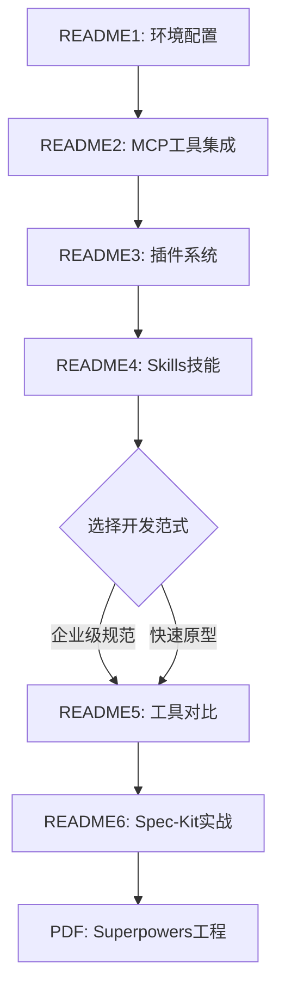

# AI工程实战

## 📚 课程概览

本课程系统讲解 AI 辅助开发的完整工具链与工程实践，涵盖从环境配置到规范驱动开发的全流程。

---

## 🗂️ 文档索引

### [README1.md](README1.md) - Claude Code CLI 配置指南
- **核心内容**：Claude Code 安装与阿里云百炼平台模型 API 配置
- **关键知识点**：
  - Node.js 安装与 Claude Code CLI 部署
  - 百炼模型配置（千问 Max/Plus/Flash/Turbo/Coder/VL 系列）
  - MCP 工具集成（time、playwright、fetch）
  - Windows 环境依赖安装（Node.js、Python+uv、Java+jbang）
  - 插件系统与 Skills 安装入口

### [README2.md](README2.md) - MCP（Model Context Protocol）推荐
- **核心内容**：MCP 协议生态与热门服务器推荐
- **分类清单**：
  - 🏆 综合资源库（awesome-mcp-servers、mcp.so、Awesome-MCP-ZH）
  - 🌐 信息检索类（Fetch、Brave Search、arXiv、Context7）
  - 🧠 思维增强类（Sequential Thinking、Memory Bank）
  - 💻 开发调试类（Chrome DevTools、GitHub、Apifox、Playwright）
  - 🗄️ 数据知识库类（Qdrant、Chroma、PostgreSQL、SQLite）
  - 🚀 部署云服务类（EdgeOne Pages、Cloudflare）
- **场景化组合**：实时研究写作、前端开发调试、自动化任务流等 5 大场景推荐

### [README3.md](README3.md) - Claude Code 插件系统
- **核心内容**：官方与社区插件生态详解
- **官方热门插件**：
  - `superpowers`：全栈开发工作流（需求澄清→任务拆解→TDD→代码审查）
  - `frontend-design`：高颜值 UI/前端生成
  - `code-review`：自动化 PR/代码审查
  - `security-audit`：依赖漏洞扫描与安全加固
  - `test-assistant`：测试生成与覆盖率分析
  - `git-flow`：分支策略管理与 Changelog 生成
- **社区精选插件**：docker-helper、api-docs-gen、tailwind-studio、db-schema-sync 等
- **管理命令**：search/list/info/update/remove 全套操作指南

### [README4.md](README4.md) - Claude Code Skills 深度解析
- **核心内容**：Skills 系统架构与热门技能推荐
- **技术要点**：
  - Skills 结构：config.yaml + prompt.md + scripts/ + tools.json
  - 安装与管理：CLI 命令与自定义开发流程
- **热门 Skills 分类**：
  - 🛠️ 开发提效：git-workflow、docker-helper、ci-cd-automator
  - 📝 代码质量：code-review-pro、test-generator、security-audit
  - 🌐 框架专精：react-nextjs、python-fastapi、rust-async
  - 📚 运维文档：docs-builder、log-analyzer、infra-terraform
  - 🧩 高阶扩展：mcp-connector、prompt-library
- **最佳实践**：权限安全、冲突处理、性能优化建议

### [README5.md](README5.md) - 规范驱动开发工具深度对比
- **核心内容**：Spec-Kit、Kiro、OpenSpec 三大工具横向评测
- **工具定位**：
  - **Spec-Kit**：企业级规范治理（项目宪法强制合规）
  - **Kiro**：代理式 IDE 原型神器（全流程自动化）
  - **OpenSpec**：棕地项目安全迭代（变更可审计隔离）
- **Claude 集成机制**：
  - Spec-Kit：总指挥模式（子代理分工）
  - Kiro：嵌入式协作者（自然语言连续对话）
  - OpenSpec：安全审查官（提案机制+Delta 变更）
- **实战案例**：添加"用户过滤搜索"功能的时间效率对比（15min vs 10min vs 8min）
- **选型决策树**：企业级新项目 → Spec-Kit；个人快速原型 → Kiro；遗留系统维护 → OpenSpec

### [README6.md](README6.md) - Spec-Kit 规范驱动开发（SDD）工具包使用说明
- **核心内容**：GitHub 官方 Spec-Kit 完整使用指南，包含核心概念、详细工作流程和最佳实践
- **标准安装流程**：
  - 前置条件：Python ≥ 3.11、uv/pipx、Git、AI 代理
  - 安装命令：`uv tool install specify-cli`
  - 验证与 PATH 配置
- **核心概念详解**：
  - 规范驱动开发（SDD）理念与优势
  - 项目原则（Constitution）：最高指导文件
  - 功能规范（Specification）：用户故事、需求、成功标准
  - 技术计划（Implementation Plan）：技术栈、架构、数据模型
  - 任务列表（Tasks）：依赖关系、并行执行、测试任务
- **完整工作流程（5步法+可选步骤）**：
  1. `/speckit-constitution` → 建立项目原则
  2. `/speckit-specify` → 创建功能规范
     - 可选：`/speckit-clarify` 澄清需求，消除歧义
  3. `/speckit-plan` → 创建技术计划
     - 可选：`/speckit-checklist` 质量检查清单
  4. `/speckit-tasks` → 分解为任务
     - 可选：`/speckit-analyze` 一致性分析
  5. `/speckit-implement` → 执行实现
- **辅助命令**：clarify（澄清模糊点）、analyze（一致性检查）、checklist（需求验证）
- **扩展定制**：社区扩展安装、预设模板应用、优先级覆盖机制
- **最佳实践**：8条实战建议，涵盖从原则制定到任务分解的全流程
- **常见问题**：安装、使用、企业环境三大类问题解答

### [实战Harness工程.pdf](实战Harness工程.pdf)
- **补充资料**：Superpowers 实战工程案例（从第 5 页开始）

---

## 🎯 学习路径建议

### 推荐学习顺序
1. **基础篇**（README1-2）：掌握 Claude Code 配置与 MCP 生态
2. **进阶篇**（README3-4）：深入插件与 Skills 系统，提升开发效率
3. **专业篇**（README5-6）：理解规范驱动开发理念，掌握 Spec-Kit 工作流
4. **实战篇**（PDF）：通过 Harness 工程案例巩固所学

---

## 🔑 核心价值主张

> **让开发者聚焦"做什么"，让 AI 专注"怎么做"**

- ✅ **可控性**：规格先行，输出可预期，告别概率生成的随机性
- ✅ **可维护性**：规范约束，团队友好，代码风格统一
- ✅ **安全性**：变更审计，风险可控，生产环境更可靠
- ✅ **工程化**：融入现有开发流程，非黑盒魔法

---

## 📖 外部资源

- 🌐 [Claude Code 官方文档](https://docs.anthropic.com/claude-code)
- 🔧 [阿里云百炼 Claude Code 配置指南](https://help.aliyun.com/zh/model-studio/claude-code)
- 💬 [Chatbox AI 客户端（支持 Qwen 等 API）](https://chatboxai.app/zh)
- 📦 [MCP 服务器注册表](https://mcp.so)
- 🎬 [Spec-Kit 视频概览](https://github.github.com/spec-kit/video-overview)