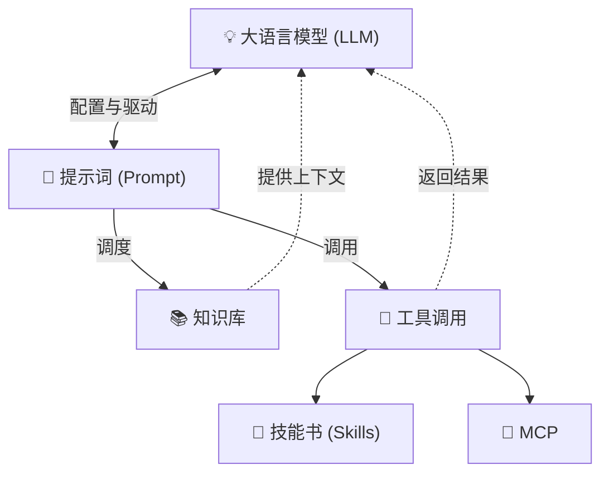
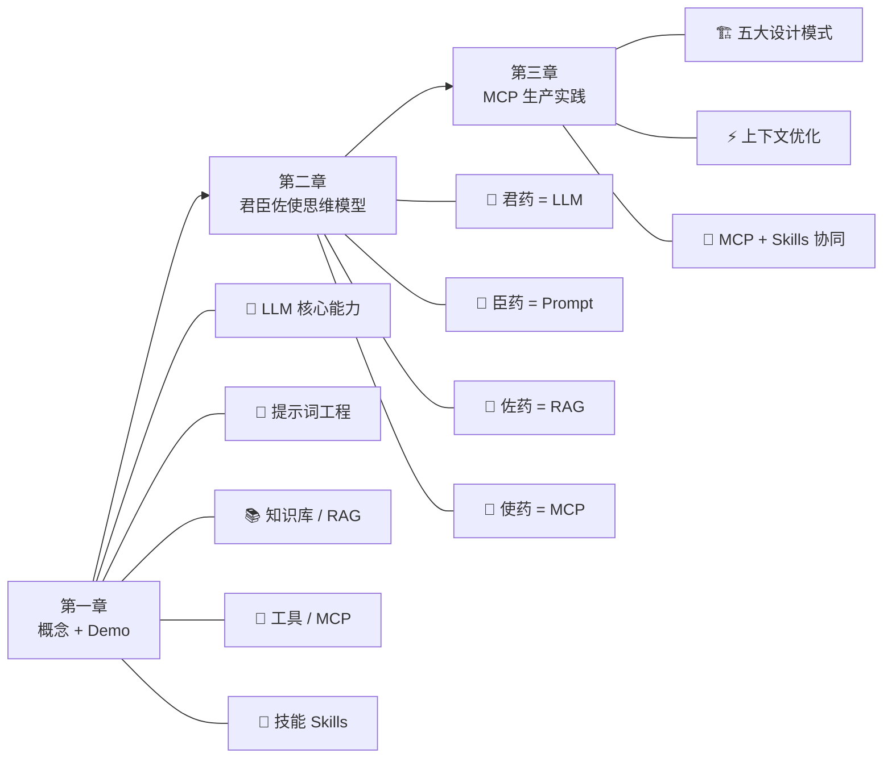

# 第 1 课：AI Agent 核心概念

⬅️ [返回课程总目录](../README.md)

> **大模型 × 提示词 × 知识库 × 工具** —— 四大核心能力构建 AI Agent 的技术底座。  
> 本课从概念到实战，带你理解 AI Agent 的架构哲学，并动手连接真实外部系统。

---
## 引言：变更说明

第 1 课：AI Agent 核心概念 是 N 个 JEP / 特性 / 章节的合集。

本篇按主题归类，给出每个条目的一句话定位 + 适用版本/场景，**先扫一遍再决定读哪节**。

---

## 学习目标

学完本课后，你将能够：

- 理解 AI Agent 的核心架构：LLM、Prompt、知识库、工具调用如何协作
- 掌握提示词工程的基本方法，将业务需求转化为结构化指令
- 理解 RAG（检索增强生成）的原理，用知识库补齐大模型的知识盲区
- 通过 MCP 协议连接外部系统，让 AI 真正"做事"而不只是"说话"
- 区分 MCP（能做什么）与 Skills（怎么做），并理解二者的协同模式

---

## 前置准备

- **Demo 项目**：基于 [spring-ai-chat](https://gitee.com/wb04307201/spring-ai-chat) 搭建  
  ⚠️ 需先在本地启动 demo 项目，再访问 [演示地址](http://localhost:8080/spring/ai/chat)
- **知识库面板**：[Qdrant Dashboard](http://localhost:6333/dashboard)（需先启动 Qdrant）

---

## 章节导航

| 章节 | 文件 | 核心问题 | 建议时长 |
|:----:|:-----|:---------|:--------:|
| **第一章** | [大模型基础能力与概念](README1.md) | AI Agent 由哪些组件构成？它们如何协作？ | 60 min |
| **第二章** | [智医同源："君臣佐使"配伍之道](README2.md) | 四大组件各自的定位是什么？缺了谁会怎样？ | 20 min |
| **第三章** | [MCP 生产实践](README3.md) | 如何将 MCP Server 做到生产级质量？ | 40 min |

### 推荐阅读顺序

```
第一章（概念 + 动手）  →  第二章（思维模型）  →  第三章（生产实战）
    ↑                        ↑                       ↑
 先跑通 demo              建立系统观               深入 MCP 设计模式
 理解四大组件             "君臣佐使"配伍哲学        五大模式 + 上下文优化
```

- **时间紧张**：先读第一章的核心架构图 + 第二章全文（约 30 分钟），建立全局认知
- **动手优先**：从第一章的 demo 演示开始，边跑边读
- **深度研究**：三章通读，重点关注第三章的五大设计模式

---

## AI Agent 核心技术架构



> 详细架构图见 [第一章](README1.md)

**一句话总结**：大模型是大脑，决定 AI Agent 的上限；提示词、知识库、工具调用提升了 AI Agent 的下限。

---

## 本课的知识地图



---

## 补充资料

| 资料 | 说明 |
|:-----|:-----|
| [百度网盘 Skill 示例](SKILL.md) | 一个完整的 Skill 定义文件，展示 Skills 的核心要素 |
| [启明11 手机介绍](qiming11.md) | RAG 演示用的知识库文档 |
| [demo 项目](demo/) | Spring AI Chat 演示项目源码 |

---

> 🚀 **准备好了吗？** 从 [第一章：大模型基础能力与概念](README1.md) 开始。

---

➡️ [下一课：Agent Harness 与控制论](../lesson2/README.md)
